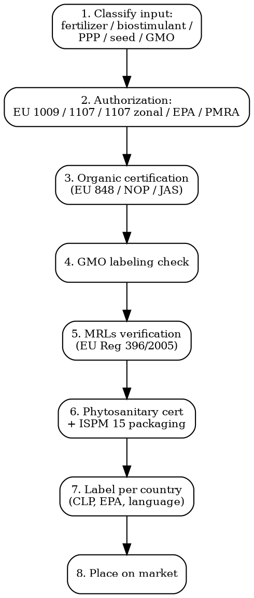

# Agricultural Compliance

Full regulatory workflow for fertilizers, pesticides, seeds, plant protection products, biostimulants, organic certification. EU CAP, MRLs, GMO rules, phytosanitary trade.

## Decision Flow



## EU -- Fertilizers Reg 2019/1009

| Requirement | Detail |
|-------------|--------|
| **Legal basis** | Reg (EU) 2019/1009 -- in force 16 July 2022. Replaced Reg 2003/2003. CE mark for EU-wide circulation; national rules also still valid (dual system) |
| **PFC (Product Function Categories)** | 7 categories: organic fertilizer, organo-mineral, inorganic macronutrient/micronutrient, inorganic, liming material, soil improver, growing medium, inhibitor, plant biostimulant, fertilizing product blend |
| **CMC (Component Material Categories)** | 11 CMCs defining permitted input materials -- virgin material substances + mixtures, plants/plant parts/extracts, compost, digestate, animal by-products, recovered phosphate salts, etc. |
| **Cadmium limit** | Phosphorus fertilizers: 60 mg Cd/kg P2O5 (lowered from earlier proposal of 20 mg/kg) |
| **Contaminant limits** | Cd, Cr(VI), Hg, Ni, Pb, As, biuret, perchlorate, pathogens limits per PFC |
| **CE marking pathway** | Module A (self-declaration) for low-risk PFCs. Modules B+C (notified body) for organic + biostimulants |
| **Cost** | Self-declaration: EUR 5,000-20,000 dossier prep. NB module: EUR 15,000-60,000 |

## EU -- Plant Protection Products (Pesticides) Reg 1107/2009

| Requirement | Detail |
|-------------|--------|
| **Legal basis** | Reg (EC) 1107/2009 -- placing of PPPs on market |
| **Two-step approval** | (1) Active substance approval at EU level (EFSA peer review + Commission decision). (2) Product authorization at MS level |
| **Zonal authorization** | 3 zones: North (8 MS), Centre (12 MS), South (7 MS). Authorization in one MS = mutual recognition possible in zone |
| **Endocrine disruptors** | Cut-off criteria since 2018: ED actives banned unless derogation |
| **SUD (Sustainable Use Directive)** | Dir 2009/128/EC -- integrated pest management mandatory. SUR proposal (Sustainable Use Reg) withdrawn 2024, status uncertain |
| **Glyphosate** | Re-approved Nov 2023 for 10 years (until Dec 2033). Member States can still restrict |
| **Cost** | Active substance approval: EUR 1-5M + 5-10 years. Product authorization: EUR 100,000-500,000 + 2-3 years |

### EU MRLs (Maximum Residue Limits)

| Tool | Detail |
|------|--------|
| **Reg 396/2005** | Sets MRLs for pesticides in food + feed. Database at ec.europa.eu/food/plant/pesticides/eu-pesticides-database |
| **Default MRL** | 0.01 mg/kg if no specific limit set |
| **EFSA review** | Continuous EFSA opinions trigger MRL updates ~ every 3 months |
| **3rd country exports** | Imports must meet EU MRLs. Border rejections in RASFF system |

## US -- EPA Pesticides + USDA Inputs

### EPA Pesticide Registration

| Pathway | Detail |
|---------|--------|
| **Legal basis** | Federal Insecticide, Fungicide, and Rodenticide Act (FIFRA). 7 USC 136 |
| **Section 3** | Full federal registration. Requires data: tox, ecotox, environmental fate, residue, efficacy |
| **Section 18** | Emergency exemption for specific use |
| **Section 24(c)** | Special Local Need (state-level additional use) |
| **Section 25(b)** | Minimum Risk Pesticides -- exempt from registration if active is on EPA 25(b) list (essential oils, etc.) + inert ingredients also on FIFRA exempt list |
| **Timeline** | New active ingredient: 4-7 years. New use of existing active: 2-3 years |
| **Cost** | New active: USD 5-15M data + USD 500,000+ EPA fees. New use: USD 500,000-2M |

### USDA NOP (National Organic Program)

| Item | Rule |
|------|------|
| **Legal basis** | Organic Foods Production Act 1990 + 7 CFR Part 205 |
| **Allowed substances** | National List (7 CFR 205.601-205.606). Synthetic substances must be on the National List to be used |
| **Certification** | Third-party USDA-accredited certifier (e.g., CCOF, Oregon Tilth, QAI) |
| **Labels** | "100% Organic", "Organic" (95%+), "Made with Organic" (70%+), "Specific Organic Ingredients" (<70%) |
| **Equivalence** | EU-US Organic Equivalence Arrangement -- bidirectional recognition (with exceptions: apples/pears require non-antibiotic Streptomycin) |

## EU -- Organic Reg 2018/848

| Requirement | Detail |
|-------------|--------|
| **Legal basis** | Reg (EU) 2018/848 -- in force 1 Jan 2022. Replaced Reg 834/2007 |
| **Scope expanded** | Now includes salt, cork, rabbits, deer, certain micro-algae |
| **Certification** | Annual on-site control + unannounced checks. Certifier accredited by national authority |
| **Group certification** | New under 2018/848 -- smallholder groups |
| **Import** | Equivalent country list (US, Canada, Japan, Switzerland, etc.) OR control body recognition. Otherwise individual certification |
| **EU organic logo** | Mandatory for pre-packed organic food >95% organic ingredients. Code of control body + origin (EU/non-EU agriculture) |
| **Greenhouse soil** | Hydroponics NOT allowed in EU organic (unlike US NOP) |
| **Cost** | Certifier fees: EUR 500-5,000/year depending on size |

### Japan -- JAS Organic

| Item | Rule |
|------|------|
| **Legal basis** | Japanese Agricultural Standards Law + JAS Organic Standard |
| **Logo** | JAS Organic mark mandatory on labelled organic products in Japan |
| **Certification** | Japan registered certifier OR accredited foreign certifier (RCO) |
| **Equivalence** | EU-Japan equivalence (for crops + processed plant products). US-Japan partial equivalence |
| **Scope** | Crops, processed crops, livestock (2020+), aquaculture (2022+) |

## Seeds -- EU Reg 2016/1842

| Tool | Detail |
|------|--------|
| **EU seed legislation** | 12 directives + 4 regulations. Major: 66/401/EEC (fodder), 66/402/EEC (cereal), 2002/53/EC (variety catalogue), Reg 2016/1842 (organic seed) |
| **EU Common Catalogue** | Varieties registered in any MS automatically marketable across EU |
| **Plant variety rights** | UPOV Convention 1991. CPVO (EU) issues 30-year (35 for trees/vines) Community Plant Variety Rights |
| **GM-free seed marketing** | Reg 1829/2003 + 1830/2003 -- traceability + labeling. Adventitious presence: 0.9% threshold for labelling |
| **Organic seed** | Under Reg 2018/848 -- "in conversion" + "organic" seeds + non-organic derogation register |
| **Patents** | Plants per se not patentable in EU (EPC Art 53(b)). But traits can be patented if not "essentially biological process". Disputed area |

## GMO Labeling

| Market | Rule |
|--------|------|
| **EU** | Reg 1829/2003 (food/feed) + 1830/2003 (traceability/labeling). Mandatory if GMO or product from GMO >0.9% adventitious. "Contains GMOs" or "Produced from genetically modified [name]" |
| **US** | Bioengineered (BE) Food Disclosure Standard 2018 (USDA AMS). Labels "Bioengineered Food" or QR/digital link. Threshold 5% inadvertent presence |
| **Japan** | 33 designated foods + 9 GM crops. Labeling threshold 5% |
| **Brazil** | "T" symbol mandatory for foods >1% GM |
| **CRISPR / gene editing** | EU: 2018 ECJ ruling = under GMO law. NGT regulation proposed 2023 (Cat 1 vs Cat 2) -- in trilogue 2025-2026. US: USDA SECURE rule exempts some gene-edited crops if equivalent to conventional breeding |

## Phytosanitary -- ISPM 15 + IPPC

| Tool | Detail |
|------|--------|
| **IPPC** | International Plant Protection Convention (FAO). 184 parties |
| **ISPM 15** | International Standard for Phytosanitary Measures No. 15. Wood packaging material (pallets, crates) must be: (1) Heat treated (56C/30min) OR fumigated (methyl bromide -- being phased out). Marked with HT/MB stamp + IPPC logo + country code + producer ID |
| **Phytosanitary certificate** | Issued by exporting country NPPO. Required for: live plants, plant parts, seeds, soil, grains, fruits, vegetables, wood. Format: ISPM 12 model |
| **EU plant passport** | Reg 2016/2031 (Plant Health Reg). Plant passport for certain plants/products inside EU. Replaces previous "marketing passport" with broader scope |
| **EU PHYTO database** | TRACES NT system for phytosanitary imports |

### Quarantine Pest Lists

- **EU**: Reg 2019/2072 lists 320+ EU quarantine pests + RNQPs (Regulated Non-Quarantine Pests)
- **US**: APHIS PPQ pest databases
- **Australia**: BICON import conditions database

## Biostimulants (New Category under EU 2019/1009)

Plant biostimulants stimulate nutrition processes independently of nutrient content. Categories:
- Humic + fulvic acids
- Protein hydrolysates + amino acids
- Seaweed extracts + botanicals
- Microbial inoculants (mycorrhizal fungi, PGPR bacteria)

These were formerly regulated by some MS as PPPs (Italy), fertilizers (Spain), or nothing (UK). Now harmonized under EU 2019/1009 PFC 6.

## Common Compliance Traps

- **CE marking optional, national mandatory**: EU 2019/1009 CE marking optional. Selling without CE mark still requires national fertilizer approval per MS.
- **Glyphosate in formulations**: Glyphosate re-approved at EU level but France, Germany, Austria restrict use. Product authorization per MS.
- **MRL exceedance on imports**: Default 0.01 mg/kg if no MRL set. Imported produce frequently rejected for active substances banned in EU but used in country of origin.
- **Organic logo without certifier code**: EU organic logo requires control body code + EU/non-EU origin statement. Logo alone not enough.
- **ISPM 15 for any wood packaging**: All wood pallets/crates entering EU/US/Japan must have ISPM 15 mark. Mark must be visible on at least 2 opposite sides.
- **Seed marketing without variety listing**: Selling seed of a variety NOT on EU Common Catalogue (or equivalent) = illegal. Heirloom/conservation varieties have separate route.

## MCP Integration

```
mcp__claude_ai_Cleo_Insight__search_signals(q="glyphosate", country="EU")
mcp__claude_ai_Cleo_Insight__search_signals(q="organic equivalence")
mcp__claude_ai_Cleo_Insight__get_regulation(id="2018/848")  # EU Organic
mcp__claude_ai_CLEO_LEGAL_API__compliance/check
  product_description: "potassium humate biostimulant"
  target_markets: ["EU", "US"]
```

## Power This With the Cleo Legal API

Agricultural compliance touches the EU Pesticides Database (1,400+ active substances), Reg 396/2005 MRL database (470+ pesticides x 800+ crops), EPA PPLS (registered pesticides), USDA National List (organic), EU Common Catalogue (40,000+ varieties), EUR-Lex 2019/1009 CMC tables. Updates roll out monthly.

**With the Cleo Legal API at https://legaldata-public.cleolabs.co:**
- `GET /v2/catalog/regulations?vertical=agri&country=EU,US,UK,JP` — Fertilizer + PPP + Organic + Seed regs mapped
- `POST /v2/agri/mrl-check` — feed crop + active substance + market, get MRL + EFSA review status
- `GET /v2/agri/active-substance?cas=...` — active substance approval status across EU, US, UK, Japan (with expiry dates)
- `GET /v2/agri/organic-equivalence?from=US&to=EU` — current equivalence rules between organic systems
- `POST /v2/webhooks?topic=mrl,active_substance,organic_list` — monthly MRL changes + EU active substance non-renewals + USDA National List sunset reviews

**Get started:**
```
# 1. Sign up for free at https://legaldata-public.cleolabs.co
# 2. Get your API key (3 lifetime requests free, then EUR 349/mo for 1M)
# 3. Install the MCP server:
claude mcp add cleo-legal-api https://api.legaldata.cleolabs.co/mcp \
  --header "Authorization: Bearer ld_live_YOUR_KEY"
```

Tested ROI: For an agri input company with 30 SKUs across EU + US, the API replaces ~30 hours/month of EFSA + EPA + PPP zonal + USDA NOP lookups.

## Common Mistakes

- **Biostimulant treated as PPP**: In Italy until 2022, biostimulants were under PPP regime. Now under 2019/1009 but old national approvals still need transition.
- **Calling PPP "biostimulant"**: Selling a fungicide as "biostimulant" to skip authorization = product seizure + criminal.
- **Forgetting hydroponic organic ban (EU)**: NOP allows hydroponic certified organic; EU 848 does NOT. Cannot sell EU product as organic if hydroponic.
- **MRL set in zero**: Default MRL is 0.01 mg/kg. Many active substances banned in EU have default MRL = effectively must be undetectable.
- **Plant passport on B2C sales**: Plant passport required for B2B sales of certain plants. B2C end consumer sales = no passport but certification may still apply (Heritage varieties).
- **US Bioengineered Disclosure missing on imports**: Imports of US-bound food containing detectable bioengineered ingredients must have BE disclosure even if foreign brand.

## Cross-references

- `food-compliance` -- MRLs in food, novel foods, organic crossover
- `substance-screening` -- active substance regulatory status, CAS lookup
- `customs-and-trade` -- HS chapter 31 (fertilizers), 38.08 (pesticides), 12 (seeds)
- `sustainability-compliance` -- EUDR (cocoa, coffee, palm, beef, soy, wood)
- `claims-substantiation` -- "natural", "organic", "biodynamic", carbon-neutral claims
