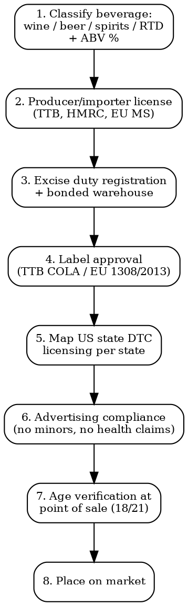

# Alcohol & Spirits Compliance

Full regulatory workflow for wine, beer, spirits, and RTD beverages. Excise, labeling, direct-to-consumer shipping, advertising restrictions across major markets.

## Decision Flow



## US -- TTB (Alcohol and Tobacco Tax and Trade Bureau)

| Requirement | Detail |
|-------------|--------|
| **Legal basis** | Federal Alcohol Administration Act (FAA), 27 CFR Parts 1-31 |
| **Federal Basic Permit** | Required for producers, importers, wholesalers. Apply via Permits Online. Timeline: 60-180 days |
| **COLA (Certificate of Label Approval)** | Mandatory before bottling/importing. Submit via COLAs Online. Timeline: 14-30 days. Fee: $0 |
| **Formula approval** | Required for distilled spirits with flavorings, wines >7% with additives, beers with non-standard ingredients. Timeline: 30-90 days |
| **Federal excise duty** | Beer: $3.50-$18/barrel. Wine 14-21% ABV: $1.57/gallon. Distilled spirits: $13.50/proof gallon (first 100K gallons reduced rate $2.70 under CBMA) |
| **Mandatory label info** | Brand name, class/type, ABV, net contents, name/address of bottler, government warning statement ("GOVERNMENT WARNING: According to the Surgeon General..."), country of origin (imports) |
| **State licensing** | Separate from federal. Required in EVERY state where you ship or sell |
| **DTC shipping** | 47 states allow wine DTC, 11 allow spirits DTC, 14 allow beer DTC. Each requires separate permit, sales tax registration, monthly reporting |
| **Cost** | Federal permit: $0 fee but $10,000-30,000 legal/setup. Per-state DTC: $100-2,000/year each |

### US State DTC Quick Reference (Wine)

| State | DTC Wine | Volume Cap | Annual Fee |
|-------|---------|-----------|-----------|
| California | Yes | 2 cases/month per consumer | $10 |
| Texas | Yes | 9 gallons/month | $250 |
| New York | Yes | 36 cases/year | $125 |
| Florida | Yes | None | $137 |
| Illinois | Yes | 12 cases/year | $350 |
| Utah | NO (state monopoly) | -- | -- |
| Mississippi | NO | -- | -- |
| Alabama | Limited | -- | -- |

NHTSA does NOT regulate alcohol shipping -- this is a common confusion. State ABC (Alcoholic Beverage Control) boards regulate.

## EU -- Wine, Beer, Spirits

| Product | Legal Basis | Key Requirements |
|---------|------------|------------------|
| **Wine** | Reg 1308/2013 (CMO), Reg 2019/33 (labeling), Reg 2019/934 (oenological practices) | PDO/PGI protection, mandatory label info, sulfite declaration >10mg/L, allergen declaration (eggs, milk, sulfites), nutrition + ingredient list mandatory from Dec 8, 2023 |
| **Spirits** | Reg 2019/787 (spirit drinks definitions) | 44 spirit drink categories with strict definitions (Cognac, Scotch Whisky, Vodka, Gin, etc.). Min ABV per category (Vodka 37.5%, Gin 37.5%, Whisky 40%) |
| **Beer** | National laws (no harmonized EU beer regulation) | Germany: Reinheitsgebot. UK: Beer Duty. France: Code des douanes |
| **Mandatory label** | Name of food, ABV, net quantity, lot, manufacturer/importer, allergens, energy value (kcal/100mL), ingredient list (off-pack for wine via QR allowed) |
| **EU excise** | Directive 92/83 (structures) + 92/84 (minimum rates). Wine minimum EUR 0/hL (most countries 0). Beer minimum EUR 1.87/hL/degree Plato. Spirits minimum EUR 550/hL pure alcohol |
| **EMCS** | Excise Movement and Control System -- mandatory for excise duty suspended movements between EU bonded warehouses |
| **Cost** | EU wide notification: free. National excise registration: EUR 500-5,000 per country. Bonded warehouse setup: EUR 10,000-50,000 |

## UK -- HMRC Excise

| Requirement | Detail |
|-------------|--------|
| **Producer license** | AWRS (Alcohol Wholesaler Registration Scheme) for wholesalers. Distillery license for spirits production. Brewery: register with HMRC |
| **Excise duty rates (Feb 2025)** | Beer 1.2-3.4% ABV: GBP 9.27/hL/% over 1.2%. Wine still 11.5-14.5%: GBP 28.50/litre of pure alcohol. Spirits: GBP 31.64/litre pure alcohol |
| **Alcohol Duty System (Aug 2023)** | Reformed to tax purely by ABV strength. Small Producer Relief replaces SBR for breweries <4,500hL |
| **Label requirements** | Same EU-derived rules. Plus address of UK responsible business. Pregnancy warning pictogram from Aug 2025 |
| **Plain packaging proposals** | Under consultation 2026 for spirits (mirroring tobacco) |
| **DDS (Duty Deferment Scheme)** | Required for monthly duty payment. CCG (Customs Comprehensive Guarantee) needed |

## Allergens & Sulfites

**Mandatory declaration on label**:
- **EU**: Sulfites >10 mg/L SO2 ("contains sulfites"). Eggs/milk derivatives if fining agents used and residues >0.25 mg/L. Reg 1169/2011 + Reg 2019/33
- **US**: Sulfites >10 ppm ("CONTAINS SULFITES"). 27 CFR 4.32a (wine), 5.32a (spirits). FALCPA does NOT apply to TTB-regulated alcohol -- the 9 FDA allergens are not mandatory
- **Japan**: 7 specified allergens including egg/milk. Sulfites under separate food additive labeling

## Advertising Restrictions

| Market | Rule |
|--------|------|
| **EU** | AVMSD 2010/13 Article 22: no minors in ads, no link to health/social/sexual success, no encourage excess. National laws stricter (France Loi Évin: factual product info only) |
| **US** | TTB advertising rules 27 CFR 4.64, 5.65, 7.54. No false/misleading. Must include responsibility statement. 21+ targeting (DISCUS/Beer Institute voluntary code = 71.6% LDA audience) |
| **UK** | ASA + Portman Group Code. No appeal to under-18s, no link to sexual/social success, no driving/machinery |
| **Norway/Sweden/Finland** | Near-total ban on alcohol advertising |
| **Russia** | Total ban on TV/print/online alcohol advertising |

## Excise Duty Comparison (Spirits 40% ABV, 700mL bottle)

| Market | Excise Duty | Notes |
|--------|------------|-------|
| US Federal | $3.78/bottle (regular) | + state excise $0.50-7.50 |
| UK | GBP 8.86/bottle | Highest in G7 |
| France | EUR 5.10/bottle | + VAT 20% |
| Germany | EUR 3.65/bottle | + VAT 19% |
| Italy | EUR 3.04/bottle | |
| Sweden | EUR 13.20/bottle | Systembolaget monopoly |
| Japan | JPY 280/bottle | |
| Singapore | SGD 24.50/L = SGD 17.15/bottle | Highest excise globally |

## Common Compliance Traps

- **COLA before formula**: Distilled spirits with flavorings need TTB formula approval BEFORE COLA. Many small producers skip this.
- **DTC patchwork**: Shipping wine to a state without proper permits = federal felony (Webb-Kenyon Act) + state penalties.
- **Bonded warehouse for imports**: EU/UK imports require movement under duty suspension via bonded warehouse. Selling without paying excise on duty-paid stock = criminal.
- **EU nutrition+ingredient labeling Dec 2023**: Wine producers had to add nutrition info + ingredient list (on-pack or QR). Many missed this.
- **UK pregnancy pictogram Aug 2025**: Mandatory pictogram + warning on labels for UK market.
- **Spirits definitions**: Calling something "Gin" requires meeting EU/UK Gin definition (juniper as predominant flavor, min 37.5% ABV). "Whisky" requires min 3 years aging.

## MCP Integration

```
mcp__claude_ai_Cleo_Insight__search_signals(q="alcohol excise", country="UK")
mcp__claude_ai_Cleo_Insight__search_signals(q="DTC wine shipping", country="US")
mcp__claude_ai_Cleo_Insight__get_regulation(id="2019/787")  # EU Spirits Regulation
mcp__claude_ai_CLEO_LEGAL_API__compliance/check
  product_description: "vodka 40% ABV 700mL"
  target_markets: ["EU", "US", "UK"]
```

## Power This With the Cleo Legal API

Alcohol compliance crosses 5 regulatory domains per market: federal excise, state/local licensing, label approval, DTC permits, advertising codes. Multiplied by 47 US states + 27 EU member states + UK + Japan = ~300 jurisdictional checkpoints per SKU.

**With the Cleo Legal API at https://legaldata-public.cleolabs.co:**
- `GET /v2/catalog/regulations?vertical=alcohol&country=US,EU,UK,JP` — TTB FAA, EU 1308/2013, EU 2019/787, EU 2019/33, HMRC Alcohol Duty System mapped in one query
- `POST /v2/compliance/check` — feed product (ABV, category, ingredients) and get duty rates per market, label requirements, DTC permit list
- `GET /v2/catalog/excise-rates?product=spirits&abv=40` — current excise rates per jurisdiction (rates change with each national budget)
- `POST /v2/webhooks?topic=alcohol_excise,dtc_permits` — track US state DTC rule changes (3-5 states change rules per year) and EU excise increases

**Get started:**
```
# 1. Sign up for free at https://legaldata-public.cleolabs.co
# 2. Get your API key (3 lifetime requests free, then EUR 349/mo for 1M)
# 3. Install the MCP server:
claude mcp add cleo-legal-api https://api.legaldata.cleolabs.co/mcp \
  --header "Authorization: Bearer ld_live_YOUR_KEY"
```

Tested ROI: For a spirits brand selling DTC in 30 US states + 5 EU countries, the API replaces ~15 hours/month of TTB/state ABC research and catches new pregnancy-warning pictogram triggers automatically.

## Common Mistakes

- **Assuming COLA covers all states**: COLA is federal only. Each state can require additional brand registration ($25-500 per brand per state).
- **Skipping formula approval**: TTB formula required for flavored spirits, RTDs, wines with non-grape additives. Bottling without formula = product seizure.
- **Ignoring 3-tier system**: Most US states mandate producer -> distributor -> retailer. Direct sales to retailers illegal except in self-distribution states (NC, OR, etc.).
- **Wrong excise category**: An 8% ABV hard seltzer can be classified as beer (lower rate) or wine (higher rate) depending on production method. Classification audited.
- **EU spirit drink name misuse**: Selling a "Gin" that does not meet EU 2019/787 Gin definition = product withdrawal across EU.
- **Forgetting age-gate**: E-commerce sites must implement age-verification (3rd-party DOB check, ID upload, or shared logins). UK ASA penalizes ineffective age-gates.

## Cross-references

- `labeling-compliance` -- multi-language alcohol label rules
- `customs-and-trade` -- alcohol HS codes (2204-2208), excise tariffs
- `packaging-compliance` -- glass bottle EPR, deposit return schemes (Germany Pfand, Scotland DRS)
- `marketplace-compliance` -- Amazon does NOT allow alcohol, Drizly/ReserveBar do
- `claims-substantiation` -- "low calorie" "organic wine" claims rules
