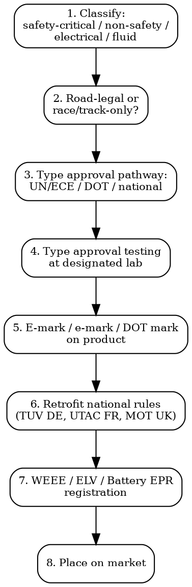

# Automotive Aftermarket Compliance

Full regulatory workflow for automotive aftermarket parts, accessories, electronics, tyres, batteries. UN/ECE, DOT, Type Approval, retrofit law.

## Decision Flow



## UN/ECE Regulations (Global Framework)

UNECE WP.29 = world forum for harmonization of vehicle regulations. ~160 UN Regulations cover everything from headlamps (R48/R112) to seat belts (R16). EU, Japan, Russia, Korea, Australia, India all participating. US uses parallel DOT system but accepts some UN regs.

### Most Common UN/ECE Regs for Aftermarket

| UN Reg | Topic | Marking |
|--------|-------|---------|
| **R10** | EMC of vehicles + components | E-mark with R10 |
| **R30** | Tyres for passenger cars + trailers | E-mark with R30 |
| **R37** | Filament lamps for road vehicles | Lamp markings R37 |
| **R44** / **R129** | Child restraint systems (R129 i-Size is newer) | E-mark with R44/04 or R129 |
| **R46** | Indirect vision (mirrors, cameras) | E-mark R46 |
| **R48** | Installation of lighting + light-signalling | Vehicle-level |
| **R64** | Temporary use spare wheels + tyres + tyre pressure monitoring (TPMS) | E-mark R64 |
| **R75** | Tyres for motorcycles/mopeds | E-mark R75 |
| **R85** | Powertrain power measurement | -- |
| **R90** | Replacement brake lining assemblies + drum brake linings | E-mark R90 (mandatory for aftermarket brakes) |
| **R100** | EV electrical safety | E-mark R100 |
| **R109** | Retreaded tyres | E-mark R109 |
| **R112** | Headlamps emitting asymmetrical passing beam | E-mark R112 |
| **R117** | Tyre rolling resistance + wet grip + rolling noise | E-mark R117 |

**E-mark format**: Lower-case "e" in rectangle for EU type approval (e.g., e1 = Germany, e2 = France, e4 = Netherlands, e11 = UK). Upper-case "E" in circle for UN/ECE type approval globally accepted (e.g., E1 = Germany, etc.).

## EU -- Type Approval Reg 2018/858

| Requirement | Detail |
|-------------|--------|
| **Legal basis** | Reg (EU) 2018/858 (general type-approval), in force Sep 2020. Replaces Dir 2007/46/EC |
| **Scope** | New motor vehicles (M1, M2, M3, N1, N2, N3, O1-O4) + systems + components + separate technical units (STUs) |
| **Approval authority** | Designated by each Member State. e.g., KBA (Germany), UTAC (France), VCA (UK), RDW (Netherlands) |
| **e-mark issuance** | Once issued by one MS approval authority, valid throughout EU. Component must be marked with approval number |
| **CoP (Conformity of Production)** | Manufacturer must demonstrate ongoing conformity. Audits required |
| **Market surveillance** | Reg 2018/858 strengthened post-Dieselgate. Member State authorities + Commission can recall/impose fines |
| **Cost** | EUR 5,000-50,000 per component type approval. Brake linings (R90): EUR 20,000-50,000 with test program |

## US -- DOT (NHTSA + EPA)

| Authority | Scope |
|-----------|-------|
| **NHTSA** | Federal Motor Vehicle Safety Standards (FMVSS) -- 49 CFR Part 571. Vehicle safety, lighting, tyres, seat belts, child restraints |
| **EPA** | Emissions (Clean Air Act). Tampering with emissions systems = federal violation |
| **DOT (Department of Transportation)** | Umbrella. NHTSA + EPA + FMCSA |
| **CARB** | California Air Resources Board. CA-specific emissions rules. EO (Executive Order) required for aftermarket parts that affect emissions sold in CA |

### Key FMVSS Standards

| FMVSS | Topic |
|-------|-------|
| **FMVSS 108** | Lamps, reflective devices, associated equipment |
| **FMVSS 109/119/139** | Tyres (passenger/heavy/light truck) |
| **FMVSS 116** | Brake fluids |
| **FMVSS 121** | Air brake systems |
| **FMVSS 213** | Child restraint systems |
| **FMVSS 218** | Motorcycle helmets |

**DOT marking** (e.g., "DOT" + manufacturer ID + plant code on tyre sidewall) certifies compliance with FMVSS. No federal type approval pre-market -- self-certification with potential post-market enforcement.

### CARB Executive Order

Aftermarket parts that affect a CA vehicle's emissions (intakes, exhausts, ECU tunes, catalytic converters) require a CARB Executive Order (EO) number. Selling without EO in CA = $5,000-50,000 fine per violation. Lookup: arb.ca.gov/aftermarket.

## UK Post-Brexit

| Topic | Status |
|-------|--------|
| **UK type approval** | UK GB type approval scheme from 1 Jan 2023. VCA (Vehicle Certification Agency) issues UK approvals. UN/ECE approvals still accepted |
| **CE/UKCA on vehicle parts** | Mostly UN/ECE-based for vehicle parts. UKCA not the relevant mark |
| **MOT compatibility** | All aftermarket parts on UK roads must comply with Construction & Use Regulations 1986 + MOT inspection criteria |

## Brake Pads -- Copper Restrictions

| Market | Rule |
|--------|------|
| **California + Washington** | Better Brakes Act. Copper <5% by weight from 2021, <0.5% from 2025. Self-certification + 3rd party verification |
| **EU** | No copper-specific brake rule but REACH applies + EU end-of-life vehicle Dir 2000/53/EC |
| **UN R90** | Aftermarket brake linings must be type approved + maintain frictional performance of OEM lining |

## Tyres -- EU Tyre Labelling + REACH 6PPD

| Tool | Detail |
|------|--------|
| **EU Tyre Labelling Reg 2020/740** | Mandatory grade for fuel efficiency (A-E), wet grip (A-E), external rolling noise (dB + A/B/C waves), snow grip (3PMSF symbol), ice grip (Nordic ice symbol) |
| **EPREL** | European Product Registry for Energy Labelling. Tyres registered before sale |
| **REACH 6PPD-quinone (forthcoming)** | 6PPD is anti-degradant in tyre rubber. Restriction proposal under REACH for 6PPD/6PPD-quinone (linked to salmon kills). Expected 2026-2027 limits |
| **PAH (polycyclic aromatic hydrocarbons)** | REACH Annex XVII Entry 50 -- tyre extender oils <1 mg/kg BaP, <10 mg/kg total of 8 PAHs |

## EU Battery Regulation 2023/1542 (For Automotive Batteries)

| Category | Requirements |
|----------|-------------|
| **SLI (Starting/Lighting/Ignition)** | Carbon footprint declaration (Feb 2027). Recycled content (Aug 2031 first tier). EPR registration per MS |
| **EV (traction batteries)** | Carbon footprint declaration (Feb 2025). Battery Passport via QR code (Feb 2027). Due diligence (Aug 2025). State of health remote access for repair |
| **LMT (light means of transport: e-bikes, e-scooters)** | Carbon footprint (Aug 2028). Battery Passport (Feb 2027) |
| **Right to repair** | Removable + replaceable by independent operators (Feb 2027 for portable, Aug 2031 for LMT) |

## CISPR 25 -- Automotive Electronics EMC

| Standard | Use |
|----------|-----|
| **CISPR 25** | EMC of receivers + components used on vehicles, boats, internal combustion engines. Limits + measurement methods for narrowband disturbances |
| **ISO 11452 series** | Component-level immunity to radiated electromagnetic energy |
| **ISO 7637 series** | Conducted transients on vehicle power supply (e.g., load dump, switching transients) |
| **ISO 16750 series** | Environmental conditions + testing for electrical/electronic equipment |
| **UN R10 Rev 6** | EMC of vehicles + components -- vehicle-level + component-level |

Cost for full CISPR 25 + ISO 11452 testing of an automotive accessory: EUR 8,000-25,000.

## Retrofit Laws by Country

| Country | Retrofit Authority | Process |
|---------|-------------------|---------|
| **Germany** | TUV / DEKRA | Each retrofit requires individual inspection. ABE (Allgemeine Betriebserlaubnis) = general type approval, no inspection needed. Teilegutachten = part report needed for non-ABE parts |
| **France** | UTAC | Reception a titre isole (RTI) for individual modifications. CE/ECE marked parts often accepted |
| **UK** | DVSA / IVA Inspector | Individual Vehicle Approval (IVA) for significantly modified vehicles. MOT for ongoing road-worthiness |
| **Netherlands** | RDW | APK inspection. Modifications generally permitted if ECE/EU approved part |
| **Italy** | Motorizzazione Civile | Collaudo (homologation) for major modifications |
| **US** | Self-certify + state inspection | State-by-state. CA: BAR + CARB. Most states only inspect at sale or for safety items |

## Racing/Sport vs Road-Legal Distinction

| Use | Rules |
|-----|-------|
| **Race/track-only** | Mostly exempt from type approval -- but cannot be sold for road use. Label MUST clearly state "for off-road/competition use only" |
| **Road-legal sport** | Full type approval required. Tuning ECU + intake systems often non-compliant once installed |
| **EU motorsport** | UEM (Union Européenne de Motocyclisme), FIA = sports federations. They set vehicle technical rules, not road law |
| **Insurance impact** | Even legally fitted modifications may void insurance if not declared. Common trap. |

## Common Compliance Traps

- **Selling LED headlight retrofits**: Most LED retrofit bulbs in halogen headlamp housings = NOT type approved. Selling for road use = illegal in EU + UK + most countries.
- **Aftermarket exhausts without homologation**: Each system needs UN R59 (replacement silencing) + R51 (noise emission) approval. Many imports lack this.
- **CARB EO requirement in California**: Selling intakes/tunes to CA addresses without EO = $$$ fines. Verify with arb.ca.gov.
- **6PPD restriction**: REACH dossier under construction. Tyre brands need transition plan for 6PPD substitution by 2027.
- **Brake pads without R90**: Aftermarket brake linings/pads sold in EU without R90 e-mark = product withdrawal.
- **EV charging cables**: Mode 3 charging cables for EVs require IEC 62196-2 + UN R100 compliance + IEC 61851-1. Many cheap imports lack tests.

## MCP Integration

```
mcp__claude_ai_Cleo_Insight__search_signals(q="UN ECE", country="EU")
mcp__claude_ai_Cleo_Insight__search_signals(q="CARB executive order", country="US")
mcp__claude_ai_Cleo_Insight__get_regulation(id="2018/858")  # EU Type Approval
mcp__claude_ai_CLEO_LEGAL_API__compliance/check
  product_description: "aftermarket LED headlight assembly"
  target_markets: ["EU", "US", "UK"]
```

## Power This With the Cleo Legal API

Automotive aftermarket touches 160+ UN/ECE Regulations, 70+ FMVSS, EU Type Approval (Reg 2018/858), CARB EO database (4,000+ EOs), retrofit rules in 27 EU MS + UK + US states. Each component class has its own approval pathway.

**With the Cleo Legal API at https://legaldata-public.cleolabs.co:**
- `GET /v2/catalog/regulations?vertical=automotive&country=EU,US,UK,JP` — UN/ECE + DOT FMVSS + Type Approval mapped per component
- `POST /v2/auto/classify` — feed product description, return applicable UN regs + FMVSS + UK + CARB requirements
- `GET /v2/auto/carb-eo?part_type=intake&engine=...` — current CARB EO database snapshot for aftermarket parts in California
- `GET /v2/catalog/notified-bodies?scope=auto_brake` — designated approval authorities for each UN reg
- `POST /v2/webhooks?topic=un_ece,fmvss,carb_eo,reach_6ppd` — track new UN reg revisions + FMVSS updates + CARB EO listings + REACH 6PPD restriction development

**Get started:**
```
# 1. Sign up for free at https://legaldata-public.cleolabs.co
# 2. Get your API key (3 lifetime requests free, then EUR 349/mo for 1M)
# 3. Install the MCP server:
claude mcp add cleo-legal-api https://api.legaldata.cleolabs.co/mcp \
  --header "Authorization: Bearer ld_live_YOUR_KEY"
```

Tested ROI: For an aftermarket brand selling 50 SKUs across EU + US + UK, the API replaces ~25 hours/month of UN reg parsing + CARB EO verification.

## Common Mistakes

- **Confusing e-mark vs E-mark**: Lower-case "e" = EU type approval (limited to EU). Upper-case "E" = UN/ECE (~60 countries). Use the right one for target market.
- **No homologation for ECU tuning**: Selling ECU tunes without emissions homologation in EU = product withdrawal. CARB requires EO in California.
- **Importing aftermarket airbags**: Airbags require type approval per UN R114 + are safety-critical. Importing/selling un-approved airbags = criminal in most markets.
- **Snow chains type approval**: EU snow chains need to comply with UN R30 (tyres) interface + national snow chain standards (Austria, Italy, France require specific homologations).
- **OBD-II tampering devices**: Selling devices that disable emissions monitoring = federal CAA violation (US). EU equivalent in 715/2007.
- **Pre-EU 2023/1542 battery registration**: Selling automotive batteries in EU without national EPR registration (per MS) = product seizure.

## Cross-references

- `electronics-compliance` -- CISPR 25 overlap with EMC, R100 for EV systems
- `customs-and-trade` -- HS chapter 87 (vehicles + parts), 8708 (parts/accessories)
- `substance-screening` -- ELV Dir 2000/53/EC heavy metals, REACH 6PPD
- `recall-response` -- NHTSA recall reporting + EU Safety Gate for vehicle parts
- `packaging-compliance` -- automotive battery EPR + ELV WEEE-like obligations
