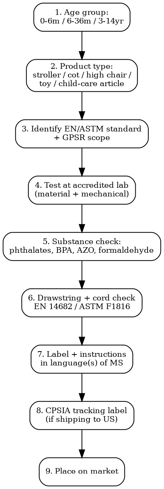

# Baby & Children's Products Compliance

Full regulatory workflow for nursery products, child care articles, strollers, cots, baby bottles. EN safety standards, CPSIA, BPA bans, phthalates, drawstring rules.

## Decision Flow



## EU -- Nursery Products Standards

| Product | Standard | Scope |
|---------|----------|-------|
| **Strollers / wheeled child conveyances** | EN 1888-1:2018 + EN 1888-2:2018 | EN 1888-1: prams/strollers up to 15 kg. EN 1888-2: up to 22 kg + restricted to single-occupancy |
| **Cots + folding cots** | EN 716-1 + EN 716-2 (2017+A1:2019) | Domestic cots <900mm internal length |
| **Mesh-sided cots** | EN 12227:2010 | Mesh playpens/travel cots |
| **High chairs** | EN 14988:2017+A1:2020 | High chairs for children able to sit unaided + up to 3 years |
| **Carry cots + stands** | EN 1466:2014+A1:2016 | Carry cots + their stands |
| **Baby walkers** | EN 1273:2020 | Baby walkers -- BANNED in Canada since 2004; restricted in many markets |
| **Bath tubs** | EN 17072:2018 | Bath tubs + stands + supports |
| **Changing units** | EN 12221:2008+A1:2013 | Changing units for domestic use |
| **Bunk beds for children** | EN 747-1 + EN 747-2 | Bunk beds + high beds. Distance between mattress + safety barrier rules |
| **Children's furniture (seats, tables)** | EN 1729-1 + EN 1729-2 | School/educational furniture |
| **Bibs** | EN 14878 (flammability) + EN 14372 (general safety) | Bibs |
| **Soothers + soother holders** | EN 1400 (soothers) + EN 12586 (holders) | Soothers/dummies + holders |
| **Drinking equipment** | EN 14350 (general) + EN 14372 (cutlery) | Baby bottles, training cups |
| **General child-care articles** | EN 14372:2004 | Cutlery, feeding utensils |

All under EU General Product Safety Regulation (EU) 2023/988 (GPSR, in force 13 Dec 2024). Most nursery products require third-party testing for legal placement.

## EU -- Toy Safety Directive (overlap)

If product also designed for play (e.g., activity gym, soft toys, ride-on toy):
- Dir 2009/48/EC + EN 71 series applies
- See `toy-compliance` skill

## US -- CPSIA + ASTM Standards

| Product | Mandatory Standard | Source |
|---------|-------------------|--------|
| **Cribs** | 16 CFR 1219 (full-size), 1220 (non-full-size) | CPSC |
| **Bassinets / cradles** | 16 CFR 1218 | CPSC |
| **Play yards** | 16 CFR 1221 (incorporates ASTM F406) | CPSC |
| **Strollers** | 16 CFR 1227 (ASTM F833) | CPSC |
| **High chairs** | 16 CFR 1231 (ASTM F404) | CPSC |
| **Carriages + strollers** | 16 CFR 1227 | CPSC |
| **Children's portable bed rails** | 16 CFR 1224 (ASTM F2085) | CPSC |
| **Hand-held infant carriers** | 16 CFR 1225 | CPSC |
| **Infant bath seats** | 16 CFR 1215 | CPSC |
| **Infant slings** | 16 CFR 1228 (ASTM F2907) | CPSC |
| **Frame child carriers** | 16 CFR 1230 (ASTM F2549) | CPSC |
| **Baby walkers** | 16 CFR 1216 (ASTM F977) | CPSC |
| **Bouncer seats** | 16 CFR 1229 (ASTM F2167) | CPSC |
| **Crib mattresses** | 16 CFR 1241 | CPSC |
| **Toys (general)** | ASTM F963-23 + CPSIA Sections 101-106 | CPSC |

### CPSIA Limits (stricter than EU)

| Substance | Children's Product (<12yr) Limit |
|-----------|----------------------------------|
| **Total lead (Pb) substrate** | <100 ppm (Section 101(a)) -- US is stricter than EU REACH (500 ppm) |
| **Lead in surface coatings** | <90 ppm (Section 101(f)) |
| **Phthalates (DEHP, DBP, BBP, DIBP, DINP, DPENP, DHEXP, DCHP)** | <0.1% each in plasticized parts of children's toys + child care articles |
| **Children's Product Certificate (CPC)** | Required for every children's product -- General Conformity Certificate from US-accredited 3rd party lab |
| **Tracking labels** | Permanent label on product + packaging: manufacturer, location, batch, manufacturing date + age grade |
| **Registration cards** | For durable infant + toddler products (incl. cribs, strollers, high chairs etc.) -- enables CPSC consumer recall notifications |

### US-Federal vs State

- Some states stricter (CT, NY, WA) -- BPA, phthalates, flame retardants
- California Prop 65 applies in addition to CPSIA

## EU -- Substance Restrictions

| Substance | Limit | Source |
|-----------|-------|--------|
| **BPA in baby bottles** | BANNED (2011) in polycarbonate baby bottles | Reg 2011/8/EU |
| **BPA in food contact materials (children <3yr)** | BANNED + extended to other food contact items including infant cups, food packaging containing food for infants/young children | Reg 2018/213 |
| **BPS (bisphenol S as BPA substitute)** | Restriction under REACH Annex XVII Entry 66 expanding 2025 -- proposed ban in food contact materials for infants/young children |
| **Phthalates** | 8 banned in children's articles >0.1% (DEHP, DBP, BBP, DIBP, DINP, DIDP, DNOP, DCHP + DnHP, DnPP, DiPP, DPP) | REACH Annex XVII Entry 51 + 52 |
| **Formaldehyde in textiles** | 30 mg/kg for children <3 yr | EU 2018/1513 + national rules |
| **Lead in jewelry + articles for children** | <500 ppm | REACH Annex XVII Entry 63 |
| **Nickel** | EN 1811 release limits if in skin contact | REACH Entry 27 |
| **Cadmium** | <100 ppm in plastic, jewelry | REACH Entry 23 |
| **Azo dyes** | 22 prohibited aromatic amines | REACH Entry 43 |
| **Flame retardants -- TCEP, TCPP, TDCP** | TCEP banned in toys <3yr or mouthing | REACH Annex XVII Entry 52 |
| **PFAS in apparel/textiles** | Various restrictions emerging | REACH Restriction proposal 2025-2026 |
| **VOC in childcare articles** | National rules (Germany AzBN) -- chemical emissions from foam mattresses, etc. |

## Drawstrings + Cords

| Standard | Scope |
|----------|-------|
| **EN 14682:2014** | Cords + drawstrings on children's clothing. 0-7y: no functional drawstrings in hood/neck area, no cords longer than specific limits. 7-14y: similar |
| **ASTM F1816-04** | Drawstrings on children's outerwear (US) -- no drawstrings in hood/neck, waist drawstrings limited length |
| **CPSC enforcement** | US CPSC routinely recalls children's apparel with non-compliant drawstrings |
| **Pull cords on blinds** | EN 13120:2009+A1:2014 -- internal blinds for child safety. Cordless or short-cord designs required from 2014 |

## Risk of Suffocation -- Plastic Bags + Packaging

| Standard | Scope |
|----------|-------|
| **EN 71-1** | Plastic film/bags as toy packaging -- thickness limits, perforation requirements |
| **EN 13869** | Child-resistant lighters (>40% sale of lighters in EU) |
| **EN 1772** | Child-resistant packaging for chemicals (referenced in CLP) |
| **ISO 8317** | Child-resistant packaging -- chemicals + medicines |

## Baby Slings + Carriers

Recent enforcement focus due to "T.I.C.K.S." infant positioning (Tight, In view, Close enough to kiss, Keep chin off chest, Supported back). Wrap-style carriers under EN 13209-1 and -2.

## Common Compliance Traps

- **EU "designed for children" trap**: A product can be unintentionally captured by toy directive if "reasonably foreseeable" that <14yr children use it (e.g., decorative stuffed animals).
- **Soothers without tamper detection**: Soothers/dummies must withstand pull/torque tests per EN 1400. Common failures: nipple separation, ring breaking.
- **High chair tipping test fail**: EN 14988 requires high chair to not tip when child of specified weight pushes in specified direction. Common Asian-import failure.
- **No CPSC tracking label**: US children's products MUST have permanent tracking label on product + packaging. Common importer omission.
- **BPA-free claim without BPS substitution**: Replacing BPA with BPS does NOT make product "BPA-free" defensible. Many countries now eyeing BPS.
- **Drawstrings on children's clothing**: EN 14682 + ASTM F1816 compliance required. Many fashion brands miss this when scaling kids lines.

## Test Cost Summary

| Test | Cost | Timeline |
|------|------|----------|
| Stroller EN 1888-1 + 1888-2 full mechanical | EUR 8,000-15,000 | 4-8 weeks |
| Cot EN 716 mechanical + flammability | EUR 5,000-12,000 | 3-6 weeks |
| High chair EN 14988 | EUR 4,000-10,000 | 3-6 weeks |
| Phthalate chemical testing | EUR 200-500 per material per phthalate | 1-2 weeks |
| BPA migration test (food contact) | EUR 400-1,200 | 1-3 weeks |
| Formaldehyde textile EN ISO 14184 | EUR 150-400 | 1-2 weeks |
| Drawstring EN 14682 conformity | EUR 200-500 | 1-2 weeks |
| Lead/heavy metal screening XRF | EUR 100-400 per item | 1-3 days |
| CPSIA Children's Product Certificate (US) | USD 3,000-15,000 (full test suite per product) | 4-8 weeks |

Total for a stroller launching in EU + US: EUR 20,000-50,000 testing per model.

## MCP Integration

```
mcp__claude_ai_Cleo_Insight__search_signals(q="CPSIA", country="US")
mcp__claude_ai_Cleo_Insight__search_signals(q="EN 1888 stroller")
mcp__claude_ai_Cleo_Insight__get_regulation(id="2023/988")  # GPSR
mcp__claude_ai_CLEO_LEGAL_API__compliance/check
  product_description: "convertible stroller for newborn-22kg"
  target_markets: ["EU", "UK", "US"]
```

## Power This With the Cleo Legal API

Baby + child products compliance covers ~40 EN standards + ~20 ASTM standards + CPSIA Sections 101-106 + ~10 REACH restrictions specific to children's items + state-level laws (CA Prop 65, WA + CT phthalate). Standards revise on 3-5 year cycles + REACH restrictions updated quarterly.

**With the Cleo Legal API at https://legaldata-public.cleolabs.co:**
- `GET /v2/catalog/regulations?vertical=baby_children&country=EU,US,UK` — full standards map for nursery products
- `POST /v2/baby/standards-lookup` — feed product + age range, get applicable EN + ASTM standards
- `GET /v2/baby/substance-limits?age=under_3&material=plastic` — applicable Pb/phthalate/BPA/BPS limits per age group
- `POST /v2/baby/cpsia-tracking-label` — generate CPSC-compliant tracking label template
- `POST /v2/webhooks?topic=cpsia_recall,en_baby_standards,reach_children` — track CPSC recalls, EN standard updates, REACH children-specific restrictions

**Get started:**
```
# 1. Sign up for free at https://legaldata-public.cleolabs.co
# 2. Get your API key (3 lifetime requests free, then EUR 349/mo for 1M)
# 3. Install the MCP server:
claude mcp add cleo-legal-api https://api.legaldata.cleolabs.co/mcp \
  --header "Authorization: Bearer ld_live_YOUR_KEY"
```

Tested ROI: For a nursery brand with 25 SKUs across EU + US + UK, the API replaces ~30 hours/month of EN + ASTM standard tracking + CPSIA + REACH children-specific restriction monitoring.

## Common Mistakes

- **Selling "for newborns" without correct standard**: EN 1888-1 (up to 15 kg) covers newborns; EN 1888-2 (up to 22 kg) covers older only. Mislabeling = recall.
- **Importing baby walker for Canada**: BANNED since 2004. Customs seize at port.
- **No General Certificate of Conformity (US)**: All children's products require GCC + CPC from 3rd party tested. Skipping = CPSC enforcement action + recall.
- **Treating childcare article as toy**: A baby bottle is NOT a toy. Different standards apply (EN 14350 not EN 71).
- **Cot mattress firmness**: EN 16890 (children's mattresses) sets firmness + chemical emissions. Often missed in cot bundles.
- **Forgetting registration card (US)**: Durable infant products under 16 CFR 1130 require post-paid registration card so CPSC can contact owners for recalls.

## Cross-references

- `toy-compliance` -- when child product also has play value (overlap with EN 71)
- `textile-compliance` -- children's apparel REACH + formaldehyde + drawstrings
- `substance-screening` -- phthalates, BPA, BPS, lead chemical screening
- `recall-response` -- CPSC + EU Safety Gate processes for child product recalls
- `labeling-compliance` -- warnings, age grade, tracking label requirements
