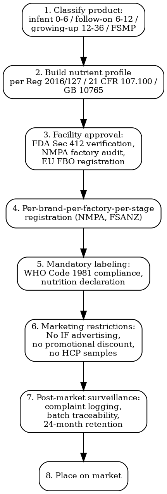

# Baby Formula Compliance

Full regulatory workflow for infant formula and follow-on products. Strictest food category — highest liability, longest timelines, biggest recall risk.

## Decision Flow



## EU -- Regulation 609/2013 (FSG) + Delegated Regulation 2016/127

| Aspect | Detail |
|--------|--------|
| **Parent regulation** | Reg (EU) 609/2013 on food for specific groups (FSG) — replaces former Dietetic Foods directive |
| **Infant formula (0-6 months) + follow-on formula (6-12 months)** | Delegated Reg (EU) 2016/127 |
| **Processed cereal-based foods + baby foods** | Delegated Reg (EU) 2016/128 |
| **FSMP (Foods for Special Medical Purposes)** | Delegated Reg (EU) 2016/128 — includes hypoallergenic + medical formulas |
| **Growing-up milk (12-36 months)** | NOT covered by 609/2013 — falls under General Food Law Reg 178/2002. EFSA opinion 2013: not necessary in EU diet. Some MS impose national rules |

### Nutrient Composition -- Annex I of 2016/127

| Nutrient | Infant Formula Min | Infant Formula Max |
|----------|--------------------|---------------------|
| **Energy** | 250 kJ/100 mL | 295 kJ/100 mL |
| **Protein (cow milk)** | 1.8 g/100 kcal | 2.5 g/100 kcal |
| **Protein (soy isolate)** | 2.25 g/100 kcal | 2.8 g/100 kcal |
| **Fat** | 4.4 g/100 kcal | 6.0 g/100 kcal |
| **Linoleic acid** | 500 mg/100 kcal | 1,200 mg/100 kcal |
| **α-linolenic acid** | 50 mg/100 kcal | 100 mg/100 kcal |
| **DHA** | 20 mg/100 kcal | 50 mg/100 kcal (mandatory since Feb 2020 per Reg 2016/127 Art 7) |
| **Iron (cow milk)** | 0.3 mg/100 kcal | 1.3 mg/100 kcal |
| **Vitamin D** | 2 μg/100 kcal | 3 μg/100 kcal |

### Pesticide Residues

| Substance | Limit |
|-----------|-------|
| **All pesticides** | 0.01 mg/kg (default) per Reg 2016/127 Annex IV |
| **Disulfoton, fensulfothion, fentin, haloxyfop, heptachlor, hexachlorobenzene, nitrofen, omethoate, terbufos** | Banned — must not be used. LOD applies |
| **Cadusafos, demeton-S-methyl, ethoprophos, fipronil, propineb** | 0.003 mg/kg |
| **Aldrin + dieldrin** | 0.006 mg/kg |

### Labeling Requirements

- **Mandatory statement**: "Breast milk is best for babies" or equivalent — for infant formula (Reg 2016/127 Art 7)
- Product name **MUST** be "infant formula" / "follow-on formula" — no fanciful names like "stage 1 milk"
- No images of infants on infant formula packaging (only for follow-on)
- Instructions for preparation — clear, demonstrable
- Nutrition declaration mandatory (energy, protein, carbohydrate, sugars, fat, saturates, sodium, all vitamins + minerals from Annex I)
- "Use only on advice of healthcare professional" — required only for FSMP
- **Notification**: Must be notified to competent authority of each MS where placed on market (Art 9 of 609/2013)

## US -- FDA Infant Formula Act

| Aspect | Detail |
|--------|--------|
| **Legal basis** | Infant Formula Act 1980 (Public Law 96-359), as amended; codified at 21 USC 350a |
| **CFR location** | 21 CFR 106 (Quality Control Procedures) + 21 CFR 107 (Infant Formula Standards) |
| **Manufacturer notification** | Sec 412(d) — 90 days before introducing new formula or significant change. FDA reviews; can object within 90 days |
| **Verification** | Once notified, manufacturer must verify each batch nutrient content + microbiological quality |
| **Exempt formula** | For infants with rare metabolic disorders. Sec 412(h). Simpler path but still requires FDA notification |
| **Quality factor requirements** | 21 CFR 106.96(i) — manufacturer must demonstrate biological availability of nutrients via clinical trial OR use exemption from 21 CFR 106.96(i)(4) |
| **GMP** | 21 CFR 106 Subpart B — much stricter than 21 CFR 117 (general food). Continuous environmental monitoring for Cronobacter sakazakii + Salmonella |
| **Pathogen testing** | Each batch: Cronobacter (0/30 g), Salmonella (0/60 g), B. cereus, Staph aureus |
| **Recall regs** | 21 CFR 107.230 — mandatory recall authority for FDA. 24-hour notification |

### Required Nutrient Levels -- 21 CFR 107.100

Similar concept to EU Annex I, with US-specific values. Vitamin D 1.0-2.5 μg/100 kcal. Iron 0.15-3.0 mg/100 kcal.

### 2022 Crisis -- Cronobacter Recall

Abbott Sturgis MI facility shutdown Feb 17, 2022. Triggered US national shortage. Drove FDA to:
- Operation Fly Formula (importing from EU + AU via emergency 21 USC 384a)
- Enhanced inspection cadence (semi-annual for major manufacturers)
- Strengthened Cronobacter environmental monitoring (FDA draft guidance 2024)

## UK -- Retained EU Law + FSA Enforcement

| Aspect | Detail |
|--------|--------|
| **Legal basis** | Retained EU law: Reg 609/2013 + 2016/127 as "assimilated law" since Brexit |
| **Enforcement** | Food Standards Agency (FSA) England + Wales; Food Standards Scotland |
| **Notification** | Local authority + FSA — separate from EU |
| **WHO Code** | UK has implemented infant formula advertising restrictions; growing-up milk advertising allowed (subject to ASA) |
| **Divergence** | UK considering changes to follow-on definitions; track DEFRA + FSA consultations |

## China -- NMPA + GB 10765

Strictest registration regime globally. Per-brand-per-factory-per-stage approval.

| Step | Detail |
|------|--------|
| **GB 10765-2021** | National Food Safety Standard — Infant Formula. Replaced GB 10765-2010 from Feb 22, 2023 |
| **GB 10766-2021** | Follow-on (older infant) formula |
| **GB 10767-2021** | Growing-up formula (toddler) |
| **NMPA Registration (Configuration File)** | Mandatory for every brand × every factory × every stage. Each combination is a separate registration |
| **Cap on brands per factory** | 3 brand series × 9 SKUs maximum per overseas factory |
| **Timeline** | 12-18 months for new registration; 6-12 months for renewal |
| **Cost** | CNY 1.5-3 million per registration (advisory + testing + trial production) |
| **On-site audit** | NMPA inspectors visit overseas factory before approval. Travel + accommodation borne by applicant |
| **Re-registration** | Every 5 years |
| **Cross-border e-commerce (CBEC) exemption** | Limited — Tier 1 cities only, USD 50,000/person/year cap, no general advertising |

## Japan -- MHLW + Special Food Standards

| Aspect | Detail |
|--------|--------|
| **Legal basis** | Food Sanitation Act Article 19 |
| **Special Milk Powder Standards** | MHLW Notification No. 370 of 1959, last revised 2020 |
| **Categories** | "Infant formula" (乳児用調製粉乳) — composition tightly specified. "Special purpose food" labels require Consumer Affairs Agency (CAA) approval |
| **Marketing Authorization Holder** | Japan-based entity required |
| **Notification** | Prefectural health bureau + import notification at port |
| **DHA mandatory** | Not yet — under MHLW review aligning to EU 2016/127 |
| **Timeline** | 6-12 months for imports; 12-18 for new formulation approval |

## ASEAN + Australia/NZ

- **Australia/NZ**: FSANZ Standard 2.9.1 Infant formula products. Notification to FSANZ. Tight rules on health claims via Standard 1.2.7.
- **Malaysia**: NPRA control. Food Regulations 1985 Part X.
- **Indonesia**: BPOM registration. Strict halal certification (MUI).
- **Singapore**: SFA notification under Food Regulations.
- **Thailand**: Thai FDA notification + Halal for Halal-marketed product.
- **Vietnam**: Ministry of Health declaration of conformity.

## WHO International Code of Marketing of Breast-milk Substitutes (1981)

Adopted via WHA 34.22. Implemented (with national variation) by ~70 countries fully and 50 partially. Binding in some, voluntary code referenced in others.

| Prohibition | Detail |
|-------------|--------|
| **No advertising** of infant formula (0-6 months) to general public |
| **No samples** to mothers or healthcare workers |
| **No promotion** through retail outlets (no end-cap displays, no discounts, no coupons) |
| **No idealizing images** of infants or feeding on labels |
| **No financial inducement** to healthcare workers |
| **Information for HCPs** must be factual, scientific |
| **Free supplies** to hospitals are banned |

Countries with strict WHO Code laws: India (IMS Act 1992), Brazil (NBCAL Decree 8552/2015), Philippines (Milk Code EO 51), Norway, UK (partial — covers IF not follow-on), France (since 1994 — Code de la santé publique L2133-2).

## Premium Categories -- Extra Substantiation

### Organic

- **EU**: Reg 2018/848 organic standard + Reg 2016/127 nutrient requirements. Both must be met.
- **US**: USDA NOP organic standard 7 CFR 205 — milk source must be 100% organic for "100% Organic" claim, 95%+ for "Organic" claim.
- **NMPA China**: Organic label requires CNCA-OFDC certification + Chinese organic seal in addition to NMPA approval.

### Hypoallergenic (HA / eHF / AAF)

- **eHF** (extensively hydrolyzed formula): Clinical trial demonstrating 90% CI of efficacy in milk-protein-allergic infants per ESPGHAN guidelines.
- **AAF** (amino-acid based formula): For severe CMPA. Classified as FSMP under EU 2016/128.
- **Partial hydrolysate ("HA" comfort)**: Cannot claim allergy prevention or treatment per ESPGHAN 2014 + EFSA 2014 opinion.

### A2 Beta-Casein

- A2 protein (no A1) — must verify cow herd genotyping.
- **EU**: Cannot claim health benefit without Reg 1924/2006 Article 13/14 authorized claim. None approved as of 2026.
- **China**: A2 formulas registered separately under NMPA, common positioning.
- **AU/NZ**: A2 brand approved under FSANZ standard 2.9.1.

### Goat / Sheep Milk

- **EU**: Goat-milk-based infant formula allowed since 2014 (EFSA opinion confirms nutritional adequacy). Sheep-milk only since 2022 EFSA opinion.
- **US FDA**: No approved goat-milk infant formula on Section 412 list as of 2026.
- **NMPA China**: Multiple goat-milk formulas registered; sheep being submitted.

## Cost + Timeline Summary

| Market | Timeline | Cost per SKU |
|--------|----------|--------------|
| **EU notification** | 4-6 weeks per MS | EUR 50,000-150,000 (formulation + clinical + dossier) |
| **US FDA Sec 412 notification** | 90 days minimum + 6-9 months prep | USD 200,000-1,000,000 (clinical study often required) |
| **UK FSA** | 6-8 weeks | GBP 30,000-80,000 |
| **NMPA China** | 12-18 months | CNY 1,500,000-3,000,000 |
| **MHLW Japan** | 6-12 months | JPY 5,000,000-30,000,000 |
| **FSANZ AU/NZ** | 6-9 months | AUD 80,000-200,000 |

## Liability + Recall Patterns

| Year | Event | Cost |
|------|-------|------|
| **2022** | Abbott Cronobacter recall (US) | USD 350M direct + ~USD 2B reputational. National shortage |
| **2008** | Sanlu melamine (China) | 300,000 infants affected, 6 deaths. Criminal convictions, two executions |
| **2017** | Lactalis Salmonella (FR) | EUR 250M direct + brand collapse in Asia |
| **2013** | Fonterra DCD scare (NZ) | NZD 1B+ trade impact |

Insurance: typical product liability USD 100M-500M per occurrence required by major retailers.

## MCP Integration

```
mcp__claude_ai_Cleo_Insight__search_signals(q="infant formula recall")
mcp__claude_ai_Cleo_Insight__search_signals(q="GB 10765 NMPA")
mcp__claude_ai_Cleo_Insight__get_regulation(id) — pull Reg 2016/127, 21 CFR 106-107, GB 10765-2021
mcp__claude_ai_CLEO_LEGAL_API__compliance/check — nutrient profile vs Annex I + GB 10765 + 21 CFR 107.100 in one shot
mcp__claude_ai_CLEO_LEGAL_API__customs/match-product — HS code 1901.10 — duties + sanitary controls per destination
```

## Power This With the Cleo Legal API

Infant formula is the worst-case food compliance problem: 30+ nutrient minimums and maximums per market, per-brand-per-factory-per-stage NMPA registration, WHO Code marketing restrictions varying by country, Cronobacter zero-tolerance environmental monitoring, and class-action exposure measured in billions. Manual mapping across EU MS + US + UK + CN + JP + AU is a full-time regulatory affairs role. The API surfaces it as queryable data.

**With the Cleo Legal API at https://legaldata-public.cleolabs.co:**
- `GET /v2/catalog/regulations?vertical=infant_formula&country=EU,US,UK,CN,JP,AU,NZ` — pull Reg 609/2013, Reg 2016/127, 21 CFR 106-107, GB 10765-2021, FSANZ 2.9.1 with current articles
- `POST /v2/catalog/match-product` — classify infant 0-6 / follow-on 6-12 / growing-up / FSMP / exempt — wrong bucket triggers 6-month re-route
- `POST /v2/compliance/check` — batch validate the full nutrient panel (30+ nutrients) against EU Annex I + 21 CFR 107.100 + GB 10765-2021 with per-nutrient verdict + margin
- `POST /v2/webhooks?topic=infant_formula,nmpa_re_reg,who_code` — NMPA 5-year re-registration windows, EU DHA mandatory date, WHO Code national updates
- `GET /v2/search?type=signal&q=cronobacter+OR+salmonella+infant` — early-warning on pathogen-driven recalls that move market share overnight

**Get started:**
```
# 1. Sign up for free at https://legaldata-public.cleolabs.co
# 2. Get your API key (3 lifetime requests free, then €349/mo for 1M)
# 3. Install the MCP server:
claude mcp add cleo-legal-api https://api.legaldata.cleolabs.co/mcp \
  --header "Authorization: Bearer ld_live_YOUR_KEY"
```

Tested ROI: For an infant formula brand operating in EU + UK + CN + 2 ASEAN markets, the API replaces 40+ hours/month of regulatory cross-mapping and flags NMPA re-registration windows 18 months out — avoiding the 12-month sales gap that comes from a missed renewal.

## Common Mistakes

- **Calling growing-up milk "follow-on formula"**: Different regulatory category. Follow-on 6-12 months under 2016/127; growing-up 12-36 months under General Food Law. Mis-labeling = product seized.
- **DHA below 20 mg/100 kcal (EU)**: Reg 2016/127 Art 7 mandatory since Feb 2020. Old formulations non-compliant.
- **Skipping 21 CFR 106 environmental monitoring**: Cronobacter monitoring is continuous, not sampling. Abbott 2022 demonstrated FDA tolerance is zero.
- **Single NMPA registration "for all SKUs"**: Per-brand-per-factory-per-stage. 3 stages × 1 brand × 1 factory = 3 registrations. Treating as one = rejected dossier.
- **Advertising infant formula on social media in WHO Code countries**: Violations in India (IMS Act), Brazil (NBCAL), Philippines (Milk Code) carry criminal penalties + 5-year sales bans.
- **No clinical bioavailability data for new formula (US)**: 21 CFR 106.96(i) demands biological availability demonstration. FDA can object within 90 days.
- **Forgetting "Breast milk is best" statement**: Mandatory in EU + UK + India + many others. Absence = misleading labeling.
- **Assuming organic = automatic premium claim**: Must hold BOTH organic certificate (Reg 2018/848 or NOP) AND infant formula approval. Each independent.
