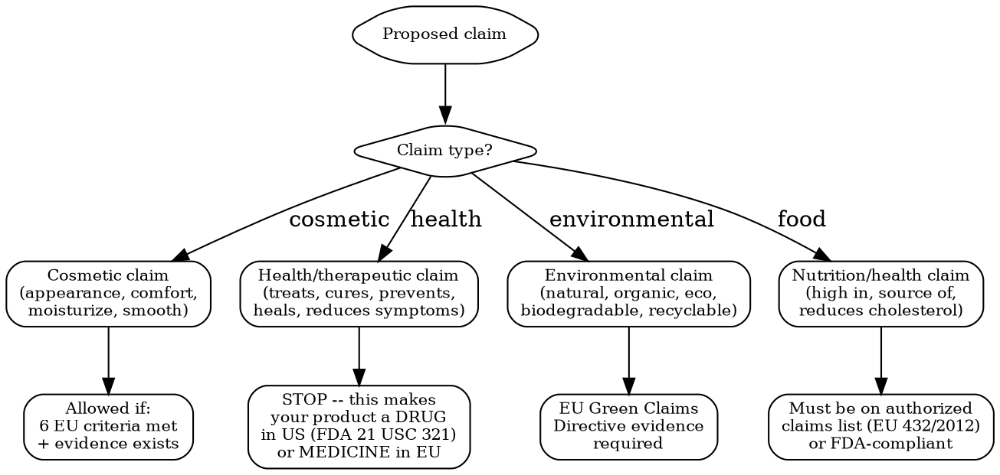

# Claims Substantiation

Validate marketing claims against regulations. Every claim on your product or marketing must be substantiated before use. Unsubstantiated claims = enforcement action, fines, recall.

## MCP Tools

```
# Search for claims-related regulation signals
mcp__claude_ai_Cleo_Insight__search_signals(q="claims regulation", limit=25)
mcp__claude_ai_Cleo_Insight__search_signals(q="green claims", limit=25)
mcp__claude_ai_Cleo_Insight__search_signals(q="greenwashing", limit=25)

# Get regulation details for claims rules
mcp__claude_ai_Cleo_Insight__get_regulation(id="<regulation-id>")

# Check if product ingredients support the claim
mcp__claude_ai_CLEO_LEGAL_API__compliance/check
  product_description: "<product with claim>"
  ingredients: ["<ingredients>"]
  target_markets: ["EU", "US", "UK"]

# Upload claims substantiation file as evidence
mcp__bastion__upload-compliance-document(name="claims-dossier-2026.pdf", document="data:application/pdf;base64,...")
mcp__bastion__add-compliance-test-evidence(testId="<test-id>", name="Claims substantiation dossier", description="Clinical study and consumer perception test for anti-aging claims", evidenceDocumentId="<doc-id>")
```

## Claims Decision Tree



## EU Cosmetics Claims: The 6 Criteria (Regulation 655/2013)

Every cosmetic claim sold in the EU must satisfy ALL 6:

| # | Criterion | What It Means | Fail Example |
|---|-----------|---------------|-------------|
| 1 | **Legal compliance** | Claim does not contradict EU law | "Approved by the EU" (no EU approval exists for cosmetics) |
| 2 | **Truthfulness** | Claim reflects actual product performance | "Removes 100% of wrinkles" (physically impossible) |
| 3 | **Evidential support** | Substantiated by adequate studies/tests | "Clinically proven" without any clinical study |
| 4 | **Honesty** | Does not attribute unique properties common to all products | "Tested on humans" (all cosmetics sold in EU are tested on humans) |
| 5 | **Fairness** | Does not denigrate competitors or legal ingredients | "Unlike products with parabens" (implies parabens are unsafe) |
| 6 | **Informed decision-making** | Average consumer can understand the claim | Complex percentages without context: "148% more luminosity" |

## Prohibited Claims (EU)

| Claim | Why Prohibited | What to Say Instead |
|-------|---------------|-------------------|
| "Hypoallergenic" (without evidence) | Must be substantiated by dermatological testing | "Dermatologically tested" (if tested) |
| "100% natural" (with synthetic preservatives) | Misleading -- product contains synthetic substances | State actual natural ingredient percentage: "95% naturally derived ingredients" |
| "Approved by [authority]" | No EU authority approves cosmetics | Remove entirely |
| "Prevents cancer" | Medical claim = reclassifies product as drug | Do not make health claims on cosmetics |
| "Heals eczema" | Medical claim | "Soothes dry, irritated skin" (cosmetic benefit) |
| "Contains no chemicals" | Everything is a chemical; misleading | "Free from [specific substance]" |
| "Dermatologically tested" (without test) | Must have actual dermatological test report | Only claim if test was performed |
| "Anti-aging" (EU guidance) | Acceptable only with evidence of measurable effect | Substantiate with clinical or instrumental measurement |

## US: Drug vs Cosmetic Line (FDA)

**The single most dangerous claims mistake for US market.** If your claim crosses the line, your cosmetic becomes an unapproved drug.

| Cosmetic Claim (OK) | Drug Claim (NOT OK -- triggers FDA drug regulation) |
|---------------------|----------------------------------------------------|
| "Moisturizes skin" | "Treats dry skin" |
| "Reduces the appearance of wrinkles" | "Eliminates wrinkles" |
| "Conditions hair" | "Promotes hair growth" |
| "Freshens breath" | "Prevents gingivitis" |
| "Cleanses skin" | "Kills bacteria" (antibacterial = OTC drug) |
| "Provides sun protection" | "Prevents skin cancer" |
| "Helps maintain skin's natural moisture" | "Restores skin barrier function" |

**Consequence of crossing the line**: FDA classifies product as unapproved new drug. Requires NDA or ANDA filing (costs USD 1M+, takes 2-5 years). Enforcement: warning letter, seizure, injunction, criminal prosecution.

**SPF claims**: Any sunscreen claim in the US makes the product an OTC drug under FDA monograph 21 CFR 352. Requires specific testing (FDA final sunscreen rule) and drug labeling.

### FTC Substantiation Doctrine

The FTC requires "competent and reliable scientific evidence" for all advertising claims:

| Evidence Level | Acceptable For | What It Means |
|---------------|---------------|---------------|
| **Randomized controlled trial** | "Clinically proven," "dermatologist recommended" | Double-blind, placebo-controlled, adequate sample size |
| **Clinical study (open-label)** | "Tested on [X] people" | Single-arm, before/after, statistically significant |
| **Instrumental measurement** | "Reduces wrinkle depth by X%" | Profilometry, corneometry, TEWL measurement |
| **Consumer perception test** | "X% of users felt smoother skin" | Self-assessment questionnaire, minimum 30 participants |
| **In vitro / in silico** | Supporting data only | Cannot be sole basis for consumer-facing claims |
| **Bibliography / literature** | Supporting data only | Published peer-reviewed studies on the ingredient |

## Food Claims (EU + US)

### EU: Nutrition & Health Claims Regulation 1924/2006

| Claim Type | Requirement | Example |
|-----------|-------------|---------|
| **Nutrition claim** | Must meet conditions in Annex (specific amounts) | "High in fiber" = minimum 6g fiber per 100g |
| **Health claim (Art. 13)** | Must be on EU Register of authorized claims | "Calcium contributes to normal bone maintenance" |
| **Risk reduction claim (Art. 14)** | Requires EFSA assessment + EU authorization | "Plant sterols reduce cholesterol" |
| **Children's development claim** | Requires EFSA assessment + EU authorization | "DHA contributes to normal brain development" |

**EU Authorized Health Claims Register**: ec.europa.eu/food/safety/labelling-nutrition/nutrition-health-claims/eu-register -- 270 authorized, 2,100+ rejected. If your claim is not on the list, you cannot use it.

### US: FDA Claim Categories

| Category | FDA Oversight | Example |
|----------|-------------|---------|
| **Nutrient content claim** | Defined by regulation (21 CFR 101.13) | "Low fat" = 3g or less per serving |
| **Structure/function claim** | No pre-approval; requires 30-day notification to FDA + disclaimer | "Supports immune health" + disclaimer |
| **Health claim (authorized)** | FDA-authorized (12 CFR 101.72-83) | "Calcium may reduce osteoporosis risk" |
| **Qualified health claim** | FDA enforcement discretion letter | Lower evidence standard, specific qualifying language required |

## Green Claims (EU Green Claims Directive 2024/825)

Effective March 2026. Kills vague environmental marketing.

| Prohibited | Why | Compliant Alternative |
|-----------|-----|----------------------|
| "Eco-friendly" (generic) | Vague, unverifiable | Specific: "Packaging is 80% recycled PET" |
| "Green" (without specifics) | Meaningless without data | "Carbon footprint: 2.1 kg CO2e per unit" |
| "Sustainable" (unqualified) | Must specify which aspect | "Ingredients sourced from certified organic farms (EU 2018/848)" |
| "Climate neutral" / "carbon neutral" | Must be based on recognized methodology, not just offsets | Remove or provide full lifecycle assessment |
| "Natural" (with synthetic ingredients) | Misleading composition claim | "Contains 92% naturally derived ingredients (ISO 16128)" |
| "Biodegradable" (without test) | Must prove biodegradation per OECD 301/302 | "Biodegradable per OECD 301B (62% in 28 days)" |

**Evidence requirements under Green Claims Directive:**
- Life Cycle Assessment (LCA) per ISO 14040/14044
- Third-party verification of claims
- Publicly accessible substantiation
- Penalties: up to 4% of annual turnover per member state

## Claims Substantiation File Template

```
CLAIMS DOSSIER -- [Product Name] -- [Date]

CLAIM: "[exact wording]"
MARKETS: [where the claim will appear]
MEDIUM: [packaging / website / advertising / social media]

CLASSIFICATION:
  Type: [cosmetic / health / nutrition / environmental / structure-function]
  EU 655/2013 criteria: [all 6 met? Y/N per criterion]
  US drug/cosmetic line: [cosmetic side / drug side]

EVIDENCE:
  Study type: [RCT / clinical / instrumental / consumer perception / in vitro / bibliography]
  Study reference: [title, lab, date, sample size]
  Key result: [metric, statistical significance]
  Study limitations: [list]

SUPPORTING EVIDENCE:
  [Additional studies, literature, supplier data]

RISK ASSESSMENT:
  Regulatory risk: [LOW / MEDIUM / HIGH]
  Alternative wording (lower risk): "[suggested safer claim]"

APPROVAL:
  Regulatory reviewer: [name]
  Date approved: [date]
  Review date: [next review -- annual minimum]
```

## Common Mistakes

- **"Clinically proven" without a clinical study**: This is the #1 enforcement trigger in EU and US. "Clinically proven" requires an actual clinical study with statistical significance on the specific product (not just the ingredient).
- **Cosmetic claim that crosses into drug territory**: "Reduces acne" = drug claim in US. "Helps maintain clear skin" = cosmetic claim. One word changes your regulatory category and compliance cost by 10-100x.
- **Using unauthorized health claims in EU**: The EU maintains a closed list of authorized health claims. If the claim is not on the list, it is illegal. "Boosts immunity" is NOT authorized.
- **"Natural" or "organic" without certification**: ISO 16128 defines natural/organic percentages. COSMOS/NATRUE/USDA Organic provide certification. Using "organic" without certification = enforcement.
- **Green claims without LCA**: The EU Green Claims Directive requires lifecycle assessment evidence. "Eco-friendly" packaging without an LCA documenting the environmental benefit = greenwashing = fines up to 4% of turnover.
- **Forgetting social media is advertising**: Claims on Instagram, TikTok, and influencer content are subject to the same substantiation requirements as packaging claims. FTC and EU authorities actively enforce.
