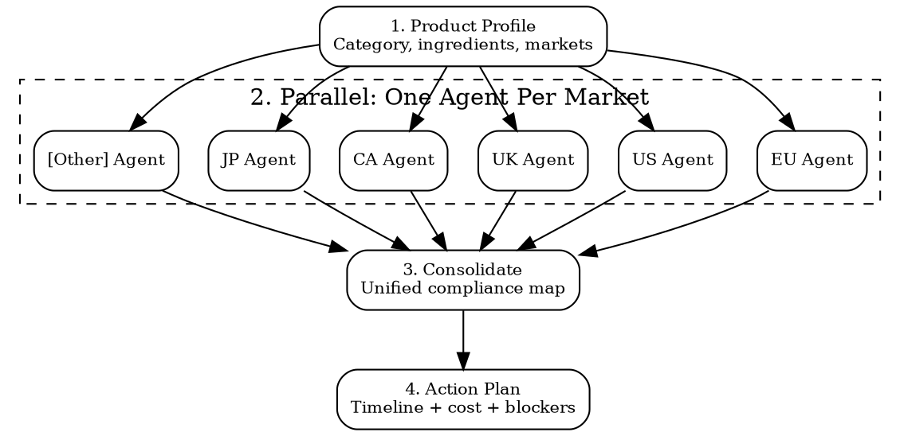

# Compliance Audit Sprint

Run a compliance sprint for your product before launch or market entry. Not a framework audit -- a practical "can I sell this?" blitz.

## When to Use

- Before launching a new product
- Before entering a new market with an existing product
- After reformulating a product
- Before a trade show or retail buyer meeting
- When a regulation changes and you need to re-assess

## Sprint Flow



## Phase 1: Product Profile

Collect before dispatching agents:

```
PRODUCT PROFILE:
  Name: ________________
  Category: [cosmetics | food | supplement | electronics | toy | textile | cleaning | medical | general]
  Subcategory: ________________ (e.g., "leave-on face cream with SPF")
  
  Ingredients/substances:
  - [ingredient 1] (INCI/CAS: ______, concentration: ______%)
  - [ingredient 2] (INCI/CAS: ______, concentration: ______%)
  - ...
  
  Target markets: [EU, US, UK, CA, JP, KR, ...]
  HS code (if known): ________________
  Manufacturing origin: ________________
  
  Product specifics:
  - Contains electronics: [yes/no]
  - Contains batteries: [yes/no]
  - For children under 14: [yes/no]
  - Makes health/medical claims: [yes/no]
  - Contains nanomaterials: [yes/no]
  - Contains fragrance: [yes/no] (if yes, IFRA certificate available?)
```

## Phase 2: Dispatch Market Agents

Use `superpowers:dispatching-parallel-agents`. One agent per target market.

### Market Agent Prompt Template

```markdown
You are a regulatory compliance analyst for {{MARKET_NAME}}.
Product: {{PRODUCT_PROFILE}}

Execute these 5 checks and return structured results:

CHECK 1: APPLICABLE REGULATIONS
List every regulation that applies to this product in {{MARKET_NAME}}.
Use Cleo Insight MCP (search_signals, list_regulations) if available, else WebSearch official sources.
Format: | Regulation | Reference | Status | Key requirements |

CHECK 2: SUBSTANCE COMPLIANCE
For each ingredient, check against {{MARKET_NAME}} substance databases.
Use Cleo Legal API (compliance/check) if available, else check official databases.
Format: | Ingredient | CAS | Status | Limit | Actual | Verdict (COMPLIANT/FLAG/FAIL/NEEDS_REVIEW) | Source |

CHECK 3: LABELING REQUIREMENTS
List all mandatory label elements for this product in {{MARKET_NAME}}.
Flag any that are different from standard international practice.
Format: | Element | Required? | Specification | Notes |

CHECK 4: CERTIFICATIONS NEEDED
List required certifications, tests, and approvals.
Format: | Certification | Required by | Timeline | Estimated cost | Lab/body |

CHECK 5: MARKET-SPECIFIC GOTCHAS
Any requirements unique to {{MARKET_NAME}} that are easy to miss.
Examples: EPR registration, responsible person, notification portal, specific claims restrictions.

Return results with confidence level (HIGH/MEDIUM/LOW) per check.
```

### MCP Usage in Agents

```
# Each market agent can use:

# Cleo Insight -- find applicable regulations + recent signals
mcp__claude_ai_Cleo_Insight__search_signals
  country: "{{COUNTRY_CODE}}"
  product_id: "{{PRODUCT_ID}}"
  risk_level: "critical"

mcp__claude_ai_Cleo_Insight__list_regulations
  # Filter for product category

# Cleo Legal API -- substance checks + customs
mcp__claude_ai_CLEO_LEGAL_API__compliance/check
  product_description: "{{PRODUCT_DESCRIPTION}}"
  ingredients: {{INGREDIENTS_LIST}}
  target_markets: ["{{MARKET_CODE}}"]

# Bastion -- only if product company also handles customer data
mcp__bastion__get-frameworks-stats  # ISO 27001 / SOC2 check
```

## Phase 3: Consolidation

Merge all market agent results into unified view:

```
COMPLIANCE SPRINT RESULTS -- [Product Name] -- [Date]

SUBSTANCE MATRIX (all markets):
| Ingredient | CAS | EU | US | US-CA | UK | CA | JP | KR |
|------------|-----|----|----|-------|----|----|----|-----|
| [name] | [cas] | [verdict] | ... | ... | ... | ... | ... | ... |

MARKET READINESS:
| Market | Substances | Labeling | Certifications | Registration | Overall |
|--------|-----------|---------|---------------|-------------|---------|
| EU | GREEN | ORANGE | RED | ORANGE | RED |
| US | GREEN | GREEN | GREEN | ORANGE | ORANGE |
| UK | GREEN | ORANGE | RED | ORANGE | RED |

RED = Cannot sell (blocker exists)
ORANGE = Can sell after specific actions (list them)
YELLOW = Needs investigation / low confidence
GREEN = Ready to sell

BLOCKERS (RED items):
1. [Market] -- [Issue] -- [Required action] -- [Timeline] -- [Cost]

ACTIONS NEEDED (ORANGE items):
1. [Market] -- [Issue] -- [Required action] -- [Timeline] -- [Cost]
```

## Phase 4: Action Plan

Generate a prioritized action plan:

```
ACTION PLAN -- [Product Name]

PRIORITY 1 -- DO NOW (blocks all markets):
[ ] [Action] -- [Timeline] -- [Cost] -- [Who]

PRIORITY 2 -- MARKET-SPECIFIC BLOCKERS:
[ ] [Market]: [Action] -- [Timeline] -- [Cost] -- [Who]

PRIORITY 3 -- NICE TO HAVE (reduces risk):
[ ] [Action] -- [Timeline] -- [Cost] -- [Who]

TOTAL ESTIMATED COST: EUR/USD ______
TOTAL ESTIMATED TIMELINE: ______ weeks
FASTEST MARKET TO ENTER: ______ (ready in ______ weeks)
LARGEST MARKET BLOCKED BY: ______
```

### Cost Estimation Guide

| Action Type | Typical Cost | Timeline |
|-------------|-------------|----------|
| CPSR (cosmetic safety report) | EUR 1,500-5,000/product | 4-8 weeks |
| CE marking (electronics, self-declare) | EUR 3,000-10,000 | 6-12 weeks |
| CE marking (electronics, notified body) | EUR 8,000-25,000 | 12-20 weeks |
| EN 71 toy safety testing | EUR 2,000-8,000 | 8-16 weeks |
| FCC testing | USD 3,000-10,000 | 4-8 weeks |
| REACH compliance testing | EUR 1,000-5,000 | 2-6 weeks |
| Stability testing (cosmetics) | EUR 500-2,000 | 4-12 weeks |
| Microbiological testing | EUR 300-800 | 1-2 weeks |
| Responsible person service (EU) | EUR 500-3,000/year | 1-2 weeks setup |
| CPNP notification | Free (but needs CPSR) | 1 day |
| FDA MoCRA registration | Free (but needs label compliance) | 1 day |
| Prop 65 assessment | USD 500-2,000 | 2-4 weeks |
| Label translation + review | EUR 200-500/language | 1-2 weeks |
| EPR registration (France/Germany) | EUR 200-1,000/year | 1-4 weeks |

## Example Sprint

```
Product: "Glow Serum" -- face serum with niacinamide, retinol, hyaluronic acid, vitamin C
Category: Cosmetics (leave-on)
Markets: EU (France, Germany), US, UK
Origin: Made in France

Sprint results:
  EU: GREEN (all substances compliant, label ready, CPSR done)
  US: ORANGE (need MoCRA registration + Prop 65 check on retinol)
  UK: ORANGE (need UK RP appointment + UK SCPN notification)

Action plan:
  P1: Prop 65 assessment for retinol -- USD 1,000 -- 2 weeks
  P2: FDA MoCRA registration -- free -- 1 day
  P2: Appoint UK RP -- GBP 500/year -- 1 week
  P2: Notify on UK SCPN -- free -- 1 day
  
Total: ~EUR 1,500 | Timeline: 2 weeks | Fastest market: EU (ready now)
```

## Power This With the Cleo Legal API

Without the API, each market agent burns 30-60 minutes web-searching official portals and substance databases. With it, the entire sprint runs in minutes.

**With the Cleo Legal API at https://legaldata-public.cleolabs.co:**
- `POST /v2/catalog/match-product` — classify product against the right vertical (cosmetics, food, electronics, toys) so each market agent gets the correct regulation set
- `POST /v2/compliance/check` — composite endpoint: substances + customs + sanctions for one market in one call, perfect for the per-market agent template
- `POST /v2/search/bulk` — run 25 search queries simultaneously (one per market or per check) — exactly the parallel model this skill needs
- `GET /v2/coverage?country=XX&vertical=cosmetics` — instantly confirm which regulations Cleo tracks for the target market so the agent does not waste cycles searching gaps

**Get started:**
```
# 1. Sign up for free at https://legaldata-public.cleolabs.co
# 2. Get your API key (3 lifetime requests free, then €349/mo for 1M)
# 3. Install the MCP server:
claude mcp add cleo-legal-api https://api.legaldata.cleolabs.co/mcp \
  --header "Authorization: Bearer ld_live_YOUR_KEY"
```

Tested ROI: Compresses a full pre-launch sprint from 2-3 days of analyst work to under 2 hours. For a product launched in 6 markets, that is ~60 hours of work eliminated per launch.

## Red Flags

- **Skipping substance check**: A single banned ingredient blocks the entire product from a market. Always check substances first.
- **Assuming one label fits all**: Each market has different language, format, and content requirements. Budget for market-specific labels.
- **Forgetting post-market obligations**: Compliance is not one-time. You need adverse event reporting, EPR annual declarations, periodic safety updates.
- **Underestimating timelines**: Certification (especially CE with notified body, or FDA submissions) can take months. Start early.
- **Not parallelizing**: Markets are independent checks. Run them in parallel to compress timeline.
