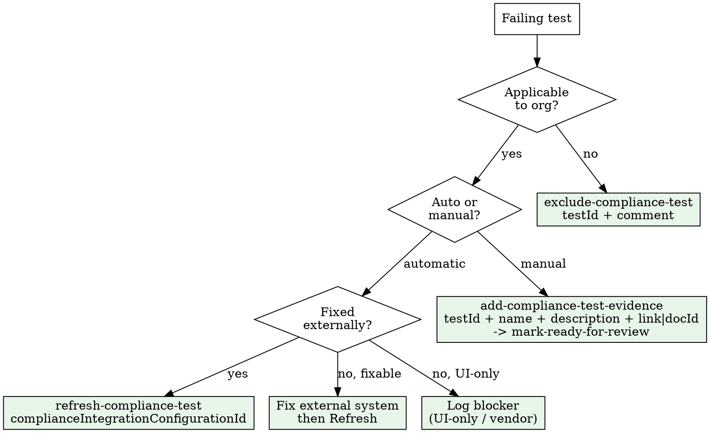

# Compliance Audit Sprint

Run a complete assess-triage-remediate-verify cycle for any compliance framework.

## Supported Frameworks

`iso27001-2022` | `soc2` | `hipaa` — pass as `framework` param to all MCP calls.

## Decision Flowchart



## Phase 1: Assess

```
mcp__bastion__get-frameworks-stats                              # all frameworks
mcp__bastion__get-compliance-failing-summary  framework="iso27001-2022"
mcp__bastion__list-failing-compliance-tests   framework="iso27001-2022"  page=1  pageSize=100
# Paginate: compare totalCount vs items returned. Increment page until exhausted.
```

## Phase 2: Triage into 5 Buckets

| Bucket | Criteria | MCP Action |
|--------|----------|------------|
| **Exclude** | N/A to org (no office, no sub-processors) | `exclude-compliance-test` testId + comment |
| **Refresh** | Already fixed externally (FileVault ON, branch protection set) | `refresh-compliance-test` complianceIntegrationConfigurationId + optional testIds[] |
| **Evidence** | Manual test, proof exists but not uploaded | `add-compliance-test-evidence` then `mark-compliance-test-ready-for-review` |
| **Fix** | Actual gap needing work | Route to `compliance-remediation` skill |
| **Blocked** | UI-only (MDM user-assoc, policy approval) or vendor-dependent | Log with owner + ETA |

Integration types from failing-summary: `bastion` (policies), `google` (workspace), `bastion_mdm` (device management), `github` (repos).

## Phase 3: Parallelize

Use `dispatching-parallel-agents` skill — three independent agents:
- **Agent A**: Exclude all N/A tests (batch)
- **Agent B**: Refresh all externally-fixed tests by integration config ID
- **Agent C**: Upload evidence for manual tests (use `evidence-blitz` skill for bulk)

Fix and Blocked stay sequential (need human decisions).

## Phase 4: Verify + Report

1. Re-run `get-frameworks-stats` for updated score
2. Compare before/after delta
3. List remaining failures with `list-failing-compliance-tests`
4. Generate report via `compliance-reporting` skill

## Example

```
User: "Run an ISO 27001 audit sprint"

1. get-frameworks-stats -> ISO27001: 14/75 passing
2. get-compliance-failing-summary framework="iso27001-2022"
   -> 61 failing: 23 manual, 31 auto (github:8, google:4, bastion_mdm:12, bastion:7), 7 N/A candidates
3. list-failing-compliance-tests pages 1-1 pageSize=100 -> full list
4. Triage: 7 exclude, 12 refresh, 18 evidence, 17 fix, 7 blocked
5. Parallel: A excludes 7, B refreshes 12 (by integrationConfigId), C uploads 18
6. Re-check: 14 -> 51 passing in one session
7. Remaining 24 -> prioritized roadmap via compliance-gap-analysis
```

## Red Flags

- **Pagination skipped**: pageSize max 100, default 25. Always check totalCount vs items.length.
- **Refreshing unfixed tests**: Just re-confirms failure. Confirm fix happened first.
- **Bulk excluding real gaps**: Excludes are auditor-visible. Only genuinely N/A tests.
- **Wrong refresh param**: `refresh-compliance-test` takes `complianceIntegrationConfigurationId` (number), NOT testId.
- **Evidence without submit**: `add-compliance-test-evidence` does NOT submit. Must call `mark-compliance-test-ready-for-review` after.
- **Ignoring blocked bucket**: Track blockers or they silently stall the sprint.
