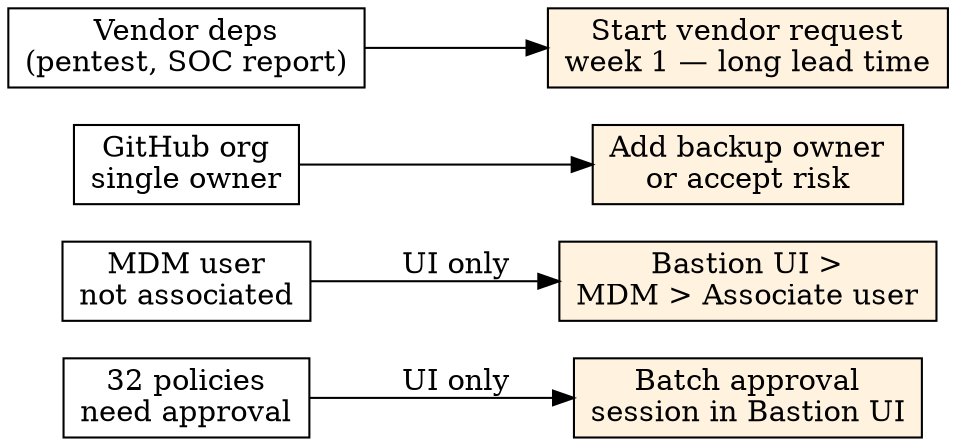

# Compliance Gap Analysis

Identify, categorize, score, and prioritize compliance gaps into a phased roadmap.

## Step 1: Pull Current State

```
mcp__bastion__get-frameworks-stats
mcp__bastion__get-compliance-failing-summary  framework="iso27001-2022"  # or soc2, hipaa
mcp__bastion__list-failing-compliance-tests   framework="iso27001-2022"  page=1  pageSize=100
# Paginate until totalCount exhausted
```

For each test needing detail: `mcp__bastion__get-compliance-test-detail  testId="<id>"`

## Step 2: Categorize Gaps

| Gap Type | Signal | Examples |
|----------|--------|----------|
| **Policy** | Missing/unapproved policy | InfoSec, acceptable use, incident response (32 policies in Bastion UI) |
| **Technical** | Misconfigured control | FileVault OFF, Firewall OFF, MFA not enforced, branch protection missing |
| **Process** | No documented procedure | No access reviews, no change mgmt, no onboarding/offboarding |
| **Evidence** | Control exists, proof not uploaded | Training records, pentest report, NDA scans |

## Step 3: Score and Prioritize

Three dimensions, each 1-3:

| Dimension | 1 (Low) | 2 (Medium) | 3 (High) |
|-----------|---------|------------|----------|
| **Impact** | Nice-to-have | Auditor flags | Certification blocker |
| **Effort** | < 1 hour | Half-day / vendor involved | Multi-day / external dependency |
| **Dependency** | Standalone | Enables 2-3 tests | Blocks entire category |

**Priority = Impact x (1/Effort) x Dependency_multiplier**

| Dependency score | Multiplier |
|-----------------|------------|
| 1 (standalone) | 1.0 |
| 2 (enables 2-3) | 1.5 |
| 3 (blocks category) | 2.0 |

Higher priority = do first. A certification-blocker (3) with low effort (1) that unblocks a category (x2.0) = 3 x 1.0 x 2.0 = **6.0** — top of the list.

## Step 4: Generate Phased Roadmap

| Phase | Scope | Timeline | Target |
|-------|-------|----------|--------|
| **Phase 1 — Blockers** | High-dependency + certification blockers | This session | +20-30 tests |
| **Phase 2 — Quick Wins** | Low effort, medium-high impact (evidence, refreshes) | Next session | +10-15 tests |
| **Phase 3 — Planned** | Policies, vendor work, process creation | 1-4 weeks | Remaining tests |

## Solo Founder Bottleneck Patterns



| Bottleneck | Why it blocks | Mitigation |
|------------|---------------|------------|
| **Single approver** (32 policies) | One person must approve each in UI | Batch approval session, ~30 min |
| **MDM user not associated** | Cannot automate via MCP | Bastion UI > MDM > Associate user manually |
| **GitHub org single owner** | Bus factor = 1, auditor flags it | Add backup owner or document risk acceptance |
| **Vendor dependency** (pentest, SOC2 report) | 2-6 week lead time | Start request in Phase 1, evidence arrives Phase 3 |
| **NDA upload** | UI file upload only | Bastion UI or `upload-compliance-document` (base64, max 25MB) |

## Example

```
Current: 14/75 passing (ISO 27001), framework="iso27001-2022"
  Policy gaps: 32 (UI approval — solo founder bottleneck, priority 2.0)
  Technical: 8 (FileVault/Firewall, priority 6.0 — do first)
  Process: 9 (priority 3.0)
  Evidence: 12 (priority 4.5 — quick wins)

Roadmap:
  Phase 1 (now):  8 technical + 12 evidence = 34/75 (50%)
  Phase 2 (next): 9 process docs            = 43/75 (63%)
  Phase 3 (Q3):   32 policies batch approval = 75/75 (100%)
```

## Red Flags

- **Scoring without dependency check**: One low-impact test might block ten others. Always map dependencies first.
- **Ignoring UI-only actions**: MDM association, policy approval, NDA upload cannot be done via MCP. Flag as manual.
- **Flat priority list**: 60+ items in one list is useless. Phase into 3 groups max.
- **Optimistic effort on policies**: Writing is fast; getting approval in a solo-founder org is the bottleneck.
- **Missing vendor lead times**: Pentest reports take 2-6 weeks. Start requests in Phase 1 even if evidence lands in Phase 3.
