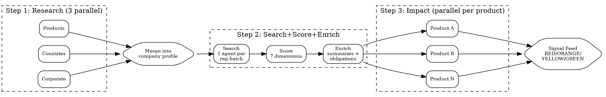

# Compliance Pipeline

Sequential 3-step pipeline with parallelism within each step. Uses `superpowers:dispatching-parallel-agents` at every stage.

## Flow



## Step 1: Research (3 parallel agents)

- **Products agent**: catalog each product with regulatory surface tags (data types, physical/digital, regulated substances)
- **Countries agent**: per-country regulatory profile (authorities, key frameworks, enforcement posture)
- **Corporate agent**: governance, financial reporting, ESG, employment law, AML obligations

Merge outputs into unified company profile + candidate regulation list.

## Step 2: Search + Score + Enrich

Split candidate regulations into batches of 5-8. One search agent per batch.

**2A Search**: find enforcement actions, latest guidance, amendments, benchmarks. Use Cleo Insight MCP if available, else WebSearch.

**2B Score** each finding on 7 dimensions (1-5 each):

| Dimension | What it measures |
|-----------|-----------------|
| Source authority | Official gazette vs blog |
| Content depth | Full analysis vs headline |
| Timeliness | <3mo vs >2yr |
| Actionability | Specific obligations vs informational |
| Legal rigor | Cites articles vs lay summary |
| Neutrality | Independent vs vendor marketing |
| Traceability | Primary sources linked vs none |

**Threshold**: <20/35 dropped. 20-27 = YELLOW. 28+ = promoted.

**2C Enrich** promoted findings: executive summary (3 sentences), extracted obligations, affected products.

## Step 3: Impact (parallel per product)

One agent per product via `superpowers:dispatching-parallel-agents`:

```markdown
Assess impact on [PRODUCT] from these enriched findings: [list].
Per finding generate action card: regulation + article, obligation (1 sentence),
risk level (GREEN/YELLOW/ORANGE/RED), deadline, suggested action + effort, owner.
Return: cards sorted by risk desc, then deadline asc.
```

## Output

1. **Signal feed**: all action cards, risk-colored
2. **Per-product view**: grouped by product
3. **Timeline view**: sorted by deadline
4. **Dropped signals**: below-threshold findings (available for review)

## Red Flags

- **Skipping Step 1**: Without company profiling, searches miss sector-specific regulations.
- **No scoring threshold**: Signal feed drowns in noise without the 20/35 cutoff.
- **Sequential Step 2**: Batch and dispatch in parallel -- do not process regulations one by one.
- **Missing cross-product impact**: One regulation may affect multiple products. Give each Step 3 agent the full enriched set.
