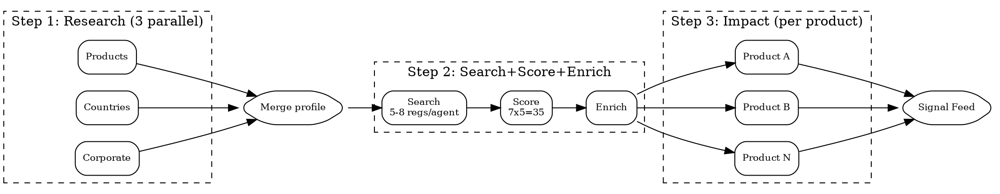

# Compliance Pipeline

Sequential 3-step pipeline with parallelism within each step. **Dependency**: `superpowers:dispatching-parallel-agents`.

## Flow



## Step 1: Research (3 parallel agents)

- **Products**: catalog with regulatory surface tags (data types, physical/digital, regulated substances)
- **Countries**: per-country regulatory profile (authorities, frameworks, enforcement posture)
- **Corporate**: governance, financial reporting, ESG, employment, AML

Merge into unified profile + candidate regulation list.

## Step 2: Search + Score + Enrich

**Batch sizing**: **5-8 regulations per search agent**. Fewer wastes slots; more causes context overflow.

**2A Search**: enforcement actions, guidance, amendments. Use Cleo Insight MCP or WebSearch.

**2B Score** on 7 dimensions (1-5 each, max 35):

| Dimension | 1 | 5 |
|-----------|---|---|
| Source authority | Blog | Official gazette |
| Content depth | Headline | Full analysis |
| Timeliness | >2yr | <3mo |
| Actionability | Informational | Specific obligations+dates |
| Legal rigor | Lay summary | Cites articles |
| Neutrality | Vendor marketing | Independent/official |
| Traceability | No sources | Primary sources linked |

**Thresholds**: <20 = DROP. 20-27 = YELLOW (monitor). 28+ = GREEN (promote to enrich).

**2C Enrich** promoted findings: 3-sentence summary, extracted obligations, affected products.

## Step 3: Impact (parallel per product)

**Risk level** = severity(1-5) x likelihood(1-5):

| Score | Level | Action |
|-------|-------|--------|
| 1-5 | GREEN | Monitor |
| 6-12 | YELLOW | Plan mitigation this quarter |
| 13-19 | ORANGE | Prioritize, assign owner |
| 20-25 | RED | Immediate action |

One agent per product:

```markdown
Assess impact on {{PRODUCT}} from: {{FINDINGS_LIST}}.
Per finding: regulation+article, obligation (1 sentence), severity(1-5), likelihood(1-5),
risk_level=severity*likelihood -> GREEN/YELLOW/ORANGE/RED, deadline, action+effort(days), owner role.
Sort: risk_level desc, deadline asc.
```

## Output

1. **Signal feed** -- all action cards, risk-colored
2. **Per-product view** -- grouped by product
3. **Timeline view** -- by deadline
4. **Dropped signals** -- below-threshold (reviewable)

## Red Flags

- **Skipping Step 1**: Searches miss sector-specific regulations without profiling.
- **No threshold**: Feed drowns in noise without 20/35 cutoff.
- **Batches >8**: Context overflow, missed findings.
- **Sequential Step 2**: Dispatch batches in parallel.
- **Missing cross-product**: Give each Step 3 agent the full enriched set.
