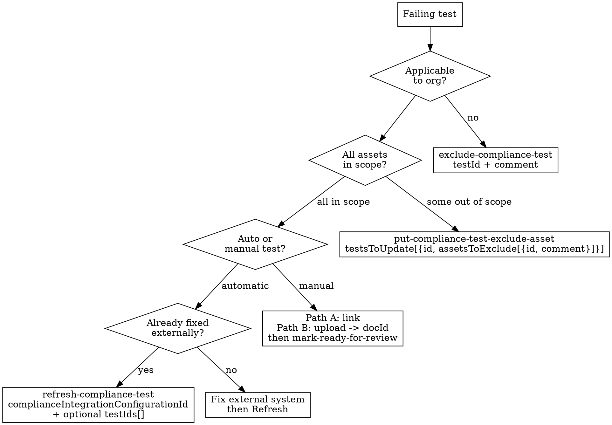

# Compliance Remediation

Fix failing compliance tests through the correct action path per test type.

## Decision Tree



## Action Reference

### Exclude (N/A test)

```
mcp__bastion__exclude-compliance-test
  testId: "<test-id>"                    # required
  comment: "<justification max 500 chars>"  # required
  excludeUntil: "infinity"               # optional, default "infinity", or ISO date
```

Good justification: "Fully remote company, no physical office or on-site assets." Bad: "Not relevant."

### Exclude Asset (partial scope)

```
mcp__bastion__put-compliance-test-exclude-asset
  testsToUpdate: [
    { "id": "<test-id>", "assetsToExclude": [
        { "id": 12345, "comment": "Test device, not production" }
    ]}
  ]
```

Supports batch: multiple tests x multiple assets in one call.

### Refresh (auto test, already fixed)

```
mcp__bastion__refresh-compliance-test
  complianceIntegrationConfigurationId: 789   # required (number, NOT testId)
  testIds: ["test-abc", "test-def"]           # optional — omit to refresh all tests for integration
```

Runs async. Wait ~30s then verify with `get-compliance-test-detail`. If still failing, the external fix did not propagate.

### Evidence (manual test) — Two Paths

**Path A: URL link**
```
mcp__bastion__add-compliance-test-evidence
  testId: "<test-id>"           # required
  name: "Branch protection screenshot"  # required
  description: "GitHub main branch requires PR review + status checks"  # required, max 500 chars
  link: "https://github.com/org/repo/settings/branches"  # URL to evidence
```

**Path B: Document upload**
```
# Step 1: Upload file (base64, max 25MB, formats: PDF/PNG/JPG/XLSX/DOCX/CSV)
mcp__bastion__upload-compliance-document
  name: "filevault-screenshot.png"
  document: "data:image/png;base64,iVBORw0KGgo..."

# Step 2: Attach returned docId as evidence
mcp__bastion__add-compliance-test-evidence
  testId: "<test-id>"
  name: "FileVault encryption proof"
  description: "Screenshot showing FileVault enabled on all endpoints"
  evidenceDocumentId: 42          # number returned from upload
```

**Both paths require submit:**
```
mcp__bastion__mark-compliance-test-ready-for-review
  testId: "<test-id>"
```

Status moves from `fail` to `ready_for_bastion_review`. Counts as passing only after Bastion admin approves.

### Fix (actual gap)

No MCP action available. Workflow: `get-compliance-test-detail` to understand gap, fix in external system, then Refresh.

## Quick Reference

| Action | MCP Tool | Required Params | Post-action |
|--------|----------|----------------|-------------|
| Exclude test | `exclude-compliance-test` | testId, comment | None |
| Exclude asset | `put-compliance-test-exclude-asset` | testsToUpdate[] | None |
| Refresh | `refresh-compliance-test` | complianceIntegrationConfigurationId | Verify after ~30s |
| Evidence (URL) | `add-compliance-test-evidence` | testId, name, description, link | `mark-ready-for-review` |
| Evidence (doc) | `upload-compliance-document` then `add-compliance-test-evidence` | name, document; then testId, name, description, evidenceDocumentId | `mark-ready-for-review` |
| Get detail | `get-compliance-test-detail` | testId | — |

**Batch**: All actions except Fix are parallelizable via `dispatching-parallel-agents` or `evidence-blitz` skill.

## Example

```
Failing: "A.8.1 — Endpoint encryption"  Type: auto / bastion_mdm integration (configId: 456)

1. get-compliance-test-detail testId="a81-endpoint-enc"
   -> 3 devices, 1 failing (MacBook-Pro-Naomie, no FileVault)
2. User enables FileVault on device
3. refresh-compliance-test complianceIntegrationConfigurationId=456 testIds=["a81-endpoint-enc"]
4. Wait 30s -> get-compliance-test-detail -> passing
```

## Red Flags

- **Evidence without mark-ready**: Adding evidence does NOT submit. Always call `mark-ready-for-review`.
- **Refreshing unfixed tests**: Just re-confirms failure. Confirm the fix happened first.
- **Wrong refresh param**: Takes `complianceIntegrationConfigurationId` (number), NOT testId. Common mistake.
- **Description over 500 chars**: MCP truncates or rejects silently.
- **Providing both link AND evidenceDocumentId**: Must be exactly one. Call fails with both.
- **Upload >25MB**: Use Bastion UI for large files.
- **Excluding real gaps**: Unjustified exclude is worse than a documented failure at audit.
- **No verify after refresh**: Always check status with `get-compliance-test-detail`. Do not assume it passed.
