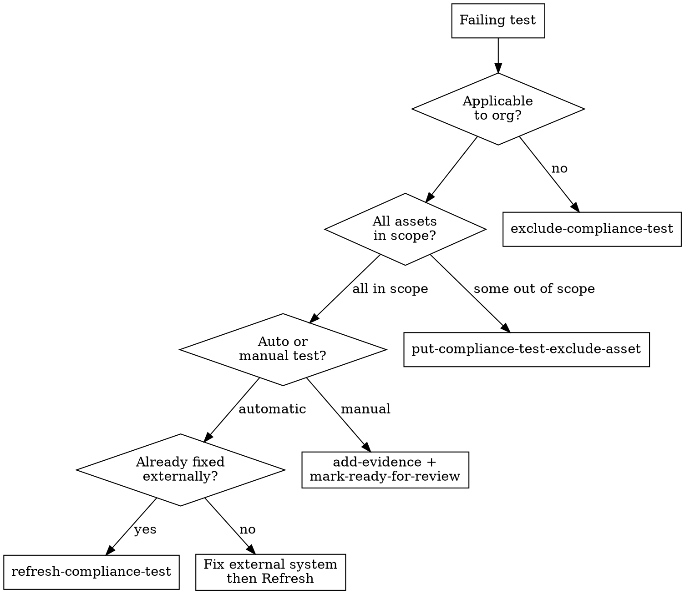

# Compliance Remediation

Systematically fix failing compliance tests through the correct action path per test type.

## Decision Tree



## Action Reference

### Exclude (N/A test)

```
mcp__bastion__exclude-compliance-test
  compliance_test_id: "<test-id>"
  comment: "Not applicable: <justification max 500 chars>"
```

Justification must be auditor-defensible. Good: "Fully remote, no on-site assets." Bad: "Not relevant."

### Exclude Asset (partial scope)

```
mcp__bastion__put-compliance-test-exclude-asset
  compliance_test_id: "<test-id>"
  asset_id: "<asset-id>"
  comment: "Out of scope: <reason>"
```

### Refresh (auto test, already fixed)

```
mcp__bastion__refresh-compliance-test
  compliance_test_id: "<test-id>"
```

Wait ~30s then verify. If still failing, the external fix didn't propagate.

### Evidence (manual test)

Always two steps:

```
# Step 1: Attach
mcp__bastion__add-compliance-test-evidence
  compliance_test_id: "<test-id>"
  description: "<max 500 chars>"
  url: "https://..."          # OR file_path (max ~50KB)

# Step 2: Submit
mcp__bastion__mark-compliance-test-ready-for-review
  compliance_test_id: "<test-id>"
```

Files >50KB: must use Bastion UI.

### Fix (actual gap)

No MCP — requires human work: identify gap via `get-compliance-test-detail`, fix externally, then Refresh.

## Quick Reference

| Action | MCP tool | Post-action |
|--------|----------|-------------|
| Exclude test | `exclude-compliance-test` | None |
| Exclude asset | `put-compliance-test-exclude-asset` | None |
| Refresh | `refresh-compliance-test` | Verify status |
| Evidence | `add-compliance-test-evidence` | `mark-ready-for-review` |

**Batch**: All actions except Fix are parallelizable via `dispatching-parallel-agents`.

## Example

```
Failing: "A.8.1 — Endpoint encryption"  Type: auto/MDM
1. get-compliance-test-detail → 3 devices, 1 failing (no FileVault)
2. User enables FileVault
3. refresh-compliance-test → wait 30s → passing
```

## Red Flags

- **Evidence without mark-ready**: Adding evidence does NOT submit. Always call `mark-ready-for-review`.
- **Refreshing unfixed tests**: Just re-confirms failure.
- **Description over 500 chars**: MCP truncates or rejects.
- **Large files via MCP**: >50KB fails silently. Use UI.
- **Excluding real gaps**: Unjustified exclude is worse than documented failure.
- **No verify after refresh**: Always check status. Don't assume it passed.
