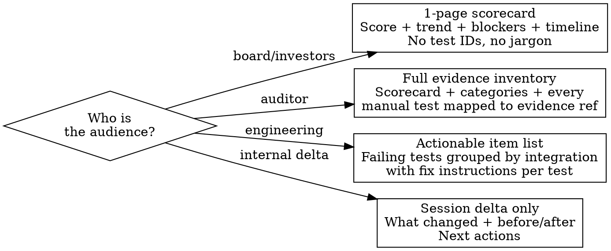

# Compliance Reporting

Generate structured compliance reports at framework, integration, or executive level.

## Data Collection

```
# Run in parallel
mcp__bastion__get-frameworks-stats
mcp__bastion__get-compliance-failing-summary  framework="iso27001-2022"  # or soc2, hipaa
mcp__bastion__list-failing-compliance-tests   framework="iso27001-2022"  page=1  pageSize=100
# Paginate until totalCount exhausted
```

## Compliance Rate Formula

```
Compliance Rate = passing / (total - excluded)
```

Never count excluded tests in the denominator. Example: 51 passing, 75 total, 7 excluded = 51/68 = **75%**.

## Audience-Specific Formats



| Audience | Format | Include | Exclude |
|----------|--------|---------|---------|
| **Board/investors** | 1-page max | Score, trend chart, top 3 blockers with ETA, readiness date | Test IDs, integration names, technical detail |
| **Auditor** | Full evidence pack | Scorecard, category breakdown, evidence inventory (test -> proof -> date) | Internal roadmap, effort estimates |
| **Engineering** | Actionable list | Failing tests by integration, fix instructions, MCP commands | Business context, trend history |
| **Internal** | Session delta | Before/after score, what was done, next actions | Full inventory |

## Report Templates

### Template 1: Executive Scorecard

```
COMPLIANCE STATUS -- [Framework] -- [Date]
Score: [passing]/[applicable] ([rate]%)
Delta: +[N] since [last date]

Achievements (top 3):
- [achievement with count]

Blockers (top 3):
- [blocker] -- Owner: [who] -- ETA: [when]

Certification Readiness: [Ready / On track Q[N] / Blocked by X]
```

### Template 2: Auditor Evidence Inventory

```
EVIDENCE INVENTORY -- [Framework] -- [Date]
| Test ID | Test Name | Status | Evidence Type | Evidence Ref | Submitted |
|---------|-----------|--------|---------------|-------------|-----------|
| A.5.1   | InfoSec Policy | ready_for_review | URL | link-to-policy | 2026-05-20 |
```

Build from: `list-failing-compliance-tests` (type=manual) cross-referenced with `get-compliance-test-detail` per test.

### Template 3: Engineering Action List

```
REMEDIATION QUEUE -- [Framework] -- [Date]
## Integration: github (configId: 123) -- 8 failing
- [ ] Branch protection on main -- refresh after fix
- [ ] Signed commits required -- refresh after fix

## Integration: bastion_mdm (configId: 456) -- 12 failing
- [ ] FileVault encryption -- user action then refresh
- [ ] Firewall enabled -- user action then refresh

## Manual tests (no integration) -- 23 failing
- [ ] Security training records -- upload evidence (Path A: URL)
- [ ] Pentest report -- upload evidence (Path B: document)
```

## Trend Tracking

```
Session 1: 14/68 (21%) -- baseline
Session 2: 34/68 (50%) -- +20 (excludes + refreshes)
Session 3: 51/68 (75%) -- +17 (evidence batch)
Target:    68/68 (100% of applicable)
```

Denominator is `total - excluded` and stays fixed unless new exclusions are added.

## Example

```
User: "ISO 27001 status for the board"

COMPLIANCE STATUS -- ISO 27001 -- 2026-05-27
Score: 51/68 (75% of applicable)  [68 = 75 total - 7 excluded]
Delta: +37 from baseline over 3 sessions

Achievements:
- 7 N/A tests excluded with auditor-defensible justifications
- 18 manual evidence packages submitted and under review
- 12 automatic tests refreshed to passing after external fixes

Blockers:
- 32 policies pending approval -- Owner: Naomie -- ETA: Q3 (batch session)
- MDM user association -- Owner: Naomie -- ETA: next session (UI-only)
- Pentest report -- Owner: vendor -- ETA: 6 weeks from engagement

Certification Readiness: On track Q3 2026
```

## Red Flags

- **Counting excludes as passing**: Excluded = out of scope, not passed. Use `passing / (total - excluded)`.
- **Stale data**: Always pull fresh `get-frameworks-stats` before reporting. Never reuse previous session data.
- **No delta**: Snapshot without trend is half the story. Always show before/after.
- **Jargon for board**: They need score, trend, blockers, timeline. No test IDs, no integration config IDs.
- **Missing evidence inventory for auditor**: Auditors will ask "show proof for test X." Map every passing manual test to its evidence.
- **Wrong denominator**: If exclusions changed between sessions, note the denominator shift explicitly.
