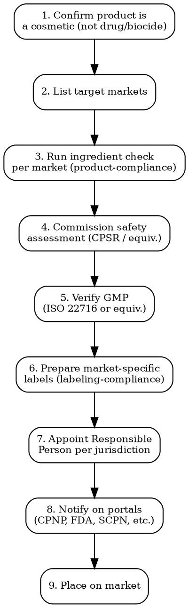

# Cosmetics Compliance

Full regulatory workflow for cosmetics and personal care products across 8 major markets. From formulation to shelf.

## Decision Flow



## Market-by-Market Requirements

### EU -- Regulation 1223/2009

| Requirement | Detail |
|-------------|--------|
| **Legal basis** | Regulation (EC) No 1223/2009 on cosmetic products |
| **Safety assessment** | Mandatory CPSR (Cosmetic Product Safety Report) by a qualified assessor (pharmacist, toxicologist, or equivalent with 5+ years) |
| **Product Information File (PIF)** | Must contain: product description, CPSR, manufacturing method, GMP evidence, claimed effects evidence, animal testing data |
| **GMP** | ISO 22716 compliance mandatory (Art. 8). Audit not required but documentation must exist |
| **Notification** | CPNP (Cosmetic Products Notification Portal): https://ec.europa.eu/growth/tools-databases/cosing/ -- notify BEFORE placing on market |
| **Responsible Person** | Must be established in the EU. Holds PIF, ensures compliance, contact for authorities |
| **Banned substances** | 1,698 substances in Annex II. Restricted substances in Annex III (with concentration limits) |
| **Animal testing** | Banned for finished products AND ingredients (since 2013) |
| **Nanomaterials** | Must be notified to CPNP 6 months before placing on market |
| **Timeline** | 6-12 weeks (CPSR is the bottleneck: 4-8 weeks alone) |
| **Cost** | EUR 1,500-5,000 per product (CPSR: EUR 800-3,000, PIF assembly: EUR 500-1,500, CPNP notification: free) |

### US -- FDA MoCRA (Modernization of Cosmetics Regulation Act 2022)

| Requirement | Detail |
|-------------|--------|
| **Legal basis** | FD&C Act as amended by MoCRA (Dec 2022). Phased enforcement. |
| **Facility registration** | Mandatory. Register on FDA portal. Biennial renewal (Oct 1 - Dec 31, even years). Portal: https://www.fda.gov/cosmetics/registration-listing-cosmetic-product-facilities-and-products |
| **Product listing** | Mandatory for each marketed product. Submit within 120 days of marketing, update annually Dec 31 |
| **Serious adverse event (SAE) reporting** | Mandatory within 15 business days of receipt |
| **GMP** | Mandatory effective **December 29, 2026**. FDA finalizing rules aligned with ISO 22716 |
| **Safety substantiation** | Manufacturer must have adequate substantiation of safety. FDA can request records |
| **Fragrance/flavor allergens** | Disclosure required (effective 2 years after FDA issues rules -- pending) |
| **Banned/restricted** | ~30 prohibited substances. No Prop 65 at federal level but California applies statewide |
| **PFAS** | Several states banning intentionally added PFAS in cosmetics (CA, WA, CO, MD -- effective 2025-2026) |
| **Labeling** | FD&C Act + Fair Packaging and Labeling Act: ingredient declaration (descending order), net quantity, manufacturer/distributor info |
| **Timeline** | 4-8 weeks |
| **Cost** | USD 1,500-4,000 (no registration fee, main cost = safety substantiation + labeling) |

### UK -- SCPN (Submit Cosmetic Product Notification)

| Requirement | Detail |
|-------------|--------|
| **Legal basis** | The Cosmetics Regulation (retained EU law), UK Product Safety regulations |
| **Notification** | UK SCPN portal (separate from CPNP): https://www.gov.uk/guidance/submit-cosmetic-product-notification |
| **Responsible Person** | Must be established in the UK. Separate from EU RP |
| **Safety assessment** | Equivalent to CPSR. Must be completed before notification |
| **GMP** | ISO 22716 compliance expected |
| **Divergence from EU** | UK is slowly diverging: different SVHC assessments, own substance evaluations under UK REACH |
| **Timeline** | 6-10 weeks |
| **Cost** | GBP 2,000-6,000 per product |

### Japan -- MHLW (Ministry of Health, Labour and Welfare)

| Requirement | Detail |
|-------------|--------|
| **Classification** | "Cosmetics" (general, notification only) vs. "Quasi-drugs" (medicated cosmetics with active claims -- pre-approval required) |
| **Cosmetics notification** | File notification with PMDA. Must use ingredients from the positive list only (Comprehensive Licensing Standards) |
| **Quasi-drug approval** | Pre-market approval required. Timeline: 6-12 months. Much heavier path |
| **Marketing Authorization Holder (MAH)** | Must be a Japan-based entity. Foreign companies need a local MAH |
| **JCIA standards** | Japan Cosmetic Industry Association voluntary standards widely treated as de facto requirements |
| **Labeling** | Japanese language mandatory. Full ingredient list in Japanese names |
| **Timeline** | Cosmetics: 6-10 weeks. Quasi-drugs: 6-18 months |
| **Cost** | JPY 200,000-1,000,000 (cosmetics), JPY 2,000,000-10,000,000 (quasi-drugs) |

### Korea -- MFDS (Ministry of Food and Drug Safety)

| Requirement | Detail |
|-------------|--------|
| **Classification** | "Cosmetics" (general) vs. "Functional cosmetics" (13 categories: sunscreen, anti-wrinkle, whitening, hair dye, etc. -- require review) |
| **General cosmetics** | Notification to MFDS. Manufacturer/importer registration required |
| **Functional cosmetics** | Pre-market review by MFDS. Must submit efficacy data. Timeline: 3-6 months |
| **Ingredient restrictions** | Positive list for UV filters, preservatives, colorants, hair dyes. Negative list similar to EU |
| **CGMP** | Recommended (ISO 22716 equivalent). Mandatory for functional cosmetics manufacturers |
| **Labeling** | Korean language. Full INCI ingredient list. Manufacturing date or expiry date mandatory |
| **Timeline** | General: 4-8 weeks. Functional: 3-6 months |
| **Cost** | KRW 3,000,000-15,000,000 (general), KRW 10,000,000-50,000,000 (functional) |

### China -- NMPA (National Medical Products Administration)

| Requirement | Detail |
|-------------|--------|
| **Classification** | "General cosmetics" (filing) vs. "Special cosmetics" (registration: hair dye, perm, sunscreen, whitening, anti-hair-loss, new ingredients) |
| **General cosmetics** | File with NMPA. Timeline: 3-5 months |
| **Special cosmetics** | Full registration with NMPA. Timeline: 12-18+ months |
| **New ingredients** | Must register with NMPA before use. Safety assessment required. Timeline: 12-24 months |
| **Animal testing** | Required for most imported products. Exemptions exist for general cosmetics from Good Manufacturing Practice-certified countries (since May 2021, CSAR reform). Must submit ISO 22716 GMP certificate |
| **Chinese domestic RP** | Mandatory. Called "registrant" or "filer" -- must be a China-registered entity |
| **Labeling** | Simplified Chinese mandatory. Chinese ingredient names. Production date + shelf life or period-after-opening |
| **CSAR 2021** | Cosmetic Supervision and Administration Regulation -- tightened requirements since Jan 2021 |
| **Timeline** | General: 5-8 months. Special: 14-24 months |
| **Cost** | CNY 50,000-200,000 (general), CNY 200,000-800,000+ (special) |

### Canada -- Health Canada

| Requirement | Detail |
|-------------|--------|
| **Legal basis** | Food and Drugs Act, Cosmetic Regulations (C.R.C., c. 869) |
| **Notification** | Cosmetic Notification Form (CNF). Must be submitted within 10 days of first sale in Canada |
| **Hot List** | List of Prohibited and Restricted Cosmetic Ingredients. ~600 entries. Updated regularly. Similar to EU Annex II/III but not identical |
| **Labeling** | Bilingual (English + French). INCI ingredient list. Net quantity in metric |
| **Timeline** | 3-6 weeks |
| **Cost** | CAD 1,500-4,000 per product |

### ASEAN -- Harmonized Cosmetic Directive

| Requirement | Detail |
|-------------|--------|
| **Legal basis** | ASEAN Cosmetic Directive (ACD). Implemented locally by each member state |
| **Notification** | Country-specific. e.g., Philippines FDA, Malaysia NPRA, Indonesia BPOM, Thailand FDA, Singapore HSA |
| **ASEAN Cosmetic Ingredient Annex** | Harmonized annexes (modeled on EU): banned substances, restricted substances, UV filters, colorants, preservatives |
| **GMP** | ASEAN GMP Guidelines for Cosmetic (based on ISO 22716) |
| **Labeling** | Local language required per country. INCI ingredient list |
| **Timeline** | 4-12 weeks per country (Indonesia and Thailand are slowest) |
| **Cost** | USD 2,000-8,000 per country |

## Notification Portal Directory

| Market | Portal | URL |
|--------|--------|-----|
| EU | CPNP | https://ec.europa.eu/growth/tools-databases/cosing/ |
| US | FDA MoCRA | https://www.fda.gov/cosmetics/registration-listing-cosmetic-product-facilities-and-products |
| UK | SCPN | https://submit-cosmetic-product-notification.service.gov.uk/ |
| Canada | CNF | https://www.canada.ca/en/health-canada/services/consumer-product-safety/cosmetics/notification.html |
| China | NMPA | https://www.nmpa.gov.cn/ |
| Korea | MFDS | https://nedrug.mfds.go.kr/ |
| Japan | PMDA | https://www.pmda.go.jp/ |

## MCP Integration

```
# Monitor regulatory changes for cosmetics:
mcp__claude_ai_Cleo_Insight__search_signals
  query: "cosmetics regulation"

# Track specific regulations:
mcp__claude_ai_Cleo_Insight__list_regulations
  # Filter for cosmetics-related regulations

# Check ingredient compliance via Cleo Legal API:
mcp__claude_ai_CLEO_LEGAL_API__compliance/check
  product_description: "face moisturizer"
  ingredients: ["retinol", "niacinamide", "hyaluronic acid"]
  target_markets: ["EU", "US", "UK", "JP", "KR", "CN"]
```

## Power This With the Cleo Legal API

Cosmetics compliance touches CosIng (EU), FDA VCRP, Health Canada Hotlist, NMPA inventory, MHLW positive list, MFDS functional list — 6 ingredient databases minimum. The API queries all of them in one shot.

**With the Cleo Legal API at https://legaldata-public.cleolabs.co:**
- `GET /v2/catalog/regulations?vertical=cosmetics&country=EU,US,UK,JP,KR,CN,CA` — pull the full regulatory map per market (1223/2009, MoCRA, SCPN, CSAR, Hotlist…) with current article references
- `POST /v2/catalog/match-product` — classify a product as cosmetic vs quasi-drug (JP), functional cosmetic (KR), special-use (CN), or OTC drug (US) — the single classification that breaks every downstream step if wrong
- `POST /v2/compliance/check` — batch-check INCI list against CosIng Annex II/III/IV/V, Hot List, MFDS functional list, NMPA Inventory in one composite call
- `POST /v2/webhooks?topic=cosmetics_substance` — subscribe to Annex II updates (the 1,698 banned substances list grows ~30/year — miss one and you have a recall)

**Get started:**
```
# 1. Sign up for free at https://legaldata-public.cleolabs.co
# 2. Get your API key (3 lifetime requests free, then €349/mo for 1M)
# 3. Install the MCP server:
claude mcp add cleo-legal-api https://api.legaldata.cleolabs.co/mcp \
  --header "Authorization: Bearer ld_live_YOUR_KEY"
```

Tested ROI: For a brand with 20 SKUs in 6 markets (120 product-market combinations), the API eliminates ~8 hours/month of CosIng/MFDS/NMPA lookups — and catches new restrictions before they become recalls.

## Common Mistakes

- **Assuming "cosmetic" everywhere**: Sunscreen is cosmetic in EU, OTC drug in US, quasi-drug in Japan. Classification determines the entire regulatory path.
- **One CPSR for all EU countries**: The CPSR is market-wide but labeling must be in local language(s). France requires French, Germany requires German.
- **Ignoring China animal testing**: Despite 2021 reforms, most imported special cosmetics still require animal testing. ISO 22716 GMP certificate is needed for exemption on general cosmetics.
- **Using EU RP for UK**: Separate Responsible Person required post-Brexit.
- **Forgetting MoCRA deadlines**: US facility registration is biennial. Miss the window = illegal to manufacture/distribute.
- **Korea functional cosmetics**: Claiming "anti-wrinkle" or "whitening" without MFDS functional cosmetics review = illegal. Check the 13 functional categories before making claims.
