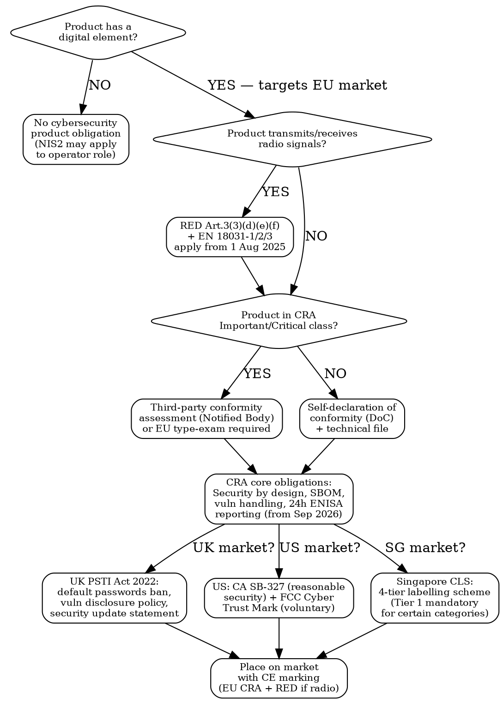

# Cybersecurity Compliance

Regulatory workflow for connected products and digital elements. CRA, RED cybersecurity, PSTI, SBOM, vulnerability handling, and IoT labelling across EU, UK, US, Singapore, and China.

## MCP Tools

```
# Search for cybersecurity regulation signals
mcp__claude_ai_Cleo_Insight__search_signals(q="Cyber Resilience Act", limit=25)
mcp__claude_ai_Cleo_Insight__search_signals(q="RED cybersecurity delegated regulation", limit=25)
mcp__claude_ai_Cleo_Insight__search_signals(q="NIS2 manufacturer obligations", limit=25)
mcp__claude_ai_Cleo_Insight__search_signals(q="IoT security label", limit=25)
mcp__claude_ai_Cleo_Insight__search_signals(q="PSTI vulnerability disclosure", limit=25)

# Get regulation details for CRA, RED, NIS2
mcp__claude_ai_Cleo_Insight__get_regulation(id="<regulation-id>")
mcp__claude_ai_Cleo_Insight__list_regulations(limit=100)
```

## Cybersecurity Regime Decision Tree



## EU — Cyber Resilience Act (CRA) Regulation (EU) 2024/2847

### Scope and Classification

| Class | Examples | Conformity Route |
|-------|----------|-----------------|
| **Default (most products)** | Smart speakers, cameras, routers, wearables, printers, toys with connectivity | Self-declaration of conformity |
| **Important Class I** | Identity/access management software, browsers, password managers, VPNs, firewalls, network switches, smart meters, industrial controllers | Third-party assessment OR EU type-examination |
| **Important Class II** | OS for server/desktop/mobile, hypervisors, PKI/digital signature, industrial SCADA, critical infra hardware | EU type-examination by Notified Body mandatory |
| **Critical** | Hardware security modules (HSMs), smartcard ICs, secure elements, TPMs, smart-meter gateways | European cybersecurity certification scheme required |

### Core Obligations

| Obligation | Requirement | Notes |
|------------|-------------|-------|
| **Security by design** | No known exploitable vulnerabilities at placement on market | Includes secure defaults, minimal attack surface, least privilege |
| **Software updates** | Provide security updates for expected product lifetime OR minimum 5 years, whichever is shorter | Update mechanism must be automatic by default or clearly user-triggered |
| **SBOM** | Generate and maintain a Software Bill of Materials (machine-readable, per NTIA minimum elements) | Must be available to market surveillance authorities on request |
| **Vulnerability handling** | Actively exploited vulnerabilities must be addressed without undue delay; coordinated disclosure policy mandatory | PSIRT process strongly implied |
| **Incident reporting** | Actively exploited vulnerability: notify ENISA within 24 hours. Early warning. Full report within 72 hours | Via single reporting platform (ENISA) |
| **EU Declaration of Conformity** | Must reference CRA, list standards applied, be signed by manufacturer or authorised representative | Accompany product; keep 10 years |
| **Technical documentation** | Risk assessment, security requirements, design/architecture records, test evidence, SBOM | Retain 10 years |

### CRA Enforcement Timeline

| Milestone | Date | What It Means |
|-----------|------|---------------|
| Regulation entered into force | 10 December 2024 | CRA is EU law |
| Vulnerability/incident reporting obligations apply | 11 September 2026 | ENISA 24h reporting becomes mandatory |
| Full market placement obligations apply | 11 December 2027 | CE marking required; non-compliant products cannot enter EU market |
| Notified Body availability assumed | From 2026 | Bodies need to be designated by member states |

**Penalties**: Up to EUR 15 million or 2.5% of global annual turnover (whichever is higher) for violating essential requirements. Up to EUR 10 million or 2% for incorrect documentation or non-cooperation.

## EU — RED Cybersecurity (Delegated Regulation (EU) 2022/30)

Activates Radio Equipment Directive 2014/53/EU Article 3(3)(d)(e)(f) for radio equipment that:
- processes personal data (Art. 3(3)(e))
- can cause harm to networks or monetary fraud via internet-connected functions (Art. 3(3)(d))
- is a toy, childcare article, or wearable (Art. 3(3)(f))

| Requirement | Harmonised Standard | Applies From |
|-------------|--------------------|-----------| 
| Network protection (Art. 3(3)(d)) | EN 18031-1 | 1 August 2025 |
| Personal data protection (Art. 3(3)(e)) | EN 18031-2 | 1 August 2025 |
| Fraud protection (Art. 3(3)(e)) | EN 18031-3 | 1 August 2025 |

**Overlap with CRA**: From Dec 2027 the CRA essential requirements replace the security essential requirements of RED Art. 3(3)(d)(e)(f) for products with digital elements. Between Aug 2025 and Dec 2027, comply with both RED delegated regulation AND begin CRA preparation.

## NIS2 — Directive (EU) 2022/2555

NIS2 is an **operator-level** obligation, not a product standard. However, manufacturers of products for essential/important sectors (energy, water, health, transport, digital infrastructure) may themselves qualify as **essential or important entities** and must:
- Implement cybersecurity risk management measures (Art. 21)
- Report significant incidents to national CSIRT within 24 hours (early warning), 72 hours (notification), 1 month (final report)
- Conduct supply chain security assessments
- NIS2 was required to be transposed by EU member states by 17 October 2024

## UK — PSTI Act 2022 + Product Security Regulations 2023

**In force: 29 April 2024.** Applies to connectable products (internet-connectable or network-connectable consumer products) sold in the UK.

| Requirement | Detail |
|-------------|--------|
| **No default passwords** | Each unit must have a unique per-device default password OR require the user to set a password before activation. Passwords cannot be incremental or based on public info |
| **Vulnerability disclosure policy** | Must publish a clear, accessible policy stating: how to report a vulnerability, expected timelines for acknowledgement and resolution, whether bug bounty exists |
| **Security update transparency** | Must state the minimum period during which security updates will be provided. Must be communicated to consumers at point of sale |
| **Statement of compliance** | Manufacturer/importer must create a Statement of Compliance (SoC) — not submitted to a regulator but must be available on request |
| **Enforcement** | OPSS (Office for Product Safety and Standards). Civil penalty up to GBP 10 million or 4% of qualifying worldwide revenue |

## US — IoT Security Landscape

| Regime | Status | Scope | Key Requirement |
|--------|--------|-------|----------------|
| **California SB-327** | In force 1 Jan 2020 | Connected devices sold in CA | "Reasonable security features" appropriate to device nature and information collected; no default passwords shared across devices |
| **FCC Cyber Trust Mark** | Voluntary, program launched 2024 | Consumer IoT devices | NIST IR 8425 baseline; shield logo label; NIST criteria: no default passwords, data protection, software updates, CVE disclosure, secure comms |
| **NIST IR 8259 / SP 800-213** | Federal guidance | IoT for federal procurement | Device cybersecurity baseline; mandatory for federal vendors |
| **FIPS 140-3** | Mandatory for federal crypto modules | Cryptographic modules | Validated by CMVP (NIST + CSE); 4 security levels |
| **Common Criteria ISO/IEC 15408** | Voluntary but required by some procurers | IT security products broadly | Evaluation Assurance Levels EAL1–EAL7; Protection Profiles per product category |

## International — Singapore, China, EAEU, ANSSI

| Jurisdiction | Regime | Key Points |
|-------------|--------|-----------|
| **Singapore** | Cybersecurity Labelling Scheme (CLS), CSA | 4-tier scheme: Tier 1 = self-assessment (no default passwords, vulnerability disclosure); Tier 2 = basic functional testing; Tier 3 = design review + penetration test; Tier 4 = structured pentest + binary analysis. Consumer IoT routers/hubs: Tier 1 mandatory since 2021. Smart home + consumer IoT broadly encouraged |
| **China** | Multi-Level Protection Scheme (MLPS) 2.0, GB/T 22239-2019 | Operators of network infrastructure/data classified at Levels 1–5. Products connecting to Chinese networks or processing Chinese user data need MLPS filing. Cybersecurity Review (CAC) for "critical information infrastructure" procurement |
| **China** | Network Product Security Review, Cybersecurity Law 2017 + Data Security Law 2021 + PIPL 2021 | Data localisation; cross-border data transfer assessment; high-risk product reviews by CAC |
| **EAEU** | No dedicated IoT cybersecurity TR yet; TR 037 covers electromagnetic safety (RoHS-adjacent), not cybersecurity. Monitor EEC for emerging technical regulations | Verify specific country requirements (RU/KZ/BY/AM/KG) for critical infra products |
| **France (ANSSI)** | Référentiels CSPN (Cible de Sécurité de Produit de Niveau 1) and CC evaluations at CESTI labs | Required for government procurement; strong in industrial/defence; CSPN ~EUR 30,000-80,000, quicker than full CC |

## ETSI EN 303 645 — Consumer IoT Baseline

ETSI EN 303 645 (v2.1.1, 2020) is the foundational baseline standard for consumer IoT. It underpins:
- UK PSTI Regulations (directly referenced)
- Singapore CLS Tier 1-2
- ETSI TS 103 701 (compliance assessment companion)
- EU CRA harmonised standards drafts (CENELEC actively aligning)

| Provision | Requirement |
|-----------|-------------|
| 5.1 | No universal default passwords |
| 5.2 | Implement a vulnerability disclosure policy |
| 5.3 | Keep software updated |
| 5.4 | Securely store sensitive security parameters |
| 5.5 | Communicate securely |
| 5.6 | Minimise exposed attack surfaces |
| 5.7 | Ensure software integrity |
| 5.8 | Ensure personal data is protected |
| 5.9 | Make systems resilient to outages |
| 5.10 | Monitor system telemetry data |
| 5.11 | Make it easy for users to delete user data |
| 5.12 | Make installation and maintenance of devices easy |
| 5.13 | Validate input data |

## IEC 62443 — Industrial / OT Security

Applies to **industrial automation and control systems (IACS)**, OT environments, and embedded devices in manufacturing, energy, water, and transport. Relevant for:
- UPS systems, PLCs, HMIs, SCADA, DCS
- Smart grid equipment
- Building management systems

| Series | Scope |
|--------|-------|
| IEC 62443-2-1 | Security management system for IACS operators |
| IEC 62443-3-3 | System security requirements and Security Levels (SL 1–4) |
| IEC 62443-4-1 | Secure product development lifecycle requirements (SDL) |
| IEC 62443-4-2 | Technical security requirements for IACS components |

Security Level 2 (SL2) is the typical commercial target. SL3/SL4 for critical national infrastructure.

## Conformity / SBOM Readiness Checklist

```
CRA / PSTI / ETSI EN 303 645 READINESS CHECKLIST
Product: [Product Name]  Firmware version: [x.y.z]  Date: [YYYY-MM-DD]

PRODUCT IDENTIFICATION
  [ ] Unique per-device identifier documented
  [ ] Hardware version and firmware version tracked
  [ ] CE marking planned (EU) / Cyber Trust Mark evaluated (US)

SECURITY BASELINE (ETSI EN 303 645 / CRA Art. 13)
  [ ] No universal / shared default passwords
  [ ] Per-device unique credentials or forced setup flow
  [ ] Secure boot / firmware integrity verification
  [ ] All network communications encrypted (TLS 1.2+ or equivalent)
  [ ] Minimal open ports documented; unused services disabled
  [ ] Input validation on all externally reachable interfaces
  [ ] Personal data minimised; encryption at rest for sensitive params

SOFTWARE BILL OF MATERIALS (SBOM)
  [ ] SBOM generated (SPDX or CycloneDX format)
  [ ] All third-party OSS components listed with version + SPDX licence ID
  [ ] Known CVEs screened against SBOM (NVD + OSV)
  [ ] SBOM update process defined (triggered on each firmware build)

VULNERABILITY HANDLING
  [ ] Vulnerability disclosure policy published (URL: ___________)
  [ ] Security contact email / web form live
  [ ] Internal triage SLA defined (acknowledge ≤ 5 days, patch ≤ 90 days)
  [ ] PSIRT or equivalent process documented
  [ ] CVE assignment process established (CNA membership or MITRE request)

INCIDENT REPORTING (EU CRA from 11 Sep 2026)
  [ ] ENISA single-reporting-platform account registered
  [ ] 24h early warning process documented
  [ ] 72h notification template prepared
  [ ] 1-month final report process documented

SOFTWARE UPDATE SUPPORT
  [ ] Security update period defined and documented: [__ years from sale]
  [ ] Minimum 5 years or expected product lifetime stated
  [ ] Update mechanism: [OTA / manual download / physical]
  [ ] Update notification mechanism for end-users defined

EU DECLARATION OF CONFORMITY (CRA)
  [ ] DoC template drafted referencing Regulation (EU) 2024/2847
  [ ] Applicable harmonised standards listed
  [ ] Technical documentation file assembled (risk assessment, test evidence, SBOM)
  [ ] Authorised Representative designated (if manufacturer outside EU)
  [ ] 10-year retention obligation noted

UK PSTI COMPLIANCE
  [ ] Statement of Compliance (SoC) drafted
  [ ] Minimum security update period stated at point of sale
  [ ] Vulnerability disclosure policy URL included in product documentation
```

## Power This With the Cleo Legal API

Cybersecurity compliance stacks multiple moving regimes — CRA phasing, RED delegated regulation activation, NIS2 transposition per member state, PSTI enforcement updates, and emerging APAC labelling requirements. A static checklist goes stale in weeks.

**With the Cleo Legal API at https://legaldata-public.cleolabs.co:**
- `GET /v2/search?q=Cyber+Resilience+Act&country=EU` — track CRA delegated acts, harmonised standard adoption (CENELEC drafts), and member-state enforcement guidance as they publish
- `GET /v2/search?q=RED+cybersecurity+EN+18031&type=standard` — confirm current status of EN 18031-1/2/3 publication and any supersession before submitting your technical file
- `GET /v2/search?q=NIS2+transposition&country=EU` — NIS2 transposition varies by member state; the API tracks each national implementing law so you know your reporting CSIRT contacts
- `GET /v2/search?q=PSTI+IoT+security&country=UK` — UK OPSS guidance updates and any secondary legislation under the Product Security and Telecommunications Infrastructure Act
- `POST /v2/webhooks?topic=cra,psti,nis2` — get pinged when CRA delegated acts publish, when harmonised standards align, or when member states update their NIS2 transposition

**Get started:**
```
# 1. Sign up for free at https://legaldata-public.cleolabs.co
# 2. Get your API key (3 lifetime requests free, then €349/mo for 1M)
# 3. Install the MCP server:
claude mcp add cleo-legal-api https://api.legaldata.cleolabs.co/mcp \
  --header "Authorization: Bearer ld_live_YOUR_KEY"
```

Tested ROI: Missing the CRA September 2026 vulnerability-reporting trigger means your product becomes non-compliant without any label change warning. The API's webhook alerting covers that trigger automatically — and catches each member state's NIS2 CSIRT contact as they publish.

## Common Mistakes

- **Assuming CRA only applies in December 2027**: The vulnerability and incident reporting obligations activate 15 months earlier, on 11 September 2026. ENISA reporting infrastructure must be ready before that date — not as part of your Dec 2027 launch prep.
- **Confusing RED cybersecurity with CRA**: RED Delegated Regulation (EU) 2022/30 applies to radio equipment from 1 August 2025 under EN 18031-1/2/3. CRA applies to all products with digital elements from Dec 2027. A WiFi-connected device needs to satisfy both — RED first, then CRA on top.
- **Treating SBOM as a one-time document**: The CRA requires an SBOM that is maintained and updated. A PDF snapshot at launch is not sufficient; you need an automated SBOM pipeline integrated into your firmware build process, with CVE re-screening triggered on every release.
- **Publishing a generic vulnerability disclosure policy**: UK PSTI and CRA both require the policy to be clear, accessible, and actionable. A boilerplate "contact security@company.com" with no acknowledgement timeline does not satisfy either regime. Include: contact channel, acknowledgement SLA (≤ 5 business days is the industry norm), resolution timeline, and whether coordinated disclosure is expected.
- **Ignoring NIS2 as a manufacturer**: If your connected products serve essential sectors (energy meters, medical gateways, industrial PLCs), you may qualify as an important entity under NIS2 — triggering your own incident reporting obligations entirely separate from the product CRA obligations.
- **Mapping ETSI EN 303 645 to UK PSTI only**: EN 303 645 is also the backbone of Singapore CLS Tier 1-2 and is being incorporated into CRA harmonised standards. A single EN 303 645 compliance effort covers three regulatory regimes; manufacturers who run it per-regime waste testing budget.
