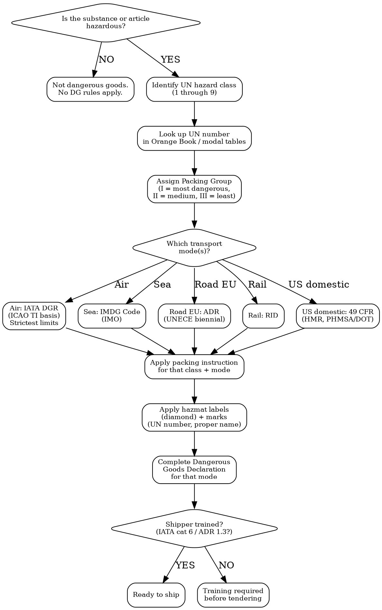

# Dangerous Goods Transport

How to classify, document, pack, and declare dangerous goods for any transport mode. Scope: hazardous materials — classification, modal regimes, packing, marking, documentation. Boundary: `customs-and-trade` = duties and HS codes; `import-export-docs` = commercial paperwork; THIS skill = transport safety rules for hazardous materials.

## MCP Tools

```
# Search for dangerous goods regulatory signals
mcp__claude_ai_Cleo_Insight__search_signals(q="dangerous goods", limit=25)
mcp__claude_ai_Cleo_Insight__search_signals(q="lithium battery transport", limit=25)
mcp__claude_ai_Cleo_Insight__search_signals(q="IATA dangerous goods", limit=25)
mcp__claude_ai_Cleo_Insight__search_signals(q="ADR dangerous goods road", limit=25)

# Get regulation details for DG frameworks
mcp__claude_ai_Cleo_Insight__get_regulation(id="<regulation-id>")
mcp__claude_ai_Cleo_Insight__list_regulations(limit=100)
```

## Classification Decision Tree



## The 9 UN Hazard Classes

| Class | Name | Sub-divisions | Examples | Packing Group |
|-------|------|---------------|----------|---------------|
| **1** | Explosives | 1.1–1.6 (mass explosion → minor hazard) | Fireworks, airbag inflators (UN 0503), signal flares | N/A (compatibility groups A–S) |
| **2** | Gases | 2.1 Flammable, 2.2 Non-flammable, 2.3 Toxic | Aerosols (UN 1950 Class 2.1), propane, oxygen cylinders, CO₂ | None (pressure drives limits) |
| **3** | Flammable liquids | — | Perfume/cologne (UN 1266), nail polish (UN 1263), ethanol (UN 1170), essential oils | I / II / III by flash point |
| **4** | Flammable solids / Spontaneous combustion / Water-reactive | 4.1 / 4.2 / 4.3 | Matches (UN 1944/2254), metal powders, sodium (UN 1428) | I / II / III |
| **5** | Oxidizers / Organic peroxides | 5.1 Oxidizers, 5.2 Organic peroxides | Hydrogen peroxide >8% (UN 2014), benzoyl peroxide (UN 3104) | I / II / III |
| **6** | Toxic / Infectious | 6.1 Toxic, 6.2 Infectious | Pesticides, UN 2814 (Category A infectious), UN 3373 (diagnostic specimens) | I / II / III |
| **7** | Radioactive | — | Medical radioisotopes, uranium ore; requires RAM certification | N/A (categories I/II/III/fissile) |
| **8** | Corrosives | — | Lead-acid batteries (UN 2794), hydrochloric acid (UN 1789), sodium hydroxide (UN 1824) | I / II / III |
| **9** | Miscellaneous | — | Lithium-ion batteries (UN 3480/3481), lithium-metal batteries (UN 3090/3091), dry ice (UN 1845), environmentally hazardous substances (UN 3082/3077), magnetized material | I / II / III or none |

## Modal Regimes

| Mode | Regulation | Authority | Update Cadence | Key Feature |
|------|-----------|-----------|----------------|-------------|
| **Air** | IATA Dangerous Goods Regulations (DGR), based on ICAO Technical Instructions (Annex 18 + Doc 9284) | IATA + ICAO | Annual (IATA DGR edition) | Most restrictive; many forbidden items; quantity per package caps lower than sea/road |
| **Sea** | IMDG Code (International Maritime Dangerous Goods Code) | IMO | Biennial (even years) | Stowage + segregation between classes; segregation table mandatory |
| **Road — EU / international** | ADR (European Agreement concerning the International Carriage of Dangerous Goods by Road) | UNECE | Biennial (odd years) | Tunnel restrictions; driver ADR certificate; transport document required |
| **Rail — EU / international** | RID (Regulations concerning the International Carriage of Dangerous Goods by Rail) | OTIF (appendix C to COTIF) | Biennial (aligned with ADR) | Annexed to CIM consignment note |
| **Inland waterways** | ADN (European Agreement for Inland Waterways) | UNECE | Biennial | Vessel certificate required |
| **US domestic** | 49 CFR Parts 171–180 — Hazardous Materials Regulations (HMR) | PHMSA / DOT | Continuous (Federal Register) | Applies to all US carriers; different proper shipping names and packing instructions from IATA/IMDG for some items |
| **Source of all** | UN Recommendations on the Transport of Dangerous Goods — Model Regulations ("Orange Book"); UN Manual of Tests and Criteria (tests, incl. UN 38.3 for lithium) | UNECE TDG Committee | Biennial | All modal rules derive from and align with the Orange Book |

## Lithium Battery Reference

| Parameter | Li-ion cells/batteries alone | Li-ion in / with equipment | Li-metal cells/batteries alone | Li-metal in / with equipment |
|-----------|------------------------------|---------------------------|-------------------------------|------------------------------|
| **UN number** | UN 3480 | UN 3481 | UN 3090 | UN 3091 |
| **Hazard class** | 9 | 9 | 9 | 9 |
| **UN 38.3 test** | Required for every cell/battery design | Required | Required | Required |
| **State of charge (air)** | Cells and batteries shipped alone: ≤ 30% of rated capacity | N/A (in/with equipment: full SoC permitted) | ≤ not capped at 30%; follow IATA DGR section requirements | N/A |
| **Packing instruction split** | Section II (small) vs Section IA / IB (large) — threshold by watt-hour rating of the battery | Section II vs IA/IB by Wh | Section II (small) vs Section IA/IB by lithium content (g) | Section II vs IA/IB |
| **Air quantity limit (Section II)** | Per-package Wh limit; check current IATA DGR edition for exact figure | Quantity of equipment drives limit | Per-package lithium content limit (g); check current IATA DGR | Quantity limit per package |
| **Forbidden on passenger aircraft** | Section IA (large): cargo aircraft only | Section IA (large): cargo aircraft only | Section IA (large): cargo aircraft only | Section IA (large): cargo aircraft only |
| **Label** | Class 9 diamond + lithium battery handling mark | Class 9 diamond + lithium battery handling mark | Class 9 diamond + lithium battery handling mark | Class 9 diamond + lithium battery handling mark |
| **Section II mark** | Lithium battery mark (UN 3480) + UN number + emergency phone | Same + UN 3481 | Lithium battery mark (UN 3090) | Same + UN 3091 |

**Note on watt-hour thresholds**: IATA DGR revises exact Wh cut-offs in each annual edition. Verify against the current edition rather than relying on a prior-year figure. For Section II eligibility in the edition in force, check Table 9.3.A (ion) and 9.3.B (metal).

## Marks and Labels Summary

| Requirement | Description | Applies To |
|-------------|-------------|-----------|
| **Hazard label (diamond)** | Class-specific diamond, minimum 100mm × 100mm (international); 4-inch × 4-inch (US) | All DG packages; outer packaging |
| **UN number mark** | "UN" + 4-digit number (e.g., UN 3480) on package | All DG packages |
| **Proper shipping name** | Full technical name from modal tables (e.g., "Lithium ion batteries") | All DG packages |
| **Packing group** | Indicated on mark where applicable (e.g., "PG II") | Classes 3, 4, 5, 6.1, 8, some 9 |
| **Orientation arrows** | Two upward-pointing arrows for liquid-containing packages | Packages with liquids, cryogenics |
| **Overpack mark** | "OVERPACK" on outer container + all inner marks visible or listed | Overpacks containing DG |
| **Lithium battery handling mark** | Specific IATA/ICAO mark showing battery + warning text | All lithium battery shipments |
| **Marine pollutant mark** | Dead fish + tree triangle | Environmentally hazardous substances (UN 3082, UN 3077) by sea |
| **Limited quantity (LQ) mark** | White diamond with black border + "Y" or mass | LQ shipments (reduced requirements, air and sea) |
| **Excepted quantity (EQ) mark** | White with inner diamond per class colour | Excepted quantities (very small amounts) |
| **UN certification mark** | Printed on UN-specification packaging (e.g., "UN 4G/Y10/S/…") | All DG packaging must bear UN performance test mark |

## Dangerous Goods Declaration Template

```
DANGEROUS GOODS DECLARATION -- [Shipment Reference] -- [Date]

Shipper: [Company name, address, country]
Consignee: [Company name, address, country]
Transport mode: [ ] AIR  [ ] SEA  [ ] ROAD  [ ] RAIL

TWO-LETTER IATA AIRPORT CODES (air): Origin: ___  Destination: ___
Vessel / Voyage (sea): ___________________________
Vehicle plate (road): ___________________________

-------------------------------------------------------------------
| Field                     | Entry                              |
-------------------------------------------------------------------
| Proper shipping name      | [e.g., Lithium ion batteries]      |
| UN number                 | [e.g., UN 3480]                    |
| Class / division          | [e.g., 9]                          |
| Subsidiary risk           | [if any, e.g., 8]                  |
| Packing group             | [I / II / III / N/A]               |
| Packing instruction       | [e.g., PI 965 Section II (IATA)]   |
| Quantity and type of packs| [e.g., 4 cartons, 2 batteries each]|
| Net quantity per package  | [e.g., 160 Wh per battery]         |
| Total net quantity        | [e.g., 1.28 kWh / 1,280 g]        |
| Packaging specification   | [UN 4G/Y10/S or outer box spec]    |
| State of charge (Li only) | [e.g., ≤30% SoC for air]          |
| UN 38.3 test reference    | [Test summary report reference]    |
-------------------------------------------------------------------

Additional handling information:
[e.g., "Keep away from heat. Do not short-circuit. Cargo aircraft only."]

Emergency response telephone: [24h number]

Declaration:
"I hereby declare that the contents of this consignment are fully and accurately described
above by the proper shipping name, and are classified, packed, marked, and labelled/placarded,
and are in all respects in proper condition for transport according to applicable international
and national governmental regulations."

Shipper name (print): ___________________
Signature: _____________________________
Date: __________________________________
```

## Power This With the Cleo Legal API

Dangerous goods rules change annually (IATA DGR) or biennially (ADR, IMDG, RID) — keeping packing instructions, quantity limits, and new forbidden-list entries current is exactly what an API handles at scale.

**With the Cleo Legal API at https://legaldata-public.cleolabs.co:**
- `GET /v2/search?q=dangerous+goods&country=EU,US,AU` — current ADR/IMDG/49 CFR updates, new forbidden-list entries, and quantity-limit changes for the active edition
- `GET /v2/search?q=lithium+battery+transport` — track IATA DGR annual editions: SoC rule changes, Wh threshold shifts, Section II/IA/IB boundary updates before they trigger a carrier rejection
- `GET /v2/search?q=IATA+DGR+update&type=regulation` — enforcement dates for each new DGR edition so you update declarations before January 1 enforcement
- `GET /v2/authorities/:slug` — direct links to IATA, IMO, UNECE ADR secretariat, PHMSA for source documents and official guidance
- `POST /v2/webhooks?topic=dg_regulation_update` — get alerted when ADR, IMDG, or IATA DGR publish amendments or corrections

**Get started:**
```
# 1. Sign up for free at https://legaldata-public.cleolabs.co
# 2. Get your API key (3 lifetime requests free, then €349/mo for 1M)
# 3. Install the MCP server:
claude mcp add cleo-legal-api https://api.legaldata.cleolabs.co/mcp \
  --header "Authorization: Bearer ld_live_YOUR_KEY"
```

Tested ROI: A single IATA DGR non-compliance rejection costs USD 500–2,000 in re-tendering and delay charges, plus potential carrier sanctions. The API's annual edition tracking eliminates that class of error.

## Common Mistakes

- **Shipping lithium batteries without a UN 38.3 test summary**: Every lithium cell and battery design must pass the UN 38.3 test series before transport. Carriers demand the test summary report; no report = shipment refused.
- **Exceeding 30% state of charge on air for UN 3480**: Lithium-ion cells and batteries shipped alone (UN 3480) on air must be at ≤ 30% rated capacity. Full-charge batteries in a parcel = immediate freight rejection and potential airline ban.
- **Using last year's IATA DGR packing instruction**: IATA DGR is updated annually (January 1). Wh thresholds, quantity-per-package limits, and Section IA/IB/II boundaries can shift. Using the previous edition's limits is a compliance violation even if the shipment was compliant last year.
- **No trained shipper**: IATA DGR (Category 6) and ADR (Chapter 1.3) both require the person preparing the declaration and the shipment to be trained and current. An untrained shipper issuing a DG declaration is a carrier liability and a regulatory offence.
- **Misclassifying non-spillable lead-acid batteries**: Wet lead-acid batteries are UN 2794 (Class 8, corrosive). Non-spillable batteries meeting specific criteria are UN 2800 (still Class 8 but relaxed conditions). Calling a UN 2794 battery "non-spillable" without meeting the criteria is a mis-declaration.
- **Ignoring IMDG segregation requirements**: Sea transport requires physical separation between incompatible classes (e.g., Class 3 flammables and Class 5.1 oxidizers). Stowing without consulting the IMDG segregation table can invalidate the cargo manifest and trigger port detention.
- **Forgetting the emergency response telephone number**: All modal regulations require a 24-hour emergency contact on the DG declaration and the package. A number that rings unanswered or routes to voicemail does not satisfy the requirement.
