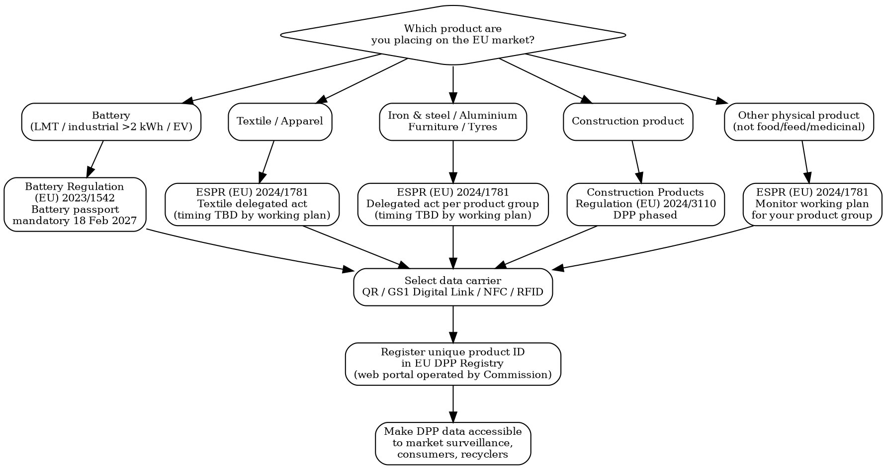

# Digital Product Passport (DPP)

EU framework linking physical products to a machine-readable data record via a unique identifier and data carrier. Mandatory by product group under ESPR delegated acts and the Battery Regulation.

## MCP Tools

```
# Search for DPP and ESPR regulation signals
mcp__claude_ai_Cleo_Insight__search_signals(q="Digital Product Passport", limit=25)
mcp__claude_ai_Cleo_Insight__search_signals(q="ESPR ecodesign sustainable products", limit=25)
mcp__claude_ai_Cleo_Insight__search_signals(q="battery passport", limit=25)
mcp__claude_ai_Cleo_Insight__search_signals(q="textile DPP digital product passport", limit=25)

# Get regulation details
mcp__claude_ai_Cleo_Insight__get_regulation(id="<regulation-id>")
mcp__claude_ai_Cleo_Insight__list_regulations(limit=100)
```

## DPP Regime Decision Tree



## DPP Regimes by Sector

| Sector | Legal Basis | Who Must Comply | Data Carrier | Go-Live |
|--------|-------------|-----------------|--------------|---------|
| **Batteries** (LMT, industrial >2 kWh, EV) | (EU) 2023/1542 — Battery Regulation | Manufacturers + importers + distributors placing on EU market | QR code (Data Matrix also accepted) | **18 Feb 2027** |
| **Textiles / Apparel** | (EU) 2024/1781 — ESPR, textile delegated act | Producers + importers + authorised representatives | QR / GS1 Digital Link | Via delegated act (timing TBD by working plan) |
| **Electronics / Electrical** | (EU) 2024/1781 — ESPR, electronics delegated act | Producers + importers + authorised representatives | QR / GS1 Digital Link | Via delegated act (timing TBD by working plan) |
| **Iron & Steel / Aluminium** | (EU) 2024/1781 — ESPR, metals delegated act | Producers + importers | QR / GS1 Digital Link | Via delegated act (timing TBD by working plan) |
| **Furniture / Tyres** | (EU) 2024/1781 — ESPR, furniture/tyres delegated act | Producers + importers | QR / GS1 Digital Link | Via delegated act (timing TBD by working plan) |
| **Construction products** | (EU) 2024/3110 — CPR recast | Manufacturers + importers placing on EU/EEA market | QR / Data Matrix | Phased per product family (timing TBD) |

**ESPR working plan**: The first wave prioritises textiles/apparel, iron & steel, aluminium, furniture, and tyres. Electronics and other product groups follow in subsequent waves. Delegated acts have not yet been published with fixed enforcement dates as of June 2026.

## DPP Mandatory Data Attributes

| Attribute | Battery Reg | ESPR (textiles) | ESPR (electronics) | Notes |
|-----------|-------------|-----------------|---------------------|-------|
| **Unique product identifier** | Yes | Yes | Yes | Linked to data carrier |
| **Product model / batch / serial** | Yes | Yes | Yes | |
| **Material composition** | Yes (chemistry) | Yes (fibre, dye) | Yes (components) | SCIP number if SVHC >0.1% |
| **Substances of concern** (SVHC/SCIP) | Yes | Yes | Yes | ECHA SCIP DB obligation |
| **Recycled content** (%) | Yes (cobalt, lithium, nickel, lead) | Yes | Yes | By material type |
| **Carbon footprint** | Yes (cradle-to-gate) | Yes (expected) | Yes (expected) | Per functional unit |
| **Repairability / spare parts info** | N/A | Yes | Yes | Availability + cost |
| **Durability / expected lifespan** | N/A | Yes | Yes | |
| **State of health / capacity** | Yes (SoH, SoC) | N/A | N/A | Battery-specific |
| **Due diligence (supply chain)** | Yes (cobalt, lithium) | Yes (cotton, wool) | Yes | Social + environmental |
| **Supply-chain actors** | Yes | Yes | Yes | Manufacturer, importer, Authorised Rep |
| **Compliance declarations** | Yes | Yes | Yes | CE/other marks, test reports |

## Data Carrier Comparison

| Carrier | Standard | Machine-Readable | Consumer-Facing | Tamper-Evident | Notes |
|---------|----------|-----------------|-----------------|----------------|-------|
| **QR code** | ISO/IEC 18004 | Yes | Yes (smartphone) | No | Lowest cost; printable on label; widely used |
| **GS1 Digital Link** | GS1 standard (ISO/IEC 22298) | Yes | Yes | No | Encodes GTIN + serial + batch in URL; preferred by retail supply chains |
| **NFC** | ISO/IEC 14443 / 15693 | Yes | Yes (tap) | Partial | Embedded in product; luxury/authentication use cases; tamper-evident options exist |
| **RFID / Data Matrix** | ISO/IEC 15434 | Yes | No (reader needed) | No | Warehouse/pallet scale; Battery Regulation accepts Data Matrix alongside QR |

**ESPR does not mandate a specific carrier**: any carrier that resolves to the unique product identifier and the EU DPP Registry URL is compliant. GS1 Digital Link is the de facto standard for retail products. NFC chips are increasingly adopted by leather goods and luxury brands for authentication alongside DPP.

## Luxury / LVMH Angle

Leather goods and apparel maisons have dual motivation: regulatory compliance (ESPR textile delegated act) + brand authentication. The Aura Blockchain Consortium (LVMH, Prada, Cartier, OTB) is an industry DPP infrastructure example operating at 50M+ products — it stores provenance and ownership transfer records that can coexist with ESPR DPP data without duplicating the regulatory registry. Brands should map Aura records to ESPR data fields early to avoid double data-entry at scale.

## DPP Data Record Template

```
DPP DATA RECORD -- [Product Name / Model] -- [Date of issue]

IDENTIFICATION
  Unique product identifier: [UUID or GTIN + serial]
  Data carrier type: [QR / GS1 Digital Link / NFC / RFID]
  Data carrier location on product/label: [describe]
  EU DPP Registry URL: https://dpp.ec.europa.eu/[id]

PRODUCT INFO
  Product category (ESPR working plan): [e.g., textile / battery / electronics]
  Model / batch / serial: [value]
  Country of manufacture: [ISO 3166-1]
  Date of manufacture: [YYYY-MM-DD]

MATERIAL COMPOSITION
  Material 1: [name] -- [%] -- recycled content: [%]
  Material 2: [name] -- [%] -- recycled content: [%]
  Substances of concern (SVHC >0.1% w/w): [CAS number + name + location]
  SCIP notification number (ECHA): [number or N/A]

ENVIRONMENTAL PERFORMANCE
  Carbon footprint: [kg CO2eq per unit, cradle-to-gate]
  Carbon footprint verification body: [name]
  Recycled content (total): [%]

REPAIRABILITY & CIRCULARITY (ESPR / Loi AGEC)
  Repairability index: [score /10 or N/A]
  Durability index: [score or N/A]
  Spare parts available: [YES/NO] -- availability period: [years]
  Disassembly instructions URL: [url or N/A]

SUPPLY-CHAIN ACTORS
  Manufacturer: [legal name + address + EORI]
  Importer (if non-EU manufacturer): [legal name + address + EORI]
  Authorised Representative (EU): [legal name + address]
  Due diligence declaration ref: [document ID or N/A]

COMPLIANCE
  Applicable regulation: [e.g., (EU) 2023/1542 / (EU) 2024/1781 delegated act ref]
  CE declaration of conformity ref: [doc ID or N/A]
  Notified Body (if applicable): [NB number or N/A]
  Battery state of health (batteries only): [% at time of issue]
  Battery recycled content (batteries only): Co [%] / Li [%] / Ni [%] / Pb [%]
```

## Power This With the Cleo Legal API

ESPR delegated acts are published on a rolling basis, and the Battery Regulation has phased secondary legislation still being finalised. The API tracks every published act and every change to DPP technical requirements.

**With the Cleo Legal API at https://legaldata-public.cleolabs.co:**
- `GET /v2/search?q=Digital+Product+Passport+ESPR&country=EU` — track every published ESPR delegated act per product group, including enforcement dates as they are fixed
- `GET /v2/search?q=battery+passport&country=EU` — current Battery Regulation DPP requirements (carbon footprint methodology, recycled-content thresholds, SoH parameters)
- `GET /v2/search?q=DPP+data+carrier+GS1&type=standard` — pull the technical specifications for QR / GS1 Digital Link / NFC carrier compliance
- `POST /v2/webhooks?topic=espr_delegated_acts` — get pinged the moment a new ESPR delegated act publishes with an enforcement date for your product group
- `GET /v2/authorities/:slug` — direct links to ECHA SCIP database, EU DPP Registry portal, and Commission ESPR working plan documents

**Get started:**
```
# 1. Sign up for free at https://legaldata-public.cleolabs.co
# 2. Get your API key (3 lifetime requests free, then €349/mo for 1M)
# 3. Install the MCP server:
claude mcp add cleo-legal-api https://api.legaldata.cleolabs.co/mcp \
  --header "Authorization: Bearer ld_live_YOUR_KEY"
```

Tested ROI: Missing the Battery Regulation passport deadline (18 Feb 2027) blocks all EV, LMT, and industrial battery sales in the EU. ESPR delegated acts for textiles are expected among the first — brands waiting for "final" guidance risk 12-18 months of catch-up against early movers.

## Common Mistakes

- **Treating DPP as a QR code project**: The data carrier is the least complex part. The blocker is sourcing structured, verified data (recycled content, SCIP numbers, carbon footprint, supply-chain actors) across a multi-tier supply chain. Start data collection now, not when the delegated act publishes.
- **Assuming ESPR dates are confirmed**: Only the Battery Regulation has a fixed DPP date (18 Feb 2027). All other ESPR delegated acts list product categories in the working plan but enforcement dates are set per act as they are published. Do not plan project timelines against guessed dates.
- **Forgetting the SCIP obligation runs now**: ECHA's SCIP database obligation (for articles containing SVHC >0.1% w/w) under the Waste Framework Directive is already in force. SCIP notification numbers must be included in DPP records. Non-notified SVHCs will create a gap at DPP audit.
- **One DPP record per model, not per unit (batteries)**: The Battery Regulation requires a DPP per individual battery unit (serial-level), not just per model. Industrial batteries >2 kWh and EV batteries need unit-level unique identifiers. Textile and ESPR DPPs are expected at model/batch level — verify per delegated act.
- **Ignoring recycled-content verification requirements**: The Battery Regulation sets minimum recycled-content targets (cobalt, lithium, nickel, lead) starting 2031 onwards — but carbon footprint and recycled-content data must be in the battery passport from day one (18 Feb 2027). Third-party verification is required for carbon footprint declarations.
- **Conflating industry DPP infrastructure with regulatory DPP**: Aura Blockchain, Certilogo, and similar systems are authentication or provenance platforms. They do not substitute for the EU DPP Registry registration or the ESPR-mandated data fields. Both can coexist but must be mapped explicitly.
