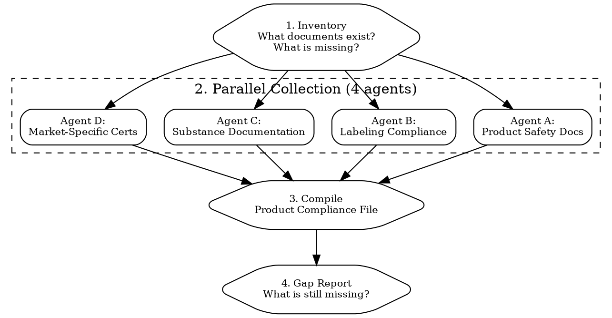

# Evidence Blitz

Gather all compliance evidence for certification, audit, retail buyer, or marketplace listing. Parallel agents per document category.

## When to Use

- Preparing for a product audit or inspection
- A retail buyer or distributor asks for your compliance file
- Listing on Amazon, Target, Whole Foods (they require compliance documentation)
- Applying for CE/UKCA certification (technical file)
- Responding to a regulatory authority inquiry
- Annual documentation refresh

## Flow



## Step 1: Document Inventory

Check what exists and what is missing:

```
DOCUMENT INVENTORY -- [Product Name] -- [Date]

PRODUCT SAFETY:
[ ] Safety assessment / CPSR (cosmetics)
[ ] Risk assessment (general products)
[ ] Stability test report (accelerated)
[ ] Stability test report (real-time)
[ ] Microbiological test report
[ ] Preservative efficacy test (PET/challenge test)
[ ] Patch test / skin irritation test
[ ] SPF test report (if SPF claim)
[ ] EMC test report (electronics)
[ ] Safety test report (LVD, electronics)
[ ] Mechanical/physical safety (toys: EN 71-1)
[ ] Flammability test (toys: EN 71-2)
[ ] Migration test (toys: EN 71-3)
[ ] Nutritional analysis (food)
[ ] Contaminant testing (food)

SUBSTANCE DOCUMENTATION:
[ ] Full ingredients list with CAS numbers
[ ] Certificates of Analysis (CoA) for each raw material
[ ] IFRA certificate (if product contains fragrance)
[ ] Allergen declaration
[ ] REACH compliance documentation
[ ] RoHS compliance documentation (electronics)
[ ] SVHC screening result
[ ] Heavy metals analysis
[ ] CPSIA testing (children's products)

LABELING:
[ ] Label artwork (per market)
[ ] INCI name verification
[ ] Allergen review (per market requirements)
[ ] Claims substantiation file
[ ] Prop 65 assessment (if selling in California)
[ ] Nutrition/supplement facts panel review (food)

MARKET CERTIFICATIONS:
[ ] CE Declaration of Conformity (EU)
[ ] CE technical documentation file
[ ] UKCA Declaration of Conformity (UK)
[ ] FCC authorization / test report (US)
[ ] CPNP notification confirmation (EU cosmetics)
[ ] FDA MoCRA registration (US cosmetics)
[ ] FDA facility registration (US food)
[ ] UK SCPN notification confirmation (UK cosmetics)
[ ] Responsible Person agreement (EU)
[ ] Responsible Person agreement (UK)
[ ] Certificate of origin (for FTA claims)
[ ] Product liability insurance certificate

CORPORATE:
[ ] GMP certificate (if applicable)
[ ] ISO 22716 (cosmetics GMP)
[ ] FSSC 22000 / ISO 22000 (food safety)
[ ] Quality management system documentation
[ ] Supplier qualification records
```

## Step 2: Parallel Collection Agents

Dispatch via `superpowers:dispatching-parallel-agents`.

### Agent A: Product Safety Documents

```markdown
Collect all product safety documentation for {{PRODUCT_NAME}}.

For each document in the safety section of the inventory:
1. Check if document exists (ask user for file location or reference)
2. If exists: verify it is current (not expired, covers current formulation)
3. If expired: flag for renewal with timeline and cost
4. If missing: specify what is needed, which lab/assessor, timeline, cost

Key documents by product type:
- Cosmetics: CPSR, stability, microbio, PET, patch test
- Electronics: EMC, LVD/safety, environmental, RED (if radio)
- Toys: EN 71-1/2/3/9, CPSIA if for US
- Food: nutritional, contaminant, shelf-life

Return: per-document status (HAVE / EXPIRED / MISSING) with action plan for gaps.
```

### Agent B: Labeling Compliance

```markdown
Verify labeling compliance for {{PRODUCT_NAME}} across all target markets ({{MARKETS}}).

For each market:
1. Check label artwork exists
2. Verify all mandatory elements present (use labeling-compliance skill reference)
3. Check language requirements met
4. Verify claims are substantiated
5. Check allergen declarations correct

Return: per-market label status (COMPLIANT / NON-COMPLIANT with specific issues).
```

### Agent C: Substance Documentation

```markdown
Collect substance documentation for {{PRODUCT_NAME}}.

For each ingredient in {{INGREDIENTS_LIST}}:
1. Certificate of Analysis (CoA) from supplier -- current? Complete?
2. REACH registration status (if selling in EU)
3. SVHC screening (is substance on SVHC Candidate List?)
4. CAS number confirmation
5. IFRA certificate (if fragrance ingredient)
6. Purity/contaminant specs

Return: per-ingredient documentation status (COMPLETE / PARTIAL / MISSING).
```

### Agent D: Market-Specific Certifications

```markdown
Collect market-specific certifications for {{PRODUCT_NAME}} in {{MARKETS}}.

For each market:
1. Conformity marking (CE, UKCA, FCC) -- have declaration + technical file?
2. Notification/registration -- completed? (CPNP, FDA MoCRA, UK SCPN)
3. Responsible Person -- appointed with signed agreement?
4. EPR registration -- done? (France, Germany, etc.)
5. Product liability insurance -- covers this market?
6. Certificate of origin -- have it for FTA claim?

Return: per-market certification status (COMPLETE / PARTIAL / MISSING) with action plan.
```

## Step 3: Compile Product Compliance File

Assemble all documents into a structured Product Compliance File:

```
PRODUCT COMPLIANCE FILE -- [Product Name] -- [Version] -- [Date]

TABLE OF CONTENTS:
1. Product Description & Classification
   - Product name, category, HS code
   - Full ingredient list with CAS numbers
   - Manufacturing process summary
   - Manufacturing origin

2. Safety Assessment
   - CPSR / Risk Assessment
   - Test reports (stability, microbio, safety)
   - Clinical/human testing (if applicable)

3. Substance Compliance
   - Certificates of Analysis (per ingredient)
   - REACH compliance evidence
   - SVHC screening
   - IFRA certificate (if fragrance)
   - Market-specific substance checks

4. Labeling
   - Label artwork (per market)
   - INCI verification
   - Allergen review
   - Claims substantiation

5. Market Certifications
   - Declarations of Conformity
   - Notification confirmations
   - RP agreements
   - Insurance certificates
   - Certificates of origin

6. Quality & Manufacturing
   - GMP certificate
   - Supplier qualification
   - Batch records (sample)

7. Post-Market
   - Adverse event reporting procedure
   - Recall procedure
   - Contact information for authorities
```

### For Bastion / ISO 27001 Users

If your company also handles customer data and uses Bastion for ISO 27001:

```
# Upload product compliance evidence to Bastion
mcp__bastion__upload-compliance-document
  name: "CPSR-GlowSerum-2026.pdf"
  document: "data:application/pdf;base64,..."

mcp__bastion__add-compliance-test-evidence
  testId: "<relevant-test-id>"
  name: "Product safety documentation"
  description: "CPSR and test reports for Glow Serum product line"
  evidenceDocumentId: <returned-doc-id>

mcp__bastion__mark-compliance-test-ready-for-review
  testId: "<relevant-test-id>"
```

## Step 4: Gap Report

```
GAP REPORT -- [Product Name] -- [Date]

HAVE (complete):
- [document] -- valid until [date]
- [document] -- valid until [date]

EXPIRED (need renewal):
- [document] -- expired [date] -- renewal cost: EUR [X] -- timeline: [weeks]

MISSING (need to create):
- [document] -- required for [market(s)] -- cost: EUR [X] -- timeline: [weeks]

TOTAL GAP CLOSURE:
  Documents to create/renew: [count]
  Estimated total cost: EUR [X]
  Estimated timeline: [weeks] (if parallelized)
  Critical path: [which document takes longest]

IMMEDIATE ACTIONS:
1. [ ] [Action] -- [who] -- [deadline]
2. [ ] [Action] -- [who] -- [deadline]
```

## Audience-Specific Packages

Different stakeholders need different subsets:

| Audience | What they need | Format |
|----------|---------------|--------|
| **Retail buyer** (Sephora, Target) | Safety assessment, test reports, claims substantiation, insurance, CoAs | PDF package with cover letter |
| **Amazon marketplace** | Product safety documentation, compliance certificates, test reports | Uploaded to Seller Central |
| **Customs/import** | Certificate of origin, Declaration of Conformity, HS code documentation | Paper originals often required |
| **Regulatory authority** (DGCCRF, FDA) | Full Product Information File, CPSR, all test reports | Must be available within 48h of request |
| **Distributor** | Product specs, compliance summary per market, labeling files | Digital package |
| **Auditor** (ISO, GMP) | Full quality system + product documentation | On-site or virtual inspection |

## Common Mistakes

- **Expired documents**: A 3-year-old stability test does not prove current batch stability. Most documents need annual or batch-specific renewal.
- **Missing CoAs from suppliers**: Every raw material needs a Certificate of Analysis. If your supplier cannot provide one, that is a red flag about the ingredient.
- **Label artwork not matching actual label**: The file you send to the buyer must match what is physically on the product. Version control is critical.
- **No IFRA certificate for fragrances**: "Parfum/Fragrance" on the label is not enough. You need the IFRA compliance certificate from your fragrance supplier to prove allergen levels.
- **Product Compliance File not accessible**: EU authorities can request your Product Information File at any time. It must be available (not "we will dig it up"). Keep it organized and up to date.
- **Insurance gaps**: Product liability insurance must cover the specific markets you sell in. A France-only policy does not cover US lawsuits.
