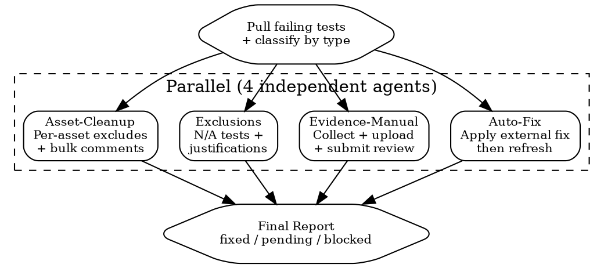

# Evidence Blitz

Parallel remediation across failing tests via `superpowers:dispatching-parallel-agents`.

## Flow



## Step 0: Pull and Classify

```
mcp__bastion__get-compliance-failing-summary  framework=<id>
mcp__bastion__list-failing-compliance-tests   framework=<id>  # paginate
```

| Group | Criteria | Agent |
|-------|----------|-------|
| Auto | Automatic integration, external fix needed | Auto-Fix |
| Manual | Manual integration, evidence exists | Evidence-Manual |
| N/A | Not applicable to org | Exclusions |
| Asset | Individually excludable failing assets | Asset-Cleanup |
| Blocked | UI-only or vendor dependency | Log and skip |

## Agent Prompts

### Auto-Fix
```markdown
Per test: get-compliance-test-detail, identify fix (FileVault, firewall, branch protection,
Dependabot...), apply via CLI/API, then refresh-compliance-test. UI-only: log blocked.
CRITICAL: Fix FIRST, refresh AFTER. Tests: [IDs]
Return: per-test (fixed | refresh-pending | blocked + reason).
```

### Evidence-Manual
```markdown
Per test: get detail, collect evidence (URL/screenshot/doc), draft description (MAX 500 CHARS),
add-compliance-test-evidence, mark-ready-for-review. Docs must be <50KB for MCP.
Tests: [IDs]. Return: per-test (submitted | blocked + what's missing).
```

### Exclusions
```markdown
Per test: confirm genuinely N/A, draft auditor-facing justification, exclude-compliance-test.
BAD: "Not relevant." GOOD: "No physical office; all employees remote since incorporation."
Tests: [IDs]. Return: per-test (excluded | kept).
```

### Asset-Cleanup
```markdown
Per test: list failing assets, identify excludable (decommissioned, test env, out of scope),
draft per-asset comment, put-compliance-test-exclude-asset.
Tests: [IDs]. Return: per-test (X excluded, Y remaining + fixes needed).
```

## Hard Constraints

- **Description max 500 chars** -- API silently rejects longer
- **Document max ~50KB** via MCP base64 -- larger files: UI upload
- **Auto tests need external fixes** -- evidence alone does not pass them
- **Policy approval** -- owners cannot approve own policies; flag if blocked
- **Refresh timing** -- retry once after fix before marking pending

## Final Report

| Category | Fixed | Pending | Blocked |
|----------|-------|---------|---------|
| Auto-Fix | X | Y | Z |
| Evidence | X | Y | Z |
| Exclusions | X | -- | Z |
| Assets | X | -- | Z |

Projection: "Before: X/Y. After blitz: ~Z/Y. N items need manual action."

## Red Flags

- **Refreshing before fixing**: Refresh re-evaluates, does not remediate.
- **Bulk-excluding real gaps**: Unjustified exclusions are auditor-visible and worse than failures.
- **Oversized uploads**: MCP silently fails on large base64 payloads.
- **Ignoring blocked items**: Untracked blockers stall the whole sprint.
