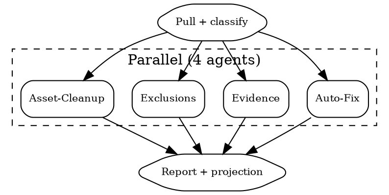

# Evidence Blitz

Parallel remediation across failing tests. **Dependency**: `superpowers:dispatching-parallel-agents`.

## Flow



## Step 0: Pull and Classify

```
mcp__bastion__get-compliance-failing-summary  framework=<id>
mcp__bastion__list-failing-compliance-tests   framework=<id>  # paginate all
```

Response contains `groups[]` with `complianceIntegrationConfigurationId` per group (integration source: GitHub, AWS, MDM, manual). Route tests by this ID.

| Group | Criteria | Agent |
|-------|----------|-------|
| Auto | Has integration ID, external fix possible | Auto-Fix |
| Manual | No integration ID or manual type | Evidence |
| N/A | Not applicable to org | Exclusions |
| Asset | Multiple failing assets, some excludable | Asset-Cleanup |
| Blocked | UI-only (see list below) | Log + skip |

**Blocked** (MCP cannot fix): policy creation (UI only), MDM enrollment (UI+device), doc >50KB, policy self-approval (needs second approver).

## Agent Prompts

### Auto-Fix
```markdown
Per test: get-compliance-test-detail, identify fix (FileVault, firewall, branch protection,
Dependabot), apply via CLI/API, wait 30s, refresh-compliance-test. UI-only: log blocked.
CRITICAL: Fix FIRST, refresh AFTER. Tests: {{TEST_IDS}}
Return: per-test (fixed | refresh-pending | blocked + reason).
```

### Evidence
```markdown
Per test: get-compliance-test-detail, collect evidence (URL/screenshot/doc), draft description
(MAX 500 CHARS), add-compliance-test-evidence, mark-compliance-test-ready-for-review.
Docs must be <50KB for MCP base64. Tests: {{TEST_IDS}}
Return: per-test (submitted | blocked + what's missing).
```

### Exclusions
```markdown
Per test: confirm genuinely N/A, draft auditor-facing justification, exclude-compliance-test.
BAD: "Not relevant." GOOD: "No physical office; 100% remote since incorporation."
Tests: {{TEST_IDS}}. Return: per-test (excluded | kept + reason).
```

### Asset-Cleanup
```markdown
Per test: list failing assets via get-compliance-test-detail, identify excludable (decommissioned,
test env, out of scope), draft per-asset comment, put-compliance-test-exclude-asset.
Tests: {{TEST_IDS}}. Return: per-test (X excluded, Y remaining).
```

## Score Projection

```
projected_passing = current_passing + excluded + refreshed_passing + evidence_submitted
projected_score   = projected_passing / total_tests
```

Report two projections: **optimistic** (all evidence approved) and **conservative** (only auto-fix + exclusions counted).

## Final Report

| Category | Fixed | Pending | Blocked |
|----------|-------|---------|---------|
| Auto-Fix | X | Y | Z |
| Evidence | X | Y | Z |
| Exclusions | X | -- | Z |
| Assets | X | -- | Z |

"Before: X/Y (Z%). After blitz: ~A/Y (B%). C items need Bastion UI."

## Red Flags

- **Refreshing before fixing**: Refresh re-evaluates, does not remediate.
- **Bulk-excluding real gaps**: Unjustified exclusions are auditor-visible, worse than failures.
- **Oversized uploads**: MCP silently fails on large base64. Check size first.
- **Ignoring blocked items**: Untracked blockers stall the sprint.
