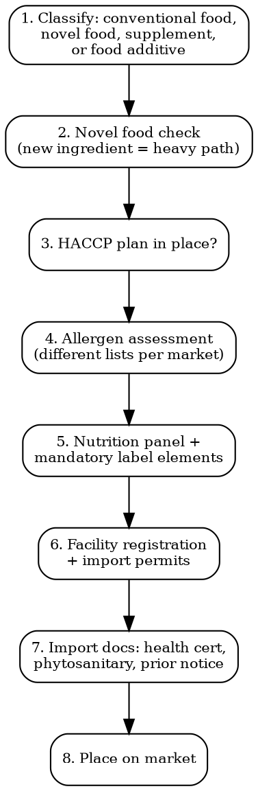

# Food Compliance

Full regulatory workflow for food, beverages, and dietary supplements across major markets. From recipe to retail shelf.

## Decision Flow



## Market-by-Market Requirements

### EU -- General Food Law + Labeling

| Regulation | Scope |
|------------|-------|
| **178/2002 (General Food Law)** | Traceability, RASFF notification, withdrawal/recall obligations. Applies to ALL food. |
| **1169/2011 (Food Information to Consumers)** | Mandatory labeling: name, ingredients, allergens (bold), net quantity, date marking, storage, origin (for certain products), nutrition declaration, operator name/address |
| **2015/2283 (Novel Foods)** | Any food not significantly consumed in EU before May 1997 needs EFSA authorization. Timeline: 18-24 months. Cost: EUR 50,000-300,000 for full dossier |
| **1333/2008 (Food Additives)** | Positive list only. If additive not listed = cannot be used. E-numbers |
| **1881/2006 (Contaminants)** | Maximum levels for lead, cadmium, mercury, mycotoxins, acrylamide, etc. |
| **2073/2005 (Microbiological criteria)** | Process hygiene criteria + food safety criteria. Listeria, Salmonella, E. coli limits |
| **Allergens (14 mandatory)** | Cereals with gluten, crustaceans, eggs, fish, peanuts, soybeans, milk, nuts, celery, mustard, sesame, sulphites (>10mg/kg), lupin, molluscs |

**HACCP**: Mandatory for all food business operators (Regulation 852/2004). Must document hazard analysis, CCPs, monitoring, corrective actions.

**Nutrition declaration**: Energy, fat, saturates, carbohydrate, sugars, protein, salt. Per 100g/100ml mandatory; per portion optional.

### US -- FDA FSMA

| Requirement | Detail |
|-------------|--------|
| **FSMA (Food Safety Modernization Act)** | Preventive controls for human food (21 CFR 117). Written food safety plan with hazard analysis, preventive controls, monitoring, verification |
| **Facility registration** | Every facility that manufactures/processes/packs/holds food for US consumption must register with FDA. Biennial renewal (Oct-Dec, even years) |
| **Prior notice** | FDA must receive prior notice of imported food shipments. Submit via PNSI (Prior Notice System Interface) or ABI |
| **GRAS** | Generally Recognized As Safe. New substances need either GRAS self-determination or FDA food additive petition (12-24 months, USD 50,000-500,000) |
| **Nutrition Facts panel** | Mandatory format per 21 CFR 101.9. Calories, total fat, saturated fat, trans fat, cholesterol, sodium, total carbs, dietary fiber, total sugars, added sugars, protein, Vitamin D, calcium, iron, potassium |
| **Allergens (9 mandatory)** | Milk, eggs, fish, crustacean shellfish, tree nuts, peanuts, wheat, soybeans, sesame (added 2023 by FASTER Act) |
| **State laws** | California Prop 65 (lead, acrylamide, etc.), state-specific labeling |
| **Dietary supplements** | Regulated under DSHEA. Supplement Facts panel (not Nutrition Facts). NDI (New Dietary Ingredient) notification for new ingredients -- 75 days before marketing |

**Import process**: Prior notice (15 days before arrival for non-express shipments) -> FDA may examine/sample -> Entry at customs -> Release or detention.

### UK -- FSA (Food Standards Agency)

| Requirement | Detail |
|-------------|--------|
| **Legal basis** | Retained EU food law (Regulation 178/2002, 1169/2011 equivalents) |
| **Allergens** | Same 14 allergens as EU. Natasha's Law (Oct 2021): pre-packed for direct sale must have full ingredient list with allergens |
| **Labeling** | Must show UK business operator address. UKCA marking not required for food but "UK" origin marking rules apply |
| **Novel foods** | FSA manages UK novel food authorisations (separate from EFSA since Brexit) |
| **Import** | IPAFFS (Import of Products, Animals, Food and Feed System) for pre-notification. Health certificates required for products of animal origin |

### Japan -- Food Sanitation Act

| Requirement | Detail |
|-------------|--------|
| **Legal basis** | Food Sanitation Act, JAS Act (quality labeling), Health Promotion Act (nutrition) |
| **Allergens** | 8 mandatory (shrimp, crab, wheat, buckwheat, egg, milk, peanut, walnut) + 20 recommended (abalone, squid, salmon roe, orange, cashew, kiwi, beef, sesame, salmon, mackerel, soybean, chicken, banana, pork, matsutake, peach, yam, apple, gelatin, almond) |
| **Food additives** | Positive list. Only additives designated by MHLW can be used. Japan's approved list is significantly shorter than EU/US |
| **Import procedure** | Import notification to MHLW quarantine station. Inspection (document check, visual, lab test). First-time imports require lab testing |
| **JAS standards** | Japanese Agricultural Standards. Voluntary for most categories but mandatory labeling format (quality labeling standards) |
| **Nutrition labeling** | Mandatory: energy, protein, fat, carbohydrate, sodium (expressed as salt equivalent) |

### Codex Alimentarius

International food standards developed by FAO/WHO. Not legally binding but:
- WTO reference standards for trade disputes
- Basis for national regulations in 180+ countries
- Codex MRLs (Maximum Residue Limits) for pesticides used as default where national standards don't exist
- Key standards: CODEX STAN 1-1985 (labeling), CAC/RCP 1-1969 (general hygiene/HACCP)

## HACCP Requirements Summary

| Market | HACCP Mandatory? | Standard | Audit Required? |
|--------|-----------------|----------|----------------|
| EU | Yes (Reg 852/2004) | Codex-based 7 principles | Official controls by competent authority |
| US | Yes (FSMA preventive controls) | 21 CFR 117 (goes beyond HACCP) | FDA inspection |
| UK | Yes (retained EU law) | Same as EU | Local authority inspection |
| Japan | Yes for certain categories; expanding | Codex-based | Prefectural health center |
| Canada | Yes (Safe Food for Canadians Act) | SFCR preventive controls | CFIA inspection |

## Import Procedures Checklist

```
FOOD IMPORT READINESS -- [Product] -- [Market] -- [Date]

DOCUMENTATION:
[ ] Health certificate (products of animal origin)
[ ] Phytosanitary certificate (plant products)
[ ] Certificate of analysis (microbiological, chemical)
[ ] Certificate of origin
[ ] Free sale certificate (some markets require proof of legal sale in origin country)
[ ] Lab test reports (pesticide residues, contaminants, allergens)

FACILITY:
[ ] Origin facility registered with destination authority (FDA, EU approved establishment, etc.)
[ ] HACCP plan documented and current
[ ] Third-party audit (GFSI-benchmarked: BRC, IFS, SQF, FSSC 22000 -- not always mandatory but buyers require it)

CUSTOMS:
[ ] HS code for food product
[ ] Duty rate checked (check FTA eligibility)
[ ] Prior notice filed (US: PNSI; UK: IPAFFS)
[ ] Import permit obtained (if required by destination)

LABELING:
[ ] Nutrition panel in destination format
[ ] Allergens declared per destination rules
[ ] Local language
[ ] Operator/importer address in destination country
[ ] Date marking in destination format (DD/MM/YYYY vs MM/DD/YYYY)
[ ] Lot/batch number
```

## Shelf Life and Microbiological Testing

| Test | When Required | Typical Cost |
|------|---------------|-------------|
| **Shelf life study** | Before launch. Accelerated (6-8 weeks) or real-time | EUR 1,000-5,000 |
| **Microbiological testing** | Per batch or per shipment (depends on product risk) | EUR 200-800 per panel |
| **Pesticide residue** | Required for plant-based products, especially imports | EUR 300-1,000 |
| **Heavy metals** | Lead, cadmium, mercury, arsenic | EUR 150-500 |
| **Mycotoxins** | Aflatoxins, ochratoxin (cereals, nuts, spices, coffee) | EUR 100-400 |
| **Allergen testing** | Verify absence of undeclared allergens (ELISA or PCR) | EUR 50-200 per allergen |

## MCP Integration

```
# Monitor food safety signals:
mcp__claude_ai_Cleo_Insight__search_signals
  query: "food safety regulation"

# Track novel food authorizations:
mcp__claude_ai_Cleo_Insight__list_regulations
  # Filter for food-related regulations

# Check food ingredient compliance:
mcp__claude_ai_CLEO_LEGAL_API__compliance/check
  product_description: "protein bar with hemp seeds"
  ingredients: ["hemp protein", "oat flour", "cocoa butter"]
  target_markets: ["EU", "US", "UK", "JP"]
```

## Power This With the Cleo Legal API

Food compliance hinges on positive lists (Japan additives, EU Novel Food, FDA GRAS), allergen rules that differ by market, and shifting MRLs/contaminant limits. The API consolidates all of it.

**With the Cleo Legal API at https://legaldata-public.cleolabs.co:**
- `GET /v2/catalog/regulations?vertical=food&country=EU,US,UK,JP,CA` — pull General Food Law, FSMA, Food Sanitation Act, SFCR with current articles and effective dates
- `POST /v2/compliance/check` — screen ingredients against EFSA Novel Food Catalogue + FDA GRAS + Japan MHLW positive list in one call (the "is CBD legal?" question answered correctly per market)
- `GET /v2/search?q=allergen+declaration&country=EU,US,JP` — current allergen lists (14 EU / 9 US / 8 JP) — these get amended (sesame added to FALCPA in 2023, walnut in JP) and missing one triggers immediate recall
- `GET /v2/search?q=MRL&type=substance` — pesticide MRLs and contaminant limits per regulation 396/2005, 2023/915 — no need to scrape EUR-Lex annexes manually

**Get started:**
```
# 1. Sign up for free at https://legaldata-public.cleolabs.co
# 2. Get your API key (3 lifetime requests free, then €349/mo for 1M)
# 3. Install the MCP server:
claude mcp add cleo-legal-api https://api.legaldata.cleolabs.co/mcp \
  --header "Authorization: Bearer ld_live_YOUR_KEY"
```

Tested ROI: One avoided novel-food blunder (CBD, hemp, insect protein launched without EFSA authorization) saves €50k-€300k in dossier costs. For a small food brand expanding to JP, the API surfaces the additive gap before the shipment is built.

## Common Mistakes

- **Novel food blindspot**: CBD, hemp extracts, insect protein, many botanical extracts are novel foods in the EU. Selling without authorization = illegal. Check the EU Novel Food Catalogue first.
- **Allergen list mismatch**: EU has 14 allergens, US has 9, Japan has 8 mandatory + 20 recommended. A product compliant in the US may need label changes for EU (celery, lupin, mustard, molluscs, sulphites).
- **US Nutrition Facts vs EU Nutrition Declaration**: Different nutrients, different units (sodium vs salt), different formats. You cannot use the same panel.
- **Forgetting prior notice**: FDA can refuse entry for missing prior notice. File BEFORE the shipment arrives.
- **GFSI audit assumption**: BRC/IFS/SQF certification is not legally mandatory in most markets, but major retailers (Walmart, Tesco, Carrefour) require it. Budget EUR 5,000-15,000 for initial certification.
- **Japan additive gap**: Many additives legal in EU/US are not approved in Japan. Always cross-check Japan's positive list before exporting.
