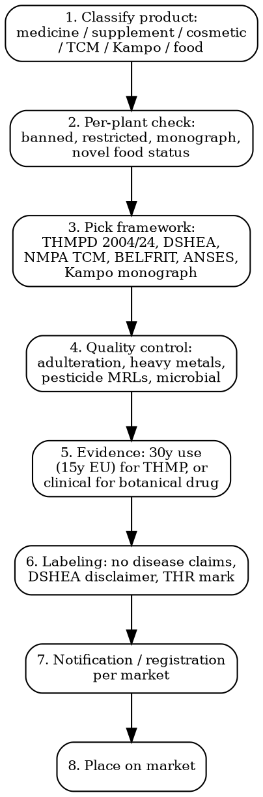

# Herbal Medicine Compliance

Full regulatory workflow for botanical and herbal medicinal products. Sits between pharmaceutical, food supplement, and traditional medicine frameworks — wrong classification adds 3-7 years to launch.

## Decision Flow



## EU -- Traditional Herbal Medicinal Products Directive (THMPD) 2004/24/EC

| Aspect | Detail |
|--------|--------|
| **Legal basis** | Directive 2004/24/EC amending Directive 2001/83/EC on medicinal products for human use |
| **Eligibility** | Herbal medicine in use for ≥30 years total, ≥15 years in EU |
| **Indications** | Only minor self-limiting conditions (cough, indigestion, joint discomfort, mild anxiety). NO serious disease claims |
| **Authority** | National competent authority + EMA HMPC (Committee on Herbal Medicinal Products) |
| **Monographs** | HMPC publishes Community Herbal Monographs (CHMs) and EU List entries — once on list, simplified registration |
| **Documentation** | Quality dossier (CTD Module 3) + bibliographic evidence of safety + traditional use evidence (30y/15y) |
| **GMP** | EU GMP Part II for active substances, Part I for finished products. Inspections required |
| **Marking** | Product marked "Traditional herbal medicinal product for use in [indication] exclusively based upon long-standing use" |
| **Pharmacovigilance** | Full PSUR + ICSR reporting obligations (same as authorized medicines) |
| **Cost** | EUR 50,000-200,000 per dossier; EUR 5,000-25,000 per MS registration fee |
| **Timeline** | 12-24 months |

### Key HMPC Monographs in Force (2026)

| Botanical | Latin | Indication scope |
|-----------|-------|------------------|
| **Echinacea purpurea** | Echinaceae purpureae herba | Common cold |
| **Valerian** | Valerianae radix | Mild nervous tension, sleep |
| **St John's wort** | Hyperici herba | Mild depressive symptoms (well-established use) / mild tension (traditional) |
| **Ginkgo** | Ginkgo folium | Vertigo, tinnitus, cognitive symptoms |
| **Ginger** | Zingiberis rhizoma | Motion sickness |
| **Milk thistle** | Silybi mariani fructus | Liver function support |
| **Saw palmetto** | Sabalis serrulatae fructus | BPH urinary symptoms |
| **Hawthorn** | Crataegi folium cum flore | Cardiac symptoms |
| **Peppermint** | Menthae piperitae aetheroleum | IBS, dyspepsia |

## US -- Two Distinct Paths

### Path 1: Dietary Supplement (DSHEA 1994)

| Aspect | Detail |
|--------|--------|
| **Legal basis** | Dietary Supplement Health and Education Act, codified in 21 USC 321(ff), 343, 350b |
| **FDA notification** | NDI (New Dietary Ingredient) notification 75 days before marketing if ingredient marketed AFTER Oct 15, 1994 |
| **Old Dietary Ingredients** | Pre-DSHEA ingredients exempt from NDI notification (list maintained informally by industry) |
| **Claims** | Structure/function claims allowed ("supports immune function"). Disease claims PROHIBITED. Required disclaimer "This statement has not been evaluated by FDA" |
| **GMP** | 21 CFR 111 cGMP for dietary supplements — mandatory since 2010 |
| **Adverse event reporting** | Mandatory within 15 days of serious AE (21 USC 379aa-1) |
| **Cost** | NDI: USD 30,000-150,000 (toxicology dossier). GMP audit: USD 50,000-200,000 annual |

### Path 2: Botanical Drug (FDA Guidance 2016)

| Aspect | Detail |
|--------|--------|
| **Pathway** | NDA (New Drug Application) under FD&C Act |
| **Special guidance** | "Botanical Drug Development Guidance for Industry" — December 2016 |
| **Approvals to date** | Only 2 approved: Veregen (sinecatechins, 2006) + Mytesi/Fulyzaq (crofelemer, 2012). Several Phase III in progress |
| **Path A (well-known botanical)** | Reduced CMC + non-clinical requirements |
| **Cost** | USD 50M-300M including Phase III |
| **Timeline** | 7-12 years |

## UK -- MHRA Traditional Herbal Registration (THR)

| Aspect | Detail |
|--------|--------|
| **Legal basis** | Human Medicines Regulations 2012 (SI 1916), Part 7 — UK transposition of THMPD |
| **Mark** | THR mark on packaging — required + distinguishable from POM (prescription) + GSL (general sales) |
| **Eligibility** | 30 years use total, 15 years in EU + UK (UK still recognizes EU history for pre-Brexit data) |
| **Indications** | Only minor self-limiting conditions |
| **Fee** | GBP 3,750 application + GBP 50,000-150,000 dossier prep |
| **Renewal** | 5-year renewal cycle |
| **Brexit divergence** | UK accepting EMA HMPC monographs but assessing independently |

## Germany -- Kommission E + AMG

| Aspect | Detail |
|--------|--------|
| **Kommission E** | Federal Health Office expert panel — published 380 herbal monographs 1978-1994 (still authoritative reference globally) |
| **Apothekenpflichtig vs Freiverkäuflich** | Prescription-only / pharmacy-only / freely sellable — German Pharmacy Operations Regulation |
| **OTC herbal market** | One of largest globally — EUR 1.5B/year |
| **AMG (Arzneimittelgesetz)** | German Medicines Act — interfaces with EU rules. National additional standards |
| **BfArM** | Federal Institute for Drugs and Medical Devices — assesses herbal medicine registrations |
| **Standard authorization** | Allowed for products fulfilling Kommission E monograph criteria — simpler path |

## France -- ANSES + Plantes Médicinales List

| Aspect | Detail |
|--------|--------|
| **148 medicinal plants** | Annex of Decree 2008-841 — plants authorized for general sale outside pharmacy. Within pharmacy: full Pharmacopoeia |
| **Pharmacopée française** | French Pharmacopoeia — plant monographs, quality standards |
| **ANSES** | French Agency for Food, Environmental and Occupational Health Safety — supplements |
| **Telemed declaration** | Food supplement declaration required before marketing (Décret 2006-352) — ANSES portal |
| **Pharmacy monopoly** | Pharmacists hold monopoly on 540+ medicinal plants. Selling outside the 148-list outside pharmacy = practicing pharmacy illegally |
| **DGCCRF enforcement** | Regular sweeps of online supplement sellers — annual seizures |

## Italy / Belgium -- BELFRIT List

| Aspect | Detail |
|--------|--------|
| **BELFRIT** | Belgium, France, Italy harmonized list — botanical supplements |
| **Status** | 1,028 plants on harmonized list (consolidated 2014, updated 2018) |
| **Use** | Each plant categorized: permitted, restricted with conditions, prohibited |
| **Scope** | Italy: Decreto 9 luglio 2012 — uses BELFRIT-derived list (1,231 plants) |
| **Belgium**: AR 29 août 1997 botanicals list |
| **France**: Plantes Plantes 148-list overlaps but is narrower |

## China -- TCM Regulation

| Aspect | Detail |
|--------|--------|
| **NMPA Drug Administration Law (2019 revision)** | TCM (Traditional Chinese Medicine) as registered drug category |
| **Chinese Pharmacopoeia (Ph. Chin.)** | 2025 edition — 5,000+ monographs |
| **TCM categories**: Class 1 (new TCM) — full clinical. Class 2 (compound preparations from authorized herbs). Class 3 (proprietary TCM with classical formula record) |
| **Classical Famous Formula Pathway** (since 2017) | 100+ historical formulas — simplified registration (no Phase III required if classical) |
| **Imported TCM** | Foreign TCM products require full NMPA registration. CFDA factory audit |
| **Cost** | CNY 5M-50M depending on category |
| **Timeline** | 18 months (classical formula) to 6+ years (Class 1 new TCM) |

## Japan -- Kampo

| Aspect | Detail |
|--------|--------|
| **Kampo medicines** | Japanese adaptation of Chinese herbal medicine — ~148 formulas reimbursed by national health insurance |
| **Dual classification** | Some Kampo are "ethical drugs" (prescription) reimbursed by NHI. Others are OTC under Pharmaceutical Affairs Law |
| **MHLW notification** | Required. Standards based on Japanese Pharmacopoeia (JP XVIII, 2021) + Kampo-specific monographs |
| **Marketing Authorization Holder** | Japan-based entity |
| **GMP** | Japan-specific GMP for Kampo manufacturers |

## WHO + Quality Standards

| Standard | Coverage |
|----------|----------|
| **WHO Guidelines on Good Agricultural and Collection Practices (GACP)** | 2003 — quality from farm |
| **WHO Guidelines on Quality Control Methods for Herbal Materials** | 2011 — testing protocols |
| **WHO Monographs on Selected Medicinal Plants** | Volumes 1-4 — 118 plants |
| **USP-NF Botanical** | US Pharmacopoeia monographs |
| **EP / Ph. Eur. monographs** | European Pharmacopoeia — 270+ plant monographs |
| **BP (British Pharmacopoeia)** | UK monographs (largely aligned EP) |

## Contamination Limits

### Heavy Metals (typical, EP Ch 5.20)

| Metal | Limit (mg/kg dry weight) |
|-------|--------------------------|
| Lead (Pb) | ≤5.0 |
| Cadmium (Cd) | ≤1.0 (≤0.5 if daily intake >100 g) |
| Mercury (Hg) | ≤0.1 |
| Arsenic (As) inorganic | ≤5.0 |

### Pesticide Residues -- Reg 396/2005

- Default 0.01 mg/kg for non-authorized pesticides
- Plant-specific MRLs in Annex IV
- Higher tolerance for dried herbs (concentration factor up to 10x)

### Microbial Limits (EP 5.1.4 / 5.1.8)

| Use | TAMC | TYMC | Bile-tolerant Gram-neg | Salmonella |
|-----|------|------|-----------------------|------------|
| Herbal teas (boiled use) | 10⁷ CFU/g | 10⁵ CFU/g | 10⁴ CFU/g | Absent 25 g |
| Herbal medicines (not boiled) | 10⁵ CFU/g | 10⁴ CFU/g | 10³ CFU/g | Absent 25 g |

### Adulteration Testing

| Method | Application |
|--------|-------------|
| **HPLC-UV / DAD** | Marker compound identification (e.g., echinacoside in Echinacea, withanolides in Ashwagandha) |
| **HPTLC** | Pharmacopoeial identification — many EP monographs use TLC fingerprint |
| **DNA barcoding** | Species authentication (ITS2, matK, rbcL markers). Standard at Health Canada NHP, USP, increasingly EU |
| **NMR fingerprinting** | Whole-extract authentication |
| **ICP-MS** | Heavy metals quantification |
| **GC-MS** | Pesticides + essential oil analysis |

## Per-Plant Regulation Table (high-priority botanicals 2026)

| Botanical | EU Status | US Status | UK | Restrictions |
|-----------|-----------|-----------|-----|--------------|
| **Echinacea purpurea/angustifolia** | HMPC monograph, THMP | DSHEA — old ingredient | THR available | Pollen allergy warning |
| **Ginseng (Panax ginseng)** | HMPC monograph | DSHEA — old ingredient | THR available | Anticoagulant interaction warning |
| **Saw palmetto (Serenoa repens)** | HMPC monograph, THMP | DSHEA | THR available | Anti-androgen — male users only by precaution |
| **Turmeric (Curcuma longa)** | Food + supplement; high-dose >300 mg curcuminoids: hepatotoxicity warning per ANSES + Italian sales suspended 2019, returned 2020 with restriction | DSHEA — black-box warning emerging | Supplement; MHRA monitoring | Bile duct obstruction contraindication |
| **Ashwagandha (Withania somnifera)** | Food supplement most MS; Denmark + Sweden + Norway issued risk assessments 2020-2024 warning of thyroid + hepatotoxic risk + 17 case reports; FR limited 2024 | DSHEA | Supplement; MHRA monitoring | Pregnancy contraindication; thyroid + hepatic warning |
| **St John's wort (Hypericum perforatum)** | Well-established medicine in DE/AT; THMP elsewhere | OTC supplement; FDA warning on drug interactions | THR + POM (prescription strengths) | Major CYP3A4 inducer — contraceptive failure, immunosuppressant + antiretroviral interactions |
| **CBD (Cannabidiol)** | Novel food (since 2019 EFSA decision). UK + EU MS authorizing case-by-case. THC <0.2% (EU) or 0.3% (US) | Hemp-derived legal under 2018 Farm Bill (<0.3% THC). FDA: not approved as supplement — enforcement discretion. Epidiolex (purified CBD) is prescription drug | Novel food authorization required by FSA; >50 products under assessment | Heavy state variation US; Italy banned synthetic CBD 2023 |
| **Kratom (Mitragyna speciosa)** | NOT authorized as supplement; controlled in DK/SE/FI/LV/LT/PL/RO/IT (since 2016) | Federal: not scheduled but FDA import alert 54-15; State bans: AL, AR, IN, RI, VT, WI. Regulated supplement: TN, GA, KY, NV (KCPA) | Class B controlled (2024 update under Psychoactive Substances Act 2016) | High abuse + dependence potential |
| **Kava (Piper methysticum)** | Lifted EU ban in 2007 after WHO review; still restricted in UK, DE | Banned in some states; FDA consumer advisory | Banned for supplements; allowed traditional cultural use | Hepatotoxicity history |
| **Ephedra (Ma huang)** | Prohibited as supplement EU + UK | Banned by FDA 2004 | Prescription only | Cardiac events |
| **Comfrey (Symphytum)** | Internal use banned EU; external limited | Banned internal supplement | Banned internal | Pyrrolizidine alkaloids hepatotoxic |
| **Yohimbe** | Prohibited as supplement EU | DSHEA — but state level Restrictions; FDA + FTC enforcement | Restricted | Cardiovascular AE |

## MCP Integration

```
mcp__claude_ai_Cleo_Insight__search_signals(q="HMPC herbal monograph")
mcp__claude_ai_Cleo_Insight__search_signals(q="kratom FDA import alert")
mcp__claude_ai_Cleo_Insight__get_regulation(id) — pull Directive 2004/24, DSHEA, BELFRIT
mcp__claude_ai_CLEO_LEGAL_API__compliance/check — per-plant status check vs HMPC + BELFRIT + ANSES + DSHEA + NMPA TCM + Kampo
mcp__claude_ai_CLEO_LEGAL_API__customs/dual-use-check — CITES-listed botanicals (Hoodia, American ginseng wild, etc.)
```

## Power This With the Cleo Legal API

Herbal medicine compliance is per-plant × per-market × per-claim. With 1,000+ commercially-used botanicals × 30+ markets × 3 claim levels (food / supplement / medicine), the matrix has 90,000+ cells. The Echinacea you sold as a supplement in 2024 moves to THMP status in 2026 in several MS. CBD novel food status changes every quarter. Kratom is unregulated federally in the US but felony in Wisconsin. The API queries the matrix.

**With the Cleo Legal API at https://legaldata-public.cleolabs.co:**
- `GET /v2/catalog/regulations?vertical=herbal&country=EU,US,UK,DE,FR,IT,BE,CN,JP` — pull THMPD, DSHEA, German Kommission E, BELFRIT, ANSES list, NMPA TCM, Kampo monographs
- `POST /v2/catalog/match-product` — classify the botanical product as medicine / supplement / food / cosmetic / TCM / Kampo per market — the same Ashwagandha capsule is a medicine in DE, supplement in US, restricted in DK
- `POST /v2/compliance/check` — batch query 50 botanicals × 8 markets in one call, returns per-plant verdict + applicable monograph + restriction
- `POST /v2/webhooks?topic=hmpc_monograph,kratom,cbd,turmeric` — monograph updates and per-plant restrictions move quarterly (Ashwagandha thyroid warning in 2023, Italian curcumin restriction 2019, Wisconsin kratom 2025…)
- `GET /v2/search?type=signal&q=hepatotoxic+OR+adulteration` — early-warning on plant-specific safety signals before they become market withdrawals

**Get started:**
```
# 1. Sign up for free at https://legaldata-public.cleolabs.co
# 2. Get your API key (3 lifetime requests free, then €349/mo for 1M)
# 3. Install the MCP server:
claude mcp add cleo-legal-api https://api.legaldata.cleolabs.co/mcp \
  --header "Authorization: Bearer ld_live_YOUR_KEY"
```

Tested ROI: For a botanical supplement brand with 30 SKUs × 6 markets, the API replaces ~30 hours/month of per-plant monograph + restriction lookups and catches the cross-market mismatches (CBD in Italy vs France, kratom in Wisconsin vs Tennessee) before regulators do.

## Common Mistakes

- **Selling supplement claims as medicine claims**: "Cures" / "treats" / "prevents" = drug claim, requires NDA. Use only structure/function language under DSHEA.
- **Missing 30-year evidence (EU THMP)**: Cannot use THMPD path without documented use ≥30 years (15 years in EU). Bibliographic evidence dossier required.
- **Same product, same name, all EU**: Each MS registers independently under THMPD. National registration ≠ EU-wide marketing authorization. Mutual Recognition Procedure available but not automatic.
- **Pyrrolizidine alkaloid contamination**: EFSA + BfArM action levels for honey + tea + supplements. Borage, comfrey, coltsfoot, butterbur — must test and exclude.
- **Curcumin without hepatic warning**: Italy AIFA banned curcumin-piperine supplements after 27 hepatotoxicity reports in 2019. Re-authorized 2020 with mandatory liver-function warning.
- **Selling CBD as food supplement in EU pre-authorization**: Novel food status since Jan 2019. Member State authorizations only with EFSA review. Italy banned synthetic CBD 2023. Verify per MS.
- **Treating kratom as supplement in US federally**: Not scheduled but FDA Import Alert 54-15 blocks imports. State-level bans + KCPA in 8 states change quarterly.
- **Pharmacy monopoly in France**: Selling any of the 540+ non-148-list medicinal plants outside pharmacy = illegal pharmacy practice. Article L4211-1 of Code de la santé publique.
- **Ashwagandha without hepatic + thyroid warning**: Denmark + Sweden + Norway + France issued risk assessments 2020-2024. 17 hepatotoxicity case reports. Pregnancy contraindication mandatory.
