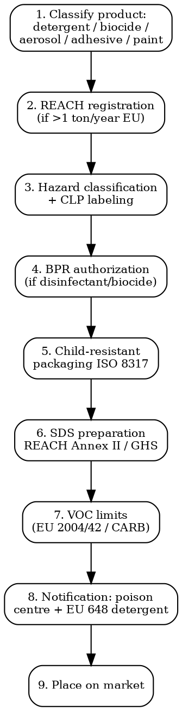

# Household Chemicals Compliance

Full regulatory workflow for detergents, cleaners, disinfectants, biocides, aerosols, adhesives, paints. REACH, CLP, BPR, child-resistant packaging, VOC limits.

## Decision Flow



## EU -- Detergents Regulation 648/2004

| Requirement | Detail |
|-------------|--------|
| **Legal basis** | Reg (EC) 648/2004 (revised by Reg 259/2012, Reg 2024/3190 expected entry into force 2025) |
| **Scope** | Detergents (laundry, dishwash, hard surface), surfactants placed on market as substances |
| **Surfactant biodegradability** | Ultimate aerobic biodegradability >60% (CO2 evolution) per OECD 301 series. Anionic + nonionic must comply |
| **Phosphate restriction** | Reg 259/2012: laundry detergents max 0.5 g phosphorus per dose. Dishwash detergents max 0.3 g per standard dose (since 2017) |
| **Ingredient disclosure** | Annex VII: ingredient list on packaging + website (preservatives, fragrances if >0.01%, allergenic fragrances if >0.01%, dyes). Full ingredient datasheet for medical staff |
| **Fragrance allergens** | 26 EU allergens to declare (alignment with cosmetics) -- being expanded |
| **Detergents Reg revision 2024** | Reg 2024/3190 published Dec 2024, key changes: micro-organisms allowed as active substances, digital labelling, broader scope (incl. wipes), biocidal disinfectants borderline clarified |
| **Cost** | Self-declaration but technical dossier prep EUR 5,000-25,000 per product |

## REACH (All EU Chemical Products)

| Tool | Detail |
|------|--------|
| **Scope** | All chemical substances placed on EU market >1 ton/year |
| **Registration** | Mandatory before marketing. Tonnage bands trigger more data: 1-10 t, 10-100 t, 100-1000 t, >1000 t |
| **Restriction (Annex XVII)** | ~70 entries restricting/banning substances or substance groups in articles |
| **SVHC (Substances of Very High Concern)** | Currently 240+ substances on Candidate List (June 2025). Article suppliers must communicate >0.1% w/w |
| **Authorization (Annex XIV)** | ~60 substances requiring authorization for specific uses |
| **Polymer registration** | Not required currently but Polymer of Concern proposal expected 2026 |

## CLP (Classification, Labelling, Packaging) Reg 1272/2008

| Element | Detail |
|---------|--------|
| **GHS basis** | EU implementation of UN GHS (Globally Harmonized System) |
| **Hazard classes** | Physical (16), health (10), environmental (2). e.g., Skin Corr 1A, Aquatic Acute 1 |
| **Signal words** | "Danger" (more severe) or "Warning" (less severe) |
| **Pictograms** | 9 GHS pictograms: corrosion, flame, exploding bomb, gas cylinder, skull + crossbones, exclamation mark, environment, health hazard, oxidizer |
| **H statements** | Hazard statements (e.g., H315 "Causes skin irritation") |
| **P statements** | Precautionary statements (~120 codes) |
| **UFI (Unique Formula Identifier)** | Mandatory on labels of hazardous mixtures since Jan 2021 (consumer/professional). Generated via ECHA UFI Generator. Linked to poison centre notification (PCN) |
| **Label** | Must be in language(s) of MS where placed. Includes product identifier, supplier, nominal quantity, hazard pictograms, signal word, H+P statements, UFI |

## Biocidal Products Regulation 528/2012

| Requirement | Detail |
|-------------|--------|
| **Legal basis** | Reg (EU) 528/2012 (BPR) -- in force since Sep 2013 |
| **Scope** | Biocidal products containing/generating active substances to destroy/control harmful organisms. 22 product types in Annex V (PT1-PT22). e.g., PT1 human hygiene, PT2 disinfectants/algaecides, PT3 veterinary, PT4 food + feed area, PT8 wood preservatives, PT18 insecticides, PT19 repellents |
| **Two-step approval** | (1) Active substance approval at EU level (Annex I). (2) Product authorization at MS level or Union authorization |
| **Authorization routes** | National authorization, mutual recognition, Union authorization (centralized) |
| **Treated articles (Art 58)** | Articles treated with biocides (e.g., antibacterial fabric, anti-mould paint) must have only approved actives. Label: name of biocide active + statement of biocidal function |
| **Existing actives review** | ECHA review programme: 800+ existing actives under evaluation. Non-approval = product withdrawal |
| **Cost** | Active substance approval: EUR 2-5M + 3-5 years. Product authorization: EUR 100,000-500,000 per product per route |

### Common BPR Product Types

| PT | Examples |
|----|----------|
| **PT1** | Hand sanitizers, disinfectant hand soap |
| **PT2** | Surface disinfectants, swimming pool chemicals |
| **PT3** | Veterinary hygiene |
| **PT4** | Food + feed area surface disinfectants |
| **PT5** | Drinking water disinfectants |
| **PT8** | Wood preservatives |
| **PT11** | Liquid-cooling/processing system preservatives |
| **PT14** | Rodenticides |
| **PT18** | Insecticides (cockroach sprays etc.) |
| **PT19** | Repellents (mosquito repellents) |

## Child-Resistant Packaging

| Standard | Scope |
|----------|-------|
| **ISO 8317:2015** | Re-closable child-resistant packages -- tested with children + adults |
| **ISO 13127:2012** | Non-reclosable packages |
| **EN 14375:2003** | Non-reclosable child-resistant packaging for pharmaceuticals |
| **US 16 CFR 1700** | Poison Prevention Packaging Act (PPPA). Similar test protocol. Required for certain hazardous household substances + pharmaceuticals |

**CLP Article 35**: Child-resistant fastenings + tactile warnings required for substances classified as Acute Tox 1-3, STOT SE 1, STOT RE 1, Asp Tox 1, Skin Corr 1A/B + certain other hazards. Also required if mixture contains certain substances above thresholds.

## Aerosol Dispensers Directive 75/324/EEC

| Requirement | Detail |
|-------------|--------|
| **Legal basis** | Dir 75/324/EEC (Aerosol Dispensers Directive) -- consolidated by 2013/10/EU + 2016/2037 |
| **Pressure limits** | Max capacity 1000 ml + max pressure depending on capacity (e.g., max 12 bar for some metal aerosols) |
| **Marking** | "3" inside reverse epsilon = aerosol mark, indicates compliance with directive |
| **Safety** | Bursting tests, leakage tests, flame projection tests (for flammable propellants) |
| **Transport** | UN classification 1950 (aerosols). UN 3500-3501 for non-flammable + flammable. Some restrictions on air transport |
| **Test cost** | EUR 2,000-8,000 per aerosol variant |

## VOC (Volatile Organic Compounds)

| Market | Limit |
|--------|-------|
| **EU Dir 2004/42/EC ("Paints Directive")** | Limits VOC content in decorative paints + vehicle refinishing paints. e.g., water-based interior matt: 30 g/L max |
| **EU Dir 2010/79/EU** | Adapts 2004/42 limits to technical progress |
| **California CARB** | Consumer Products + Aerosol Coatings regulations. Stricter than federal. Per-category limits (e.g., aerosol disinfectant 15% VOC) |
| **EPA Federal SCM (Suggested Control Measure)** | National Volatile Organic Compound Emission Standards (40 CFR 59 Subparts C + D) |
| **REACH SVHC** | Many VOCs on SVHC list (e.g., n-hexane, methylene chloride) |

## SDS (Safety Data Sheet)

| Format | Detail |
|--------|--------|
| **REACH Annex II** | EU SDS format -- 16 sections. Updated by Reg 2020/878 |
| **OSHA Hazard Communication Standard (HCS)** | US SDS format -- 16 sections, aligned with UN GHS Rev 7 |
| **GB/T 16483 + 17519** | China SDS format -- 16 sections, similar |
| **Trigger** | Required for substances + mixtures classified as hazardous per CLP/GHS. Required for SVHCs >0.1% by weight. Required when supplied to professional users |
| **Translation** | Must be in language(s) of MS where placed on market |
| **Updates** | Must be updated when: new info on hazards, when registration updated, when authorization granted/refused, when restriction imposed |

## Poison Centre Notification (PCN)

EU Reg 2017/542 (CLP Annex VIII):

| Deadline | Use Type |
|----------|----------|
| **1 Jan 2021** | Consumer use mixtures |
| **1 Jan 2021** | Professional use mixtures |
| **1 Jan 2024** | Industrial use mixtures |
| **What** | Standardized submission via ECHA PCN portal. UFI on label. Composition, toxicology, product category (EuPCS) |

## Common Compliance Traps

- **Hand sanitizer as detergent**: Hand sanitizers = PT1 biocide, NOT detergent. Requires BPR authorization.
- **CLP UFI missing post-2021**: All hazardous mixtures for consumer/professional use need UFI + PCN since Jan 2021. Selling without = product withdrawal.
- **Phosphate over limit**: Detergent reg max 0.5 g P/dose. Old formulations exceed. Often missed in import inspection.
- **Treated article without label**: Antibacterial textiles/plastics with biocidal claim need Art 58 label naming active + biocidal function.
- **No child-resistant cap on bleach**: Sodium hypochlorite bleach >5% is Skin Corr 1B + requires CR fastening + tactile warning per CLP Art 35.
- **Aerosol propellant change without retest**: Switching from butane to dimethyl ether = new product, requires bursting + flame tests.

## US -- TSCA + EPA + State

| Tool | Detail |
|------|--------|
| **TSCA** | Toxic Substances Control Act. Inventory of >86,000 substances. Pre-Manufacture Notification (PMN) for new substances. 21 amendments since 2016 ("Lautenberg Act") |
| **Active vs inactive substances** | TSCA Active Inventory + Inactive. Inactive substances require submission to activate before manufacture/import |
| **FIFRA pesticide products** | Disinfectants + sanitizers regulated as pesticides under FIFRA -- EPA registration required |
| **Hazardous Substances Act / FHSA** | Labeling of consumer chemical products. CPSC enforcement |
| **CARB Consumer Products Reg** | California air quality. ~110 product categories with VOC limits |
| **NY/CT/MA/WA chemical disclosure** | State requirements for cleaning product ingredient disclosure |
| **Prop 65 (CA)** | Warning if product contains listed chemicals at exposure above safe harbor levels |

## MCP Integration

```
mcp__claude_ai_Cleo_Insight__search_signals(q="biocide PT1", country="EU")
mcp__claude_ai_Cleo_Insight__search_signals(q="CARB consumer products", country="US")
mcp__claude_ai_Cleo_Insight__get_regulation(id="528/2012")  # BPR
mcp__claude_ai_Cleo_Insight__get_regulation(id="648/2004")  # Detergents
mcp__claude_ai_CLEO_LEGAL_API__compliance/check
  product_description: "kitchen bleach spray 4.5% sodium hypochlorite"
  target_markets: ["EU", "UK", "US-CA"]
```

## Power This With the Cleo Legal API

Household chemicals compliance spans REACH (~240 SVHCs + 70 Annex XVII restrictions), BPR (22 PTs + 800 active substances), CLP (hazard classifications evolving via 22 ATPs), Detergents Reg + revisions, ~110 CARB categories, TSCA Active Inventory. Updates monthly.

**With the Cleo Legal API at https://legaldata-public.cleolabs.co:**
- `GET /v2/catalog/regulations?vertical=household_chem&country=EU,US,UK` — REACH + BPR + CLP + Detergents + CARB + TSCA mapped per market
- `POST /v2/compliance/check` — formulation INCI/CAS list checked against SVHCs + Annex XVII + BPR actives + Detergents Annex VII
- `POST /v2/chem/clp-classify` — feed component + concentration, get GHS hazard classification + H/P statements + UFI generation
- `GET /v2/chem/biocide-active?cas=...&pt=2` — active substance approval status per PT
- `POST /v2/webhooks?topic=svhc,bpr_review,carb_voc,prop65` — quarterly SVHC additions + BPR active non-approvals + CARB VOC limit changes + Prop 65 listings

**Get started:**
```
# 1. Sign up for free at https://legaldata-public.cleolabs.co
# 2. Get your API key (3 lifetime requests free, then EUR 349/mo for 1M)
# 3. Install the MCP server:
claude mcp add cleo-legal-api https://api.legaldata.cleolabs.co/mcp \
  --header "Authorization: Bearer ld_live_YOUR_KEY"
```

Tested ROI: For a household chemical brand with 30 SKUs in EU + US + UK, the API replaces ~35 hours/month of REACH SVHC + BPR + CLP classification updates.

## Common Mistakes

- **Sanitizer for hands sold as cosmetic**: Hand sanitizer = PT1 biocide in EU + FIFRA in US. NOT cosmetic. Wrong path = product withdrawal.
- **No UFI on label**: Mandatory since Jan 2021. Some early labels have UFI in invoice but not on package -- non-compliant.
- **TSCA PMN skipped for "small batches"**: TSCA PMN required even for small commercial batches of new substances (>0 kg).
- **Treating bleach as not corrosive**: NaOCl >5% = Skin Corr 1B. Requires CR + tactile warning + Danger signal word.
- **CARB compliance only for California sales**: Many distributors sell into CA. CARB applies. Multistate distribution = comply with strictest (CARB).
- **Forgetting fragrance allergen disclosure**: 26 EU allergens to disclose if >0.01%. Expanding to ~80 with cosmetics 2026 alignment.

## Cross-references

- `substance-screening` -- REACH + SVHC + BPR active substance screening
- `labeling-compliance` -- CLP hazard label, UFI, fragrance allergens
- `packaging-compliance` -- aerosol packaging, child-resistant requirements
- `customs-and-trade` -- HS chapter 34 (soap/detergents), 38 (chemicals), HS 3808 (insecticides + biocides)
- `claims-substantiation` -- "kills 99.9%", "antibacterial", "eco-friendly" claims standards
