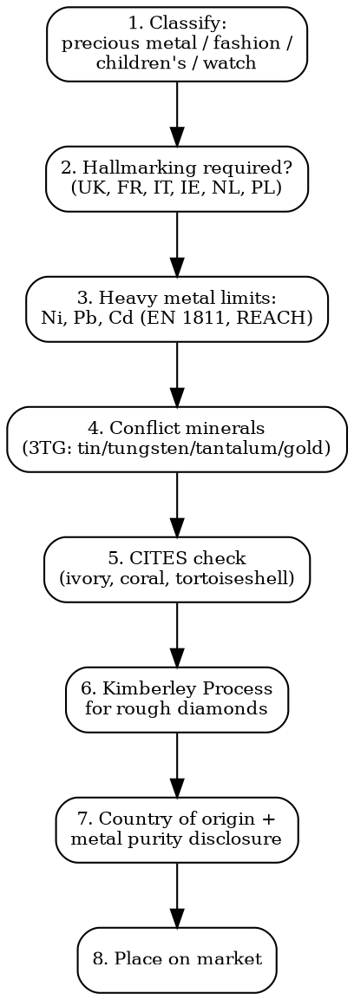

# Jewelry Compliance

Full regulatory workflow for fine jewelry, fashion jewelry, watches, gemstones. Hallmarking, heavy metal restrictions, conflict minerals, CITES.

## Decision Flow



## Hallmarking by Country (Precious Metals)

| Country | Mandatory? | Office | Marks |
|---------|-----------|--------|-------|
| **UK** | YES (>1g gold, >7.78g silver, >0.5g platinum, >1g palladium) | London, Birmingham, Sheffield, Edinburgh Assay Offices | Sponsor's mark + Standard mark + Assay office + Date letter |
| **France** | YES (>3g gold, >30g silver) | Bureau de garantie / Maison de la Bijouterie | Poincon de garantie (head of eagle/Minerva/horse for gold/silver/platinum) + Maker's mark |
| **Italy** | YES (>1g) | Camera di Commercio | Fineness mark (e.g., 750) + Stella d'Italia + Province code + Maker number |
| **Ireland** | YES | Dublin Assay Office | Same UK system (CCC -- Convention on Hallmarks) |
| **Netherlands** | YES (>1g) | Waarborg Holland | Lion (silver), helmet (gold), Minerva |
| **Poland** | YES | Główny Urząd Miar | Knight's head + fineness |
| **Germany** | Voluntary | -- | If marked, must be accurate (fineness only) |
| **Spain** | Voluntary | -- | If marked, must comply with RD 197/1988 |
| **US** | NO national hallmark | -- | FTC Jewelry Guides 16 CFR 23: stamped quality marks must be accurate (e.g., "14K" = 58.5% gold min). Trademark required if quality stamp used |
| **Switzerland** | YES | Bureau central du controle des metaux precieux | Helvetia, St. Bernard dog, mark of authentication |
| **CCC Convention** | Multi-country | -- | Common Control Mark (CCM) accepted in 21 member states |

### Convention on Hallmarks (CCC) Member States

UK, Austria, Czech Republic, Denmark, Finland, Hungary, Ireland, Latvia, Lithuania, Netherlands, Norway, Poland, Portugal, Slovakia, Slovenia, Sweden, Switzerland, Cyprus, Israel, Italy, Croatia. Common Control Mark = single hallmark accepted in all 21.

## Heavy Metal Restrictions

### Nickel (EU + UK)

| Standard | Limit | Test |
|----------|-------|------|
| **REACH Annex XVII Entry 27** | Items in prolonged contact with skin: nickel release <0.5 µg/cm2/week. Piercing posts: <0.2 µg/cm2/week | **EN 1811** (release) + **EN 12472** (simulated wear & corrosion before release test) |

**Test cost**: EUR 150-400 per item per test. Mandatory for earrings, watch backs, bracelets, rings.

### Lead (US + EU)

| Market | Limit | Legal Basis |
|--------|-------|-------------|
| **US children's jewelry (<12 yr)** | Pb <100 ppm in accessible substrate. Pb <90 ppm in surface coating | CPSIA 2008 + 16 CFR 1303 |
| **US adult jewelry (California Prop 65)** | Settled limit: 600 ppm Pb total. Class 1 (children): 1.5 µg/day exposure | Settlement agreements (People v. Brighton, etc.) |
| **EU REACH Entry 63** | Pb <0.05% (500 ppm) in jewelry articles + parts. Earring posts <0.5 ppm | REACH Reg 1907/2006 |

### Cadmium (US + EU)

| Market | Limit | Legal Basis |
|--------|-------|-------------|
| **US children's jewelry** | Cd <75 ppm (Connecticut, Maryland, Illinois). No federal limit | State laws |
| **California Prop 65** | Settlement: Cd <300 ppm in adult jewelry | Settlement agreements |
| **EU REACH Entry 23** | Cd <0.01% (100 ppm) in metal jewelry. Plastic jewelry: 100 ppm | REACH Reg 1907/2006 |

### Other Restricted Substances

- **Phthalates** in PVC components: 8 banned per REACH (DEHP, DBP, BBP, DIBP + 4 added). Children's articles: <0.1%
- **Azo dyes**: REACH Entry 43 -- 22 banned aromatic amines in textile/leather jewelry components
- **Polonium 210, radium**: prohibited

## Conflict Minerals (3TG: Tin, Tungsten, Tantalum, Gold)

### US -- Dodd-Frank Section 1502

| Requirement | Detail |
|-------------|--------|
| **Scope** | SEC-registered issuers using 3TG in manufactured products |
| **Filing** | Form SD + Conflict Minerals Report annually (May 31) |
| **Due diligence** | OECD Due Diligence Guidance 5-step framework |
| **Status** | Court rulings 2014/2015 weakened reporting language ("DRC conflict-free" no longer required to be stated). 2017 SEC guidance reduced enforcement |
| **Cost** | $50,000-300,000/year for compliance program |

### EU -- Conflict Minerals Regulation 2017/821 (in force Jan 2021)

| Requirement | Detail |
|-------------|--------|
| **Scope** | EU importers of 3TG (tin, tungsten, tantalum, gold) above volume thresholds (gold: 100 kg/year; tin: 50,000 kg; tungsten: 250,000 kg; tantalum: 100,000 kg). Downstream importers NOT covered |
| **Due diligence** | Mandatory: OECD Due Diligence Guidance |
| **Audit** | Independent third-party audit of due diligence |
| **Reporting** | Annual public report on due diligence policies + results |
| **Penalty** | Set by member states. Range EUR 5,000 to EUR 1,000,000+ |

### Jewelry Industry Standards

- **Responsible Jewellery Council (RJC) Code of Practices**: Voluntary but expected by major retailers
- **OECD Due Diligence Guidance for Responsible Supply Chains of Minerals from Conflict-Affected and High-Risk Areas** -- gold-standard framework
- **LBMA Responsible Gold Guidance**: For refined gold from LBMA Good Delivery refiners

## CITES (Convention on International Trade in Endangered Species)

| Material | CITES Status | Trade Rules |
|----------|-------------|-------------|
| **Elephant ivory** | Appendix I (most), II (some southern Africa) | Pre-Convention (pre-1976) trade with CITES certificate. Post-Convention: trade BANNED. US: 2016 federal near-total ban. UK: 2018 Ivory Act in force. EU: 2017 prohibition on raw ivory + 2022 worked ivory limits |
| **Sea turtle (tortoiseshell)** | Appendix I | Trade BANNED. Antique exemption: pre-1947 with CITES certificate |
| **Red & black coral (Corallium)** | Appendix III (China only) + Mediterranean restrictions | EU CITES permit required for some species. Pink coral: still legal but Italy/France restrictions on harvesting |
| **Crocodile/alligator** | Most Appendix II | CITES permit + sustainable sourcing certificate |
| **Mother of pearl (most species)** | Not CITES | Generally OK, but Queen Conch (Strombus gigas) Appendix II |
| **Pearls (cultured)** | Not CITES | OK |
| **Snake/lizard skin** | Most Appendix II | CITES permit required |

**CITES permit costs**: EUR 30-200 per export/import permit. Major bottleneck = obtaining the export permit from the source country.

## Kimberley Process (Rough Diamonds)

| Requirement | Detail |
|-------------|--------|
| **Legal basis** | Kimberley Process Certification Scheme (KPCS) 2003 |
| **Scope** | Rough diamonds (HS 7102.10, 7102.21, 7102.31) -- NOT polished/cut diamonds, NOT jewelry containing diamonds |
| **Certificate** | Each shipment of rough diamonds must be accompanied by a KP Certificate from exporting government |
| **Trade restrictions** | Trade with non-participants PROHIBITED. Importers in EU/US/UK/Canada must verify KP origin |
| **Participants** | 59 countries + EU as bloc (counts as 27) -- covers 99.8% of rough diamond trade |
| **Limitations** | Does NOT cover diamonds from human rights abuses if not "conflict diamonds" (definition: financing rebel groups). Critics: scheme too narrow |

### Beyond Kimberley -- Industry Initiatives

- **Responsible Jewellery Council (RJC)** Chain of Custody Standard
- **De Beers Diamond Source** tracing program (blockchain-based Tracr)
- **Lab-grown diamonds**: FTC requires clear disclosure "laboratory-grown" or "synthetic". EU follows ISO/IEC 14624 nomenclature
- **Diamonds from Russia**: G7 ban March 2024 on Russian-origin diamonds >1ct. Sept 2024 expanded to <1ct. Traceability required

## Mandatory Label Information

### US (FTC Jewelry Guides 16 CFR 23)

| Item | Requirement |
|------|------------|
| **Gold quality stamp** | "14K", "18K" etc. Must be accurate to +/-3 parts per 1000 |
| **Silver "Sterling"** | Must be 92.5% silver minimum |
| **Platinum** | "PLAT" or "PT" = 95%+. "950 Plat" = 95%. "850 Plat" = 85% (with alloy disclosure) |
| **Country of origin** | Required per 19 USC 1304. Must be permanent (engraved or etched), not sticker |
| **Trademark** | If quality stamp used, manufacturer trademark also required adjacent |

### EU (Reg 1169/2011 not for jewelry, but national rules)

- Country of origin: Reg 952/2013 (Union Customs Code), substantial transformation rule
- Fineness mark per national hallmarking law
- CE marking does NOT apply to jewelry (not in scope of any New Approach directive)

## Common Compliance Traps

- **"14K" plated as solid gold**: FTC actions for selling gold-plated as "gold". Must say "gold-plated", "gold-filled", "rolled gold plate" with thickness disclosure
- **Forgetting nickel release test**: Earring posts and bracelets touching skin >10 min/day need EN 1811 test. Many small importers skip this.
- **CPSIA for "adult" jewelry sold to kids**: If reasonably foreseeable that <12yr children will use product, CPSIA Pb/phthalate limits apply.
- **Antique ivory misdescription**: "Antique" alone is not enough. Need CITES "pre-Convention" certificate proving acquired before treaty date for that species.
- **Lab-grown diamond labeling**: Failing to disclose "lab-grown" before sale = FTC deceptive practice. EU competition law follows similar logic.
- **Russian diamond sanctions**: Importers must obtain chain-of-custody proof from G7 March 2024 onwards. Suppliers cannot self-certify -- need third-party verification.

## MCP Integration

```
mcp__claude_ai_Cleo_Insight__search_signals(q="conflict minerals", country="EU")
mcp__claude_ai_Cleo_Insight__search_signals(q="REACH nickel jewelry")
mcp__claude_ai_Cleo_Insight__get_regulation(id="2017/821")  # EU Conflict Minerals Reg
mcp__claude_ai_CLEO_LEGAL_API__compliance/check
  product_description: "sterling silver bracelet with cubic zirconia"
  target_markets: ["EU", "UK", "US"]
```

## Power This With the Cleo Legal API

Jewelry compliance crosses 6 regulatory streams: hallmarking (15+ national offices), heavy metal limits (REACH Entries 23, 27, 63 + 50 state laws), CITES (38,000+ species), Kimberley Process (rough diamonds only), conflict minerals (Dodd-Frank + EU 2017/821), and G7 Russia diamond sanctions. Each ships its own update cadence.

**With the Cleo Legal API at https://legaldata-public.cleolabs.co:**
- `GET /v2/catalog/regulations?vertical=jewelry&country=EU,US,UK` — REACH Entries 23/27/63, CPSIA, FTC Jewelry Guides, Conflict Minerals Reg, Ivory Acts in one query
- `POST /v2/compliance/check` — material composition (alloy %, plating, gemstone species) checked against REACH limits + CITES + Kimberley + sanctions
- `GET /v2/catalog/cites?species=...` — current CITES Appendix status for any species (changes per CoP meeting)
- `POST /v2/customs/sanctions-check` — G7 Russian diamond ban verification against shipment origin
- `POST /v2/webhooks?topic=cites,reach_jewelry,sanctions` — track CITES re-listings + REACH amendments + sanctions expansion

**Get started:**
```
# 1. Sign up for free at https://legaldata-public.cleolabs.co
# 2. Get your API key (3 lifetime requests free, then EUR 349/mo for 1M)
# 3. Install the MCP server:
claude mcp add cleo-legal-api https://api.legaldata.cleolabs.co/mcp \
  --header "Authorization: Bearer ld_live_YOUR_KEY"
```

Tested ROI: For a jewelry brand with 200 SKUs in EU+US+UK, the API replaces ~25 hours/month of REACH/CITES/hallmarking research and catches G7 sanctions changes within 24 hours.

## Common Mistakes

- **No EN 1811 test on earring posts**: Even "hypoallergenic" claim requires test data. Reg enforcement is heaviest on earrings (skin contact, piercings).
- **Conflict mineral DD only at importer level**: EU Reg 2017/821 only covers EU importers ABOVE volume thresholds. Below threshold = no obligation but retailers still demand DD letters.
- **Selling rough diamonds without KP certificate**: Illegal in all participant countries. Customs seize shipments.
- **Cadmium in costume jewelry**: REACH Entry 23 limit is 100 ppm by weight. Some cheap "silver-look" alloys exceed this. XRF testing mandatory.
- **No assay office mark on UK gold >1g**: Selling unmarked precious metal jewelry in UK = criminal offence under Hallmarking Act 1973.
- **Wrong country of origin**: Re-polishing or stone-setting does NOT change origin. The country where the article was manufactured (the metal worked into jewelry form) is origin.

## Cross-references

- `customs-and-trade` -- HS codes 7113-7117 (jewelry), 7102 (diamonds), 7108 (gold)
- `substance-screening` -- REACH heavy metal limits, CAS resolution for alloys
- `import-export-docs` -- CITES permits, Kimberley certificates
- `marketplace-compliance` -- Amazon Restricted Products (jewelry materials), eBay precious metals policy
- `claims-substantiation` -- "ethical", "fair-trade", "conflict-free" claims standards
