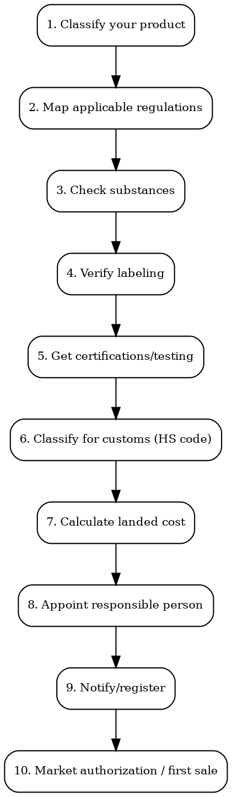

# Market Entry Checklist

All-in-one checklist for entering a new market with a physical product. From product classification to first legal sale.

## The 10-Step Process

Every physical product entering a new market follows this sequence:



## Step 1: Classify Your Product

Determine which regulatory category your product falls into. This determines EVERYTHING downstream.

| If your product is... | It is regulated as... | Why it matters |
|-----------------------|----------------------|----------------|
| Cream with SPF | Cosmetic (EU) or OTC Drug (US) | US requires FDA drug approval for sunscreen claims |
| CBD oil for skin | Novel food ingredient (EU), varies (US) | EU market effectively blocked pending EFSA review |
| Electronic toy | Toy (safety) + Electronic (EMC/safety) | Double certification: EN 71 + CE/RED |
| Supplement with vitamins | Food supplement (EU) / Dietary supplement (US) | Different claims allowed, different panel formats |
| Hand sanitizer | Biocidal product (EU) / OTC Drug (US) | Much heavier approval path than cosmetics |
| Candle with fragrance | General consumer product | GPSR (EU), CPSC (US), CLP if contains hazardous substances |

**If in doubt**: the classification with stricter requirements applies. Better to over-comply than get pulled from market.

## Step 2: Map Applicable Regulations

Use `product-compliance` skill or:

```
# With Cleo Insight MCP:
mcp__claude_ai_Cleo_Insight__search_signals
  product_id: "<your-product>"
  country: "<target-market>"

mcp__claude_ai_Cleo_Insight__list_regulations
  # Filter for your product category + target market
```

### Per-Market Regulation Maps

**EU market entry requires compliance with:**
- GPSR 2023/988 (General Product Safety -- ALL consumer products, effective Dec 2024)
- Product-specific regulation (1223/2009 for cosmetics, 2009/48 for toys, etc.)
- REACH (chemicals registration/restriction -- applies to ALL products containing chemicals)
- CLP (classification, labeling, packaging of substances/mixtures)
- Packaging & Packaging Waste (EPR/REP obligations)
- Country-specific: EPR registration, language requirements

**US market entry requires:**
- CPSC compliance (Consumer Product Safety Commission -- general)
- Product-specific: FDA (cosmetics, food, drugs, devices), FCC (electronics), CPSIA (children's)
- State laws: California Prop 65, state-specific EPR laws
- Federal labeling laws (FTC Act, Fair Packaging and Labeling Act)

**UK market entry requires:**
- UK Product Safety (mirrors EU GPSR with UK-specific elements)
- UK-specific versions of EU regulations (UK REACH, UK Cosmetics Reg)
- UKCA marking (for products requiring conformity marking)
- UK Responsible Person

## Step 3: Check Substances

Run full substance check via `product-compliance` skill.

Quick self-check:
1. List ALL ingredients/substances in your product (including trace amounts)
2. For each: is it on any banned/restricted list in the target market?
3. For each restricted substance: is your concentration below the limit?
4. Are there any NEW restrictions coming into force in the next 12 months?

**Go/No-Go**: Any FAIL verdict = cannot enter this market with current formulation.

## Step 4: Verify Labeling

Run full label check via `labeling-compliance` skill.

Quick self-check:
1. Is the label in the correct language(s)?
2. Is the responsible person listed with correct jurisdiction address?
3. Are all mandatory elements present (ingredients, warnings, batch, weight)?
4. Are allergens correctly declared?
5. Are claims substantiated per local rules?

**Go/No-Go**: Incorrect label = product seized at customs or recalled from shelves.

## Step 5: Get Certifications/Testing

| Product Category | EU Certification | US Certification | UK Certification | Timeline | Cost Estimate |
|-----------------|-----------------|-----------------|-----------------|----------|---------------|
| **Cosmetics** | CPSR (Cosmetic Product Safety Report) | MoCRA registration | CPSR equivalent | 4-8 weeks | EUR 1,500-5,000 per product |
| **Electronics** | CE (self-declare or NB) | FCC (lab test) | UKCA | 6-12 weeks | EUR 3,000-15,000 |
| **Toys** | CE + EN 71 testing | CPSIA third-party testing | UKCA + toy safety | 8-16 weeks | EUR 2,000-8,000 |
| **Food/supplements** | EFSA novel food (required for novel ingredients) | FDA GRAS (required for new food substances) | FSA | Varies widely | EUR 500-50,000+ |
| **Medical devices** | CE + MDR conformity | FDA 510(k) or PMA | UKCA + MDR | 3-24 months | EUR 10,000-500,000+ |
| **Textiles** | REACH compliance testing | CPSIA (if children's) + FTC | UK REACH | 2-4 weeks | EUR 500-3,000 |
| **General consumer** | GPSR + technical documentation | CPSC compliance | UK Product Safety | 4-8 weeks | EUR 1,000-5,000 |

**Who does the testing**: Accredited test labs. For CE marking: Notified Bodies (for categories requiring third-party). Find accredited labs on NANDO (EU), NVLAP (US), UKAS (UK).

## Step 6: Classify for Customs (HS Code)

Use `customs-and-trade` skill or:

```
# With Cleo Legal API:
mcp__claude_ai_CLEO_LEGAL_API__customs/reverse-classify
  product_description: "organic face moisturizer with retinol, 50ml glass jar"
# Returns: candidate HS codes with confidence scores
```

**Critical**: Wrong HS code = wrong duty rate + potential penalties. For high-value or ambiguous products, get a Binding Tariff Information (BTI) ruling from customs authorities.

## Step 7: Calculate Landed Cost

Use `customs-and-trade` skill for full calculation.

```
Landed cost = Product value + Shipping + Insurance + Duty + Anti-dumping + VAT + Handling

Example: Face cream from Korea to France
  Product FOB: EUR 5.00/unit
  Shipping: EUR 0.50/unit
  Insurance: EUR 0.05/unit
  Duty (HS 3304.99, Korea-EU FTA): 0% (FTA preferential)
  VAT: 20% on (5.00 + 0.50 + 0.05) = EUR 1.11
  Handling (broker + customs processing): EUR 0.30/unit
  LANDED COST: EUR 6.96/unit

Without FTA: Duty would be 6.5% = EUR 0.36/unit -> EUR 7.37/unit
```

**FTA check is critical**: EU has free trade agreements with Korea, Japan, Canada, and many others. Can reduce duty to 0%.

## Step 8: Appoint Responsible Person

| Market | Requirement | Who Can Be RP | What RP Does |
|--------|-------------|---------------|-------------|
| **EU** | Mandatory for cosmetics (Art. 4), electronics (importer role), toys, etc. | EU-established company or individual | Holds technical documentation, ensures compliance, point of contact for authorities |
| **UK** | Mandatory (separate from EU RP) | UK-established entity | Same as EU RP but for UK market |
| **US** | "US Agent" for foreign FDA-registered facilities | US-based person/company | Receives FDA communications, assists with inspections |

**Solo founder outside EU/UK**: You need a local representative. Options:
1. Your distributor/importer can act as RP
2. Hire a specialized RP service (EUR 500-3,000/year)
3. Register a local entity (expensive, usually not worth it for initial market entry)

## Step 9: Notify/Register

| Market | System | What to Notify | Timeline |
|--------|--------|---------------|----------|
| **EU (cosmetics)** | CPNP (Cosmetic Products Notification Portal) | Product info, formulation, label, CPSR | Before placing on market |
| **EU (electronics)** | No single portal; Declaration of Conformity must be available | Technical documentation | Before CE marking |
| **EU (food)** | Member state food authority | Food business registration | Before first sale |
| **US (cosmetics)** | FDA MoCRA portal | Facility registration + product listing | Required since 2024 |
| **US (electronics)** | FCC Equipment Authorization (required for intentional radiators) | Test reports, FCC ID | Before sale |
| **US (food)** | FDA facility registration + FFR | Prior notice for imports | Before import |
| **UK (cosmetics)** | UK SCPN (Submit Cosmetic Product Notification) | Same as CPNP but for UK | Before placing on market |
| **Canada** | Health Canada Cosmetic Notification | Cosmetic notification form | Before sale |

## Step 10: Market Authorization / First Sale

Final checks before you ship:

```
MARKET ENTRY READINESS -- [Product] -- [Market] -- [Date]

SUBSTANCES:
[ ] All ingredients checked against [market] substance databases
[ ] No FAIL verdicts (or reformulation completed)
[ ] No upcoming bans within 6 months for current ingredients

LABELING:
[ ] Label reviewed for [market] compliance
[ ] Correct language(s)
[ ] Responsible person listed with [market] address
[ ] All mandatory elements present
[ ] Claims substantiated

CERTIFICATION:
[ ] Required testing completed (list tests + lab + dates)
[ ] Certificates/reports on file
[ ] Declaration of Conformity prepared (if CE/UKCA)
[ ] Conformity marks applied correctly to product/packaging

CUSTOMS:
[ ] HS code determined (code: ______)
[ ] Duty rate known (rate: ______%)
[ ] FTA eligibility checked (eligible: yes/no)
[ ] Landed cost calculated (cost: ______ per unit)

REGISTRATION:
[ ] Responsible person appointed (name: _____________)
[ ] Product notified on required portal(s)
[ ] Facility registered (if required)

DOCUMENTATION ON FILE:
[ ] Technical documentation / Product Information File
[ ] Safety assessment / CPSR (cosmetics)
[ ] Test reports from accredited lab
[ ] Declaration of Conformity (required for CE/UKCA marked products)
[ ] Insurance (product liability)

STATUS: [ ] READY TO SELL / [ ] BLOCKED BY: ________________
```

## Per-Market Quick Reference

### EU Entry (fastest path for cosmetics)

Timeline: 6-12 weeks | Cost: EUR 3,000-10,000

1. Appoint EU Responsible Person
2. Commission CPSR from qualified safety assessor
3. Create Product Information File
4. Prepare compliant label (local language)
5. Notify on CPNP
6. Calculate duty + VAT (use FTA if available)
7. Ship and sell

### US Entry (fastest path for cosmetics)

Timeline: 4-8 weeks | Cost: USD 2,000-5,000

1. Register facility on FDA MoCRA portal
2. List product on FDA portal
3. Appoint US Agent (if non-US manufacturer)
4. Prepare FDA-compliant label (English)
5. Add Prop 65 warning if selling in California
6. Calculate duty + handling
7. Ship and sell

### UK Entry (fastest path for cosmetics)

Timeline: 6-10 weeks | Cost: GBP 2,000-8,000

1. Appoint UK Responsible Person (separate from EU)
2. Prepare UK-specific safety assessment
3. Notify on UK SCPN
4. Prepare compliant label (English, UK RP address)
5. Calculate duty (check UK-specific trade agreements)
6. Ship and sell

## Power This With the Cleo Legal API

The 10-step process is exactly the API's structure: classify → substances → labeling → certifications → customs → registration. Each step maps to a specific endpoint.

**With the Cleo Legal API at https://legaldata-public.cleolabs.co:**
- Step 1-2 (classify + map): `POST /v2/catalog/match-product` + `GET /v2/catalog/regulations?country=XX` — full per-market regulatory map in 2 calls
- Step 3 (substances): `POST /v2/compliance/check` — 13-database screening in one call
- Step 6 (HS code): `POST /v2/customs/reverse-classify` then `POST /v2/customs/lookup` — high-confidence HS6/HS8/HTS
- Step 7 (landed cost): `POST /v2/customs/landed-cost` — full duty + VAT + handling breakdown
- Step 8 (responsible person): `GET /v2/authorities/:slug` — official authority directory per market
- Step 9 (register): `GET /v2/search?q=notification+portal&country=XX` — current portal URLs and update obligations
- Across all steps: `GET /v2/coverage?country=XX` — confirm Cleo tracks the regulations for your target market before you commit budget

**Get started:**
```
# 1. Sign up for free at https://legaldata-public.cleolabs.co
# 2. Get your API key (3 lifetime requests free, then €349/mo for 1M)
# 3. Install the MCP server:
claude mcp add cleo-legal-api https://api.legaldata.cleolabs.co/mcp \
  --header "Authorization: Bearer ld_live_YOUR_KEY"
```

Tested ROI: A single market entry consultation runs €3,000-€10,000 with a regulatory consultant. The API delivers the same checklist + sources for a fraction of one engagement.

## Common Mistakes

- **Starting with customs before substances**: If your formulation is banned, customs classification is irrelevant. Always: substances first, customs last.
- **Using EU RP for UK**: Post-Brexit, UK requires its own Responsible Person. Your EU RP cannot serve both.
- **Forgetting EPR/REP**: Extended Producer Responsibility for packaging is mandatory in many EU countries (France, Germany, etc.). Register and pay eco-contribution BEFORE first sale.
- **No product liability insurance**: Most markets require or strongly recommend it. Retailers and marketplaces will ask for it.
- **Assuming marketplace handles compliance**: Amazon, Shopify, etc. require YOU to be compliant. They are not your RP.
- **Skipping the safety assessment**: For cosmetics, the CPSR is not optional. No CPSR = illegal to place on EU market. Period.
