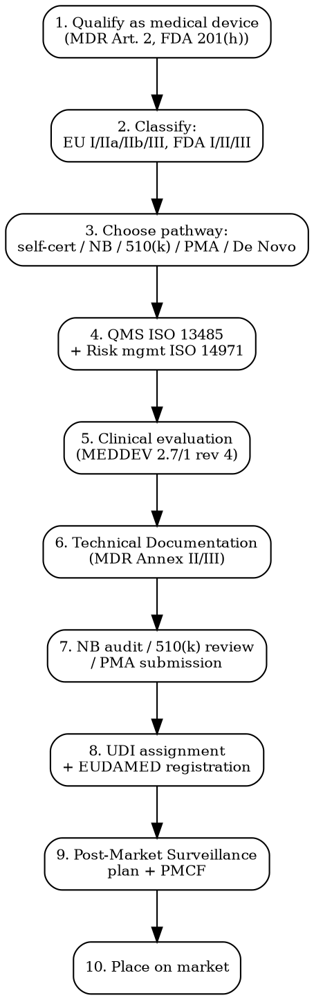

# Medical Device Compliance

Full regulatory workflow for medical devices, IVDs, and software as a medical device (SaMD). EU MDR/IVDR, FDA, UKCA, classification, clinical evaluation, post-market.

## Decision Flow



## EU -- MDR 2017/745

| Requirement | Detail |
|-------------|--------|
| **Legal basis** | Regulation (EU) 2017/745 (MDR) -- fully applicable since 26 May 2021. Transitional provisions to 26 Dec 2027 (Class III/IIb implantables) and 31 Dec 2028 (other Class IIa/IIb/Im/Is/Ir) per Reg 2023/607 |
| **Classification** | Annex VIII rules 1-22. Class I (low risk), IIa (medium), IIb (medium-high), III (high risk). Software per Rule 11 (most clinical SaMD = Class IIa minimum) |
| **Pathway** | Class I non-sterile/non-measuring: self-declaration. Class Is/Im/Ir: Notified Body for sterility/measurement/reusable aspect only. Class IIa+: full NB conformity assessment (Annex IX or X) |
| **Notified Body** | ~50 NB designated under MDR (vs 80+ under old MDD). 18-24 month wait times. List: NANDO database |
| **Technical Documentation** | MDR Annex II + III: device description, design info, GSPR checklist (Annex I), risk management ISO 14971, verification/validation, clinical evaluation, labeling, PMS plan |
| **Clinical evaluation** | MDR Article 61 + Annex XIV. MEDDEV 2.7/1 rev 4 still referenced. Equivalence routes restricted under MDR. Implants + Class III need own clinical investigations |
| **QMS** | ISO 13485:2016 required. Annex IX requires NB to audit QMS |
| **UDI** | Basic UDI-DI + UDI-DI (production identifier). Carrier: GS1, HIBCC, ICCBBA. Direct marking on reusable devices |
| **EUDAMED** | EU database. Modules: Actor registration (live), UDI/Device (live but voluntary), NB/Certificate (live), Clinical Investigation (partial), Vigilance (live), PMS (pending). Mandatory use phased |
| **Authorized Representative** | Non-EU manufacturers MUST appoint EU AR (MDR Article 11) |
| **Timeline** | Class I: 1-3 months. Class IIa: 8-14 months (incl. NB wait). Class IIb: 12-18 months. Class III: 18-36 months |
| **Cost** | Class I: EUR 5,000-30,000. Class IIa: EUR 50,000-200,000 + NB fees EUR 30,000-100,000/year. Class III: EUR 500,000-2,000,000+ |

## EU -- IVDR 2017/746 (In Vitro Diagnostics)

| Requirement | Detail |
|-------------|--------|
| **Legal basis** | Reg (EU) 2017/746 -- date of application 26 May 2022. Transition extended by Reg 2024/1860: Class D to Dec 2027, Class C to Dec 2028, Class B to Dec 2029, Class A sterile to Dec 2029 |
| **Classification** | 7 rules (Annex VIII). Class A (low, self-cert), B (medium-low, NB for QMS), C (medium-high, NB full), D (high risk, NB + EU Reference Lab) |
| **Massive shift from IVDD** | ~80% of IVDs now require NB involvement (was ~20% under IVDD). Critical NB capacity shortage |
| **CS (Common Specifications)** | Mandatory for Class D devices. Annex I performance + safety |
| **Performance evaluation** | Analytical + clinical performance + scientific validity. PER (Performance Evaluation Report) |
| **In-house exception** | IVDs manufactured and used within the same health institution exempt from CE marking but must meet GSPRs and document compliance |
| **Cost** | Class A: EUR 10,000-50,000. Class B: EUR 50,000-150,000. Class C/D: EUR 150,000-800,000 + |

## US -- FDA Pathways

| Pathway | Use | Timeline | User Fee FY2026 |
|---------|-----|----------|-----------------|
| **510(k) Premarket Notification** | Class II (most). Demonstrate substantial equivalence to predicate. Class III by 510(k) for grandfathered devices | 90-day FDA target (actual: 4-9 months) | $24,335 standard; $6,084 small business |
| **PMA (Premarket Approval)** | Class III high-risk devices (e.g., implantable defibrillators, life-sustaining) | 180-day FDA target (actual: 12-24 months) | $507,505 standard; $126,876 small business |
| **De Novo** | Novel low/moderate risk devices with no predicate. Pathway to Class I/II for new device types | 150-day FDA target (actual: 10-18 months) | $172,553 standard; $43,138 small business |
| **510(k) exempt** | ~75% of Class I devices and many Class II. Still subject to general controls + listing | Immediate | $0 (only listing fee $9,280 annual establishment) |
| **HDE (Humanitarian Device Exemption)** | Rare diseases <8,000 patients/year US. Limited evidence | 75-day FDA target | $4,867 |
| **Breakthrough Devices** | Designation accelerates review for serious conditions | -- | Same as 510(k)/PMA + priority |

### FDA Classification

| Class | Risk | Controls | Examples |
|-------|------|----------|----------|
| **Class I** | Low | General controls only | Tongue depressors, exam gloves, manual stethoscopes |
| **Class II** | Moderate | General + special controls (510(k) usually required) | Powered wheelchairs, infusion pumps, blood pressure monitors |
| **Class III** | High | PMA required | Heart valves, implantable pacemakers, deep brain stimulators |

### FDA Software (SaMD)

- Software functions that meet the definition of a "device" under section 201(h) regulated
- 21st Century Cures Act 2016 excluded certain wellness software, EHR functions
- Pre-Cert pilot program ended 2023; FDA returning to traditional 510(k) for SaMD
- AI/ML: PCCP (Predetermined Change Control Plan) framework finalized 2024 -- allows pre-authorized algorithm updates

## UK -- UKCA / UK MDR

| Requirement | Detail |
|-------------|--------|
| **Legal basis** | UK Medical Devices Regulations 2002 (as amended). New UK MDR consultation 2024-2026 to align/diverge from EU MDR |
| **CE acceptance** | CE marked devices accepted in GB until 30 June 2030 (extended by Statutory Instrument 2024) |
| **UKCA marking** | Required if new UK-specific routes used. Limited UK Approved Bodies (BSI UK, SGS UK, TUV SUD UK) |
| **UKRP** | UK Responsible Person required for non-UK manufacturers (since Jan 2021). Must be GB-established. Functions equivalent to EU AR |
| **MHRA registration** | All devices placed on UK market must be registered with MHRA. Free for Class I, EUR 100-240 for higher classes |
| **Northern Ireland** | EU MDR/IVDR apply (Northern Ireland Protocol). CE marking only |

## Post-Market Obligations

### EU MDR/IVDR PMS

| Tool | Frequency |
|------|-----------|
| **PMS Plan** | Mandatory per device (Annex III) |
| **PSUR (Periodic Safety Update Report)** | Class IIa: every 2 years. Class IIb/III: annually. Submit to EUDAMED |
| **PMCF (Post-Market Clinical Follow-up)** | Mandatory unless justified absence. Plan + report cycle |
| **Vigilance (Article 87)** | Serious incident: report within 15 days. Death/serious deterioration: within 10 days. Trend reporting: as soon as identified |
| **Field Safety Corrective Action** | FSCA + Field Safety Notice -- public communication of safety issue |

### FDA Post-Market

| Tool | Detail |
|------|--------|
| **MDR (Medical Device Reporting)** | 21 CFR 803. Manufacturer: 30-day MDR (death/serious injury) or 5-day MDR (urgent remedial action). User facility: 10-day report |
| **Recalls** | FDA-required (rare) or voluntary. 21 CFR 7 |
| **Post-market studies (522 orders)** | FDA can require post-approval studies |
| **MedWatch** | FDA voluntary reporting system |

## Key Standards

| Standard | Purpose |
|----------|---------|
| **ISO 13485:2016** | Medical device QMS. Mandatory for CE marking, expected by FDA |
| **ISO 14971:2019** | Risk management. Mandatory for CE/FDA |
| **IEC 62366-1:2015** | Usability engineering |
| **IEC 60601-1** (4th edition) | Electrical medical equipment safety |
| **IEC 62304:2006+A1:2015** | Medical device software lifecycle |
| **ISO 10993** series | Biological evaluation of medical devices |
| **ISO 11135 / 11137** | Sterilization (EO / radiation) |
| **MEDDEV 2.7/1 rev 4** | Clinical evaluation guidance |

## Common Compliance Traps

- **Wellness vs medical device threshold**: "General wellness" software exempt under 21st Century Cures Act ONLY if not for disease diagnosis/treatment. "Heart health monitor" claims = medical device.
- **Software classification trap**: MDR Rule 11 pushes nearly all software providing information used for decision-making to Class IIa minimum. Self-declaration NOT possible.
- **IVDR self-certified to NB shock**: 80% of IVDs moved to NB requirement under IVDR. Capacity is the bottleneck (only 12 NB designated under IVDR as of 2025).
- **510(k) substantial equivalence overreach**: Selecting a predicate that uses different technology/indications = FDA Refuse-to-Accept letter. RTA happens in ~30% of submissions.
- **Missing PMCF plan justification**: Under MDR, "no PMCF needed" requires positive justification per Annex XIV Part B Section 6. Cannot just say "low risk".
- **UDI direct marking**: Reusable Class IIa/IIb/III devices need UDI directly marked on the device (etching, laser). Many small manufacturers overlook this.

## MCP Integration

```
mcp__claude_ai_Cleo_Insight__search_signals(q="MDR transition", country="EU")
mcp__claude_ai_Cleo_Insight__search_signals(q="FDA 510k", country="US")
mcp__claude_ai_Cleo_Insight__get_regulation(id="2017/745")  # EU MDR
mcp__claude_ai_Cleo_Insight__get_regulation(id="2017/746")  # EU IVDR
mcp__claude_ai_CLEO_LEGAL_API__compliance/check
  product_description: "wearable ECG monitor with AI arrhythmia detection"
  target_markets: ["EU", "US", "UK"]
```

## Power This With the Cleo Legal API

Medical device compliance involves MDR (174 articles), IVDR (113 articles), FDA 21 CFR Parts 800-1299, UK MDR 2002 (constantly amended), 200+ harmonized standards, EUDAMED + GUDID databases, Notified Body certification status (changes weekly). A typical product launch touches 15+ regulatory documents.

**With the Cleo Legal API at https://legaldata-public.cleolabs.co:**
- `GET /v2/catalog/regulations?vertical=medical_device&country=EU,US,UK` — MDR, IVDR, FDA pathways, UK MDR + harmonized standards mapped
- `POST /v2/medical/classify` — feed intended use + technical features, get MDR class (Rules 1-22) + FDA class + UK class in one call
- `GET /v2/medical/notified-bodies?scope=mdr_iia` — current list of NBs designated for each MDR scope code (NB designations change quarterly)
- `POST /v2/medical/predicate-search` — for FDA 510(k), find candidate predicates from 510(k) database
- `POST /v2/webhooks?topic=mdr_transition,fda_guidance,nb_designation` — MDR/IVDR transition deadlines, FDA guidance docs, NB scope changes

**Get started:**
```
# 1. Sign up for free at https://legaldata-public.cleolabs.co
# 2. Get your API key (3 lifetime requests free, then EUR 349/mo for 1M)
# 3. Install the MCP server:
claude mcp add cleo-legal-api https://api.legaldata.cleolabs.co/mcp \
  --header "Authorization: Bearer ld_live_YOUR_KEY"
```

Tested ROI: For a SaMD company launching across EU+US+UK, the API replaces ~40 hours of MDR Annex VIII rule parsing + 510(k) predicate research + UK MDR divergence tracking per device.

## Common Mistakes

- **Confusing CE for general use**: A device that is CE marked under MDR is NOT automatically authorized in US (FDA), UK (UKCA post-2030), Switzerland, or other markets.
- **Skipping clinical evaluation update**: CE under MDR requires updating clinical evaluation EVERY year for Class III/implants, every 2 years for Class IIa/IIb. Missing this = certificate suspension.
- **AR/UKRP overlap confusion**: One legal entity can be both EU AR and UK RP only if established in both jurisdictions (Brexit complication).
- **EUDAMED voluntary trap**: Some modules voluntary now -- but UDI/registration becomes mandatory once Commission declares EUDAMED fully functional (expected late 2026).
- **Wellness device pivot**: Adding ANY diagnostic claim to wellness wearable = medical device. Marketing materials must align with cleared/CE-marked indications.
- **ISO 13485 not enough alone**: ISO 13485 is QMS only. MDR requires QMS PLUS clinical evidence PLUS technical file PLUS PMS system. Cert alone = not CE marking.

## Cross-references

- `claims-substantiation` -- general wellness vs medical claim boundary
- `electronics-compliance` -- IEC 60601 overlap with LVD/EMC for electromedical devices
- `labeling-compliance` -- MDR Annex I Chapter III labelling + UDI
- `product-safety-incident` -- MDR vigilance vs general product safety overlap
- `regulatory-calendar` -- MDR/IVDR transition deadlines, PSUR cycles, certificate renewals
