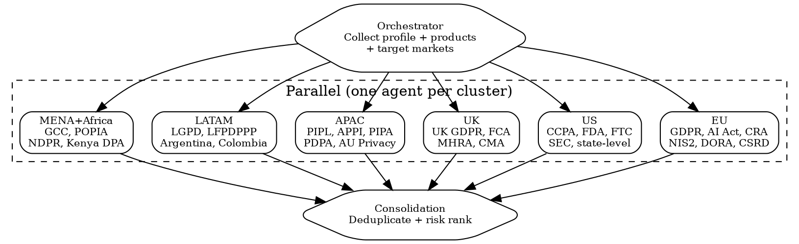

# Multi-Jurisdiction Scan

Parallel regulatory scan across 6 jurisdiction clusters via `superpowers:dispatching-parallel-agents`.

## Flow



## Prerequisites

Collect before dispatch: company description, products, target markets, data types processed.

## Cluster Agent Prompt

```markdown
Scan [CLUSTER] regulations for: Company=[description], Products=[list], Data=[types].

Per applicable regulation return:
1. Name + official reference
2. Status: in_force | adopted_not_yet_in_force | proposed
3. Key obligations (max 3 bullets)
4. Deadline or next milestone
5. Risk: RED (<6mo/penalties active) | ORANGE (12mo) | YELLOW (>12mo) | GREEN
6. Cross-border flag: affects other clusters?

Use Cleo Insight MCP (search_signals, list_regulations) if available, else WebSearch on official sources.
Return: table sorted by risk descending.
```

**Cluster watch-fors**: EU = delegated acts under AI Act | US = state fragmentation, no federal privacy | UK = adequacy status, FCA Consumer Duty | APAC = data localization mandates | LATAM = LGPD enforcement ramp-up | MENA = rapid legislative activity, variable enforcement.

## Consolidation Agent

```markdown
Merge 6 jurisdiction results into:
1. Unified regulation inventory (regulation, jurisdictions, status, deadline, risk)
2. Deduplicate cross-border regulations (e.g., GDPR adequacy spans EU+UK+APAC)
3. Risk heatmap: cluster x risk-level matrix
4. Top 10 priority deadlines
5. Cross-border dependency map
```

## Output

1. **Regulation inventory** -- full table per jurisdiction
2. **Risk heatmap** -- cluster x risk matrix
3. **Priority deadlines** -- top 10 by date
4. **Cross-border obligations** -- inter-cluster dependencies

## Red Flags

- **Skipping "proposed"**: These become law. Track with estimated timelines.
- **Ignoring sub-national**: US state laws and EU member-state implementations create real obligations.
- **Single-source research**: Cross-reference official gazette + regulator site + enforcement tracker.
- **Stale data**: Landscape shifts quarterly. Flag scan date prominently.
