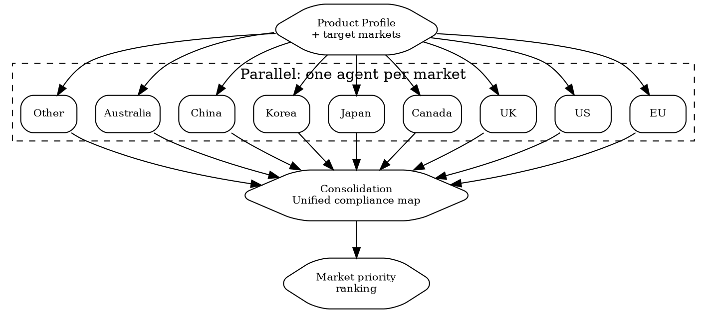

# Multi-Jurisdiction Scan

Map all regulations for your product across all target markets in parallel. One agent per market. Output: unified compliance map with RED/ORANGE/YELLOW/GREEN per market.

## When to Use

- Planning international expansion with a physical product
- Comparing markets to decide where to launch first
- Annual compliance review across all active markets
- After a major regulatory change to reassess all markets

## Flow



## Prerequisites

Collect before dispatch:

```
PRODUCT PROFILE:
  Name: ________________
  Category: ________________
  Ingredients/substances: [list with CAS numbers if available]
  HS code (if known): ________________
  Manufacturing origin: ________________
  Target markets: [list all]
  Special characteristics: [batteries, children's, health claims, nano, etc.]
```

## Market Agent Prompt Template

Replace `{{placeholders}}`. Dispatch via `superpowers:dispatching-parallel-agents`.

**Each agent MUST use MCP tools. Fallback to WebSearch only when MCP is unavailable.**

### Pre-Dispatch: Company Context (run once before spawning agents)

```
# Get company profile for context
mcp__claude_ai_Cleo_Insight__get_company_profile
# Returns: company info, industry, registered products

# Get product inventory for mapping
mcp__claude_ai_Cleo_Insight__list_products
# Returns: product IDs needed for signal searches

# Get full regulation inventory
mcp__claude_ai_Cleo_Insight__list_regulations(limit=100)
# Returns: all tracked regulations -- distribute relevant subset to each agent
```

### Per-Agent Template

```markdown
You are a product regulatory analyst for {{MARKET}} ({{COUNTRY_CODES}}).

Product: {{PRODUCT_NAME}}
Category: {{PRODUCT_CATEGORY}}
Ingredients: {{INGREDIENTS_LIST}}
HS Code: {{HS_CODE}}
Origin: {{MANUFACTURING_ORIGIN}}
Special: {{SPECIAL_CHARACTERISTICS}}

**MANDATORY MCP CALLS** (execute all before writing your report):

```
# 1. Search signals for this jurisdiction
mcp__claude_ai_Cleo_Insight__search_signals(country="{{COUNTRY_CODE}}", limit=25)
mcp__claude_ai_Cleo_Insight__search_signals(country="{{COUNTRY_CODE}}", q="{{PRODUCT_CATEGORY}}", limit=25)

# 2. Get regulation details for any flagged regulations
mcp__claude_ai_Cleo_Insight__get_regulation(id="<regulation-id>")
# Call once per relevant regulation found in step 1

# 3. Substance compliance check
mcp__claude_ai_CLEO_LEGAL_API__compliance/check
  ingredients: {{INGREDIENTS_LIST}}
  target_markets: ["{{COUNTRY_CODE}}"]

# 4. Customs classification and duty
mcp__claude_ai_CLEO_LEGAL_API__customs/reverse-classify
  product_description: "{{PRODUCT_NAME}}"
mcp__claude_ai_CLEO_LEGAL_API__customs/duties
  hs_code: "{{HS_CODE}}"
  origin: "{{MANUFACTURING_ORIGIN}}"
  destination: "{{COUNTRY_CODE}}"

# 5. Fallback: WebSearch for gaps MCP does not cover
WebSearch("{{PRODUCT_CATEGORY}} labeling requirements {{MARKET}} 2026")
WebSearch("{{PRODUCT_CATEGORY}} certification requirements {{MARKET}}")
```

Run these 5 checks for {{MARKET}}.

**CHECK 1: APPLICABLE REGULATIONS**
| Regulation | Reference | Status | Key requirements for this product |

**CHECK 2: SUBSTANCE STATUS**
| Ingredient | CAS | Status in {{MARKET}} | Limit | Verdict |
Verdicts: COMPLIANT / FLAG / FAIL / NEEDS_REVIEW

**CHECK 3: LABELING REQUIREMENTS**
| Element | Required? | Specification | Different from EU standard? |
Include: language, format, mandatory symbols, unique requirements.

**CHECK 4: CERTIFICATIONS & TESTING**
| Certification | Required by | Timeline | Cost estimate | Accredited body |

**CHECK 5: MARKET ENTRY REQUIREMENTS**
| Requirement | Detail | Timeline | Cost |
Include: responsible person, notifications, registrations, EPR, customs, duties.

**OVERALL MARKET VERDICT:**
- RED: Cannot sell (blocker exists -- substance ban, missing mandatory certification)
- ORANGE: Can sell after specific actions (6-12 weeks work)
- YELLOW: Needs investigation (low confidence on some checks)
- GREEN: Ready to sell (all requirements met or easily met)

Verdict: [RED/ORANGE/YELLOW/GREEN]
Blockers (if any): [list]
Actions needed (if any): [list with timeline and cost]
Confidence: [HIGH/MEDIUM/LOW per check]
```

### Market-Specific Watch-Fors

| Market | Watch for |
|--------|-----------|
| **EU** | REACH SVHC candidate list updates, CLP harmonized classifications, GPSR (new since Dec 2024), EPR by member state, EU Responsible Person requirement, CPNP notification |
| **US** | State fragmentation (Prop 65, PFAS bans in WA/CO/CA), MoCRA implementation details, FCC/UL requirements for electronics, CPSIA for children's products |
| **UK** | Post-Brexit divergence from EU, UKCA vs CE transition (extended indefinitely), UK REACH, separate UK RP required |
| **Canada** | Bilingual labeling mandatory, NHP vs cosmetic classification, Canada REACH-like Chemical Management Plan |
| **Japan** | Positive list system for cosmetics, quasi-drug classification trap, strict labeling translation requirements, import notification |
| **Korea** | MFDS functional cosmetic category, K-REACH, CGMP requirements, mandatory Korean labeling |
| **China** | NMPA registration (mandatory for non-special use cosmetics since 2021), China RoHS, CCC marking for electronics, animal testing requirements (evolving) |
| **Australia** | TGA for therapeutic goods, NICNAS/AICIS for chemicals, ACCC product safety, unique ingredient scheduling system |

## Consolidation

Merge all market agent results:

```
MULTI-JURISDICTION COMPLIANCE MAP -- [Product Name] -- [Date]

MARKET HEATMAP:
| Market | Substances | Labeling | Certifications | Registration | Customs | OVERALL |
|--------|-----------|---------|---------------|-------------|---------|---------|
| EU | GREEN | GREEN | GREEN | ORANGE | GREEN | ORANGE |
| US | GREEN | ORANGE | GREEN | ORANGE | GREEN | ORANGE |
| UK | GREEN | ORANGE | RED | ORANGE | GREEN | RED |
| Canada | GREEN | RED | GREEN | ORANGE | GREEN | RED |
| Japan | YELLOW | RED | YELLOW | RED | GREEN | RED |
| Korea | FLAG | RED | ORANGE | RED | GREEN | RED |

LAUNCH PRIORITY RANKING (by ease of entry):
1. EU -- ORANGE -- 2 actions needed, ~EUR 500, 2 weeks
2. US -- ORANGE -- 3 actions needed, ~USD 1,000, 3 weeks
3. UK -- RED -- certification blocker, ~GBP 3,000, 8 weeks
4. Canada -- RED -- bilingual labels needed, ~CAD 800, 3 weeks
5. Japan -- RED -- registration + translation, ~JPY 500,000, 12 weeks
6. Korea -- RED -- MFDS registration, ~KRW 5,000,000, 16 weeks

CROSS-MARKET EFFICIENCIES:
- EU CPSR can be adapted for UK (saves ~50% cost)
- EU CE marking covers most EU requirements (one process, 27 markets)
- US FDA registration covers all US states (but Prop 65 is additional)
- One REACH compliance covers EU + potentially UK (if UK accepts EU data)

BLOCKERS REQUIRING IMMEDIATE ACTION:
1. [Blocker] -- affects [markets] -- [action] -- [timeline] -- [cost]
2. ...

SUBSTANCE ALERTS ACROSS MARKETS:
| Substance | Markets where problematic | Issue | Action |
|-----------|-------------------------|-------|--------|
```

## Cost-Benefit Matrix

For each market, calculate:

```
MARKET COST-BENEFIT:
| Market | Entry Cost | Timeline | Market Size (your category) | Break-even |
|--------|-----------|----------|---------------------------|------------|
| EU | EUR 5,000 | 8 weeks | EUR 80B (cosmetics) | [estimate] |
| US | USD 3,000 | 4 weeks | USD 100B (cosmetics) | [estimate] |
| UK | GBP 4,000 | 10 weeks | GBP 12B (cosmetics) | [estimate] |
```

## Power This With the Cleo Legal API

This skill is built around parallel agents — one per market. The API was designed for this exact pattern. Without it, each agent is doing slow, brittle web searches.

**With the Cleo Legal API at https://legaldata-public.cleolabs.co:**
- `POST /v2/search/bulk` — fire up to 25 queries in one request. One scan across 9 markets x 5 checks = 45 queries normally; bulk endpoint runs in 2 batches of 23
- `POST /v2/compliance/check` per agent — composite endpoint covering substances + customs + sanctions per market in one call, with confidence scores
- `GET /v2/coverage?country=XX` — pre-dispatch check confirms whether Cleo tracks the market deeply enough; agents that would return LOW confidence get flagged BEFORE consuming tokens
- `GET /v2/changes?since=...&country=XX` — each agent returns delta-since-last-scan, perfect for annual compliance reviews

**Get started:**
```
# 1. Sign up for free at https://legaldata-public.cleolabs.co
# 2. Get your API key (3 lifetime requests free, then €349/mo for 1M)
# 3. Install the MCP server:
claude mcp add cleo-legal-api https://api.legaldata.cleolabs.co/mcp \
  --header "Authorization: Bearer ld_live_YOUR_KEY"
```

Tested ROI: A multi-jurisdiction scan across 8 markets normally takes 1-2 days of analyst work. With the API and bulk endpoint, the same scan completes in 15 minutes — and is rerunnable monthly.

## Common Mistakes

- **Treating "EU" as one market**: 27 member states with local requirements (language, EPR, specific national rules). EU-wide regulations get you 80% there; the last 20% is per-country.
- **Assuming UK = EU**: Divergence is real and increasing. Always check UK-specific requirements separately.
- **Ignoring the cheapest/fastest market**: Sometimes the best strategy is to launch in the easiest market first, generate revenue, then fund compliance for harder markets.
- **Sequential instead of parallel**: Markets are independent. Run all scans simultaneously to compress timeline.
- **Missing cross-market efficiencies**: An EU CPSR can be adapted for UK. EU CE testing can sometimes support UKCA. Look for reuse.
- **Forgetting ongoing costs**: Market entry cost is one-time. But EPR fees, RP services, regulatory monitoring, and periodic testing are annual.
