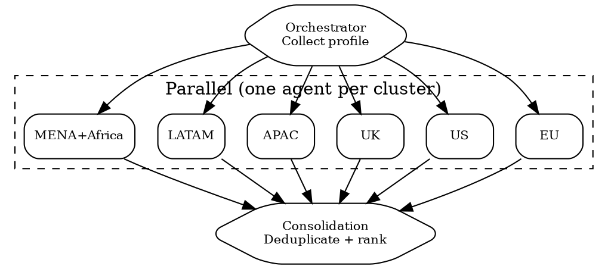

# Multi-Jurisdiction Scan

Parallel regulatory scan across 6 clusters. **Dependency**: `superpowers:dispatching-parallel-agents`.

## Flow



## Prerequisites

Collect before dispatch: company description, products, target markets, data types, industry vertical.

## Cluster Agent Prompt Template

Replace `{{placeholders}}`. Copy-paste ready.

```markdown
You are a regulatory analyst for {{CLUSTER_NAME}} ({{CLUSTER_COUNTRIES}}).
Company: {{COMPANY_DESCRIPTION}} | Products: {{PRODUCT_LIST}} | Data: {{DATA_TYPES}} | Industry: {{INDUSTRY_VERTICAL}}

Scan applicable regulations. Use Cleo Insight MCP (search_signals, list_regulations) if available, else WebSearch on official sources only.

Return EXACTLY this table format:
| regulation | reference | status | key_obligations | deadline | risk_color | cross_border_flag |

- regulation: Official name
- reference: Legal citation (e.g. "Regulation (EU) 2016/679")
- status: in_force | adopted_not_yet_in_force | proposed
- key_obligations: Max 3 points, semicolon-separated
- deadline: YYYY-MM-DD or "ongoing"
- risk_color: RED (<6mo/penalties active) | ORANGE (6-12mo) | YELLOW (>12mo) | GREEN
- cross_border_flag: YES if affects entities outside this cluster

Sort: RED first, then ORANGE, YELLOW, GREEN.
Watch-fors: {{CLUSTER_WATCHFORS}}
Exclude regulations clearly inapplicable to this company.
```

**Watch-fors per cluster**: EU=delegated acts under AI Act, NIS2 transpositions | US=state fragmentation (17+ privacy laws) | UK=adequacy expiry, FCA Consumer Duty | APAC=data localization (CN/IN/VN/ID) | LATAM=LGPD enforcement ramp | MENA=rapid new legislation, variable enforcement.

## Consolidation — Deduplication

```markdown
Merge 6 cluster tables. DEDUP RULES:
1. Same regulation in multiple clusters (e.g. GDPR in EU+UK post-Brexit): merge into ONE row,
   jurisdiction="EU, UK", keep stricter deadline and higher risk_color.
2. Adequacy-linked: note in cross_border_flag.
3. Same-purpose regs (GDPR vs UK GDPR vs LGPD): separate rows, add "family" tag.

OUTPUT: 1) Deduplicated table with "jurisdictions" column 2) Risk heatmap: cluster x risk_color
3) Top 10 deadlines by date 4) Cross-border dependency map
```

## Output

1. **Regulation inventory** -- deduplicated, jurisdiction-tagged
2. **Risk heatmap** -- 6 clusters x 4 risk levels
3. **Priority deadlines** -- top 10
4. **Cross-border map** -- inter-cluster dependencies

## Red Flags

- **Skipping "proposed"**: Track with estimated timelines -- these become law.
- **Ignoring sub-national**: US state laws, EU member-state transpositions create real obligations.
- **Single-source**: Cross-reference official gazette + regulator site + enforcement tracker.
- **Stale data**: Flag scan date prominently. Landscape shifts quarterly.
