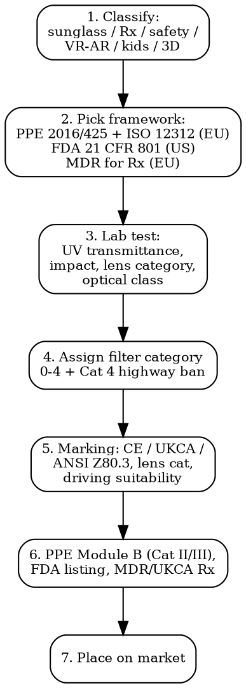

# Optical Eyewear Compliance

Full regulatory workflow for sunglasses, prescription lenses, safety eyewear, and head-mounted displays. Spans cosmetic accessory, PPE, and medical device frameworks depending on classification.

## Decision Flow



## EU -- PPE Regulation 2016/425

Non-prescription sunglasses, ski goggles, safety glasses are personal protective equipment under Reg 2016/425. Prescription eyewear sits under MDR 2017/745.

### Sunglasses -- EN ISO 12312-1:2022

| Requirement | Detail |
|-------------|--------|
| **Category I (PPE)** | Sunglasses for general use against solar radiation |
| **Lens category 0-4** | 0: clear/very light (3-20% VLT), 1: light (43-80% VLT — no driving issue), 2: medium (18-43% VLT), 3: dark (8-18% VLT — standard sunglass), 4: very dark (3-8% VLT — NOT FOR DRIVING, mark mandatory) |
| **UV transmittance** | UVA τSUV ≤5% (cat 2-4), UVB ≤1%, solar UV total ≤5% |
| **Driving suitability** | Cat 4 — must carry pictogram "not for driving" or text per Annex F |
| **Optical class 1/2/3** | Refractive power tolerance. Class 1 = no impact on visual acuity (highest grade); Class 3 = casual wear only |
| **Marking** | CE + Filter category number + manufacturer ID + EN ISO 12312-1 reference + "not for direct solar observation" for Cat 0-3 (Cat 4 carries separate "not for driving" pictogram) |
| **Module** | Cat I sunglasses = self-declaration (Module A). No NB involvement |

### Mountaineering / Glacier / Ski -- EN ISO 12312-2:2015

| Use case | Special requirement |
|----------|---------------------|
| **Glacier / high altitude** | Category 4 lens, lateral protection (side shields), τSUV ≤2% |
| **Ski / snowboard goggles** | Category 2-3, anti-fog, peripheral protection. EN 174:2001 covers downhill ski-specific |
| **Marking** | "Sunglare filter for mountaineering" + skull/snowflake pictogram |

### Safety Eyewear -- EN 166:2001 + Companions

| Standard | Coverage |
|----------|----------|
| **EN 166** | Personal eye protection — general requirements (Cat II PPE) |
| **EN 167** | Optical test methods |
| **EN 168** | Non-optical test methods (impact, robustness) |
| **EN 169** | Welding filters |
| **EN 170** | UV filters (industrial) |
| **EN 171** | Infrared filters |
| **EN 172** | Sunglare filters for industrial use |
| **EN 1731** | Mesh-type eye + face protection |

**Marking on frame**: Manufacturer ID + EN 166 + symbol of intended use (3 = liquid, 4 = coarse dust, 5 = gas/fine dust, 8 = electric arc, 9 = molten metal). Field of use letters A/B/F/S for impact energy.

**Marking on lens**: Filter type + scale number (e.g., 5-2.5 = sunglare scale 2.5) + manufacturer ID + optical class 1/2/3 + impact rating + S/F/B/A.

**Module B + C2 / D** (Cat II / III): Required for safety eyewear. NB type-examination + ongoing surveillance.

### Prescription Eyewear -- MDR 2017/745

Prescription lenses are **Class I medical devices** (most cases) under MDR 2017/745.

| Requirement | Detail |
|-------------|--------|
| **Classification** | Class I (most Rx spectacle lenses + contact lenses non-corrective without optics). Class IIa for some contact lenses |
| **Conformity assessment** | Class I sterile or with measuring function = NB. Class I non-sterile = self-declaration |
| **EUDAMED** | Registration required (manufacturer + device UDI) |
| **PRRC** | Person Responsible for Regulatory Compliance — mandatory for manufacturer |
| **Authorized Representative** | EU-based, required if manufacturer outside EU |
| **UDI** | Unique Device Identifier on labelling |

## US -- FDA + ANSI

### Sunglasses are Medical Devices

21 CFR 801.410 makes **non-prescription sunglasses Class I medical devices** (impact resistance requirement). 21 CFR 801.410(c)(1) requires every lens to pass the drop-ball impact test (5/8" steel ball, 50" drop) unless exempt.

| Requirement | Reference |
|-------------|-----------|
| **Drop-ball impact test** | 21 CFR 801.410. Must be performed on a representative sample of each batch. Manufacturer must retain records |
| **510(k) exemption** | Most non-prescription sunglasses are 510(k)-exempt Class I (21 CFR 886.5850). Still must comply with QSR and listing |
| **Establishment registration + device listing** | Annual via FURLS. USD 9,280 annual establishment fee FY2026 |
| **Polycarbonate lenses** | Generally pass drop-ball without coating |
| **Glass lenses** | Must be chemically heat-treated and individually tested |

### ANSI Z80.3-2020 -- Non-Prescription Sunglasses

Voluntary but de facto required for retail. Sets transmittance, optical, and labeling specs aligned closely with ISO 12312-1.

### ANSI Z87.1-2020 -- Safety Eyewear

Required for occupational eye protection (OSHA 29 CFR 1910.133 enforces).

| Marking | Meaning |
|---------|---------|
| **Z87** | Basic impact (drop ball pass) |
| **Z87+** | High impact (1/4" steel ball at 150 ft/s) |
| **Z87 D3** | Splash + droplets |
| **Z87 D4** | Dust |
| **Z87 D5** | Fine dust |
| **Z87 W (number)** | Welding shade |
| **Z87 U (1-6)** | UV scale |
| **Z87 L (1-9)** | Visible light filter |
| **Z87 R (1-7)** | IR scale |
| **Z87 V** | Variable tint |
| **Z87 S** | Special purpose |

### Prescription Lenses -- US

- Spectacle lenses are 510(k)-exempt Class I under 21 CFR 886.5842
- Soft contact lenses Class II — require 510(k)
- Decorative non-corrective contact lenses subject to FDA Reauthorization Act 2005 — full medical device regulation

## UK -- Post-Brexit

| Product | Path | Notes |
|---------|------|-------|
| Sunglasses | UKCA under PPE Regulations 2016 (retained 2016/425) | UK Approved Body for Cat II/III. CE still accepted under indefinite recognition |
| Safety eyewear | UKCA, BS EN 166 (technically identical to EN 166) | UK Approved Body required for Cat II/III |
| Rx eyewear | UKCA under UK MDR 2002 | Class I — self-declaration. MHRA registration required |

## Japan -- JIS + MHLW

| Standard | Coverage |
|----------|----------|
| **JIS T 7333:2018** | Sunglasses and clip-ons — UV protection, lens cat 0-4 (aligned to ISO 12312-1) |
| **JIS T 8147:2016** | Industrial protective eyewear (equivalent to EN 166 / ANSI Z87.1) |
| **JIS S 4030** | Children's sunglasses — stricter UV |
| **MHLW notification** | Rx lenses are "medical devices" Class I. Requires Japan-based MAH and PMDA notification |
| **STBA** | Sunglass Toxic-Free Buying Aid — voluntary industry mark |

## Children's Eyewear -- Stricter UV

| Market | Requirement |
|--------|-------------|
| **EU** | EN ISO 12312-1 applies. AFNOR norms NF S70-001/2 for kids 0-6 — stricter UV400, no removable parts, lens drop test from 1m |
| **France** | Décret 2008-1115 — children sunglasses must be UV400 + lens Cat ≥3 |
| **US** | No federal requirement above sunglass rule, but FTC enforces against deceptive UV claims |
| **AU/NZ** | AS/NZS 1067:2016 mandates UV400 for kids 0-12 |

## Blue-Light Filtering -- Claims Rules

| Market | What you can claim | What you cannot |
|--------|-------------------|------------------|
| **EU** | Filter blue light (e.g., "blocks 30% of HEV 380-500 nm") — physical claim ok if measured. **Cannot claim** "reduces digital eye strain", "prevents AMD", "improves sleep" without RCT evidence — falls under MDR if therapeutic |
| **US (FTC)** | Substantiated descriptive claim ok. AAO (American Academy of Ophthalmology) issued 2017 statement: no scientific evidence blue light from devices causes eye damage. Class action lawsuits filed in 2022-2023 against retailers making AMD/sleep claims |
| **UK** | ASA + MHRA enforce. CAP Code requires "reasonable basis" for technical claims |
| **AU** | ACCC + TGA. TGA classified blue-blocker glasses with therapeutic claims as Class I medical device |

## Polarization Claims

| Standard | Method |
|----------|--------|
| **ISO 8980-3** | Quantifies polarization efficiency (Q-factor). Must be ≥75% to label "polarized" in most markets |
| **EU 2016/425** | Mis-marking polarization = misleading commercial communication (UCPD 2005/29) |
| **US** | FTC enforcement on substantiation |

## 3D / VR / AR Headsets

Separate regulatory landscape combining electronics + optical + radio.

| Aspect | Framework |
|--------|-----------|
| **EU CE** | LVD 2014/35 + EMC 2014/30 + RED 2014/53 (WiFi/BT) + RoHS 2011/65. Display optics under General Product Safety Reg (GPSR) 2023/988 not PPE |
| **US** | FCC Part 15 (radio) + FDA if any therapeutic / vision-correction claim. SAR if head-worn radio |
| **Photobiological safety** | IEC 62471 — lamp/luminaire safety covers display LED emissions. Risk groups RG0/1/2/3 |
| **Display eye safety** | ICNIRP guidelines, IEEE C95.1-2019 RF exposure |
| **Children's VR** | Most manufacturers (Meta, Apple) self-impose 13+ minimum. EU GPSR + national child-safety advisories. Sony PSVR explicit 12+ minimum age |
| **Photosensitive epilepsy** | Industry-wide warning required since W3C WCAG 2.3 + ITU-R BT.1702 luminance flicker guidance |

## Photochromic / Transitional Lenses

- Variable transmittance — must be marked with **two filter categories** (light state + dark state) per ISO 12312-1 Annex H
- Cannot replace Cat 4 sunglasses for high-altitude — passive activation lag
- "Not for driving" warning required if dark-state reaches Cat 4
- Claims like "darkens in 30 seconds" must be substantiated per measured test method

## Lens Materials -- Impact Resistance

| Material | Drop-ball (21 CFR 801.410) | EN 166 impact rating | Notes |
|----------|---------------------------|----------------------|-------|
| **CR-39 (allyl diglycol)** | Pass with treatment | S basic | Heavy, scratch-prone, optical quality |
| **Polycarbonate** | Pass naturally | F (45 m/s) | Standard safety lens material |
| **Trivex** | Pass naturally | F | Lighter than polycarbonate |
| **Glass (untreated)** | Fail | -- | Banned for general sun + safety per FDA, EU |
| **Chemically tempered glass** | Pass with batch testing | S | Permitted, requires individual lens testing |
| **High-impact plastic** | Pass with high-impact rating | B (120 m/s) | Required for shooting / industrial |

## Test Lab Cost Summary

| Test | Cost | Timeline |
|------|------|----------|
| ISO 12312-1 full battery | EUR 1,200-2,500 | 2-3 weeks |
| EN 166 safety eyewear | EUR 2,000-4,000 | 3-4 weeks |
| Drop-ball 21 CFR 801.410 | USD 800-1,500 | 1 week |
| ANSI Z87.1 high-impact | USD 2,500-4,500 | 2-3 weeks |
| IEC 62471 photobiological | EUR 1,500-3,500 | 2-3 weeks |
| Polarization Q-factor ISO 8980-3 | EUR 500-1,200 | 1 week |
| Blue-light transmittance | EUR 800-1,500 | 1 week |

## MCP Integration

```
mcp__claude_ai_Cleo_Insight__search_signals(q="PPE Regulation 2016/425 eyewear")
mcp__claude_ai_Cleo_Insight__search_signals(q="ISO 12312 sunglasses")
mcp__claude_ai_Cleo_Insight__get_regulation(id) — pull current EN ISO 12312-1:2022 / ANSI Z80.3-2020 status
mcp__claude_ai_CLEO_LEGAL_API__compliance/check — lens substance check (bisphenol A in polycarbonate, monomer migration)
```

## Power This With the Cleo Legal API

Optical eyewear straddles three frameworks simultaneously: PPE Regulation 2016/425 (sunglasses + safety), MDR 2017/745 (prescription), and FDA 21 CFR 801 (US sunglasses as medical devices). One product, three sets of conformity assessments. The API consolidates them.

**With the Cleo Legal API at https://legaldata-public.cleolabs.co:**
- `GET /v2/catalog/regulations?vertical=eyewear&country=EU,US,UK,JP,AU` — pull PPE 2016/425, MDR 2017/745, 21 CFR 801, ANSI Z80.3, JIS T 7333, AS/NZS 1067 with current standard versions
- `POST /v2/catalog/match-product` — classify as sunglass-PPE / prescription-MDR / safety-PPE Cat III / VR-electronics / kids-stricter-UV — wrong route adds 3-6 months to launch
- `GET /v2/search?type=standard&q=EN+ISO+12312` — surface 2022 revision changes vs older versions (lens cat marking format changed)
- `POST /v2/webhooks?topic=ppe_eyewear,mdr_class_i` — Class I reclassification under MDR Article 52 happens silently; webhooks lock alerts
- `POST /v2/compliance/check` — blue-light claim substantiation check vs CAP/ASA/FTC enforcement history (over 50 enforcement actions 2022-2025)

**Get started:**
```
# 1. Sign up for free at https://legaldata-public.cleolabs.co
# 2. Get your API key (3 lifetime requests free, then €349/mo for 1M)
# 3. Install the MCP server:
claude mcp add cleo-legal-api https://api.legaldata.cleolabs.co/mcp \
  --header "Authorization: Bearer ld_live_YOUR_KEY"
```

Tested ROI: For a sunglass brand selling EU + US + UK, the API replaces ~6 hours per SKU of standards lookup and avoids the most common error — selling Cat 4 lenses without the "not for driving" pictogram, which triggers EU Safety Gate notifications.

## Common Mistakes

- **Selling sunglasses without drop-ball record in US**: 21 CFR 801.410 violation. FDA can detain at port and issue warning letter. Required for every batch.
- **Missing "not for driving" on Cat 4**: ISO 12312-1 Annex F mandates the pictogram or wording. EU market surveillance routinely seizes Cat 4 sunglasses without the mark.
- **Claiming blue-light glasses prevent AMD or eye strain**: FTC + ASA + ACCC enforcement is active. Class actions filed against major retailers 2022-2024. Stick to physical transmittance claims only.
- **Treating Rx lenses as accessories**: They are Class I medical devices under MDR. Requires PRRC, EU AR, EUDAMED registration, technical file.
- **Forgetting polarization Q-factor**: Labeling "polarized" with Q-factor <75% = misleading. ISO 8980-3 sets the threshold.
- **VR/AR using PPE route**: Headsets are NOT PPE. Apply LVD + EMC + RED + RoHS + GPSR + IEC 62471. Wrong framework = product seized.
- **Children's eyewear without UV400**: France Décret 2008-1115 and AU/NZ 1067 mandate UV400 for kids. Adult-grade UV380 = non-compliant.
