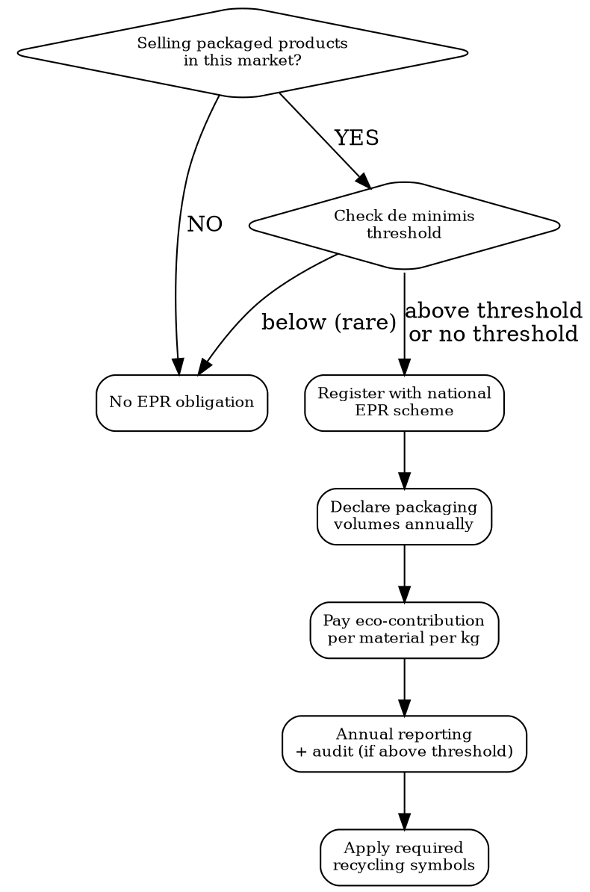

# Packaging Compliance

Packaging regulations by market. EPR registration, waste directives, recycling symbols, plastic taxes, and SUP restrictions.

## MCP Tools

```
# Search for packaging regulation signals
mcp__claude_ai_Cleo_Insight__search_signals(q="packaging waste", limit=25)
mcp__claude_ai_Cleo_Insight__search_signals(q="EPR registration", limit=25)
mcp__claude_ai_Cleo_Insight__search_signals(q="single-use plastics", limit=25)
mcp__claude_ai_Cleo_Insight__search_signals(q="PPWR", limit=25)

# Get regulation details for packaging directives
mcp__claude_ai_Cleo_Insight__get_regulation(id="<regulation-id>")
mcp__claude_ai_Cleo_Insight__list_regulations(limit=100)

# Check landed cost impact of packaging taxes
mcp__claude_ai_CLEO_LEGAL_API__customs/landed-cost
  hs_code: "<product-hs-code>"
  origin: "<origin>"
  destination: "<destination>"
  product_value: <value>
```

## EPR Registration Decision Tree



## EPR by EU Member State

| Country | Scheme | Registration Portal | Annual Fee (SME) | Eco-Contribution | Deadline |
|---------|--------|--------------------|--------------------|-------------------|----------|
| **France** | CITEO | citeo.com | EUR 80 (HT) | EUR 0.05-0.25/kg by material | Annual declaration by Feb 28 |
| **Germany** | ZSVR/Lucid | verpackungsregister.org | Free registration | EUR 0.10-1.40/kg via dual system (Der Gruene Punkt, BellandVision, etc.) | Before first sale |
| **Italy** | CONAI | conai.org | EUR 25 entry | EUR 5-660/tonne by material | Annual declaration by May 20 |
| **Spain** | Ecoembes (household) / SIGRE (pharma) | ecoembes.com | EUR 0 (built into contribution) | EUR 0.05-0.50/kg by material | Annual declaration |
| **Netherlands** | Afvalfonds Verpakkingen | afvalfonds.nl | Based on revenue tier | EUR 0.01-1.00/kg by material | Annual declaration by March 1 |
| **Belgium** | Fost Plus (household) / VAL-I-PAC (commercial) | fostplus.be | EUR 100-500 setup | EUR 0.03-0.90/kg | Annual declaration |
| **Austria** | ARA | ara.at | EUR 100 setup | EUR 0.10-0.80/kg | Before first sale |
| **Poland** | BDO registry | bdo.mos.gov.pl | Free registration | EUR 0.01-0.50/kg | Annual declaration |
| **Sweden** | FTI | ftiab.se | SEK 2,000 (EUR ~175) | SEK 0.10-3.00/kg | Before first sale |

**Remote sellers rule (EU)**: If you sell online from outside a member state directly to consumers in that state, YOU are the producer responsible for EPR. Amazon and marketplaces enforce this -- they block listings without EPR registration numbers.

## PPWD to PPWR Transition

| Aspect | Current: PPWD (94/62/EC) | New: PPWR (2024/3254) |
|--------|--------------------------|----------------------|
| Legal form | Directive (transposed nationally) | Regulation (directly applicable) |
| Recyclability | Voluntary targets | Mandatory: 100% recyclable by 2030 |
| Recycled content | No mandatory minimum | Plastic packaging: 35% by 2030, 65% by 2040 |
| Reuse targets | None | 10% of beverage packaging by 2030 |
| Excessive packaging | General principle | Empty space ratio max 50% from 2030 |
| Labeling | National symbols | Harmonized EU labeling (material ID + sorting) |
| DRS | National discretion | Mandatory for PET bottles and aluminium cans by 2029 |
| Timeline | In force | Enter into force Q3 2025, phase 2026-2040 |

## Required Symbols by Market

| Symbol | Market | What It Means | When Required |
|--------|--------|---------------|---------------|
| **Triman** | France | Product is recyclable, sort for recycling | ALL recyclable consumer packaging sold in France |
| **Info-tri** | France | Sorting instructions alongside Triman | Since Jan 2022 for ALL packaging |
| **Der Gruene Punkt** | Germany | Producer contributes to recycling system | Mandatory if registered with a dual system using this mark (otherwise optional) |
| **Tidyman** | UK, others | Dispose of responsibly | Voluntary but widely expected |
| **OPRL** | UK | On-Pack Recycling Label (Recycle / Don't Recycle / Check Locally) | Voluntary but standard practice for UK retail |
| **Mobius Loop** | International | Material is recyclable | Voluntary; misleading if material is NOT recyclable in practice |
| **Material ID codes** | EU (PPWR) | Plastic: 1-7 (PET, HDPE, PVC, LDPE, PP, PS, Other). Metal: 40-41. Paper: 20-22. Glass: 70-72. | Mandatory under PPWR from 2028 |
| **WEEE bin** | EU | Electronics recycling | ALL electrical/electronic equipment (crossed-out wheelie bin) |
| **Battery symbol** | EU | Battery recycling | ALL products containing batteries (crossed-out wheelie bin + Pb/Cd/Hg chemical symbols when lead/cadmium/mercury exceed thresholds) |

### France Triman + Info-Tri (Mandatory Since Jan 2022)

The Triman logo + sorting instructions must appear on ALL packaging sold in France:
- On-pack: Triman + text or pictogram indicating correct bin
- Size minimum: 6mm height for Triman
- CITEO provides free pictogram generator: citeo.com/info-tri
- Non-compliance fine: EUR 15,000 per product reference

## Single-Use Plastics (SUP) Directive 2019/904

| Item | Restriction | Effective |
|------|-------------|-----------|
| Cutlery, plates, straws, stirrers, sticks | **Market ban** | July 2021 |
| Expanded polystyrene food containers | **Market ban** | July 2021 |
| Oxo-degradable plastics | **Market ban** | July 2021 |
| Beverage containers (bottles) | Tethered caps mandatory | July 2024 |
| PET bottles | 25% recycled content by 2025, 30% by 2030 | Phased |
| Tobacco filters | EPR obligation | Dec 2024 |
| Wet wipes | Labeling: "contains plastic" | July 2021 |

## Plastic Tax

| Market | Rate | Scope | Effective |
|--------|------|-------|-----------|
| **UK** | GBP 217.85/tonne (2024) | Plastic packaging with < 30% recycled content, manufactured or imported into UK, > 10 tonnes/year | April 2022 |
| **Italy** | EUR 0.45/kg | Single-use plastic products (enforcement delayed to July 2026) | Delayed |
| **Spain** | EUR 0.45/kg | Non-reusable plastic packaging | Jan 2023 |
| **EU-wide** | EUR 0.80/kg of non-recycled plastic | Paid by member states (not directly by companies -- funded through national budgets) | Jan 2021 |

**UK Plastic Packaging Tax**: Applies to ALL plastic packaging with < 30% recycled content. Exemptions: < 10 tonnes/year, medical packaging, transit packaging. Registration required via HMRC.

## US Packaging Laws

| State | Law | Key Requirements | Effective |
|-------|-----|-----------------|-----------|
| **California** | SB 54 (Plastic Pollution Prevention and Packaging Producer Responsibility Act) | EPR for all packaging; 65% source reduction by 2032; 100% recyclable/compostable by 2032 | Jan 2024 (phased) |
| **Maine** | LD 1541 (EPR for Packaging) | EPR program managed by stewardship organization; eco-modulated fees | Jul 2024 (phased) |
| **Oregon** | SB 582 (Plastic Pollution and Recycling Modernization Act) | EPR + truth-in-labeling for recyclability claims | Jul 2025 |
| **Colorado** | HB 22-1355 (Producer Responsibility for Recycling Act) | EPR; needs assessment phase 2024-2025, fee collection starts 2026 | Phased |

## Packaging Composition Declaration Template

```
PACKAGING DECLARATION -- [Product Name] -- [Date]

PRIMARY PACKAGING (touches product):
  Material: [e.g., PET, HDPE, glass, aluminium]
  Weight: [g]
  Recycled content: [%]
  Material ID code: [1-7 for plastic, 20-22 paper, 40-41 metal, 70-72 glass]
  Recyclable: [YES/NO in practice]
  Contains SUP component: [YES/NO]

SECONDARY PACKAGING (box, sleeve):
  Material: [e.g., cardboard, kraft paper]
  Weight: [g]
  Recycled content: [%]
  FSC/PEFC certified: [YES/NO]

TERTIARY PACKAGING (shipping):
  Material: [e.g., corrugated cardboard, stretch wrap]
  Weight per unit: [g]

TOTAL PACKAGING WEIGHT PER UNIT: [g]
TOTAL PLASTIC PER UNIT: [g]
RECYCLED CONTENT (plastic): [%]
UK PLASTIC TAX LIABLE: [YES/NO -- < 30% recycled plastic AND > 10 tonnes/year]
```

## Power This With the Cleo Legal API

EPR is fragmented per-country, per-material, per-PRO — exactly what an API normalizes. PPWR/SUP/plastic tax rules also shift constantly.

**With the Cleo Legal API at https://legaldata-public.cleolabs.co:**
- `GET /v2/search?q=EPR+packaging&country=FR,DE,IT,ES,NL,BE,AT,PL,SE` — current scheme, PRO, eco-modulated fees, and deadlines for every EU member state
- `GET /v2/search?q=PPWR&type=regulation` — track the phased PPWR transition (recyclability 2030, recycled content 35% by 2030, reuse targets) before retailer requirements bite
- `GET /v2/search?q=plastic+tax&country=UK,IT,ES` — current rates (GBP 217.85/tonne UK, EUR 0.45/kg ES) with effective dates
- `POST /v2/webhooks?topic=epr_deadlines` — get pinged 30-90 days before each country's annual declaration deadline (LUCID May 15, CITEO Feb 28…)
- `GET /v2/authorities/:slug` — direct portal URLs for CITEO, LUCID/ZSVR, CONAI, Ecoembes, Afvalfonds, FTI

**Get started:**
```
# 1. Sign up for free at https://legaldata-public.cleolabs.co
# 2. Get your API key (3 lifetime requests free, then €349/mo for 1M)
# 3. Install the MCP server:
claude mcp add cleo-legal-api https://api.legaldata.cleolabs.co/mcp \
  --header "Authorization: Bearer ld_live_YOUR_KEY"
```

Tested ROI: Missing the German LUCID May 15 deadline costs up to €200,000 + sales ban. The API's webhook alerting eliminates that risk class entirely.

## Common Mistakes

- **Registering in your home country only**: EPR is per-market. Selling in France, Germany, and Spain = 3 separate EPR registrations with 3 separate annual declarations.
- **Forgetting Amazon enforces EPR**: Amazon DE, FR, ES, and IT block listings without valid EPR registration numbers. This is the #1 reason small sellers get delisted in EU.
- **Missing Triman + Info-tri in France**: EUR 15,000 fine per product reference. Every product sold in France needs Triman and sorting instructions on the packaging.
- **Claiming "recyclable" without evidence**: EU Green Claims Directive and US FTC Green Guides both require proof. Under PPWR, recyclability claims must follow harmonized criteria.
- **Ignoring the UK Plastic Packaging Tax**: If you import > 10 tonnes/year of plastic packaging into the UK with < 30% recycled content, you owe GBP 217.85/tonne. Register with HMRC within 30 days of exceeding threshold.
- **Counting only primary packaging**: EPR covers ALL packaging -- primary (bottle), secondary (box), tertiary (shipping carton), and service packaging (bags, tissue paper).
