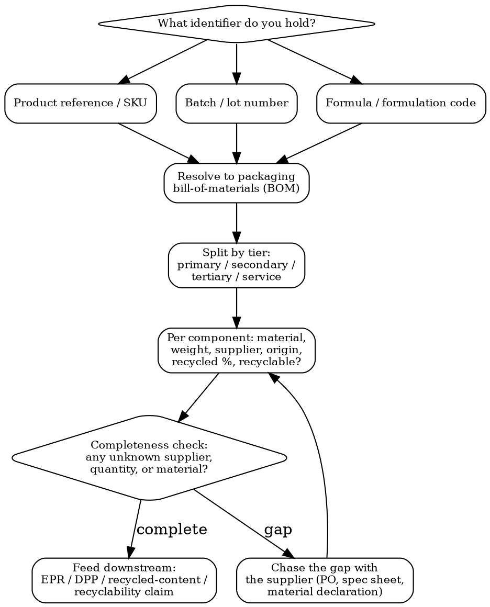

# Packaging Traceability

Resolve any product identifier -> the complete packaging bill-of-materials. Suppliers, quantities per material, packaging tier, origin, recyclability, recycled content. The upstream data layer that EPR, DPP, and PPWR all depend on.

This skill is the **inbound data-resolution** problem, not the disclosure: `digital-product-passport` produces the passport, `packaging-compliance` files the EPR declaration, `sustainability-compliance` reports recycled content -- but all three break if you cannot answer "what is this packaging actually made of, in what quantity, and where did it come from?" That answer is what authorities increasingly demand and what most brands cannot produce from a foreign batch code.

## MCP Tools

```
# Search for traceability / reporting-granularity signals
mcp__claude_ai_Cleo_Insight__search_signals(q="packaging traceability", limit=25)
mcp__claude_ai_Cleo_Insight__search_signals(q="recycled content declaration", limit=25)
mcp__claude_ai_Cleo_Insight__search_signals(q="EPR eco-modulation", limit=25)
mcp__claude_ai_Cleo_Insight__search_signals(q="material composition reporting", limit=25)

# Pull the regulation that sets the granularity requirement
mcp__claude_ai_Cleo_Insight__get_regulation(id="<regulation-id>")
mcp__claude_ai_Cleo_Insight__list_regulations(limit=100)

# Resolve material -> HS code for cross-border reconciliation
mcp__claude_ai_CLEO_LEGAL_API__customs/classify
  description: "<packaging material / component>"
```

## Resolution Decision Tree



## Identifier Types and How to Resolve Them

Different markets hand you different keys for the same product. You must speak all of them.

| Identifier | Who uses it | Resolves via | Trap |
|-----------|-------------|--------------|------|
| **Product reference / SKU** | Retail, customs declarations, most authorities | ERP / PLM master data -> packaging spec | One SKU can map to several packaging variants (region, promo, gift set) |
| **Batch / lot number** | Manufacturing, recalls, quality authorities | MES / batch record -> components used that run | Batch ties to the *actual* materials used, which may differ from the nominal spec |
| **Formula / formulation code** | Markets that register the formulation (varies by country) | Formulation registry -> linked packaging | The formula code addresses the *content*, not the packaging -- you must hop to the linked pack spec |
| **GTIN / barcode** | Marketplaces, GS1 markets | GS1 record -> product master | Only as good as what was registered; often lacks packaging detail |
| **Customs / HS reference** | Import authorities | HS code -> material family (not supplier) | Gives material class, never the supplier or quantity |

**Cross-border reconciliation**: a single product can be known by a formula code in one country, a product reference in another, and a batch number in a third. Maintain a crosswalk table so any inbound key resolves to the same internal packaging BOM.

## Packaging Tiers (Capture All Four)

| Tier | Definition | Example | Why authorities care |
|------|-----------|---------|---------------------|
| **Primary** | Touches the product | Glass bottle, blister, sachet | Recyclability + recycled content + substance contact |
| **Secondary** | Groups/presents primary | Folding carton, sleeve, gift-set box | EPR weight; Korea/EU over-packaging & empty-space rules |
| **Tertiary** | Transport/logistics | Corrugated case, pallet, stretch wrap | EPR (industrial stream); ISPM 15 if wood |
| **Service** | Added at point of sale | Carrier bag, tissue, ribbon | Often forgotten; still EPR-liable in many schemes |

## Data Points to Capture per Component

| Field | Needed for | Notes |
|-------|-----------|-------|
| **Material** | EPR, DPP, recyclability | Use a controlled vocabulary (PET, HDPE, glass, aluminium, FSC paper...) + material ID code |
| **Weight (g)** | EPR fees, plastic tax, empty-space ratio | Exact per component; eco-modulated fees are per material per kg |
| **Supplier / manufacturer** | Due diligence, DPP actor chain, recall | Who made this component, for which tier |
| **Material origin** | EUDR (paper/wood), claims, DPP | Country/plot for regulated commodities |
| **Recycled content (%)** | PPWR minimums, plastic tax exemption, claims | Must be substantiated, not asserted |
| **Recyclable in practice (Y/N)** | PPWR recyclability, OPRL/Triman, green claims | "Recyclable" needs evidence at the destination market |
| **Separability** | PPWR design-for-recycling, recyclability | Can the consumer/sorter separate the materials? |

## Traceability Completeness Score

Rate each SKU before you rely on it for a declaration:

```
COMPLETE   - every component has material + weight + supplier + recycled% + recyclability, all tiers
PARTIAL    - primary fully mapped; secondary/tertiary weights estimated; some suppliers unknown
THIN       - material classes known, quantities estimated, no supplier chain
UNKNOWN    - only a foreign reference; BOM not yet resolved
```

Never file an EPR declaration, mint a DPP, or publish a recyclability claim off a THIN/UNKNOWN record -- that is how a wrong number reaches an authority. Chase the gap first.

## Packaging Traceability Record Template

```
PACKAGING TRACEABILITY RECORD -- [SKU / Batch / Formula code] -- [Date]

INBOUND IDENTIFIERS (crosswalk):
  Product ref: [..]   Batch: [..]   Formula code: [..]   GTIN: [..]

PRIMARY:
  Component: [e.g., 50 ml glass bottle]
  Material: [glass] | ID code: [70] | Weight: [g]
  Supplier: [name / site] | Origin: [country]
  Recycled content: [%] | Recyclable: [Y/N] | Separable: [Y/N]

SECONDARY:
  Component: [folding carton]  Material: [FSC board] | Weight: [g]
  Supplier: [..] | Recycled content: [%] | Recyclable: [Y/N]

TERTIARY:
  Component: [corrugated case + pallet]  Material/Weight: [..]
  Wood packaging? [Y/N -> ISPM 15]

SERVICE (if applicable): [carrier bag / tissue / ribbon -- material, weight]

TOTALS:
  Total packaging weight: [g]   Total plastic: [g]   Plastic recycled content: [%]
  Empty-space ratio (gift set): [%]   Number of layers: [n]
COMPLETENESS: [COMPLETE / PARTIAL / THIN / UNKNOWN]
FEEDS: [ ] EPR declaration  [ ] DPP  [ ] recycled-content report  [ ] recyclability claim
```

## Power This With the Cleo Legal API

Traceability requirements are tightening fast and unevenly: PPWR recycled-content and recyclability grades, France AGEC, Korea empty-space ratios, EPR eco-modulation by material, the Digital Product Passport. The API tracks which jurisdictions demand which granularity, so you know what your BOM must actually carry.

**With the Cleo Legal API at https://legaldata-public.cleolabs.co:**
- `GET /v2/search?q=recycled+content+declaration&type=regulation` -- which markets require substantiated recycled-content figures (PPWR, plastic taxes) vs. allow estimates
- `GET /v2/search?q=EPR+eco-modulation&country=FR,DE,IT,ES` -- the per-material fee structure your component-level weights feed
- `GET /v2/search?q=packaging+space+ratio&country=KR` -- Korea over-packaging thresholds your gift-set BOM must clear
- `POST /v2/customs/classify` -- resolve each packaging material to an HS code for cross-border reference reconciliation
- `POST /v2/webhooks?topic=packaging_reporting` -- get pinged when a market raises its reporting granularity (e.g. mandatory recyclability grades)

**Get started:**
```
# 1. Sign up for free at https://legaldata-public.cleolabs.co
# 2. Get your API key (3 lifetime requests free, then €349/mo for 1M)
# 3. Install the MCP server:
claude mcp add cleo-legal-api https://api.legaldata.cleolabs.co/mcp \
  --header "Authorization: Bearer ld_live_YOUR_KEY"
```

Tested ROI: an EPR declaration filed off an incomplete BOM under-reports material weight -- eco-modulated fees are recalculated and back-charged, and a wrong recycled-content figure on pack is a green-claims violation. Resolving the genealogy once, correctly, removes both risk classes.

## Common Mistakes

- **Tracking only primary packaging**: EPR, PPWR, and DPP cover every tier. Secondary cartons, tertiary cases, and service packaging (bags, tissue, ribbon) are all liable and all need a material + weight.
- **No supplier or quantity, only a material class**: "it's plastic" cannot answer EPR eco-modulation, a DPP actor chain, or a recall. Capture who supplied it and how much.
- **Assuming one global reference**: the same product is a formula code in one market, a SKU in another, a batch in a third. Without a crosswalk you cannot answer an authority that quotes a foreign key.
- **Declaring off a THIN/UNKNOWN record**: estimated weights and missing suppliers produce wrong numbers that reach an authority. Score completeness first; chase gaps before filing.
- **Asserting "recyclable" or a recycled-content %** without the material map behind it: both are substantiated claims under PPWR and green-claims rules. The traceability record is the evidence.
- **Batch vs. spec drift**: the nominal packaging spec and the materials actually used in a given batch can differ. For recalls and audits, resolve to the batch record, not just the master SKU.
