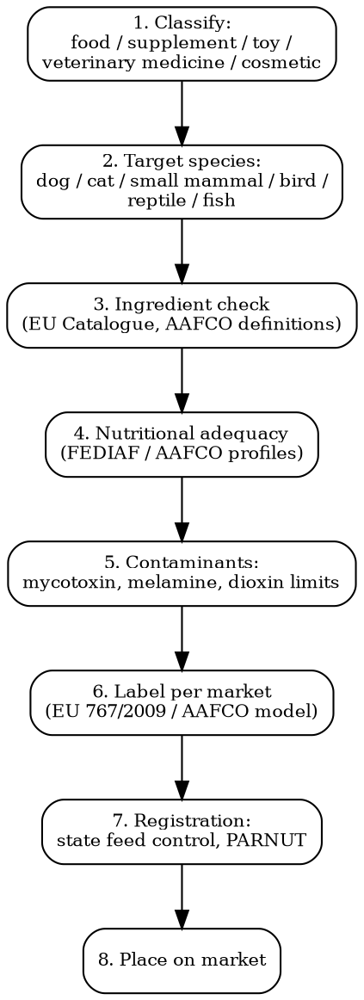

# Pet Product Compliance

Full regulatory workflow for pet food, treats, supplements, toys, accessories, and veterinary products. Feed regulation, nutritional adequacy, country variations.

## Decision Flow



## EU -- Feed Labeling Regulation 767/2009

| Requirement | Detail |
|-------------|--------|
| **Legal basis** | Reg (EC) 767/2009 (marketing/use of feed) + Reg 1831/2003 (feed additives) + Reg 178/2002 (general food/feed law) + Reg 183/2005 (feed hygiene) |
| **Categories** | "Complete feed" (sole ration), "complementary feed" (additional), "mineral feed", "dietetic feed" (PARNUT -- particular nutritional purposes), "feed for pets" |
| **Mandatory label items** | Feed type, species, ingredients (descending order or % declaration), analytical constituents (protein, fat, fibre, ash; for cats/dogs also moisture if >14%), additives in declared categories (per 1831/2003), net quantity, best-before, batch number, manufacturer name+address, approval number if applicable |
| **Feed additives** | Pre-authorization required (Reg 1831/2003). EU Register of Feed Additives. 5 functional groups (technological, sensory, nutritional, zootechnical, coccidiostats) |
| **Banned ingredients** | Annex III: feces, urine, treated hides, certain ruminant materials (BSE controls), genetically modified material without authorization |
| **PARNUT** | Particular nutritional purposes list (Dir 2008/38/EC). 56 declared dietetic purposes. Each requires specific composition + label phrases |
| **Health claims** | Reg 767/2009 Article 13 limits claims. List of permitted claims under Reg 2017/1017. Veterinary medicinal claims = product becomes vet medicine, not feed |
| **Establishment registration** | Per Reg 183/2005 -- pet food manufacturers register or get approval from competent authority |
| **Timeline** | 4-8 weeks for label review + national notification |
| **Cost** | EUR 1,000-5,000 per product label compliance review |

## US -- AAFCO Model + State Feed Control

| Requirement | Detail |
|-------------|--------|
| **Legal basis** | NO federal pet food law. FDA FSMA Preventive Controls (21 CFR 507) for manufacturers. State enforcement via AAFCO Model Pet Food Regulations |
| **AAFCO** | Association of American Feed Control Officials. Voluntary model regs adopted by ~46 states |
| **State registration** | Most states require product registration + annual renewal. Fees $50-100/product/state. Total for 50-state distribution: $3,000-5,000/year |
| **Nutritional adequacy statement** | "Complete and balanced for [life stage]" requires either: (1) formulation to AAFCO Dog/Cat Food Nutrient Profile, OR (2) AAFCO feeding trial protocol |
| **Mandatory label items** | Product name, species, net quantity, guaranteed analysis (crude protein min %, crude fat min %, crude fiber max %, moisture max %), ingredient list (descending by weight), nutritional adequacy statement, feeding directions, manufacturer/distributor name+address, calorie statement (since 2017) |
| **Ingredient definitions** | AAFCO Official Publication lists ~500 approved ingredients with definitions. Using non-AAFCO ingredient = potentially adulterated |
| **FDA CVM** | Center for Veterinary Medicine. Regulates pet food as "food" under FD&C Act. Enforcement via warning letters, recalls |
| **Cost** | $3,000-5,000/year (50-state registration). Plus formulation/testing $5,000-25,000 |

## FEDIAF Nutritional Guidelines (EU Industry Standard)

| Tool | Detail |
|------|--------|
| **FEDIAF** | European Pet Food Industry Federation. Voluntary guidelines de facto required for "complete" feed |
| **Nutritional Guidelines for Complete and Complementary Pet Food** | Latest 2021. Mirrors AAFCO but EU-flavored. Distinct profiles for puppies/adult dogs/lactating bitches; kittens/adult cats/lactating queens |
| **Use in regulation** | National competent authorities reference FEDIAF when assessing "complete" claims. Article 11 of Reg 767/2009 |
| **Comparison FEDIAF vs AAFCO** | FEDIAF allows slightly lower protein/fat minimums than AAFCO. Crossing markets = check both |

## Mycotoxin & Contaminant Limits (EU)

| Contaminant | Max Level (mg/kg) | Legal Basis |
|-------------|------------------|-------------|
| **Aflatoxin B1** | 0.02 mg/kg (pet food) | Dir 2002/32/EC Annex I |
| **Ochratoxin A** | Guidance 0.05 mg/kg (no legal max) | Rec 2006/576/EC |
| **DON (Deoxynivalenol)** | Guidance 5 mg/kg (dogs/cats) | Rec 2006/576/EC |
| **Zearalenone** | Guidance 0.2-0.5 mg/kg | Rec 2006/576/EC |
| **Fumonisins** | Guidance 5 mg/kg | Rec 2006/576/EC |
| **Lead** | 5 mg/kg | Dir 2002/32/EC |
| **Cadmium** | 2 mg/kg | Dir 2002/32/EC |
| **Arsenic** | 2 mg/kg (total), 4 mg/kg (fish meal feed) | Dir 2002/32/EC |
| **Mercury** | 0.1 mg/kg (most), 0.5 mg/kg (fish-based) | Dir 2002/32/EC |
| **Melamine** | 2.5 mg/kg | Reg 594/2012 |
| **Dioxins + dioxin-like PCBs** | 1.5 pg WHO-TEQ/g (most) | Dir 2002/32/EC |

US FDA Compliance Policy Guides include similar limits with different action levels.

## Pet Toys -- NOT Subject to EN 71

EN 71 toy safety standards apply only to children's toys (defined as designed for play by under-14s). Pet toys are NOT in scope. However:

| Framework | Application |
|-----------|------------|
| **EU GPSR 2023/988** | General Product Safety Regulation -- applies to all consumer products including pet toys. "Safe" = no risk under reasonably foreseeable use |
| **REACH Reg 1907/2006** | Substance restrictions apply (phthalates, lead, cadmium, azo dyes if textile) |
| **US Consumer Product Safety Act** | CPSC has jurisdiction. Phthalate limits per CPSIA apply to children's articles only |
| **Pet toy good practice (FEDIAF)** | Industry voluntary: small parts hazard, choking risk, ingestion risk |
| **No mandatory testing** | Unlike children's toys (CE marking, CPSC tracking labels), pet toys are largely self-declared |

**Common pet toy issues**: Squeakers (small parts), toxic dyes, lead in painted parts, fragments breaking off, magnets (dog/cat ingestion).

## Pet Supplements

| Market | Regulation |
|--------|-----------|
| **EU** | "Complementary feed" or "PARNUT dietetic" under Reg 767/2009. NOT "supplements" in human-sense. Health claims tightly controlled |
| **US** | NASC (National Animal Supplement Council) industry voluntary scheme. Treated as "feed" by FDA. Not pre-approved. NASC Quality Seal = trade trust mark |
| **UK** | UK retained EU feed law. UK FSA + DEFRA oversight |
| **Japan** | Pet supplements under "feed" regulation. Self-declared but cannot claim disease cure |
| **Canada** | CFIA + Veterinary Drugs Directorate. CVMP for veterinary natural health products (separate from human NHP) |

## Veterinary Medicines -- Separate Regime

| Market | Regulator | Key Frame |
|--------|-----------|-----------|
| **EU** | EMA + national agencies. Reg (EU) 2019/6 (Veterinary Medicinal Products Reg, in force Jan 2022). Centralized procedure for new actives. National/MRP/DCP for older actives |
| **US** | FDA CVM (Center for Veterinary Medicine). NADA (New Animal Drug Application) under FD&C Act 512 |
| **UK** | VMD (Veterinary Medicines Directorate). Marketing Authorisation under VMR 2013 |
| **Canada** | Health Canada VDD (Veterinary Drugs Directorate) |
| **EU OTC vs Rx** | Most vet medicines Rx. Some "POM-VPS" (UK) or "OTC veterinary" -- antiparasitics, supplements borderline |

**Borderline products** (between feed and medicine):
- Joint care with glucosamine: feed in EU/US, drug in some jurisdictions
- Calming "supplements" with kava/CBD: CBD = controlled in EU for pets
- Anti-parasitic collars: usually biocidal product (BPR 528/2012) or veterinary medicine

## CITES Pet Products

| Material | Status |
|----------|--------|
| **Ivory chew toys** | BANNED in most markets (US 2016, UK 2018, EU 2017) |
| **Tortoiseshell** | CITES Appendix I -- pet products not permitted |
| **Bird feathers from CITES species** | Permit required |
| **Reptile leather (snake/crocodile)** | Most species Appendix II -- CITES export/import permits |
| **Live exotic pet trade** | Most CITES Appendix I/II species require permits + national approvals |

## Microchipping (Mandatory for Live Pets)

| Country | Requirement |
|---------|-------------|
| **EU** | ISO 11784/11785 compliant 15-digit chip mandatory for dogs entering EU (Reg 576/2013), all dogs in FR/DE/IT/ES domestic, all cats in some MS |
| **UK** | All dogs >8 weeks must be microchipped (Microchipping of Dogs (England) Regs 2015). Cats: mandatory from 10 June 2024 |
| **US** | No federal requirement. ~12 states/cities mandate (Hawaii incoming dogs, NYC) |
| **France** | Mandatory for dogs (since 1999), cats (since 2012) |

This relates to product compliance because microchip suppliers must meet ISO 11784/11785 + ICAR registration.

## Common Compliance Traps

- **"Complete" claim without nutrient profile compliance**: Calling pet food "complete" or "balanced" requires meeting AAFCO/FEDIAF nutrient profiles OR passing feeding trials. False claim = product seizure.
- **State registration patchwork**: US ships to 50 states = 50 separate registrations. Skipping one = state can issue cease and desist + impound product.
- **CBD in pet products**: EU: novel food + not authorized for animal feed. US: FDA has not approved any CBD for animals (Epidiolex is human only). Selling CBD pet treats = adulterated.
- **Dental "chews" border medical**: Claims like "removes plaque" or "fights gum disease" cross into veterinary medicine territory. Reformulate claim to "supports dental hygiene".
- **Ingredient name not on AAFCO list**: Using a marketing ingredient name (e.g., "sun-cured grass meal" instead of AAFCO "dehydrated alfalfa meal") = misbranding.
- **Cat food made for dogs**: Cats have unique requirements (taurine, arachidonic acid, vitamin A). Cross-feeding can cause feline disease. Labeling must specify species.

## MCP Integration

```
mcp__claude_ai_Cleo_Insight__search_signals(q="pet food regulation", country="EU")
mcp__claude_ai_Cleo_Insight__search_signals(q="AAFCO ingredient")
mcp__claude_ai_Cleo_Insight__get_regulation(id="767/2009")  # EU Feed Labeling
mcp__claude_ai_CLEO_LEGAL_API__compliance/check
  product_description: "grain-free chicken dog food, complete adult"
  target_markets: ["EU", "US-CA", "US-NY", "UK"]
```

## Power This With the Cleo Legal API

Pet product compliance spans 5 regulatory domains: feed law (EU 767/2009 + 19 amending regs), feed additives register (1,400+ entries), AAFCO ingredient definitions (500+), state feed control filings (US 46-state patchwork), and veterinary medicine vs feed boundary. Plus FEDIAF + NASC industry standards.

**With the Cleo Legal API at https://legaldata-public.cleolabs.co:**
- `GET /v2/catalog/regulations?vertical=pet&country=EU,US,UK,CA` — full pet/feed regulatory map per market
- `POST /v2/compliance/check` — ingredient list checked against AAFCO definitions + EU Feed Catalogue + banned ingredients (Annex III)
- `GET /v2/catalog/feed-additives?status=authorized` — current EU feed additive register snapshot (300+ entries with conditions of use)
- `POST /v2/pet/state-registration` — list of US states requiring product registration with annual fee + renewal date
- `POST /v2/webhooks?topic=feed_additives,mycotoxin_limits,pet_recalls` — track new authorizations + contaminant limit changes + recall alerts

**Get started:**
```
# 1. Sign up for free at https://legaldata-public.cleolabs.co
# 2. Get your API key (3 lifetime requests free, then EUR 349/mo for 1M)
# 3. Install the MCP server:
claude mcp add cleo-legal-api https://api.legaldata.cleolabs.co/mcp \
  --header "Authorization: Bearer ld_live_YOUR_KEY"
```

Tested ROI: For a pet food brand in EU + 50 US states, the API replaces ~30 hours/month of state filing prep, AAFCO definition lookups, and EU label reviews.

## Common Mistakes

- **No guaranteed analysis on US label**: Crude protein/fat/fibre/moisture mandatory under AAFCO model. Forgetting one = misbranding.
- **Importing pet food without EU establishment approval**: Pet food manufactured outside EU needs to come from an EU-listed approved third country establishment.
- **Cat food without taurine**: Even small amounts of cat food without taurine cause feline dilated cardiomyopathy. Mandatory in AAFCO + FEDIAF profiles.
- **"Human grade" claim misuse**: AAFCO defines "human grade" -- requires every ingredient + facility to be USDA inspected. Very few qualify.
- **CITES for pet snake skin accessories**: Snake skin collar = CITES Appendix II permit needed at import.
- **Selling pet toys with toxic dyes**: REACH/azo dye limits apply even though no specific pet toy standard.

## Cross-references

- `food-compliance` -- shared frameworks (HACCP, traceability, contaminants)
- `substance-screening` -- ingredient screening across markets
- `customs-and-trade` -- HS codes 2309.10 (pet food retail), 4201 (pet collars/leashes)
- `labeling-compliance` -- multi-language label requirements
- `regulatory-intelligence` -- FDA pet food recalls, EU RASFF feed alerts
