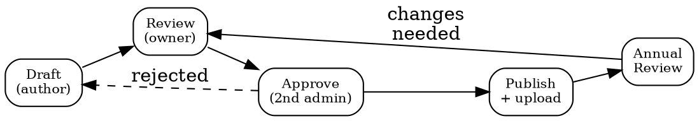

# Policy Management

## Quick Reference

| Action | MCP Tool | Returns |
|--------|----------|---------|
| List policies | `mcp__bastion__list-customer-policies` | `policyId, version, category, type, status, filename` |
| Read policy | `mcp__bastion__get-customer-policy-by-id` | Full policy text + metadata |
| Failing tests | `mcp__bastion__list-failing-compliance-tests` | Tests blocked by missing/outdated policies |
| Upload doc | `mcp__bastion__upload-compliance-document` | Attach evidence to a test |
| Test detail | `mcp__bastion__get-compliance-test-detail` | Which policy is expected |

## Policy Lifecycle



**BLOCKER: Policy owners cannot approve their own policies.** Bastion enforces separation of duties. Solution: invite a 2nd admin to the Bastion workspace before starting the approval cycle.

## ISO 27001 Annex A Policy Mapping

| Policy domain | Annex A controls |
|---------------|-----------------|
| Information Security | A.5.1-5.3 (policies, roles) |
| Access Control | A.8.2-8.5 (authentication, privilege) |
| Data Protection | A.5.34 (privacy), A.8.11-8.12 (masking, DLP) |
| Incident Response | A.5.24-5.28 (IR lifecycle) |
| Risk Management | A.5.7 (threat intel), A.8.8 (vuln mgmt) |
| Vendor Management | A.5.19-5.22 (supplier chain) |
| Asset Management | A.5.9-5.13 (inventory, classification) |
| Awareness & Training | A.6.3 (security awareness) |
| DR/BC | A.5.29-5.30 (ICT continuity) |
| Physical Security | A.7.1-7.14 (physical controls) |

## Workflow

1. **Inventory** -- `mcp__bastion__list-customer-policies`. Map `category` against the 10 domains above.
2. **Gap analysis** -- Cross-ref with `mcp__bastion__list-failing-compliance-tests`. Missing = draft. Outdated = review.
3. **Draft** -- Purpose, scope, roles, statements, exceptions, review schedule. Concrete: "MFA on all prod systems."
4. **Review** -- Owner checks against actual operations. Use `compliance-frameworks-ref` for wording.
5. **Approve** -- Different person from owner. Solo founder: invite 2nd admin first.
6. **Publish** -- `mcp__bastion__upload-compliance-document`. Link summaries from `trust-center`.
7. **Maintain** -- Annual minimum. Immediate on: incidents, reg changes, reorgs.

## Usage Example

```
mcp__bastion__list-customer-policies
# → [{policyId: "pol_42", version: 3, category: "access_control", status: "published"}...]
mcp__bastion__get-customer-policy-by-id(policyId="pol_42")
# → Full text + last review date + owner
```

## Common Mistakes

- **Owner self-approving** -- Bastion returns 403. Always have a 2nd admin. Solo founders: invite a co-admin before starting policy cycle.
- **Copy-pasting templates verbatim** -- Auditors verify policies match operations. Claiming "24/7 SOC" without one = major nonconformity.
- **Forgetting version control** -- Every edit = new `version`. Never overwrite without changelog.
- **Missing annual review** -- Even with no changes, document "reviewed, no changes needed" + date + reviewer.
- **Not linking to failing tests** -- Use `security-posture` to find which tests reference which policy. Fix the policy gap, then `refresh-compliance-test`.
