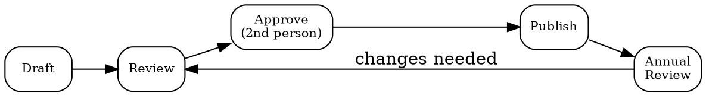

# Policy Management

## Quick Reference

| Action | MCP Tool | Fallback |
|--------|----------|----------|
| List all policies | `bastion__list-customer-policies` | Manual policy inventory spreadsheet |
| Read policy details | `bastion__get-customer-policy-by-id` | Read policy document directly |
| Check compliance gaps | `bastion__list-failing-compliance-tests` | Audit report review |
| Upload evidence | `bastion__upload-compliance-document` | Manual upload via Bastion UI |

## Policy Types

| Domain | Covers |
|--------|--------|
| Information Security | ISMS scope, objectives, roles |
| Data Protection | GDPR/privacy, processing records, DPIA |
| Access Control | Least privilege, MFA, provisioning/deprovisioning |
| Incident Response | Detection, escalation, notification timelines |
| Risk Management | Risk register, assessment methodology, appetite |
| Vendor Management | Due diligence, SLA monitoring, offboarding |
| Asset Management | Inventory, classification, acceptable use |
| Awareness & Training | Onboarding, annual training, phishing tests |
| DR/BC | RTO/RPO, backup strategy, failover testing |
| Physical Security | Office access, visitor logs, clean desk |

## Lifecycle

## Workflow

1. **Inventory** — `list-customer-policies` to see what exists. Map against required policy types for your framework (ISO 27001 needs all 10 above).
2. **Gap analysis** — Compare inventory against failing compliance tests. Missing policy = draft from scratch. Outdated = trigger review cycle.
3. **Draft** — Write policy with: purpose, scope, roles & responsibilities, policy statements, exceptions process, review schedule.
4. **Review** — Policy owner reviews for accuracy and feasibility. Check alignment with actual operational practices.
5. **Approve** — Second person approves. **Owner cannot approve their own policy.**
6. **Publish** — Upload to compliance platform. Link from trust center if public-facing summary needed.
7. **Maintain** — Annual review minimum. Trigger immediate review on: security incidents, regulatory changes, org restructuring.

## Review Triggers

- Annual calendar reminder (mandatory)
- Post-incident lessons learned
- New regulation affecting scope
- Organizational change (M&A, new product line, new market)
- Failed compliance test referencing the policy

## Common Mistakes

- **Owner self-approving** — Bastion enforces separation of duties. Always designate a different approver than the author/owner.
- **Copy-pasting templates verbatim** — Auditors check that policies reflect actual practices. A policy claiming 24/7 SOC when you have none will fail audit.
- **Forgetting version control** — Every edit must be a new version with change log. Never overwrite without tracking what changed.
- **Writing policies nobody reads** — Keep policy statements concrete and actionable. "Passwords must be 12+ characters with MFA" beats "appropriate authentication measures shall be employed."
- **Missing the annual review** — Even if nothing changed, document "reviewed, no changes needed" with date and reviewer name.
