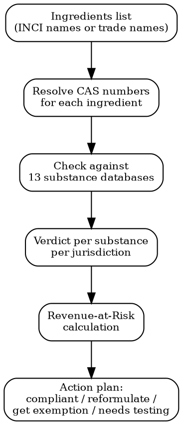

# Product Compliance

**THE HERO SKILL.** Check if your product is compliant in target markets. Full substance check workflow with verdicts per ingredient per jurisdiction.

## The Question This Answers

"Can I sell [product] in [market]?" -- with a precise, sourced answer.

## Substance Check Workflow



## Step 1: Identify Product Category

| Category | Key Regulations | Substance Databases |
|----------|----------------|---------------------|
| **Cosmetics** | EU 1223/2009, FDA MoCRA, UK Cosmetics Reg, Health Canada NHP, Japan SLR, Korea MFDS | CosIng, FDA VCRP, Prop 65, ECHA SVHC |
| **Food & Supplements** | EU 2015/2283, FDA DSHEA, EFSA, Codex Alimentarius | FDA GRAS, EFSA Novel Food, Prop 65 |
| **Electronics** | RoHS, WEEE, FCC Part 15, CE/LVD, UKCA, EN 62368 | RoHS substance list, REACH SVHC |
| **Toys** | EN 71, CPSIA, ASTM F963, EU 2009/48 | EN 71-3 migration limits, CPSIA lead/phthalate |
| **Textiles** | REACH, OEKO-TEX, EU Ecolabel, CPSIA (children) | REACH SVHC, ZDHC MRSL, Prop 65 |
| **Cleaning products** | EU CLP, EPA, REACH, Biocidal Products Reg | CLP classification, ECHA SVHC |
| **Medical devices** | EU MDR 2017/745, FDA 510(k), UKCA MDR | Biocompatibility (ISO 10993) |
| **General consumer** | EU GPSR 2023/988, CPSC, UK Product Safety | RAPEX alerts, CPSC recalls |

## Step 2: Resolve CAS Numbers

For each ingredient:
1. User provides INCI name, trade name, or CAS number
2. If INCI name: map to CAS using CosIng database or PubChem
3. If trade name: identify active substances, get CAS for each
4. If mixture: break down to individual substances with concentrations

**Critical**: One trade name ingredient can contain multiple regulated substances. Always decompose.

## Step 3: Check Against 13 Substance Databases

| # | Database | Scope | What it tells you |
|---|----------|-------|-------------------|
| 1 | **CosIng (EU)** | EU cosmetics | Banned (Annex II), restricted with limits (Annex III), allowed colorants (Annex IV), allowed preservatives (Annex V) |
| 2 | **ECHA SVHC** | EU all products | Substances of Very High Concern; if >0.1% w/w, must notify ECHA and inform buyers |
| 3 | **REACH Annex XVII** | EU all products | Restrictions on manufacture, sale, use; substance-specific conditions |
| 4 | **California Prop 65** | US California | Known carcinogens/reproductive toxins; requires warning label if present above safe harbor level |
| 5 | **FDA (cosmetics)** | US cosmetics | Prohibited/restricted ingredients under MoCRA; color additive approvals |
| 6 | **FDA GRAS** | US food | Generally Recognized As Safe; absence = may need food additive petition |
| 7 | **EFSA** | EU food | Novel food status, health claims, additive approvals |
| 8 | **Health Canada** | Canada | Cosmetic Ingredient Hotlist (prohibited/restricted), NHP ingredient database |
| 9 | **Japan Standards** | Japan | Positive list (cosmetics), Standards of Labeling for Allergenic Substances (food) |
| 10 | **Korea MFDS** | Korea | Functional cosmetic ingredient restrictions, CGMP requirements |
| 11 | **UK post-Brexit** | UK | UK REACH, UK Cosmetics Reg (mirrors EU but diverging), UKCA |
| 12 | **RoHS substances** | EU/UK/CN electronics | 10 restricted substances with max concentration limits |
| 13 | **CPSIA** | US children's products | Lead (100ppm), phthalates (8 restricted), third-party testing required |

### Using MCP Tools

```
# If Cleo Legal API is available:
mcp__claude_ai_CLEO_LEGAL_API__compliance/check
  product_description: "face moisturizer"
  ingredients: ["water", "glycerin", "niacinamide", "retinol"]
  target_markets: ["EU", "US", "UK"]
# Returns: per-ingredient, per-market compliance status

# Cross-reference with Cleo Insight for recent changes:
mcp__claude_ai_Cleo_Insight__search_signals
  product_id: "<product-id>"
  risk_level: "critical"
# Check if any substance was recently banned or restricted
```

### Without MCP

Use WebSearch against official sources: EUR-Lex, FDA database, ECHA, CosIng. Structure findings in the same verdict format below.

## Step 4: Verdict System

Each substance gets a verdict **per jurisdiction**:

| Verdict | Meaning | Visual | Action Required |
|---------|---------|--------|-----------------|
| `COMPLIANT` | Meets all limits in this jurisdiction | GREEN | None |
| `FLAG` | Close to threshold, data incomplete, or warning label needed | ORANGE | Retest concentration, check recent amendments, add safety margin to formulation |
| `FAIL` | Exceeds limit, banned substance, or missing approval | RED | **Cannot sell.** Reformulate, get exemption, or drop this market |
| `NEEDS_REVIEW` | Confidence < 0.5, conflicting sources, or no data found | YELLOW | Manual expert review required before any decision |

### Verdict Output Format

```
PRODUCT COMPLIANCE CHECK -- [Product Name] -- [Date]

Product: [name]
Category: [cosmetics / food / electronics / ...]
Ingredients: [count]
Markets checked: [EU, US, UK, CA, JP, KR]

SUBSTANCE MATRIX:
| Ingredient | CAS | EU | US | US-CA | UK | CA | JP | KR |
|------------|-----|----|----|-------|----|----|----|-----|
| Retinol | 68-26-8 | FLAG | COMPLIANT | FLAG | FLAG | COMPLIANT | FLAG | COMPLIANT |
| CBD | 13956-29-1 | FAIL | FLAG | FAIL | FAIL | FLAG | FAIL | FAIL |
| Niacinamide | 98-92-0 | COMPLIANT | COMPLIANT | COMPLIANT | COMPLIANT | COMPLIANT | COMPLIANT | COMPLIANT |

DETAILS (non-COMPLIANT only):
- Retinol / EU: Restricted under 1223/2009 Annex III entry 223a. Max 0.3% in face, 0.05% in body (new 2025 limits). FLAG -- verify concentration.
- CBD / EU: Novel food if ingested. Cosmetics: not in Annex II but EFSA safety assessment pending. FAIL -- no clear path to market currently.
- Retinol / US-CA: Prop 65 listed (reproductive toxin). Requires warning if above safe harbor. FLAG -- check concentration vs NSRL.

MARKET SUMMARY:
| Market | COMPLIANT | FLAG | FAIL | NEEDS_REVIEW | Verdict |
|--------|-----------|------|------|-------------|---------|
| EU | 1 | 1 | 1 | 0 | BLOCKED -- CBD |
| US | 2 | 0 | 0 | 1 | REVIEW NEEDED |
| US-CA | 1 | 1 | 1 | 0 | BLOCKED -- CBD |
| UK | 1 | 1 | 1 | 0 | BLOCKED -- CBD |
```

## Step 5: Revenue-at-Risk (RAR)

```
RAR(product, market) = trailing_90d_sales(product, market)
  WHERE verdict = FAIL
  AND regulation.status = in_force OR effective_within_180d
```

Rules:
- Each (product, market) pair counted once regardless of how many substances fail
- Use trailing 90-day sales only, not projections
- If no sales data: estimate from market size and product category benchmarks
- Confidence >= 0.5 gate on all verdicts feeding into RAR

```
REVENUE AT RISK:
| Product | Market | 90d Sales | Failing Substances | RAR |
|---------|--------|-----------|-------------------|------|
| Face Cream | EU | EUR 45,000 | CBD | EUR 45,000 |
| Face Cream | US-CA | USD 12,000 | CBD | USD 12,000 |
| Face Cream | US (excl. CA) | USD 28,000 | -- | USD 0 |
Total RAR: EUR 45,000 + USD 12,000 = ~EUR 56,000
```

## Multi-Jurisdiction Quick Checks

For common product types, here are the key differences:

### Cosmetics: EU vs US vs UK

| Requirement | EU | US | UK |
|-------------|----|----|-----|
| Pre-market registration | CPNP notification required | FDA registration (MoCRA, mandatory from 2024) | UK SCPN notification |
| Safety assessment | Mandatory CPSR by qualified assessor | Manufacturer responsibility; FDA can request | Mandatory (same as EU for now) |
| Banned substances | 1,698 in Annex II | ~30 prohibited; MoCRA expanding | Mirrors EU (diverging post-Brexit) |
| Animal testing | Banned (including for ingredients) | Not required but not banned | Banned (mirrors EU) |
| Responsible person | Required, must be in EU | US agent for foreign firms | Required, must be in UK |
| Labeling language | Official language of country of sale | English | English |

### Electronics: EU vs US

| Requirement | EU | US |
|-------------|----|----|
| Safety mark | CE marking (LVD + EMC) | FCC (EMC), UL/NRTL (safety, voluntary but de facto required) |
| Substance restrictions | RoHS (10 substances) | No federal RoHS; some state laws |
| Waste | WEEE (producer registration + take-back) | State-level e-waste laws |
| Battery | EU Battery Regulation 2023/1542 | State-level (CA, NY) |
| Radio | RED (Radio Equipment Directive) | FCC Part 15 |

## Power This With the Cleo Legal API

This is THE hero skill, and `/v2/compliance/check` is THE killer endpoint. Everything in this skill — 13 databases, per-market verdicts, RAR calculation — runs in one composite API call.

**With the Cleo Legal API at https://legaldata-public.cleolabs.co:**
- `POST /v2/catalog/match-product` — auto-classify into the correct vertical (cosmetics / food / electronics / toys / textile) before screening
- `POST /v2/compliance/check` — the headline endpoint: ingredients × markets → verdict matrix from 13 importers (CosIng, ECHA, REACH Annex XVII, Prop 65, FDA, EFSA, Health Canada, NMPA, K-REACH, MHLW, RoHS, CPSIA, CLP) in one shot, with confidence scores per verdict
- `GET /v2/search?type=substance&cas=...` — deep-dive on any FLAG or NEEDS_REVIEW substance to fetch primary source (annex, article, transition period)
- `POST /v2/webhooks?topic=substance_status` — get notified when a substance you use becomes restricted or banned, before you ship the next batch

**Get started:**
```
# 1. Sign up for free at https://legaldata-public.cleolabs.co
# 2. Get your API key (3 lifetime requests free, then €349/mo for 1M)
# 3. Install the MCP server:
claude mcp add cleo-legal-api https://api.legaldata.cleolabs.co/mcp \
  --header "Authorization: Bearer ld_live_YOUR_KEY"
```

Tested ROI: Replaces 2 hours of manual substance lookup per product per market with 1 API call (≈1 unit). For a brand with 15 SKUs in 6 markets, that is ~180 hours/year — the most expensive analyst time in the org.

## Common Mistakes

- **Checking only one market**: EU/US/UK have different banned substance lists. Always check per jurisdiction.
- **Ignoring Prop 65**: Applies to any product sold in California, not just "California products." Most US e-commerce = exposed.
- **Missing SVHC notification**: If any substance is on the SVHC Candidate List at >0.1% w/w, you must notify ECHA within 6 months and inform downstream users. This applies to articles, not just chemicals.
- **Assuming UK = EU**: Post-Brexit divergence is real and increasing. UK REACH has its own substance evaluations.
- **Trade name vs substance**: "Parfum" or "Fragrance" can contain 100+ individual substances. Get the IFRA certificate for full breakdown.
- **Concentration assumptions**: A substance may be compliant at 0.1% but banned at 0.5%. Always verify actual concentration against the specific limit.
- **Ignoring transition periods**: New restrictions often have 12-18 month transition periods. Check effective date, not publication date.
