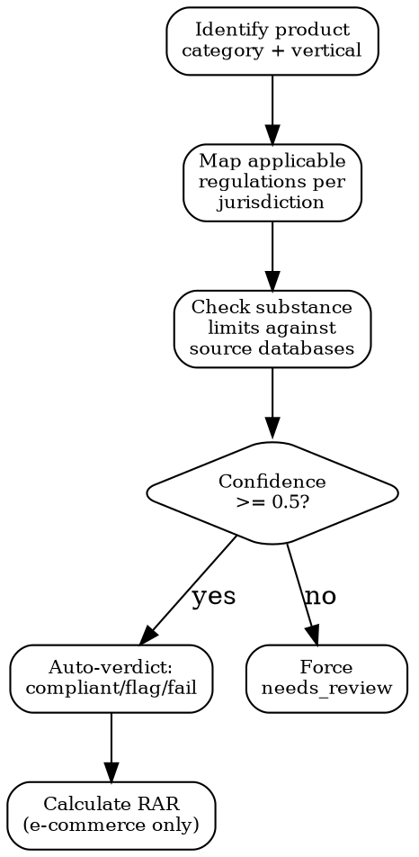

# Product Compliance

## Quick Reference

| Action | MCP Tool | Params |
|--------|----------|--------|
| Search signals | `mcp__claude_ai_Cleo_Insight__search_signals` | `product_id, country, hs_code, risk_level` |
| Regulation details | `mcp__claude_ai_Cleo_Insight__get_regulation` | `id` |
| Legal search | `mcp__claude_ai_CLEO_LEGAL_API__*` (requires auth) | — |
| Company profile | `mcp__claude_ai_Cleo_Insight__get_company_profile` | Current product catalog |

## Substance Limit Sources

| Source | Scope | Scale |
|--------|-------|-------|
| CosIng Annex II | EU banned substances | 1,200+ entries |
| CosIng Annex III | EU restricted (with limits) | 80+ entries |
| ECHA SVHC | EU substances of very high concern | ~260 entries |
| California Prop 65 | US CA carcinogens/repro toxins | ~900 entries |
| FDA GRAS | US generally recognized as safe | ~3,000 entries |

## Vertical Types

| Vertical | Examples |
|----------|----------|
| `chemistry` | REACH, CLP, TSCA, K-REACH |
| `cosmetics` | CosIng, FDA OTC, Health Canada NHP |
| `food` | FDA GRAS, EFSA, Codex Alimentarius |
| `cross` | Prop 65, ECHA SVHC (apply across verticals) |

## Verdict System

| Verdict | Meaning | Action |
|---------|---------|--------|
| `compliant` | Meets all limits | None |
| `flag` | Close to threshold or incomplete data | Investigate, retest |
| `fail` | Exceeds limit or banned substance | Block sale or reformulate |
| `needs_review` | Confidence < 0.5 | Manual expert review |

## Assessment Flow



## Revenue-at-Risk Formula

```
RAR(P,M) = sales(P,M,90d) WHERE is_at_risk(P,M,R) AND confidence >= 0.5
```

- `is_at_risk` = verdict `fail` AND regulation `in_force` or effective within 180d
- No double-counting: each (product, market) pair counted once regardless of how many regs fail
- 90-day trailing sales only, not projected

## Workflow

1. **Categorize** -- Assign vertical + category. Ambiguous products: assess under ALL applicable categories.
2. **Map frameworks** -- Per jurisdiction via `regulatory-intelligence`.
3. **Check substances** -- Cross-ref composition against source DBs. Limits vary by jurisdiction.
4. **Verdict** -- Per substance per jurisdiction. Confidence >= 0.5 gate.
5. **RAR** -- Quantify exposure. Feed into `compliance-reporting`.

## Common Mistakes

- **Single-jurisdiction check** -- EU/US/CA have different limits for the same substance. Assess per market.
- **Ignoring `cross` vertical** -- Prop 65 and SVHC apply across product types.
- **Double-counting RAR** -- One (P,M) pair = one entry. Multiple failing regs do not multiply.
- **Wrong HS code** -- Determines applicable regs. Verify via `customs-and-trade`.
- **Low-confidence auto-action** -- Below 0.5 forces `needs_review`. Never auto-act.
