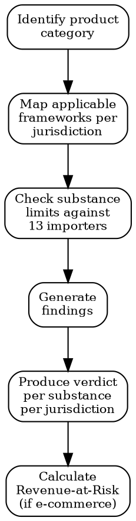

# Product Compliance

## Quick Reference

| Action | MCP Tool | Fallback |
|--------|----------|----------|
| Search regulatory signals | `Cleo_Insight__search_signals` | WebSearch regulatory databases |
| Get regulation details | `Cleo_Insight__get_regulation` | Read regulation source text |
| Legal search | `CLEO_LEGAL_API__search` (after auth) | Manual legal database lookup |
| Compliance check | `CLEO_LEGAL_API__compliance/check` | Manual substance-by-substance review |
| Customs lookup | `CLEO_LEGAL_API__customs/lookup` | HS code reference tables |

## Verdict System

| Verdict | Meaning | Action |
|---------|---------|--------|
| `compliant` | Meets all limits in jurisdiction | None |
| `flag` | Close to threshold or data incomplete | Investigate, retest |
| `fail` | Exceeds limit or banned substance found | Block sale or reformulate |
| `needs_review` | Confidence < 0.5, cannot auto-decide | Manual expert review |

**Confidence gate**: Only verdicts with confidence >= 0.5 surface automatically. Below that threshold, the system forces `needs_review`.

## Assessment Flow



## Substance Importers (13)

CosIng, ECHA SVHC, REACH Annex XVII, CLP Annex VI, California Prop 65, FDA (US), EFSA, Health Canada, NICNAS (AU), MHLW (JP), K-REACH (KR), ANVISA (BR), NMPA (CN).

## Product Categories (20)

Cosmetics, Electronics, Medical Devices, Food & Beverage, Toys, Textiles, Packaging, Automotive Parts, Cleaning Products, Building Materials, Batteries, Jewelry, Furniture, Personal Protective Equipment, Agricultural Chemicals, Pharmaceuticals, Veterinary Products, Supplements, Candles & Fragrances, Industrial Chemicals.

## Revenue-at-Risk Calculation

For e-commerce products facing imminent regulatory blocking:

```
RAR = (90-day trailing sales) x (blocking gaps in 180-day horizon)
```

A "blocking gap" = jurisdiction where product verdict is `fail` and regulation status is `in_force` or effective within 180 days.

## Workflow

1. **Categorize** — Assign to reference category. Ambiguous products (e.g., cosmetic tool with electronics) get assessed under ALL applicable categories.
2. **Map frameworks** — Per jurisdiction, identify which of 62 catalogued regulations apply.
3. **Check substances** — Cross-reference composition against relevant importers. Limits vary by jurisdiction.
4. **Generate findings** — One finding per substance per regulation: current value, limit, margin, source.
5. **Produce verdicts** — Aggregate into per-jurisdiction verdicts. Apply confidence gate.
6. **Calculate RAR** — Quantify financial exposure from blocking gaps.

## Common Mistakes

- **Checking only one jurisdiction** — A product sold in EU+US+CA needs three separate assessments. Limits differ.
- **Ignoring `adopted_not_yet_in_force`** — A regulation effective in 90 days should trigger reformulation now, not on enforcement day.
- **Trusting low-confidence verdicts** — Below 0.5 confidence, the verdict is a guess. Always escalate to domain expert.
- **Forgetting HS code mapping** — Customs classification determines which regulations apply. Wrong HS code = wrong assessment.
