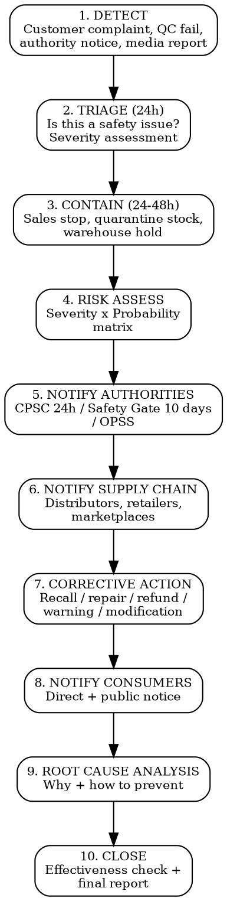

# Product Safety Incident Response

Step-by-step protocol from detection of a product safety issue to case closure. Time-critical: missed notification deadlines = criminal liability in most jurisdictions.

## Incident Response Flow



## Step 1: Detection Sources

| Source | Typical Signal | Urgency |
|--------|---------------|---------|
| **Customer complaint** | Injury report, burn, allergic reaction, electric shock, choking near-miss | IMMEDIATE if injury |
| **Quality control** | Batch test failure, contamination found, wrong component | HIGH -- assess scope |
| **Market surveillance authority** | RAPEX/Safety Gate alert, CPSC notification, OPSS contact | HIGH -- authority expects response |
| **Competitor/media** | Social media report, press article, competitor product recall (same component) | MEDIUM -- investigate |
| **Internal discovery** | Design flaw found, supplier non-conformance, test report discrepancy | MEDIUM -- assess impact |
| **Distributor/retailer** | Return spike, complaint pattern, marketplace flag | MEDIUM-HIGH |

**Rule**: ANY report of physical injury or risk of injury triggers the 24-hour clock.

## Step 2: Triage (First 24 Hours)

Determine if the issue is a product safety concern vs. quality/cosmetic defect:

| Question | If YES | If NO |
|----------|--------|-------|
| Could the defect cause injury or death? | Safety issue -- proceed | Quality issue -- standard process |
| Has anyone been injured? | Safety issue -- proceed urgently | Continue assessment |
| Does the product fail a mandatory safety standard? | Safety issue -- proceed | May still be safety issue -- assess risk |
| Is there a fire, electric shock, or chemical exposure risk? | Safety issue -- proceed | Continue assessment |
| Does it affect children's products? | Lower threshold -- treat as safety issue | Standard risk assessment |

**Document everything from this point**: dates, times, decisions, communications. This file becomes legal evidence.

## Step 3: Containment (24-48 Hours)

Immediate actions before full assessment:

```
CONTAINMENT CHECKLIST -- [Product] -- [Date] -- [Incident ID]

STOCK:
[ ] Warehouse stock quarantined (flag in WMS/ERP)
[ ] In-transit shipments identified and held
[ ] Production halted (if still manufacturing)

SALES CHANNELS:
[ ] E-commerce listings paused/removed
[ ] Marketplace listings deactivated (Amazon, eBay, etc.)
[ ] Wholesale orders on hold -- notify distributors
[ ] Retail partners notified to pull from shelves

EVIDENCE:
[ ] Defective sample(s) preserved (DO NOT destroy or modify)
[ ] Customer's product retrieved if possible (with consent)
[ ] Photos/videos of defect documented
[ ] Batch/lot records pulled
[ ] Production records for affected batch(es) secured
```

## Step 4: Risk Assessment

### Severity x Probability Matrix

**Severity levels**:
| Level | Description | Examples |
|-------|-------------|---------|
| **S1 -- Death/permanent** | Death or irreversible health effects | Electrocution, strangulation, severe chemical burn |
| **S2 -- Severe** | Hospitalization, temporary disability | Fracture, deep cut, moderate allergic reaction, moderate burn |
| **S3 -- Moderate** | Medical attention, no hospitalization | Minor burn, mild allergic reaction, minor cut requiring stitches |
| **S4 -- Minor** | First aid, no medical attention | Superficial scratch, mild irritation |

**Probability levels**:
| Level | Description |
|-------|-------------|
| **P1 -- Very high** | Defect present in all/most units AND likely to cause harm during normal use |
| **P2 -- High** | Defect present in significant portion OR likely to cause harm under foreseeable conditions |
| **P3 -- Medium** | Defect present in limited batch AND harm requires specific conditions |
| **P4 -- Low** | Isolated defect, harm requires unusual conditions |

**Risk matrix**:

| | P1 (very high) | P2 (high) | P3 (medium) | P4 (low) |
|--|----------------|-----------|-------------|----------|
| **S1 (death)** | SERIOUS -- mandatory recall | SERIOUS -- mandatory notification | SERIOUS -- mandatory notification | HIGH -- assess notification |
| **S2 (severe)** | SERIOUS -- mandatory notification | HIGH -- mandatory notification | HIGH -- assess notification | MEDIUM -- monitor |
| **S3 (moderate)** | HIGH -- mandatory notification | MEDIUM -- voluntary action | MEDIUM -- voluntary action | LOW -- monitor |
| **S4 (minor)** | MEDIUM -- voluntary action | LOW -- monitor | LOW -- monitor | LOW -- log |

## Step 5: Authority Notification

### EU -- GPSR (General Product Safety Regulation 2023/988)

| Aspect | Detail |
|--------|--------|
| **Obligation** | Economic operators must notify authorities when they know or should know a product poses a risk (Art. 9) |
| **Portal** | Safety Gate (formerly RAPEX): https://ec.europa.eu/safety-gate/ |
| **Deadline** | Within **10 business days** of becoming aware (or immediately for serious risk) |
| **Who notifies** | Manufacturer, importer, or distributor (whoever first becomes aware). Practical: the EU Responsible Person or Authorized Representative |
| **Content** | Product identification, description of risk, corrective measures taken/planned, distribution data (countries, quantities, sales channels) |
| **Consequence of non-notification** | Fines (member state-specific, typically EUR 10,000-500,000), criminal prosecution possible |

### US -- CPSC Section 15(b) Mandatory Reporting

| Aspect | Detail |
|--------|--------|
| **Obligation** | Manufacturer, importer, distributor, or retailer must report when a product: (1) fails a safety rule/ban, (2) contains a defect that could create substantial product hazard, (3) creates unreasonable risk of serious injury or death |
| **Portal** | SaferProducts.gov: https://www.saferproducts.gov/ -- use CPSC's online reporting form |
| **Deadline** | Within **24 hours** of obtaining information that reasonably supports the conclusion that reporting is required |
| **Who reports** | Every entity in the distribution chain has an independent obligation. In practice: manufacturer/importer reports first |
| **Content** | Product description, nature of defect, injury reports, number of units, distribution details, proposed corrective action |
| **Consequence of late/non-reporting** | Civil penalties up to $120,000 per violation (max $17.15M per related series). Criminal penalties: up to 5 years imprisonment for knowing/willful violations |
| **FDA products** | If product is FDA-regulated (cosmetics, food): report to FDA (MedWatch for devices, CFSAN for food/cosmetics), not CPSC |

### UK -- OPSS (Office for Product Safety and Standards)

| Aspect | Detail |
|--------|--------|
| **Obligation** | Notify OPSS when product presents a risk to health and safety |
| **Portal** | Product Safety Database: https://www.gov.uk/guidance/product-safety-database |
| **Deadline** | "Without delay" (interpreted as within 10 business days for non-critical, immediately for critical) |
| **Who** | UK Responsible Person, importer, or distributor |

## Step 6: Supply Chain Notification

```
SUPPLY CHAIN NOTIFICATION -- [Date]

TO: [All distributors, retailers, marketplace partners]

RE: Safety notification for [Product Name], [Model/SKU], [Batch/Lot]

ISSUE: [Brief description of safety concern]

AFFECTED UNITS: [Batch/lot numbers, date range, quantity]

IMMEDIATE ACTION REQUIRED:
1. Stop sale of affected units immediately
2. Quarantine remaining stock
3. Do not destroy stock (needed for investigation)
4. Provide us with: quantity in stock, quantity sold, customer records if available

CONSUMER COMMUNICATION: [Do / Do not] communicate to consumers until coordinated messaging is ready.

CONTACT: [Name, email, phone for incident coordinator]
```

## Step 7: Corrective Action Types

| Action | When Used | Consumer Impact | Cost Estimate |
|--------|-----------|----------------|---------------|
| **Voluntary recall + refund** | Serious risk, product cannot be made safe | Full refund. Highest consumer disruption | EUR 50-500+ per unit (logistics + refund + administration) |
| **Voluntary recall + repair** | Fixable defect, product valuable enough to repair | Product returned, repaired, re-shipped | EUR 20-200 per unit |
| **Voluntary recall + replacement** | Defect in specific component, replacement available | Swap defective product for corrected version | EUR 30-300 per unit |
| **Sales stop** | Risk assessment ongoing, precautionary | No consumer action yet | Low direct cost, revenue loss |
| **Safety warning** | Low-severity risk, user behavior can mitigate | Communication to users with safety instructions | EUR 1-10 per user (email/mail) |
| **Product modification** | Prospective fix for future production | None for existing owners (unless combined with warning) | Manufacturing cost only |

## Step 8: Consumer Notification

Notify consumers directly if you have their contact information, plus public notice:

| Channel | When | Content |
|---------|------|---------|
| **Direct email** | All recalls/warnings | Product name, risk description, what to do, how to get refund/repair, contact info |
| **Website banner** | All recalls | Dedicated recall page with full details |
| **Social media** | Serious risk or high public visibility | Brief factual statement + link to recall page |
| **Press release** | CPSC-coordinated recalls (US) or Safety Gate alerts | Coordinated with authority |
| **Point of sale** | If product still on shelves | Recall notice posted in-store |

## Step 9: Root Cause Analysis

| Method | Application |
|--------|-------------|
| **5 Whys** | Simple causal chain: "Why did the component fail?" -> "Why was the wrong material used?" -> ... |
| **Fishbone (Ishikawa)** | Categorize causes: Materials, Methods, Machines, Manpower, Measurement, Environment |
| **Fault Tree Analysis** | For complex systems: map logical paths to the failure event |

**Document**: Root cause, contributing factors, systemic issues (not just the proximate defect).

## Step 10: Case Closure

```
INCIDENT CLOSURE REPORT -- [Incident ID] -- [Date]

INCIDENT: [Product, defect, risk level, date detected]
AFFECTED UNITS: [Total manufactured, total sold, total recovered]

TIMELINE:
- Detection: [date]
- Containment: [date]
- Authority notification: [date + reference number]
- Consumer notification: [date]
- Corrective action started: [date]
- Corrective action completed: [date]

RECOVERY RATE: [X]% of affected units recovered/addressed
EFFECTIVENESS CHECK: [Describe verification that corrective action resolved the issue]
ROOT CAUSE: [Summary]
PREVENTIVE ACTIONS: [Changes to design, QC, supplier management, etc.]

AUTHORITY SIGN-OFF: [Status of authority case -- closed/open/monitoring]
INSURANCE: [Claim reference, status]

LESSONS LEARNED: [Documented changes to prevent recurrence]
```

## Insurance Notification

**Notify your product liability insurer immediately** when you become aware of a safety incident. Most policies require notification within 24-72 hours of awareness. Late notification can void coverage.

Provide insurer with: incident description, product details, injury reports, corrective actions planned, estimated financial exposure.

## Common Mistakes

- **Waiting for certainty before notifying**: CPSC requires reporting within 24 hours of information that "reasonably supports" a reportable condition. You do not need to be certain. Report early, update later.
- **Destroying defective products**: Preserve evidence. Destruction before investigation = spoliation risk in litigation.
- **Notifying only one authority**: If you sell in EU + US + UK, you must notify Safety Gate AND CPSC AND OPSS independently.
- **Treating marketplace removal as sufficient**: Removing a listing is containment, not corrective action. You still must notify authorities and consumers.
- **Forgetting downstream distributors**: Every entity in the chain has independent reporting obligations. Notify your distributors so they can comply with their own obligations.
- **No written record of triage decision**: If you decide an issue is NOT a safety concern, document why. Authorities will ask.

## MCP Integration

```
mcp__claude_ai_Cleo_Insight__search_signals(q="recall", risk_level="critical") — monitor active recalls
mcp__claude_ai_Cleo_Insight__search_signals(q="safety alert", country="XX") — per-market alerts
mcp__bastion__upload-compliance-document(name, document) — upload incident report to compliance file
mcp__bastion__add-compliance-test-evidence(testId, name, description, link) — attach corrective action proof
```
