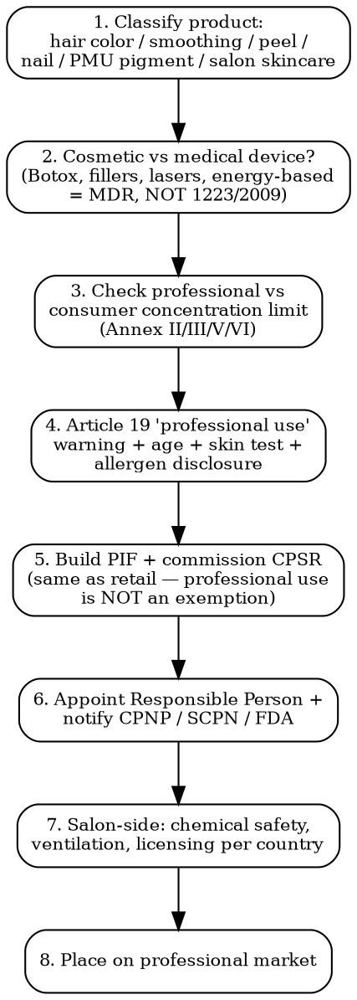

# Professional Cosmetics Compliance

Full regulatory workflow for salon-only and B2B cosmetics. Same regulations as retail cosmetics PLUS additional professional-use rules and concentration thresholds — the line between cosmetic and medical device sits inside this category.

## Decision Flow



## EU -- Regulation 1223/2009 Article 19 (Professional Use)

| Provision | Detail |
|-----------|--------|
| **Art 19(1)(d)** | Cosmetic products made available to the consumer must bear: nominal content, durability date, particular precautions, batch number, list of ingredients |
| **Art 19(2)** | For products that are NOT pre-packaged, are packaged at point of sale, or are pre-packaged at consumer's request — info may be on accompanying notice |
| **Professional use warning** | Required when product concentration exceeds consumer limit in Annex III. Examples: hair dye PPD up to 6% (vs 2% consumer), hydrogen peroxide up to 12% in hair products |
| **PIF still required** | No exemption for B2B distribution. Full safety assessment + Product Information File mandatory |
| **CPNP notification** | Mandatory even for salon-only products |
| **Responsible Person** | Must be EU-established |

### Hair Coloring — Annex III Restrictions (Professional Concentrations)

| Substance (INCI) | Consumer max | Professional max (Art 19) | Comment |
|------------------|--------------|---------------------------|---------|
| **p-Phenylenediamine (PPD)** | 2% in mixed product | 2% in mixed product (no professional-only higher level) | Annex III entry 8a |
| **Toluene-2,5-diamine (PTD)** | 2% in mixed product | 2% | Annex III entry 9a |
| **Resorcinol** | 1.25% rinse-off; 0.5% leave-on | 1.25% (rinse-off only for hair) | Annex III entry 22 |
| **m-Aminophenol** | 1.2% mixed | 1.2% | Annex III entry 16 |
| **Hydrogen peroxide (in hair products)** | 4% (12 vol) on application | 12% (40 vol) in product as sold | Annex III entry 12 |
| **Ammonium persulfate / potassium persulfate (bleaching)** | -- | 25% in powder for prep | Annex III entry 47 |
| **Thioglycolic acid (permanent waves)** | 8% pH 7-9.5 | 11% professional pH 7-9.5 | Annex III entry 2 (a/b) |
| **Sodium hydroxide (relaxers)** | 2% general use | 4.5% professional hair use, 5% straight unclassified | Annex III entry 15 |

### Mandatory Warnings on Hair Dye Products

Per Annex III + EU Guidance on hair dye warnings (2010):

- "Hair colorants can cause severe allergic reactions"
- "Read and follow instructions"
- "This product is not intended for use on persons under the age of 16"
- "Temporary 'black henna' tattoos may increase your risk of allergy"
- "Do not colour your hair if: you have a rash on your face or sensitive, irritated and damaged scalp / you have ever experienced any reaction after colouring your hair / you have experienced a reaction to a temporary 'black henna' tattoo in the past"
- "Contains phenylenediamines"

### Hair Smoothing / Keratin Treatments — Formaldehyde

| Substance | Status |
|-----------|--------|
| **Formaldehyde** | Banned in cosmetics as preservative since Sep 2019 (Annex II entry 1577). Still permitted in nail hardeners at ≤5% as releaser, Annex III entry 13 |
| **Formaldehyde-releasing keratin treatments** (methylene glycol, formalin disguised as "methanediol") | Effectively prohibited — any product releasing ≥0.05% formaldehyde under use conditions = non-compliant |
| **Glyoxylic acid + carbocysteine systems** (formaldehyde-free) | Permitted but still subject to safety assessment. Several EU MS issuing warnings 2023-2025 on kidney safety (glyoxylic acid) |

### Hydrogen Peroxide — Differentiated Limits

| Use | Consumer | Professional | Reg |
|-----|----------|--------------|-----|
| **Hair dye / lightening preparation** | 12% in product (as sold), 4% on hair (mixed) | 12% in product as sold | Annex III entry 12 |
| **Skin preparations** | 4% | 4% | Same |
| **Nail preparations** | 2% | 2% | Same |
| **Mouth preparations** | 0.1% | 6% (must be applied by dentist or under supervision) | Annex III entry 12 — dentists exempt for higher concentrations |
| **Tooth whitening 0.1-6%** | Only by dentists per Directive 2011/84/EU | -- | Cosmetic at <0.1%; medical device above |

## EU REACH — Tattoo + PMU Pigments

Regulation (EU) 2020/2081 added Annex XVII entry 75 restricting substances in tattoo + permanent makeup inks.

| Aspect | Detail |
|--------|--------|
| **Effective dates** | 4 Jan 2022 (general substances). 4 Jan 2023 (Pigment Blue 15:3 + Pigment Green 7 — additional 12-month delay) |
| **Scope** | Tattoo + PMU inks placed on market for use on the body |
| **Restricted substances** | ~4,000 substances grouped: CMR substances (Carc/Mut/Repr 1A/1B/2 under CLP), skin sensitizers, eye/skin irritants, certain metals, certain colorants |
| **Limits** | Generally 1 mg/kg for CMR Cat 1A/1B/2; 100 mg/kg for skin sensitizers; specific limits for As, Ba, Cd, Cr(VI), Co, Cu, Hg, Ni, Pb, Sb, Se |
| **Banned colorants** (since 2023) | Pigment Blue 15:3 (CI 74160 — phthalocyanine blue), Pigment Green 7 (CI 74260 — phthalocyanine green). Most blues + greens used in PMU brows + lip blush were these — re-formulation required |
| **Labeling** | "Mixture for use in tattoos or permanent make-up" + ingredient list + warnings + manufacturer info |
| **Penalty** | Each MS enforces; product seizures + fines reaching EUR 500,000 |

## Professional Nail Products

| Substance | Status |
|-----------|--------|
| **Methyl methacrylate (MMA)** monomer | Banned for nail use EU (Annex II entry 1175) and prohibited in 30+ US states (CA, FL, NY enforce strongly) since 1970s FDA notice |
| **Ethyl methacrylate (EMA)** monomer | Permitted, professional use only. Skin sensitizer category 1 — irritant + allergen warnings mandatory |
| **HEMA + di-HEMA trimethylhexyl dicarbamate** (gel polish) | Permitted up to 35% (HEMA) + 99% (di-HEMA TMHD) — but EU SCCS opinion 2022 + ban under discussion 2025 for skin sensitization concerns. UK banned in DIY products 2024 |
| **TPO (Trimethylbenzoyl diphenylphosphine oxide)** photoinitiator | Banned EU 1 Sep 2025 (CMR Cat 1B reclassification) — major reformulation across gel polishes |
| **Toluene** in nail polish | Restricted to 25% Annex III entry 185 |
| **Camphor** | Permitted up to 11% |
| **Formaldehyde in nail hardeners** | Permitted up to 5% (as releaser) — last formaldehyde permitted use post-2019 |
| **Acid-etch primers** (methacrylic acid) | Permitted; irritant warnings required |

### Salon Ventilation — OSHA + EU OEL

- US OSHA Permissible Exposure Limit toluene 200 ppm (8h TWA); methyl methacrylate 100 ppm
- EU Directive 2000/39/EC + 2017/164/EU + 2019/130/EU set Indicative + Binding OELs
- LEV (Local Exhaust Ventilation) at nail tables — required under EU OSH Framework Directive 89/391/EEC

## Where Cosmetic Ends, Medical Device Begins

### NOT cosmetics — fall under MDR 2017/745 (or fully outside cosmetics framework)

| Product | Framework | Classification |
|---------|-----------|----------------|
| **Botulinum toxin (Botox)** | Centrally Authorized Medicinal Product (EMA), POM. Cannot be sold OTC anywhere | Prescription drug |
| **Hyaluronic acid dermal fillers** | EU MDR 2017/745 — Class III (since MDR 2017/745 + Annex XVI list) | Medical device Class III |
| **Other dermal fillers (PMMA, PLLA, calcium hydroxylapatite)** | MDR Class III | Medical device |
| **Energy-based aesthetic devices (laser, IPL, HIFU, radiofrequency)** | MDR Annex XVI (since 22 June 2023 transition) | Class IIb medical device |
| **Microneedling pens >0.5 mm needle depth** | MDR — invasive medical device | Class IIa medical device |
| **Microneedling rollers ≤0.5 mm** | EU SCCS 2021 — cosmetic if non-invasive only. Many MS restrict to professional use |
| **Chemical peels >pH 3.5 OR >50% acid** | Borderline product — Member States interpret differently. Often classified as medicinal under Directive 2001/83/EC by "function" criterion |
| **Eyelash growth serums (bimatoprost, latanoprost)** | Prescription drug (US: FDA approved Latisse only). Cosmetic peptide serums permitted as cosmetic |
| **Threads (PDO, PLLA lifting)** | MDR Class IIb medical device |

## UK — Post-Brexit SCPN

| Aspect | Detail |
|--------|--------|
| **Professional cosmetics** | Same SCPN notification as retail. UK Responsible Person required |
| **PMU pigments** | Mirrored REACH Annex XVII restriction under UK REACH (UK transposed 2020/2081 in retained law) |
| **Botox + fillers regulation** | Joint Council for Cosmetic Practitioners (JCCP) voluntary register. Health and Care Act 2022 — new licensing scheme being developed (Sec 180) for non-surgical cosmetic procedures. Expected effective late 2026 |
| **Hair dyes** | Same EU Annex III concentrations (retained) |

## US — FDA + State Cosmetology Boards

| Aspect | Detail |
|--------|--------|
| **MoCRA** | Modernization of Cosmetics Regulation Act 2022 applies to professional cosmetics same as retail. Facility registration + product listing required |
| **Professional vs consumer concentration** | FDA does not formally distinguish but applies safety standard. MMA banned for nails by 30+ states |
| **State cosmetology boards** | License esthetician / cosmetologist / nail tech / electrologist per state. ~150-1,500 training hours per license depending on state |
| **OSHA Hazard Communication 29 CFR 1910.1200** | Salons must hold SDS for every chemical product used. Mandatory training for chemical handling |
| **Botox + fillers** | FDA prescription drugs / devices. Most states require MD, RN-with-supervision, or PA to inject |

## Salon Licensing Per Country

| Country | Salon Authority | Cosmetology Course Hours |
|---------|----------------|--------------------------|
| **France** | CAP Coiffure / Esthétique (Education nationale) | CAP 2 years (≈1,400h) |
| **Germany** | Friseur-Meister (chamber) / Kosmetiker (varies state) | 3-year apprenticeship for Friseur |
| **UK** | NVQ Level 2/3 (no statutory licensing nationally) | NVQ L3 ≈1,200h |
| **US — California** | Board of Barbering and Cosmetology | 1,000h cosmetology, 600h esthetics |
| **US — New York** | Department of State Division of Licensing | 1,000h cosmetology |
| **US — Texas** | TDLR | 1,000h cosmetology |
| **Japan** | Bihatsushi license (MHLW) | 2-year vocational school |
| **Italy** | Estetista qualified diploma | 1,800h-2,700h regional |

## Professional Distribution Channel

| Aspect | Detail |
|--------|--------|
| **B2B-only labeling** | Permitted to omit consumer-facing info IF not made available to consumer (Art 19(2)). Salon must hold full info |
| **Bulk packaging** | Often 1-5 L containers vs retail 100-500 mL. Same PIF, batch traceability |
| **Diverter / grey market** | Salon-only products diverted to retail = manufacturer brand-protection battle. Professional brands (Wella, L'Oréal Professionnel, Redken, Olaplex) actively pursue diverters via trademark + contractual claims |
| **Online sale of professional product** | EU + UK: permitted but professional-use warnings + age verification recommended. Marketplace policies vary (Amazon allows; eBay restricts hair color above consumer concentrations) |
| **Free samples to stylists** | WHO doesn't apply; cosmetics free samples to professionals = standard practice. Documented training distribution chains |

## Cost + Timeline

| Activity | Cost | Timeline |
|----------|------|----------|
| **CPSR (professional product)** | EUR 1,500-5,000 per product | 4-8 weeks (slightly higher than retail due to professional concentration assessment) |
| **REACH Annex XVII PMU testing** | EUR 800-3,000 per pigment shade | 2-3 weeks |
| **Reformulation post-TPO ban (Sep 2025)** | EUR 50,000-200,000 per gel polish line | 3-9 months |
| **CPNP / SCPN notification** | Free / GBP 0 | Same-day to 1 week |
| **MDR Class IIb device (laser, IPL)** | EUR 300,000-2,000,000 | 12-30 months |
| **UK Sec 180 license (when in force)** | TBD — expected GBP 200-1,000 + premise inspection | 3-6 months |

## MCP Integration

```
mcp__claude_ai_Cleo_Insight__search_signals(q="REACH tattoo pigment Annex XVII")
mcp__claude_ai_Cleo_Insight__search_signals(q="TPO ban cosmetics")
mcp__claude_ai_Cleo_Insight__get_regulation(id) — pull 1223/2009, REACH 2020/2081, MDR 2017/745 Annex XVI
mcp__claude_ai_CLEO_LEGAL_API__compliance/check — concentration check vs Annex II/III/V/VI in professional vs consumer mode
mcp__claude_ai_CLEO_LEGAL_API__catalog/match-product — borderline cosmetic vs medical device classification
```

## Power This With the Cleo Legal API

Professional cosmetics compliance combines four moving regimes: Reg 1223/2009 Annex III professional concentrations, REACH Annex XVII PMU + tattoo pigment restrictions, MDR 2017/745 Annex XVI for energy-based devices that used to be cosmetics, and per-state cosmetologist scope-of-practice rules. PPD limits change. TPO got banned in Sep 2025. HEMA may follow. PMU greens disappeared in Jan 2023. The API tracks the changes per substance.

**With the Cleo Legal API at https://legaldata-public.cleolabs.co:**
- `GET /v2/catalog/regulations?vertical=professional_cosmetics&country=EU,US,UK` — pull 1223/2009, REACH 2020/2081, MDR Annex XVI, MoCRA, UK Sec 180 with current articles
- `POST /v2/catalog/match-product` — cosmetic vs medical device classifier — wrong path adds 18 months (MDR Class IIb route) or kills the SKU (microneedling >0.5mm = device)
- `POST /v2/compliance/check` — INCI list batch check using "professional use" flag so the engine reads the right concentration column in Annex III
- `POST /v2/webhooks?topic=annex_xvii_pmu,scc_opinion,tpo,hema` — Annex XVII PMU updates, SCCS opinions, photoinitiator reclassifications — all of which trigger forced reformulation
- `GET /v2/search?type=signal&q=glyoxylic+acid+OR+thiol+OR+phenylenediamine` — early-warning on salon-chemical safety alerts

**Get started:**
```
# 1. Sign up for free at https://legaldata-public.cleolabs.co
# 2. Get your API key (3 lifetime requests free, then €349/mo for 1M)
# 3. Install the MCP server:
claude mcp add cleo-legal-api https://api.legaldata.cleolabs.co/mcp \
  --header "Authorization: Bearer ld_live_YOUR_KEY"
```

Tested ROI: For a professional brand with 80 SKUs (hair color + gel polish + PMU + skincare), the API replaces ~15 hours/month of Annex III + Annex XVII cross-checking and caught the TPO + PMU Pigment Blue 15:3 reformulation triggers 12+ months ahead of enforcement — saving the EUR 200K cost of emergency relabeling.

## Common Mistakes

- **Skipping CPSR because "professional use only"**: Article 19 lets you omit consumer-side labeling, NOT the safety assessment. Full PIF + CPSR + notification required.
- **Selling formaldehyde-releasing keratin as "0% formaldehyde"**: Annex II entry 1577 covers any preservative or releaser. Methylene glycol = banned formaldehyde donor. National enforcement aggressive in DE + FR + IT since 2021.
- **PMU pigments with Pigment Blue 15:3 or Green 7 after Jan 2023**: Banned EU REACH Annex XVII. Major PMU brand recalls 2023-2024. Reformulation to certified copper phthalocyanines required.
- **Treating microneedling pen as cosmetic**: ≥0.5 mm needle depth = invasive medical device under MDR. CE-MDR Class IIa minimum. Cosmetic CPNP route is illegal.
- **Energy-based devices on cosmetic claims**: Lasers, IPL, HIFU = MDR Annex XVI Class IIb since June 2023. Cosmetic-only route closed. Tattoo removal lasers: full medical device path.
- **Botox or fillers sold direct-to-consumer**: Botox = POM (prescription-only medicine). Fillers = MDR Class III. Selling either DTC = unlicensed medicines / unlicensed device offence.
- **TPO in gel polish after Sep 2025**: Reclassified CMR 1B → banned in cosmetics EU. Stockpiled inventory = product seizure.
- **HEMA gel polish DIY in UK**: Banned for non-professional supply 2024. Professional channel still permitted but trade-only.
- **Diverting salon-only to consumer retail**: Manufacturer brand protection battles aside, consumer-channel sale of professional-concentration hair dye (e.g., 12% peroxide developer) without proper consumer-facing labeling = regulatory violation per Art 19, not just contract dispute.
