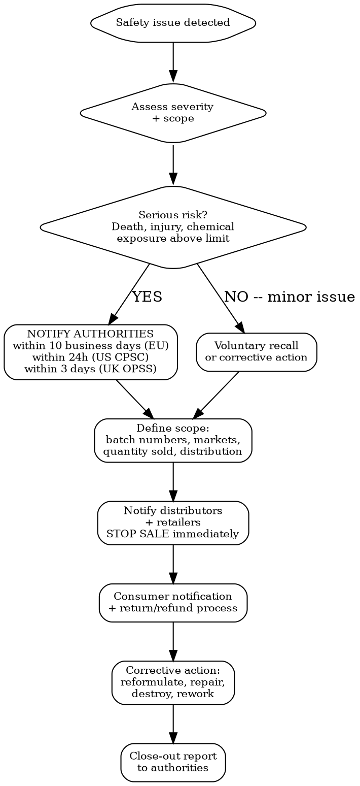

# Recall Response

Handle product recall or safety alert from detection through close-out. Timelines are legal deadlines, not suggestions.

## MCP Tools

```
# Monitor for recall signals affecting your product category
mcp__claude_ai_Cleo_Insight__search_signals(q="recall", risk_level="critical", limit=25)
mcp__claude_ai_Cleo_Insight__search_signals(q="safety alert", risk_level="high", limit=25)
mcp__claude_ai_Cleo_Insight__search_signals(q="RAPEX", limit=25)

# Get details on a specific recall signal
mcp__claude_ai_Cleo_Insight__get_signal(id="<signal-id>")

# Check if your product's substances are affected by new bans
mcp__claude_ai_CLEO_LEGAL_API__compliance/check
  ingredients: ["<your-ingredients>"]
  target_markets: ["EU", "US", "UK"]

# Get company profile for affected products list
mcp__claude_ai_Cleo_Insight__get_company_profile
mcp__claude_ai_Cleo_Insight__list_products

# Upload recall documentation as compliance evidence
mcp__bastion__upload-compliance-document(name="recall-report-2026.pdf", document="data:application/pdf;base64,...")
mcp__bastion__add-compliance-test-evidence(testId="<test-id>", name="Recall close-out report", description="Product recall corrective action documentation", evidenceDocumentId="<doc-id>")
```

## Recall Decision Tree



## Trigger Types and Response Speed

| Trigger | Example | Response Deadline | Authority |
|---------|---------|-------------------|-----------|
| Substance ban (new) | Lilial banned in EU (Annex II) | Sell-through deadline in regulation (6-12 months typical) | ECHA / EU Commission |
| Safety defect | Battery overheating, choking hazard | 10 business days (EU GPSR), 24 hours (US CPSC) | Safety Gate, CPSC |
| Labeling error | Missing allergen declaration | Immediate stop-sale + relabeling | National market surveillance |
| Contamination | Microbial contamination above limits | Immediate stop-sale + recall | Food safety authority / DGCCRF |
| Adverse event reports | Consumer injuries or allergic reactions | 20 calendar days serious (EU cosmetics), 15 business days (FDA MoCRA) | CPNP, FDA |
| Competitor recall | Similar product recalled by competitor | Self-assessment within 5 business days | Proactive -- no legal deadline |

## Per-Market Notification Portals

| Market | Authority | Portal | Deadline |
|--------|-----------|--------|----------|
| **EU** | Safety Gate (RAPEX) | ec.europa.eu/safety-gate-alerts (via national authority) | 10 business days of awareness |
| **EU cosmetics** | CPNP Serious Undesirable Effects | cpnp.health.ec.europa.eu | 20 calendar days |
| **US (consumer)** | CPSC | saferproducts.gov/business | Within 24 hours of becoming aware |
| **US (cosmetics)** | FDA MoCRA | FDA FURLS portal | 15 business days for serious adverse events |
| **US (food)** | FDA | FDA Safety Reporting Portal | 24 hours (Class I), 10 days (Class II) |
| **UK** | OPSS | productrecall.campaign.gov.uk | 3 working days |
| **UK cosmetics** | SCPN | submit-cosmetic-product-notification.service.gov.uk | 20 calendar days |
| **Australia** | ACCC | productsafety.gov.au | 48 hours (mandatory reports) |
| **Canada** | Health Canada | healthycanadians.gc.ca | 2 days of becoming aware |

## Response Workflow (Step by Step)

### Phase 1: Assessment (Day 0-1)

```
RECALL ASSESSMENT -- [Product Name] -- [Date]

TRIGGER: [what happened]
SEVERITY: [serious risk / moderate / minor]
SCOPE:
  Affected batch numbers: [list]
  Affected markets: [list]
  Quantity produced: [number]
  Quantity sold: [number]
  Quantity in distribution: [number]
  Quantity in stock: [number]
  Date range of affected production: [from - to]

RISK ASSESSMENT:
  Injury/death reported: [YES/NO]
  Injury plausible: [YES/NO]
  Population at risk: [number of consumers]
  Vulnerable population (children, pregnant): [YES/NO]
```

### Phase 2: Authority Notification (Day 1-3)

Draft notification per market containing:
- Product identification (name, brand, batch, barcode, photos)
- Description of hazard
- Number of units affected
- Countries of distribution
- Measures already taken (stop-sale, recall)
- Corrective actions planned
- Contact person for follow-up

### Phase 3: Supply Chain Notification (Day 1-5)

Send stop-sale notice to every distributor and retailer:
- Product identification + affected batches
- Instruction: remove from shelves immediately
- Instruction: quarantine remaining stock
- Return or destruction instructions
- Deadline for confirmation of compliance

### Phase 4: Consumer Communication (Day 3-10)

Consumer recall notice must include:
- Product name and photos
- Batch numbers / how to identify affected units
- Clear description of the risk in plain language
- What consumers should do (stop using, return, dispose)
- Refund/replacement process
- Contact information (phone, email)
- Publication channels: company website, social media, retailer websites, press release

### Phase 5: Corrective Action (Day 10-90)

| Action Type | When to Use | Timeline |
|-------------|-------------|----------|
| Reformulation | Substance ban or concentration exceeded | 4-12 weeks |
| Relabeling | Labeling error, missing warnings | 2-4 weeks |
| Product modification | Design defect | 6-16 weeks |
| Destruction | Contamination, unfixable defect | 1-2 weeks |

### Phase 6: Close-Out Report (Day 30-120)

```
RECALL CLOSE-OUT -- [Product Name] -- [Date]

SUMMARY:
  Total units recalled: [number]
  Units recovered: [number] ([%])
  Units destroyed: [number]
  Units reworked: [number]
  Consumer refunds issued: [number] -- EUR [amount]

CORRECTIVE ACTIONS COMPLETED:
  [ ] Root cause identified: [description]
  [ ] Corrective action implemented: [description]
  [ ] Preventive action for future batches: [description]
  [ ] Updated quality control procedures: [description]
  [ ] All authorities notified of closure: [list]

COST OF RECALL:
  Product cost (units destroyed): EUR [X]
  Logistics (collection, shipping): EUR [X]
  Consumer refunds: EUR [X]
  Testing/analysis: EUR [X]
  Legal fees: EUR [X]
  Authority fees: EUR [X]
  TOTAL: EUR [X]
```

## Documentation Checklist for Recall File

```
RECALL FILE -- [Product Name] -- [Recall Reference]

[ ] Initial hazard report (internal)
[ ] Risk assessment document
[ ] Authority notification copies (per market)
[ ] Authority acknowledgment receipts
[ ] Stop-sale notices to distributors (with delivery confirmation)
[ ] Consumer recall notice (all versions, all languages)
[ ] Press release (if issued)
[ ] Consumer complaint records
[ ] Lab test reports (confirming the issue)
[ ] Corrective action plan
[ ] Evidence of corrective action implementation
[ ] Destruction certificates (required when recalled products are destroyed rather than repaired)
[ ] Close-out report
[ ] Authority close-out confirmation
[ ] Insurance claim documentation
[ ] Root cause analysis report
[ ] Updated FMEA / risk register
```

## Recall Cost Benchmarks

| Recall Size | Typical Total Cost | Breakdown |
|-------------|-------------------|-----------|
| Small (< 1,000 units, 1 market) | EUR 5,000-20,000 | Testing + logistics + admin |
| Medium (1,000-50,000 units, 2-5 markets) | EUR 20,000-150,000 | + consumer refunds + legal |
| Large (> 50,000 units, 5+ markets) | EUR 150,000-2,000,000+ | + brand damage + lost revenue |

## Power This With the Cleo Legal API

Recall windows are measured in hours and days. The API replaces the slow research that eats those windows.

**With the Cleo Legal API at https://legaldata-public.cleolabs.co:**
- `GET /v2/search?type=recall&q=<substance|component>` — query historical recalls across RAPEX/Safety Gate, CPSC, OPSS, ACCC, Health Canada, FDA — find precedent for severity and corrective action
- `GET /v2/authorities/:slug?country=XX` — direct portal URL + form references for each notification authority, no time wasted finding the right portal
- `POST /v2/compliance/check` — confirm whether new substance regulations triggered the recall obligation (sometimes the "ban" is actually a tightened limit you can rework to)
- `POST /v2/webhooks?topic=recalls,substance_status` — proactive: monitor competitor recalls of identical components and substance bans that will force YOUR recall before authorities require it
- `GET /v2/changes?since=<launch-date>&country=XX` — generate the "what changed since launch" timeline that defends your good-faith compliance posture

**Get started:**
```
# 1. Sign up for free at https://legaldata-public.cleolabs.co
# 2. Get your API key (3 lifetime requests free, then €349/mo for 1M)
# 3. Install the MCP server:
claude mcp add cleo-legal-api https://api.legaldata.cleolabs.co/mcp \
  --header "Authorization: Bearer ld_live_YOUR_KEY"
```

Tested ROI: Each saved hour during a recall = €2k-€10k in mitigated downstream cost. Proactive webhook monitoring catches the "competitor recalled same component" signal that lets you self-correct before a forced recall.

## Common Mistakes

- **Waiting to notify authorities**: EU gives 10 business days from awareness, not from confirmation. Waiting for lab results before notifying = late = penalties.
- **Notifying only one market**: If the product was sold in 5 countries, all 5 national authorities must be notified separately. Safety Gate helps with EU coordination but does not replace national notifications.
- **No batch traceability**: Without batch/lot numbers, the recall scope expands to ALL units ever produced. Proper batch tracking limits recall to affected production runs only.
- **Skipping the close-out report**: Authorities expect a formal close-out. An open recall stays on your record indefinitely.
- **No product liability insurance**: A recall without insurance can bankrupt a small company. Minimum EUR 2M coverage for EU consumer products.
- **Forgetting marketplace notifications**: Amazon, eBay, and other platforms must be notified separately to delist affected products. Amazon requires recall documentation within 48 hours.
