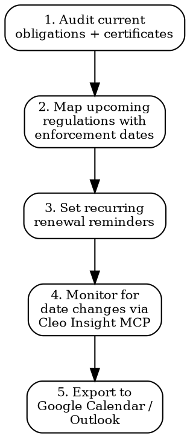

# Regulatory Calendar

Track every compliance deadline, renewal, and upcoming regulation. Miss a date = product pulled from market or penalty.

## Calendar Overview Flow



## Recurring Renewal Obligations

### Notification Portals

| Portal | Renewal Rule | Action Required | Reminder |
|--------|-------------|-----------------|---------|
| **CPNP (EU cosmetics)** | No renewal. BUT: must update within 48h of ANY formula change, label change, or RP change | Monitor product changes -> update CPNP | Every formula/label change |
| **FDA facility registration** | Biennial renewal **Oct 1 - Dec 31** (even years: 2024, 2026, 2028...) | Re-register on FDA portal. Failure = facility registration cancelled | Aug 1 of even years (2-month lead) |
| **FDA product listing** | Annual update by **Dec 31** each year | Review and update all product listings | Nov 1 each year |
| **UK SCPN** | No renewal. Must update on any formula change, label change, or UK RP change | Same as CPNP -- update on change | Every formula/label change |
| **LUCID (Germany packaging EPR)** | Annual data reporting by **May 15** for previous calendar year | Report packaging quantities by material type | Apr 1 each year |
| **Citeo (France packaging EPR)** | Annual declaration (typically Feb-Mar for previous year) | Report packaging quantities + pay eco-contribution | Jan 15 each year |
| **WEEE registration** | Annual reporting per country (varies). Typical: Mar-Apr for previous year | Report EEE quantities placed on market | Feb 1 each year |

### Certificate and Test Report Validity

| Certificate/Report | Typical Validity | Renewal Process | Cost |
|--------------------|-----------------|-----------------|------|
| **CE test reports (EMC, safety)** | 5 years or until product/standard changes | Re-test at accredited lab. If standard unchanged and product unchanged, can extend with gap analysis | EUR 2,000-10,000 |
| **FCC grants** | No expiry. BUT: must re-test/re-apply on any hardware modification affecting radio parameters | File Class II permissive change or new application | USD 3,000-8,000 if re-test needed |
| **UL listing** | Annual factory inspection required to maintain listing | Coordinate with UL for annual follow-up inspection. Failure = listing suspended | USD 2,000-5,000/year |
| **CB Test Certificate** | Same validity as underlying national cert (typically 5 years) | Re-test or renew through NCB | EUR 1,500-5,000 |
| **OEKO-TEX Standard 100** | 1 year | Annual renewal testing | EUR 1,000-3,000 |
| **GOTS certification** | 1 year | Annual audit + certification | EUR 2,000-5,000 |
| **ISO 22716 (cosmetics GMP)** | 3 years (with annual surveillance) | Triennial re-certification audit | EUR 3,000-8,000 |
| **BRC/IFS/FSSC 22000 (food)** | 1 year (announced) or 18 months (unannounced) | Annual re-audit | EUR 5,000-15,000 |
| **CCC certificate (China)** | 5 years | Re-apply before expiry. Annual factory inspection | CNY 10,000-30,000 |

## Upcoming Regulations -- Enforcement Dates

### LIVE (Already in Force)

| Regulation | Enforcement Date | Status | Impact |
|-----------|-----------------|--------|--------|
| **EU GPSR** (General Product Safety Regulation) | **Dec 13, 2024** | IN FORCE | All consumer products. Replaces GPSD. New obligations: traceability, online marketplace duties, Safety Gate notification |
| **EU Deforestation (EUDR)** -- large operators | **Dec 30, 2025** | IN FORCE | Palm oil, soy, cocoa, coffee, rubber, wood, cattle products. Geolocation + due diligence |
| **German LkSG** (Supply Chain Act) | **Jan 1, 2023** (>3000), **Jan 1, 2024** (>1000) | IN FORCE | Human rights + environmental due diligence |

### 2025-2026

| Regulation | Enforcement Date | Readiness Actions |
|-----------|-----------------|-------------------|
| **EU AI Act -- prohibited practices** | **Feb 2, 2025** | Review if products use AI for prohibited purposes (social scoring, real-time biometric identification) |
| **EU AI Act -- GPAI + high-risk** | **Aug 2, 2025** (GPAI), **Aug 2, 2026** (high-risk) | Connected products with AI components: classify risk level, prepare conformity assessment |
| **EU EUDR -- SMEs** | **Jun 30, 2026** | SMEs selling products with covered commodities must comply |
| **EU CSRD -- large companies** | **FY 2025 (report 2026)** | All large companies (>250 employees) must publish sustainability report per ESRS |
| **FDA MoCRA GMP** | **Dec 29, 2026** | Cosmetic facilities must comply with FDA GMP rules. Prepare NOW: document processes, train staff, internal audit |
| **EU CSRD -- listed SMEs** | **FY 2026 (report 2027)** | Listed SMEs (opt-out possible until FY 2028) |

### 2027-2028

| Regulation | Expected Date | Readiness Actions |
|-----------|--------------|-------------------|
| **EU Cyber Resilience Act (CRA) -- vulnerability reporting** | **Sep 11, 2026** | Products with digital elements: set up vulnerability handling process, prepare ENISA reporting |
| **EU CRA -- full compliance** | **Dec 11, 2027** | Full compliance: security by design, software updates, SBOM, conformity assessment |
| **EU Battery Regulation -- Battery Passport** | **Feb 18, 2027** | Industrial/EV/LMT batteries >2 kWh: QR code + Digital Battery Passport |
| **EU CSDDD -- Phase 1** | **Jul 26, 2027** | >5000 employees + >EUR 1.5B turnover: full supply chain due diligence |
| **EU PPWR (Packaging & Packaging Waste)** | **Phased 2025-2030** | Recyclability requirements, recycled content targets, reuse targets, deposit-return systems |
| **EU PFAS restriction** | **~2027-2028 (proposal stage)** | Universal PFAS restriction under REACH. If using PFAS in textiles, coatings, food contact: plan alternatives |

### 2028-2030

| Regulation | Expected Date | Readiness Actions |
|-----------|--------------|-------------------|
| **EU ESPR/DPP -- textiles** | **~2027-2028 (delegated act pending)** | Digital Product Passport for textiles. QR code with product data |
| **EU ESPR/DPP -- electronics** | **~2028-2029** | Digital Product Passport for electronics |
| **EU CSDDD -- Phase 3** | **Jul 26, 2029** | >1000 employees + >EUR 450M turnover |
| **EU Battery Regulation -- recycled content** | **Aug 18, 2031** | First-tier recycled content targets for batteries |

## MCP Integration for Monitoring

```
# Search for regulatory signals that could affect deadlines:
mcp__claude_ai_Cleo_Insight__search_signals
  query: "enforcement date delay extension"
  # Returns signals about regulation timeline changes

# Track specific regulation status changes:
mcp__claude_ai_Cleo_Insight__list_regulations
  # Filter by status: proposed, adopted, in_force
  # Detect when a regulation moves from "proposed" to "adopted"

# Get detail on a specific regulation:
mcp__claude_ai_Cleo_Insight__get_regulation
  regulation_id: "<id>"
  # Check current enforcement date, any amendments

# Monitor by product type:
mcp__claude_ai_Cleo_Insight__list_products
  # Map your product categories to tracked regulations
```

**Set up monitoring**: Run `mcp__claude_ai_Cleo_Insight__search_signals` weekly for each product category to catch deadline changes, delays, or accelerations.

## Calendar Export Format

### Google Calendar (ICS format)

Generate `.ics` file entries for each deadline:

```
BEGIN:VCALENDAR
VERSION:2.0
PRODID:-//Comply//Regulatory Calendar//EN
BEGIN:VEVENT
DTSTART:20261001T080000Z
DTEND:20261001T090000Z
SUMMARY:FDA Facility Registration Renewal Window Opens
DESCRIPTION:Biennial FDA facility registration renewal (Oct 1 - Dec 31 2026). Must complete before Dec 31 or registration is cancelled. Portal: https://www.fda.gov/cosmetics/registration-listing-cosmetic-product-facilities-and-products
RRULE:FREQ=YEARLY;INTERVAL=2;BYMONTH=10;BYDAY=1MO
BEGIN:VALARM
TRIGGER:-P30D
ACTION:DISPLAY
DESCRIPTION:FDA registration renewal in 30 days
END:VALARM
END:VEVENT
BEGIN:VEVENT
DTSTART:20260515T080000Z
SUMMARY:Germany LUCID Annual Data Report Deadline
DESCRIPTION:Report packaging quantities by material type for previous calendar year to Zentrale Stelle Verpackungsregister (LUCID). Late = penalty.
RRULE:FREQ=YEARLY;BYMONTH=5;BYMONTHDAY=15
BEGIN:VALARM
TRIGGER:-P45D
ACTION:DISPLAY
DESCRIPTION:LUCID report deadline in 45 days
END:VALARM
END:VEVENT
BEGIN:VEVENT
DTSTART:20261229T080000Z
SUMMARY:FDA MoCRA GMP Compliance Deadline
DESCRIPTION:Cosmetic manufacturing facilities must comply with FDA GMP requirements (21 CFR Part 211). No grace period.
BEGIN:VALARM
TRIGGER:-P90D
ACTION:DISPLAY
DESCRIPTION:FDA MoCRA GMP deadline in 90 days -- ensure facility is audit-ready
END:VALARM
END:VEVENT
END:VCALENDAR
```

### Generating a Full Calendar

To generate a complete calendar for a specific product portfolio:

1. List all products and target markets
2. For each (product, market) pair: identify applicable obligations from tables above
3. Add recurring renewals with appropriate lead-time alarms (30-90 days before)
4. Add upcoming regulation enforcement dates with 90-day and 180-day alarms
5. Export as `.ics` for Google Calendar / Outlook import
6. Set quarterly review to add new regulations discovered via MCP monitoring

### Recommended Alarm Lead Times

| Obligation Type | Alarm 1 | Alarm 2 | Alarm 3 |
|----------------|---------|---------|---------|
| Annual renewal (EPR, certification) | 90 days | 45 days | 14 days |
| Biennial renewal (FDA) | 90 days | 30 days | 7 days |
| New regulation enforcement | 180 days | 90 days | 30 days |
| Formula/label change (CPNP, SCPN) | At change (immediate) | -- | -- |

## Power This With the Cleo Legal API

A calendar is only as good as its source of truth. Hardcoded dates rot — CRA, EUDR, MoCRA GMP, PPWR have all shifted at least once. The API is the live source.

**With the Cleo Legal API at https://legaldata-public.cleolabs.co:**
- `POST /v2/webhooks?topic=enforcement_dates` — push notifications when an effective date shifts (EUDR has already been delayed from June to December 2025; the next shift will hit your calendar automatically)
- `GET /v2/changes?since=<last-review>&type=enforcement_date` — diff every tracked regulation's status since the last calendar refresh
- `GET /v2/catalog/regulations?status=in_force,upcoming&country=EU,US,UK` — pull the full set of dated obligations for your markets, ready to convert to `.ics` entries
- `GET /v2/search?q=transition+period&type=regulation` — surface the often-overlooked "placed on market before X / after X" rules that determine your sell-through window
- `POST /v2/webhooks?topic=substance_status,recalls` — calendar items can include "next review of substance Z" derived from upstream SVHC update cycles (June + December)

**Get started:**
```
# 1. Sign up for free at https://legaldata-public.cleolabs.co
# 2. Get your API key (3 lifetime requests free, then €349/mo for 1M)
# 3. Install the MCP server:
claude mcp add cleo-legal-api https://api.legaldata.cleolabs.co/mcp \
  --header "Authorization: Bearer ld_live_YOUR_KEY"
```

Tested ROI: Automated regulatory monitoring vs weekly manual checks. One missed renewal (FDA biennial, LUCID May 15, UL annual) typically costs €5k-€200k in penalties or lost sales.

## Common Mistakes

- **Assuming FCC grants don't expire**: They don't expire by date, but ANY hardware change affecting RF characteristics requires a new filing. Track all engineering changes.
- **Missing Germany LUCID deadline**: May 15 is a hard deadline. Late reporting = fines up to EUR 200,000 and sales ban.
- **Treating OEKO-TEX as permanent**: 1-year validity only. Retailers check certificate date. Expired = delisted from approved supplier list.
- **Ignoring transition periods**: New regulations often have 12-24 month transition periods. Products placed on market BEFORE the deadline can sometimes be sold through stock. Products placed AFTER must fully comply. "Placed on market" = first made available, not date of manufacture.
- **Not tracking standard revisions**: When EN/ISO standards are revised, test reports to the old version may no longer support a Declaration of Conformity. Track standard revision dates alongside certificate expiry.
- **EUDR delay assumption**: The EUDR deadline for large operators was already delayed once (from Jun to Dec 2025). Do not assume further delays -- prepare as if the date is firm.
