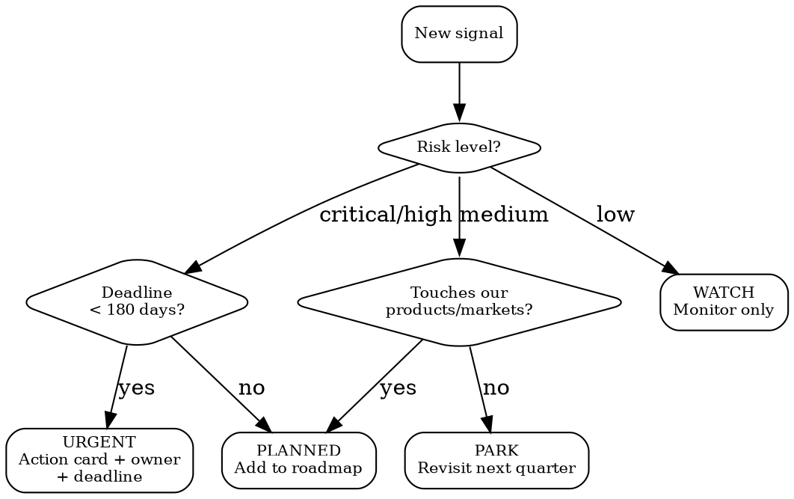

# Regulatory Intelligence

## Quick Reference

| Action | MCP Tool | Key params |
|--------|----------|------------|
| Search signals | `mcp__claude_ai_Cleo_Insight__search_signals` | `risk_level, q, country, product_id, hs_code, limit, after` |
| Signal details | `mcp__claude_ai_Cleo_Insight__get_signal` | `id` (string) |
| List regulations | `mcp__claude_ai_Cleo_Insight__list_regulations` | `limit, after` (cursor pagination) |
| Regulation details | `mcp__claude_ai_Cleo_Insight__get_regulation` | `id` (string) |
| List authorities | `mcp__claude_ai_Cleo_Insight__list_authorities` | — |
| List countries | `mcp__claude_ai_Cleo_Insight__list_countries` | 49 tracked |
| List products | `mcp__claude_ai_Cleo_Insight__list_products` | returns `product_id` for filters |

## Risk Level Color Map

| Level | Color | SLA |
|-------|-------|-----|
| `critical` | RED | Triage within 24h |
| `high` | ORANGE | Triage within 72h |
| `medium` | YELLOW | Next weekly review |
| `low` | GREEN | Monthly batch |

## Signal Triage Decision Tree



## Regulation Statuses

| Status | Meaning |
|--------|---------|
| `in_force` | Legally binding now |
| `adopted_not_yet_in_force` | Published, effective date pending |
| `proposed` | Draft or consultation phase |
| `under_review` | Existing regulation being revised |

## Workflow

1. **Discover** -- `search_signals(country="FR", product_id="cosmetics", risk_level="critical")`. Start broad, narrow by risk.
2. **Read** -- `get_signal(id)`. Focus on: executive summary, obligations list, enforcement date.
3. **Assess** -- Cross-reference with product catalog. Use `product-compliance` skill for substance checks.
4. **Act** -- Extract action cards: one obligation = one card with deadline + owner.
5. **Monitor** -- `adopted_not_yet_in_force` signals need calendar entries. Pipe high-risk signals to `compliance-gap-analysis`.

## Usage Example

```
# Morning triage: critical signals in EU markets
search_signals(risk_level="critical", country="EU", limit=20)
# For each signal → get_signal(id) → read impact rationale
# If product impact → create action card → assign to product-compliance
```

## Without MCP

Use WebSearch for EUR-Lex, Federal Register, ECHA notifications. Structure as: regulation name, status, effective date, impacted products, required actions.

## Common Mistakes

- **Skipping impact rationale** -- Signal summary != full analysis. Always call `get_signal(id)` before triaging to "no impact."
- **Searching only by product** -- A chemical ban affects cosmetics AND electronics AND toys. Search by substance or HS code too.
- **Ignoring `adopted_not_yet_in_force`** -- These have hard deadlines. Lead time for reformulation is 6-12 months.
- **Confusing authority with jurisdiction** -- ECHA covers 27 EU states. One signal, 27 markets impacted.
- **Pagination miss** -- `list_regulations` is cursor-paginated. Always check `after` token; default `limit` may truncate results.
