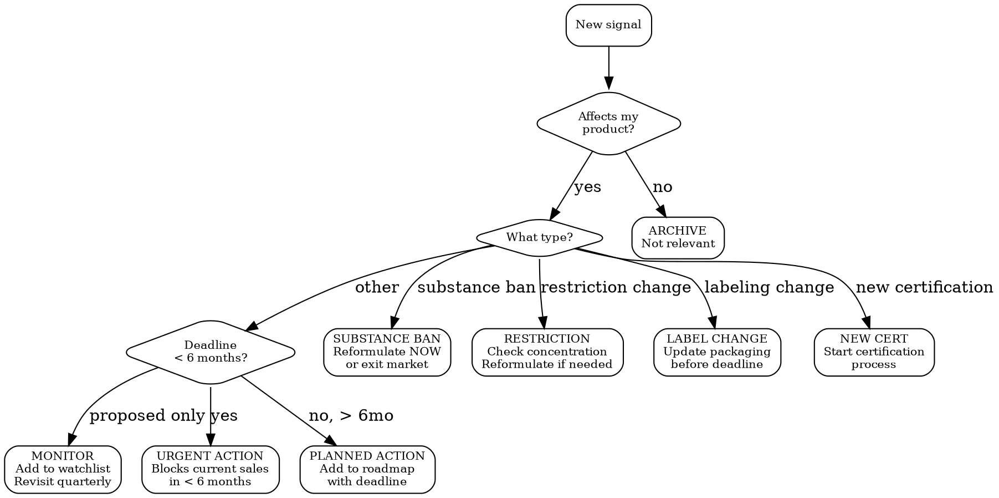

# Regulatory Intelligence

Monitor regulations that could block your product from sale. Focus on signals that require action: substance bans, labeling changes, recall notices, deadline approaches.

## What Matters for Physical Products

Not all regulatory signals are equal. For a product company, these are the ones that hurt:

| Signal Type | Impact | Example | Urgency |
|------------|--------|---------|---------|
| **Substance ban** | Cannot sell product with this ingredient | Titanium dioxide banned in EU food (2022) | CRITICAL -- reformulate or exit market |
| **Substance restriction** | Must reduce concentration or add warning | Retinol limits lowered in EU cosmetics (2025) | HIGH -- reformulate or relabel |
| **Labeling change** | Must update all packaging | New allergen added to mandatory declaration list | HIGH -- reprint labels before deadline |
| **New certification** | Must obtain before continued sale | GPSR (2024) requires new product safety documentation | HIGH -- prepare documentation |
| **Recall notice** | Similar product recalled, check yours | RAPEX alert on similar product category | MEDIUM -- verify your product is not affected |
| **New market entry rule** | Must comply before entering market | EU Battery Regulation (2024) for electronics | MEDIUM -- plan for compliance |
| **Proposed legislation** | No action yet but prepare | MoCRA implementation rules (US) | LOW -- monitor timeline |

## MCP Tools

### Cleo Insight (primary)

```
# Search for signals that affect your products
mcp__claude_ai_Cleo_Insight__search_signals
  product_id: "<your-product-id>"     # From list_products
  risk_level: "critical"              # critical > high > medium > low
  country: "FR"                       # ISO code or country name
  hs_code: "3304.99"                 # HS code for your product
  q: "retinol cosmetics"             # Free-text search
  limit: 20

# Get full signal details
mcp__claude_ai_Cleo_Insight__get_signal
  id: "<signal-id>"
# Focus on: what changed, who it affects, enforcement date, required action

# Browse all tracked regulations
mcp__claude_ai_Cleo_Insight__list_regulations
  limit: 50

# Get regulation details
mcp__claude_ai_Cleo_Insight__get_regulation
  id: "<regulation-id>"
```

### Cleo Legal API (substance-specific)

```
# Check if a specific substance is affected by recent changes
mcp__claude_ai_CLEO_LEGAL_API__compliance/check
  ingredients: ["retinol", "titanium dioxide"]
  target_markets: ["EU", "US", "UK"]
```

## Signal Triage Decision Tree



## Monitoring Schedule

| Frequency | What to Check | How |
|-----------|--------------|-----|
| **Weekly** | Critical + high signals for your product category + markets | `search_signals(risk_level="critical", product_id=...)` then `risk_level="high"` |
| **Monthly** | Medium signals, new regulations adopted | `search_signals(risk_level="medium")` + `list_regulations` |
| **Quarterly** | Proposed legislation, regulatory landscape review | Full scan via `multi-jurisdiction-scan` skill |

## Signal Action Cards

For each actionable signal, generate:

```
SIGNAL ACTION CARD
Signal: [title]
Source: [authority + regulation reference]
Risk: [CRITICAL / HIGH / MEDIUM / LOW]
Deadline: [YYYY-MM-DD or "ongoing"]

WHAT CHANGED:
[1-2 sentences: what is the new rule/ban/restriction]

IMPACT ON MY PRODUCT:
[Which products affected, which markets, which ingredients/components]

REQUIRED ACTION:
[ ] [Specific action 1] -- deadline: [date] -- owner: [who]
[ ] [Specific action 2] -- deadline: [date] -- owner: [who]

COST ESTIMATE: [EUR/USD amount]
REVENUE AT RISK IF IGNORED: [EUR/USD amount or "market exit"]
```

## Key Regulatory Calendars (Physical Products)

### EU -- Coming Into Force (2025-2027)

| Regulation | Effective | Affects | Action |
|-----------|-----------|---------|--------|
| GPSR 2023/988 | Dec 2024 | ALL consumer products | Technical documentation + serious risk reporting |
| EU Battery Regulation | Feb 2024 (phased) | Electronics with batteries | Carbon footprint, recycled content, QR code |
| EU Packaging & Waste | 2025+ (phased) | ALL packaged products | Recyclability, recycled content, EPR |
| Retinol limits (cosmetics) | 2025 | Cosmetics with retinol | Max 0.3% face, 0.05% body |
| PFAS restriction (proposed) | ~2027 | Wide range of products | Phase-out of "forever chemicals" |
| Deforestation Regulation | Dec 2025 | Products with soy, palm, cocoa, coffee, wood, rubber, cattle | Due diligence for deforestation-free supply chain |

### US -- Coming Into Force (2025-2027)

| Regulation | Effective | Affects | Action |
|-----------|-----------|---------|--------|
| MoCRA implementation | 2024+ (phased) | Cosmetics | Facility registration, product listing, adverse event reporting, GMP |
| PFAS state bans | 2025+ (varies by state) | Cosmetics (WA, CO, CA), food packaging, textiles | Reformulate or exit state markets |
| EPR laws (state-level) | 2025+ | Packaged products (CA, CO, OR, etc.) | Register, report, pay eco-fee |

## Without MCP

Use these official sources for manual monitoring:

| Source | URL | What it covers |
|--------|-----|----------------|
| EUR-Lex | eur-lex.europa.eu | EU legislation |
| ECHA | echa.europa.eu | Substances, SVHC, REACH |
| CosIng | ec.europa.eu/growth/tools-databases/cosing | EU cosmetic ingredients |
| RAPEX/Safety Gate | ec.europa.eu/safety-gate | EU product recalls |
| FDA | fda.gov | US food, drugs, cosmetics, devices |
| Federal Register | federalregister.gov | US new regulations |
| CPSC | cpsc.gov | US product recalls |
| Prop 65 | oehha.ca.gov/proposition-65 | California substance list updates |
| UK Gov | legislation.gov.uk | UK regulations |
| OPSS | gov.uk/opss | UK product safety |

## Common Mistakes

- **Checking only "in force" regulations**: Adopted-but-not-yet-in-force regulations have hard deadlines. Lead time for reformulation is 6-12 months. If you wait until enforcement, you are too late.
- **Searching only by product name**: A chemical ban affects cosmetics AND electronics AND toys. Search by substance name or CAS number, not just product category.
- **Treating all signals equally**: A Prop 65 listing for a substance you use at 0.001% is very different from an EU Annex II ban. Triage by actual impact.
- **Ignoring "proposed" legislation**: The EU PFAS restriction proposal will affect thousands of products. Start planning now, not when it passes.
- **Confusing one authority with one country**: ECHA covers 27+ EU member states. One ECHA signal = 27 markets potentially affected.
- **Not checking state-level (US)**: Federal US has few substance bans. But California, Washington, Colorado, and others have aggressive state laws. If you sell online in the US, assume California applies.
