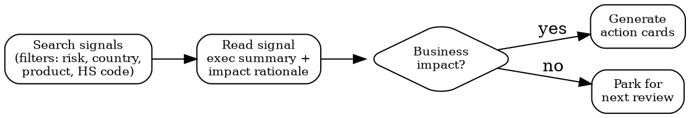

# Regulatory Intelligence

## Quick Reference

| Action | MCP Tool | Fallback |
|--------|----------|----------|
| Search signals | `Cleo_Insight__search_signals` | WebSearch for regulatory news |
| Signal details | `Cleo_Insight__get_signal` | WebFetch on official gazette URL |
| List regulations | `Cleo_Insight__list_regulations` | Manual framework inventory |
| Regulation details | `Cleo_Insight__get_regulation` | Read source document |
| List authorities | `Cleo_Insight__list_authorities` | — |
| List countries | `Cleo_Insight__list_countries` | — |
| List products | `Cleo_Insight__list_products` | — |

## Signal Triage Flow

## Search Filters

- **risk_level**: `critical` | `high` | `medium` | `low`
- **country**: ISO code or name (49 countries tracked)
- **product_id**: from `list_products`
- **hs_code**: Harmonized System code
- **free-text**: keyword search across signal titles and summaries

## Regulation Statuses

| Status | Meaning |
|--------|---------|
| `in_force` | Legally binding now |
| `adopted_not_yet_in_force` | Published, effective date pending |
| `proposed` | Draft or consultation phase |
| `under_review` | Existing regulation being revised |

## Workflow

1. **Discover** — Search signals with relevant filters. Start broad (country + product), narrow by risk.
2. **Read** — Get signal details. Focus on: executive summary, obligations list, enforcement date.
3. **Assess** — Cross-reference with your product catalog. Does this regulation touch your materials, markets, or supply chain?
4. **Act** — Extract action cards from signal. Each card = one concrete obligation with deadline and suggested owner.
5. **Monitor** — Track regulation status changes. `adopted_not_yet_in_force` signals need calendar entries for effective dates.

## Without MCP

When Cleo Insight tools are unavailable:

1. Use WebSearch for regulatory news by jurisdiction and sector
2. Check official gazettes (EUR-Lex, Federal Register, etc.)
3. Manually extract obligations and deadlines
4. Structure findings as: regulation name, status, effective date, impacted products, required actions

## Common Mistakes

- **Ignoring `adopted_not_yet_in_force`** — These have hard deadlines. Treat as actionable, not informational.
- **Searching too narrowly** — A chemical regulation may affect cosmetics, electronics, AND toys. Search by substance, not just product category.
- **Skipping impact rationale** — The signal summary alone is insufficient. Always read the full impact rationale before triaging to "no impact."
- **Confusing authority with jurisdiction** — One authority may enforce across multiple countries (e.g., ECHA covers all EU member states).
