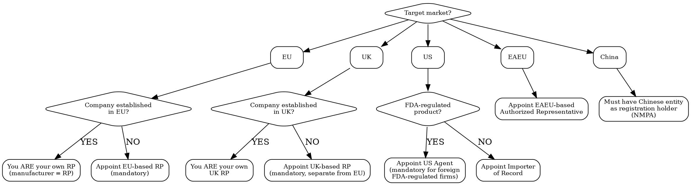

# Responsible Person / Legal Representative

Every major market requires a local legal entity accountable for your product. No RP = no market access.

## MCP Tools

```
# Search for RP-related regulation signals
mcp__claude_ai_Cleo_Insight__search_signals(q="responsible person", limit=25)
mcp__claude_ai_Cleo_Insight__search_signals(q="GPSR economic operator", limit=25)
mcp__claude_ai_Cleo_Insight__search_signals(q="authorized representative", limit=25)

# Get regulation details (GPSR, Cosmetics Reg, MDR)
mcp__claude_ai_Cleo_Insight__get_regulation(id="<regulation-id>")

# Get company profile to check existing RP arrangements
mcp__claude_ai_Cleo_Insight__get_company_profile

# Upload RP mandate letter as compliance evidence
mcp__bastion__upload-compliance-document(name="RP-mandate-EU-2026.pdf", document="data:application/pdf;base64,...")
mcp__bastion__add-compliance-test-evidence(testId="<test-id>", name="EU Responsible Person mandate", description="Signed RP mandate with [provider name], covering cosmetics product line", evidenceDocumentId="<doc-id>")
```

## RP Requirement Decision Tree



## EU Responsible Person

### Legal Basis

| Regulation | RP Requirement | Scope |
|-----------|---------------|-------|
| **GPSR 2023/988** (General Product Safety) | Economic operator established in EU must be identifiable on product or packaging | ALL consumer products (from Dec 13, 2024) |
| **Cosmetics 1223/2009** Art. 4 | Designated RP established in EU; name + address on label | ALL cosmetics placed on EU market |
| **MDR 2017/745** Art. 11 | Authorized Representative for non-EU manufacturers | Medical devices |
| **Toy Safety 2009/48/EC** | Manufacturer or authorized representative in EU | Toys |
| **CE Directives** (LVD, EMC, RED, RoHS) | EU importer or authorized representative | Electronics |

### EU RP Responsibilities

| Duty | Detail |
|------|--------|
| **Product safety file access** | Must have access to (or hold) the technical documentation / PIF |
| **Label presence** | Name and postal address on product or packaging |
| **Authority liaison** | Respond to national market surveillance authority requests within 10 days |
| **CPNP notification** | Submit/maintain Cosmetic Product Notification Portal entry (cosmetics) |
| **Adverse event reporting** | Report serious undesirable effects within 20 calendar days (cosmetics) |
| **Post-market surveillance** | Monitor product safety, maintain complaint records |
| **Recall coordination** | Coordinate with authorities during recall or corrective action |
| **Declaration of Conformity** | Hold DoC and make available on request (CE-marked products) |

### EU RP Setup Checklist

```
EU RESPONSIBLE PERSON SETUP -- [Date]

[ ] Select RP provider (or use own EU entity)
[ ] Sign mandate letter (formal written authorization)
[ ] RP reviews Product Information File / technical documentation
[ ] RP address added to product labels (name + full postal address)
[ ] CPNP notification submitted under RP's account (cosmetics)
[ ] RP receives copy of all test reports and safety assessments
[ ] Post-market surveillance procedure agreed
[ ] Adverse event reporting procedure agreed
[ ] Emergency contact protocol established (24h for serious incidents)
[ ] Annual review date set: [date]
```

## UK Responsible Person

Separate from EU RP. The EU RP cannot serve as UK RP (and vice versa) unless they have establishments in both jurisdictions.

| Aspect | Requirement |
|--------|------------|
| **Legal basis** | UK Cosmetics Regulation (retained EU law), UK GPSR (Product Safety and Metrology Bill), UK MDR |
| **Must be** | Established in Great Britain (England, Scotland, Wales) -- Northern Ireland follows EU rules |
| **For cosmetics** | UK RP name + GB address on label; SCPN (Submit Cosmetic Product Notification) registration |
| **For general products** | UK-based economic operator identified on product (GPSR equivalent) |
| **UKCA marking** | UK importer or authorized representative for CE-equivalent |

## US Requirements

| Role | Legal Basis | Required When | Responsibilities |
|------|------------|---------------|-----------------|
| **US Agent** | FDA 21 CFR 807.40 (devices), MoCRA sec. 605 (cosmetics), 21 CFR 1.227 (food) | Foreign establishment registered with FDA | Receive FDA communications, assist FDA during inspections, provide FDA with importer name |
| **Importer of Record (IOR)** | 19 USC 1484 | Every import shipment | Customs bond, entry filing, duty payment, ensure compliance of imported goods |
| **Initial Distributor** | MoCRA (cosmetics) | First US entity in distribution chain | Adverse event reporting, facility registration |

**US Agent is NOT a Responsible Person** -- the US Agent facilitates FDA communication but does NOT assume product safety liability. Product liability remains with the manufacturer and/or importer.

## EAEU (Russia, Belarus, Kazakhstan, Armenia, Kyrgyzstan)

| Aspect | Requirement |
|--------|------------|
| **Legal basis** | EAEU Technical Regulations (TR CU/EAEU) |
| **Role** | Authorized Representative (AR) of foreign manufacturer |
| **Must be** | Legal entity registered in an EAEU member state |
| **Duties** | Apply for TR CU declaration/certificate, hold technical documentation, represent manufacturer to authorities |
| **Cost** | EUR 2,000-5,000/year + per-product certification fees |

## China (NMPA)

| Aspect | Requirement |
|--------|------------|
| **Legal basis** | CSAR (Cosmetic Supervision and Administration Regulation) 2021, Medical Device Regulation |
| **Role** | Chinese Responsible Agent + Chinese registration holder |
| **Must be** | Chinese-registered legal entity |
| **Cosmetics** | All imported cosmetics must be registered/notified through NMPA by a Chinese agent |
| **Registration timeline** | Non-special use: 3-6 months; Special use (sunscreen, hair dye, whitening): 12-18 months |
| **Cost** | Agent fee: EUR 3,000-8,000/year; registration: EUR 2,000-10,000 per product |
| **Animal testing** | Waived for "general" cosmetics notified online since 2021; still required for "special use" cosmetics and some risk triggers |

## RP Service Provider Costs

| Market | Provider Type | Annual Cost (EUR) | Per-Product Surcharge | Includes |
|--------|--------------|-------------------|----------------------|----------|
| **EU** | Dedicated RP firm | 1,500-3,000/year | EUR 200-500/product | Label review, CPNP, AE reporting, authority liaison |
| **EU** | Full-service (RP + CPSR + PIF) | 3,000-6,000/year | EUR 500-1,500/product | Everything above + safety assessment + PIF management |
| **UK** | UK RP firm | 1,000-2,500/year | EUR 200-400/product | Label review, SCPN, authority liaison |
| **US** | US Agent (FDA) | 500-1,500/year | EUR 100-300/product | FDA communication, inspection facilitation |
| **China** | NMPA agent | 3,000-8,000/year | EUR 2,000-10,000/product | Registration, authority liaison, formula review |
| **EAEU** | Authorized Representative | 2,000-5,000/year | EUR 1,000-3,000/product | TR CU certification, technical documentation |

## Key Documentation

| Document | Purpose | Who Signs |
|----------|---------|-----------|
| **Mandate letter** | Formal appointment of RP by manufacturer | Both parties |
| **RP agreement/contract** | Scope of services, liability, term, termination | Both parties |
| **Technical file access** | RP must access PIF/technical documentation at all times | Manufacturer grants access |
| **Power of Attorney** | For customs, registration, authority dealings | Manufacturer to RP |
| **DoC location notice** | Where the Declaration of Conformity is held | Referenced on DoC |
| **Post-market surveillance plan** | How the RP monitors product safety | Joint |

### Mandate Letter Template (Key Clauses)

```
RESPONSIBLE PERSON MANDATE

Manufacturer: [Company name, address, registration number]
Responsible Person: [RP name, EU/UK address, registration number]

1. SCOPE: [Product categories / product names covered]
2. TERRITORY: [EU-27 / UK / both]
3. OBLIGATIONS: [List from RP responsibilities table above]
4. TECHNICAL FILE: RP has access to technical documentation at [location]
5. DURATION: [Start date] to [End date], renewable
6. TERMINATION: [Notice period -- minimum 3 months to allow label updates]
7. LIABILITY: [Allocation per contract -- note: EU law holds RP jointly liable]
8. FEES: [Annual fee + per-product fee + any variable costs]
```

## Common Mistakes

- **Using EU RP for UK**: Post-Brexit, UK requires a separate UK-based Responsible Person. Your EU RP in Paris cannot serve as your UK RP.
- **RP name not on label**: EU Cosmetics Regulation Art. 19 requires the RP's name AND postal address on every unit. A website URL alone does not satisfy the requirement.
- **No technical file access**: The RP must have access to the Product Information File. If the RP cannot produce it within 10 days of an authority request, both manufacturer and RP face enforcement.
- **Confusing US Agent with RP**: The US Agent is a communication relay for FDA, not a safety guarantor. Product liability stays with manufacturer/importer.
- **Terminating RP without transition**: If you switch RP providers, the old RP's address is on existing packaging in market. Plan 3-6 months overlap to sell through existing stock and print new labels.
- **Forgetting Northern Ireland**: Northern Ireland follows EU rules (Windsor Framework), not GB rules. Products sold in NI need an EU RP, not a UK RP.
