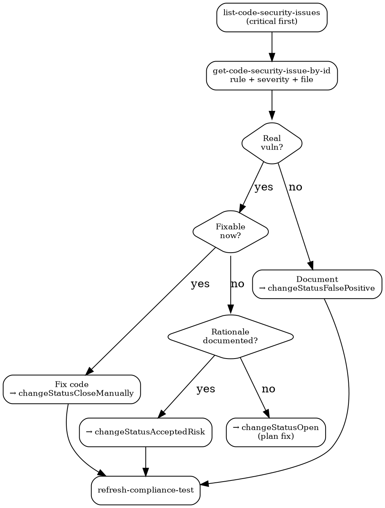

# Security Posture

## Quick Reference

| Action | MCP Tool | Key detail |
|--------|----------|------------|
| List issues | `mcp__bastion__list-code-security-issues` | Sort by severity |
| Issue detail | `mcp__bastion__get-code-security-issue-by-id` | rule, severity, file, line range |
| Remediate | `mcp__bastion__post-customer-issues-remediation` | Requires `remediationId` enum |
| Dependabot | `mcp__bastion__get-github-dependabot-resolution` | Returns pass/fail/no_test |
| Refresh test | `mcp__bastion__refresh-compliance-test` | After any remediation |
| Failing tests | `mcp__bastion__list-failing-compliance-tests` | Security-related subset |

## Remediation ID Enum

| `remediationId` | Use when |
|-----------------|----------|
| `changeStatusCloseManually` | Code fix deployed and verified |
| `changeStatusCloseAutomatically` | Auto-resolved by dependency update |
| `changeStatusAcceptedRisk` | Won't fix; documented rationale required |
| `changeStatusFalsePositive` | Finding is incorrect; document why |
| `changeStatusOpen` | Reset to open for re-triage |

## Triage Flow

## Device Compliance

| Control | Check | Fix |
|---------|-------|-----|
| FileVault ON | `fdesetup status` | System Settings > FileVault |
| Firewall ON | `com.apple.alf globalstate` | System Settings > Firewall |
| MDM enrolled | Must show `mdm.bastion.tech` | Bastion UI only (no MCP) |
| OS updated | `softwareupdate -l` | Software Update |
| Screen lock <= 5min | Lock screen timeout | System Settings > Lock Screen |

## Dependabot States

`pass` = resolved. `fail` = open alerts (response includes repo list). `no_test` = not enabled.

## Workflow

1. **List** -- `mcp__bastion__list-code-security-issues`. Critical > high > medium > low.
2. **Read** -- `mcp__bastion__get-code-security-issue-by-id`. Check reachability + mitigations.
3. **Remediate** -- `mcp__bastion__post-customer-issues-remediation` with correct `remediationId`.
4. **Verify** -- `mcp__bastion__refresh-compliance-test` after every remediation.
5. **Deps** -- `mcp__bastion__get-github-dependabot-resolution`. On `fail`, upgrade listed repos.
6. **Devices** -- Check table above. Feed gaps to `compliance-remediation`.

## Common Mistakes

- **Wrong `remediationId`** -- `changeStatusCloseManually` without actual fix. Auditors verify.
- **Bulk `changeStatusAcceptedRisk`** -- Each needs specific justification. "Low priority" is not a rationale.
- **Fixing without refreshing** -- Bastion caches state. Always `refresh-compliance-test`.
- **Ignoring `no_test`** -- Means Dependabot not enabled. Enable it; no alerts != no vulnerabilities.
- **MDM via MCP** -- Enrollment requires Bastion UI. No API exists. Plan manual step.
