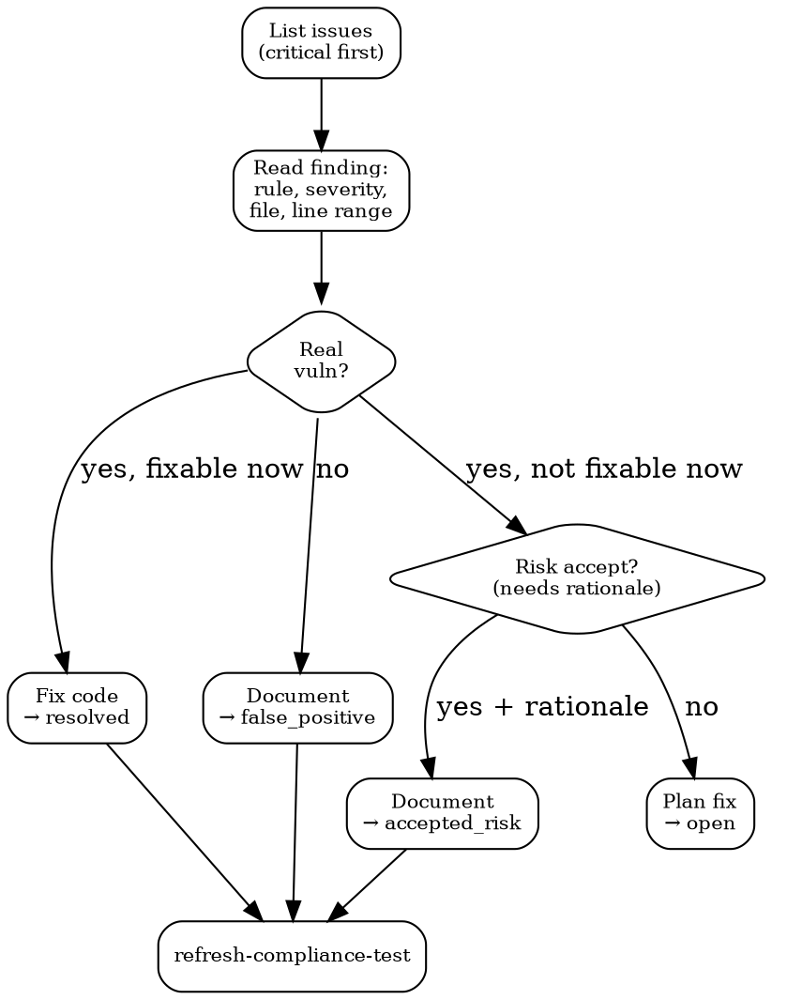

# Security Posture

## Quick Reference

| Action | MCP Tool | Fallback |
|--------|----------|----------|
| List security issues | `bastion__list-code-security-issues` | GitHub Security tab / SAST reports |
| Issue details | `bastion__get-code-security-issue-by-id` | Read SAST finding in source |
| Remediate issue | `bastion__post-customer-issues-remediation` | Fix code + close issue manually |
| Dependabot status | `bastion__get-github-dependabot-resolution` | `gh api /repos/{owner}/{repo}/dependabot/alerts` |
| Refresh test | `bastion__refresh-compliance-test` | Re-run scan manually |
| Failing tests | `bastion__list-failing-compliance-tests` | Audit dashboard review |

## Remediation States

| State | When to use |
|-------|-------------|
| `resolved` | Code fix deployed and verified |
| `accepted_risk` | Risk acknowledged, documented rationale, won't fix |
| `false_positive` | Finding is incorrect, document why |
| `open` | Reset to open for re-triage |

## Triage Flow

## Device Compliance Checklist

| Control | Check | Fix |
|---------|-------|-----|
| FileVault | Disk encryption enabled | System Preferences > Security > FileVault ON |
| Firewall | macOS firewall active | System Preferences > Security > Firewall ON |
| MDM | Device enrolled + user associated | Enroll via MDM portal (UI only, no MCP) |
| OS updates | Latest security patches | Software Update |
| Screen lock | Auto-lock <= 5 minutes | System Preferences > Lock Screen |

## Branch Protection

Required: reviews >= 1, CI status checks, signed commits, no force push on main, admin enforcement.

## Workflow

1. **List** — `list-code-security-issues`, sort by criticality: critical > high > medium > low.
2. **Read** — Full details per finding: SAST rule, severity, file path, line range, repo.
3. **Assess** — Real vulnerability? Check reachability, user-controlled inputs, existing mitigations.
4. **Act** — Fix code, mark false positive, or accept risk with rationale.
5. **Verify** — `refresh-compliance-test` after remediation.
6. **Dependencies** — `get-github-dependabot-resolution` for open alerts. Upgrade or pin.

## Common Mistakes

- **Bulk-accepting risk without rationale** — Each `accepted_risk` needs specific justification. "Low priority" is not a rationale.
- **Fixing code but not refreshing** — Bastion won't know it's resolved until you `refresh-compliance-test`.
- **Ignoring medium/low before audit** — Auditors see everything. Triage all findings.
- **Device compliance via MCP** — MDM enrollment requires Bastion UI. No MCP tool exists.
