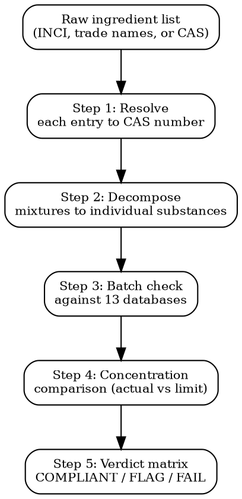

# Substance Screening

Deep ingredient/material screening against 13 regulatory databases. Input: ingredient list. Output: per-substance, per-jurisdiction verdict with concentration limits and margin calculations.

## MCP Tools

```
# Primary: batch substance check across markets
mcp__claude_ai_CLEO_LEGAL_API__compliance/check
  product_description: "anti-aging face serum"
  ingredients: ["retinol", "niacinamide", "salicylic acid", "titanium dioxide"]
  target_markets: ["EU", "US", "UK", "CA", "JP", "KR"]

# Cross-reference recent substance ban signals
mcp__claude_ai_Cleo_Insight__search_signals(q="substance ban", risk_level="critical", limit=25)
mcp__claude_ai_Cleo_Insight__search_signals(q="SVHC candidate list", limit=25)

# Get regulation details for any flagged substance
mcp__claude_ai_Cleo_Insight__get_regulation(id="<regulation-id>")

# List all tracked regulations to find substance-specific ones
mcp__claude_ai_Cleo_Insight__list_regulations(limit=100)
```

## Screening Workflow



## Step 1: INCI Name to CAS Number Resolution

| Input Type | Resolution Method | Example |
|-----------|-------------------|---------|
| INCI name | CosIng database lookup | RETINOL -> CAS 68-26-8 |
| Trade name | Supplier SDS -> active substance -> CAS | Parsol MCX -> Ethylhexyl Methoxycinnamate -> CAS 5466-77-3 |
| Botanical extract | Map to marker compounds + CAS | CAMELLIA SINENSIS LEAF EXTRACT -> EGCG (CAS 989-51-5) |
| Fragrance blend | IFRA certificate -> individual allergens + CAS | PARFUM -> LIMONENE (CAS 5989-27-5), LINALOOL (CAS 78-70-6), etc. |
| CI number | Colorant index to CAS | CI 77891 -> Titanium Dioxide -> CAS 13463-67-7 |

**Rule**: Never screen a trade name directly. Always resolve to individual chemical substances with CAS numbers. One trade name = multiple regulated substances.

## Step 2: The 13 Databases

| # | Database | Jurisdiction | Substance Count | What It Covers |
|---|----------|-------------|-----------------|----------------|
| 1 | CosIng Annex II | EU | 1,698 banned | Substances prohibited in cosmetics |
| 2 | CosIng Annex III | EU | 321 restricted | Substances with concentration limits, conditions, warnings |
| 3 | CosIng Annex IV-VI | EU | ~8,000 | Allowed colorants (IV), preservatives (V), UV filters (VI) -- positive lists |
| 4 | ECHA SVHC Candidate List | EU | 260+ | Substances of Very High Concern; >0.1% w/w triggers notification |
| 5 | REACH Annex XVII | EU | 72 entries (many multi-substance) | Manufacture/sale/use restrictions with specific conditions |
| 6 | CLP Annex VI | EU | 4,700+ | Harmonized classification and labeling; drives SDS and warnings |
| 7 | California Prop 65 | US-CA | 900+ | Carcinogens + reproductive toxins; requires consumer warning |
| 8 | FDA GRAS | US | 3,000+ | Generally Recognized As Safe for food use |
| 9 | EFSA OpenFoodTox | EU | 600+ | Toxicological reference values for food-relevant substances |
| 10 | Health Canada Hotlist | CA | 600+ | Prohibited and restricted cosmetic ingredients |
| 11 | NMPA Inventory | CN | 8,972 | Registered cosmetic ingredients; unlisted = new ingredient registration |
| 12 | K-REACH | KR | 1,600+ registered | Korean chemical registration; >1 ton/year requires registration |
| 13 | MHLW Standards | JP | Positive list system | Only listed substances permitted in cosmetics |

## Step 3: Per-Substance Output Format

```
SUBSTANCE SCREENING REPORT -- [Product Name] -- [Date]

SCREENING PARAMETERS:
  Product category: [cosmetics / food / electronics / ...]
  Total ingredients screened: [count]
  Markets checked: [list]
  Databases queried: 13/13

PER-SUBSTANCE RESULTS:
| Substance | CAS | Actual % | Market | Database | Limit | Unit | Margin | Verdict |
|-----------|-----|----------|--------|----------|-------|------|--------|---------|
| Retinol | 68-26-8 | 0.25 | EU | CosIng III | 0.30 | % (face) | +0.05 | FLAG |
| Retinol | 68-26-8 | 0.25 | US-CA | Prop 65 | NSRL 5.4 | ug/day | -- | FLAG |
| Salicylic acid | 69-72-7 | 2.0 | EU | CosIng III | 2.0 | % (rinse-off) | 0.0 | FLAG |
| Salicylic acid | 69-72-7 | 2.0 | JP | MHLW | 0.2 | % | -1.8 | FAIL |
| Titanium dioxide | 13463-67-7 | 3.0 | EU | CLP VI | -- | nano flag | -- | FLAG |
| Niacinamide | 98-92-0 | 5.0 | ALL | -- | no limit | -- | -- | COMPLIANT |
```

## Step 4: Concentration Margin Calculation

```
margin = regulatory_limit - actual_concentration
margin_pct = (margin / regulatory_limit) * 100

Verdict logic:
  margin > 20% of limit  -> COMPLIANT (green)
  margin 0-20% of limit  -> FLAG (orange) -- too close to threshold
  margin < 0             -> FAIL (red) -- exceeds limit
  no limit found         -> NEEDS_REVIEW (yellow)
```

**Thresholds that trip companies up:**

| Substance | EU Limit | Common Mistake |
|-----------|----------|---------------|
| Retinol (face) | 0.30% | Serums at 0.5% or 1% = FAIL since 2025 |
| Retinol (body) | 0.05% | Body lotions with "retinol" claims often exceed |
| Salicylic acid | 2.0% (rinse-off), 0.5% (leave-on) | BHA serums at 2% = FAIL if leave-on |
| Hydroquinone | 0% in EU (Annex II banned) | Still sold OTC in US at 2% |
| CBD/cannabidiol | Novel food status (EU), not in CosIng | No clear cosmetic pathway in EU |
| Formaldehyde releasers | 0.1% (as free formaldehyde) | DMDM Hydantoin, Imidazolidinyl Urea release it |
| Lilial (butylphenyl methylpropional) | 0% in EU (banned 2022, Annex II) | Still in some US fragrances |

## Step 5: Batch Screening Protocol

For full ingredient lists (20+ substances):

1. Collect complete INCI list with concentrations from formulation sheet
2. Resolve all CAS numbers (Step 1)
3. Decompose all mixtures -- especially PARFUM, botanical extracts, colorant blends
4. Run MCP batch check: `compliance/check` with full ingredients array
5. Cross-reference MCP results against each of the 13 databases manually for any NEEDS_REVIEW
6. Generate the full verdict matrix
7. Flag any substance where margin < 20% of limit -- these are reformulation risks

```
BATCH SCREENING SUMMARY:
  Total substances: [count after decomposition]
  COMPLIANT: [count] ([%])
  FLAG: [count] ([%])
  FAIL: [count] ([%])
  NEEDS_REVIEW: [count] ([%])

  BLOCKING MARKETS: [list of markets with at least one FAIL]
  SAFE MARKETS: [list of markets with all COMPLIANT/FLAG]
  REFORMULATION REQUIRED FOR: [substance -> market pairs with FAIL]
```

## Common Mistakes

- **Screening INCI names instead of CAS numbers**: "AQUA" returns nothing useful. CAS 7732-18-5 is unambiguous across every database worldwide.
- **Missing fragrance decomposition**: PARFUM on the label is one line; the formulation contains 50-200 individual substances. Get the IFRA certificate and screen every component.
- **Ignoring nanomaterial form**: Titanium dioxide (CAS 13463-67-7) in bulk form has different rules than in nano form. EU requires [nano] labeling and specific safety assessment.
- **Using outdated database snapshots**: ECHA updates the SVHC Candidate List twice per year (June + December). Prop 65 updates quarterly. Always check signal dates.
- **Forgetting Japan's positive list**: Unlike EU (negative list = banned substances), Japan uses a positive list. An ingredient NOT on the list is NOT allowed. Absence = prohibition.
- **Confusing rinse-off vs leave-on limits**: EU Annex III sets different concentration limits for rinse-off (wash out) and leave-on (stays on skin) products. A 2% BHA face wash is legal; a 2% BHA serum is not.
